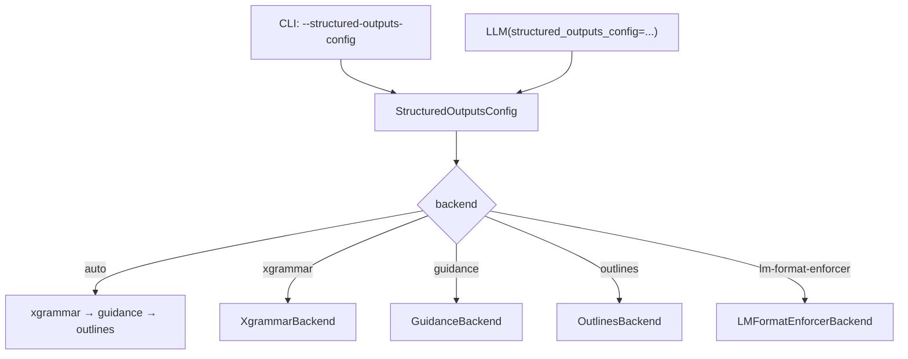

# `guided_decoding_backend` Configuration

vLLM's structured output backend is configured through the `StructuredOutputsConfig`
(defined in `vllm/config/structured_outputs.py`). This configuration controls which
backend library is used to enforce output constraints, how fallback works, and
various backend-specific options.

---

## Configuration Overview

The structured outputs configuration is passed to the engine at startup via the
`--structured-outputs-config` CLI argument or the `structured_outputs_config`
parameter of the `LLM` class.



---

## `StructuredOutputsConfig` Fields

Defined in `vllm/config/structured_outputs.py`:

```python
@config
class StructuredOutputsConfig:
    backend: StructuredOutputsBackend = "auto"
    disable_fallback: bool = False
    disable_any_whitespace: bool = False
    disable_additional_properties: bool = False
    reasoning_parser: str = ""
    reasoning_parser_plugin: str = ""
    enable_in_reasoning: bool = False
```

### `backend`

**Type:** `Literal["auto", "xgrammar", "guidance", "outlines", "lm-format-enforcer"]`  
**Default:** `"auto"`

Selects the structured output backend. With `"auto"`, vLLM makes opinionated choices
based on the request content and available backends:

1. **xgrammar** is tried first for all constraint types it supports
2. **guidance** is used as fallback when xgrammar cannot handle the schema
3. **outlines** is used for Mistral tokenizers or schemas with `patternProperties`

> **Note:** The `auto` behavior may change between vLLM releases as backends evolve.
> For reproducible behavior, specify a backend explicitly.

### `disable_fallback`

**Type:** `bool`  
**Default:** `False`

When `True`, vLLM will not fall back to a different backend if the primary backend
fails validation. Instead, a `ValueError` is raised immediately.

This is useful in production environments where you want predictable behavior and
explicit control over which backend is used.

### `disable_any_whitespace`

**Type:** `bool`  
**Default:** `False`  
**Supported backends:** `xgrammar`, `guidance`

When `True`, JSON output will always be compact with no optional whitespace between
fields. When `False` (default), the model may generate whitespace like spaces and
newlines between JSON fields, which is still valid JSON.

```python
# Compact: {"brand":"Toyota","model":"Supra"}
# Flexible: {"brand": "Toyota", "model": "Supra"}
```

> **Validation:** Setting `disable_any_whitespace=True` with `backend="outlines"` or
> `backend="lm-format-enforcer"` raises a `ValueError` at startup.

### `disable_additional_properties`

**Type:** `bool`  
**Default:** `False`  
**Supported backends:** `guidance` only

When `True`, the guidance backend injects `"additionalProperties": false` into every
JSON object definition that has `properties`. This makes the guidance backend behave
more like xgrammar and outlines, which reject additional properties by default.

> **Validation:** Setting `disable_additional_properties=True` with any backend other
> than `guidance` raises a `ValueError` at startup.

### `reasoning_parser`

**Type:** `str`  
**Default:** `""`

Selects the reasoning parser for models that produce chain-of-thought reasoning
(e.g. DeepSeek-R1). When set, structured output constraints are applied only to the
final answer portion, not the reasoning trace.

Available parsers are registered via `ReasoningParserManager`.

### `reasoning_parser_plugin`

**Type:** `str`  
**Default:** `""`

Path to a Python module that registers a custom reasoning parser plugin. The module
is dynamically loaded and registered at startup.

### `enable_in_reasoning`

**Type:** `bool`  
**Default:** `False`

When `True`, structured output constraints are applied during the reasoning phase as
well as the answer phase. This is useful for models where the reasoning itself should
be constrained.

---

## Configuration Methods

### Via CLI (Server Mode)

Pass the configuration as a JSON string to `--structured-outputs-config`:

```bash
# Use xgrammar backend explicitly
vllm serve Qwen/Qwen2.5-3B-Instruct \
  --structured-outputs-config '{"backend": "xgrammar"}'

# Use guidance with compact JSON
vllm serve Qwen/Qwen2.5-3B-Instruct \
  --structured-outputs-config '{"backend": "guidance", "disable_any_whitespace": true}'

# Use outlines with disk cache
vllm serve Qwen/Qwen2.5-3B-Instruct \
  --structured-outputs-config '{"backend": "outlines"}'
```

### Via Python API (Offline Mode)

Pass a dict or `StructuredOutputsConfig` instance to the `LLM` constructor:

```python
from vllm import LLM
from vllm.config import StructuredOutputsConfig

# Using a dict
llm = LLM(
    model="Qwen/Qwen2.5-3B-Instruct",
    structured_outputs_config={"backend": "xgrammar"},
)

# Using StructuredOutputsConfig directly
config = StructuredOutputsConfig(
    backend="guidance",
    disable_any_whitespace=True,
    disable_additional_properties=True,
)
llm = LLM(
    model="Qwen/Qwen2.5-3B-Instruct",
    structured_outputs_config=config,
)
```

---

## Backend Selection Logic (`auto` mode)

When `backend="auto"`, the selection logic in `SamplingParams._validate_structured_outputs()`
(in `vllm/sampling_params.py`) works as follows:

```python
try:
    validate_xgrammar_grammar(self)
    self.structured_outputs._backend = "xgrammar"
except ValueError:
    # xgrammar failed — check if guidance can handle it
    skip_guidance = has_guidance_unsupported_json_features(schema)

    if is_mistral_tokenizer(tokenizer) or skip_guidance:
        # Fall back to outlines
        validate_structured_output_request_outlines(self)
        self.structured_outputs._backend = "outlines"
    else:
        # Fall back to guidance
        validate_guidance_grammar(self, tokenizer=None)
        self.structured_outputs._backend = "guidance"

self.structured_outputs._backend_was_auto = True
```

The `_backend_was_auto` flag allows the engine to re-evaluate the backend selection
if the same `StructuredOutputsParams` object is reused across requests.

---

## Per-Request Backend Override

> **Important:** Per-request backend selection is **not** supported in vLLM V1.
> All requests must use the same backend, which is determined at engine startup.

Attempting to set `_backend` on a request when the engine uses a different backend
raises a `ValueError`:

```
Request-level structured output backend selection is not supported.
The request specified 'xgrammar', but vLLM was initialised with 'guidance'.
```

---

## Environment Variables

In addition to `StructuredOutputsConfig`, several environment variables affect
structured output behavior:

| Variable | Default | Description |
|---|---|---|
| `VLLM_XGRAMMAR_CACHE_MB` | `512` | xgrammar grammar compiler cache size in MB |
| `VLLM_V1_USE_OUTLINES_CACHE` | `0` | Enable on-disk cache for outlines DFA indices |
| `OUTLINES_CACHE_DIR` | `~/.cache/outlines` | Directory for outlines on-disk cache |
| `LLGUIDANCE_LOG_LEVEL` | `1` | Log level for llguidance (0=off, 1=warn, 2=debug) |

```bash
# Increase xgrammar cache to 2 GB
export VLLM_XGRAMMAR_CACHE_MB=2048

# Enable outlines disk cache
export VLLM_V1_USE_OUTLINES_CACHE=1
export OUTLINES_CACHE_DIR=/mnt/cache/outlines

# Enable llguidance debug logging
export LLGUIDANCE_LOG_LEVEL=2
```

---

## Backend Capability Matrix

| Feature | auto | xgrammar | guidance | outlines | lm-format-enforcer |
|---|---|---|---|---|---|
| JSON Schema | ✅ | ✅ | ✅ | ✅ | ✅ |
| JSON Object | ✅ | ✅ | ✅ | ❌ | ✅ |
| Regex | ✅ | ✅ | ✅ | ✅ | ✅ |
| EBNF Grammar | ✅ | ✅ | ✅ | ❌ | ❌ |
| Choice | ✅ | ✅ | ✅ | ✅ | ✅ |
| Structural Tag | ✅ | ✅ | ✅ | ❌ | ❌ |
| Speculative decoding | ✅ | ✅ | ✅ | ✅ | ❌ |
| Mistral tokenizer | ✅ | ✅ | ❌ | ✅ | ❌ |
| `disable_any_whitespace` | ❌ | ✅ | ✅ | ❌ | ❌ |
| `disable_additional_properties` | ❌ | ❌ | ✅ | ❌ | ❌ |

---

## Reasoning Model Configuration

For models like DeepSeek-R1 that produce reasoning traces before the final answer:

```bash
vllm serve deepseek-ai/DeepSeek-R1-Distill-Qwen-7B \
  --structured-outputs-config '{
    "backend": "xgrammar",
    "reasoning_parser": "deepseek_r1"
  }'
```

With `reasoning_parser` set, the structured output constraint is applied only after
the reasoning trace ends (detected by the parser). The `enable_in_reasoning` option
can override this to apply constraints throughout:

```bash
vllm serve deepseek-ai/DeepSeek-R1-Distill-Qwen-7B \
  --structured-outputs-config '{
    "backend": "xgrammar",
    "reasoning_parser": "deepseek_r1",
    "enable_in_reasoning": true
  }'
```

---

## Async Grammar Compilation

Grammar compilation is performed asynchronously in a thread pool to avoid blocking
the scheduler. The number of worker threads is:

```python
max_workers = max(1, (multiprocessing.cpu_count() + 1) // 2)
```

> **Note:** In `external_launcher` mode (used for multi-TP-rank deployments), async
> grammar compilation is disabled to maintain determinism across TP ranks. Grammar
> compilation happens synchronously in this mode.

---

## See Also

- [Structured Output Overview](overview.md)
- [response_format parameter](response-format.md)
- [xgrammar backend](backend-xgrammar.md)
- [outlines backend](backend-outlines.md)
- [llguidance backend](backend-guidance.md)
- [lm-format-enforcer backend](backend-lm-format-enforcer.md)
