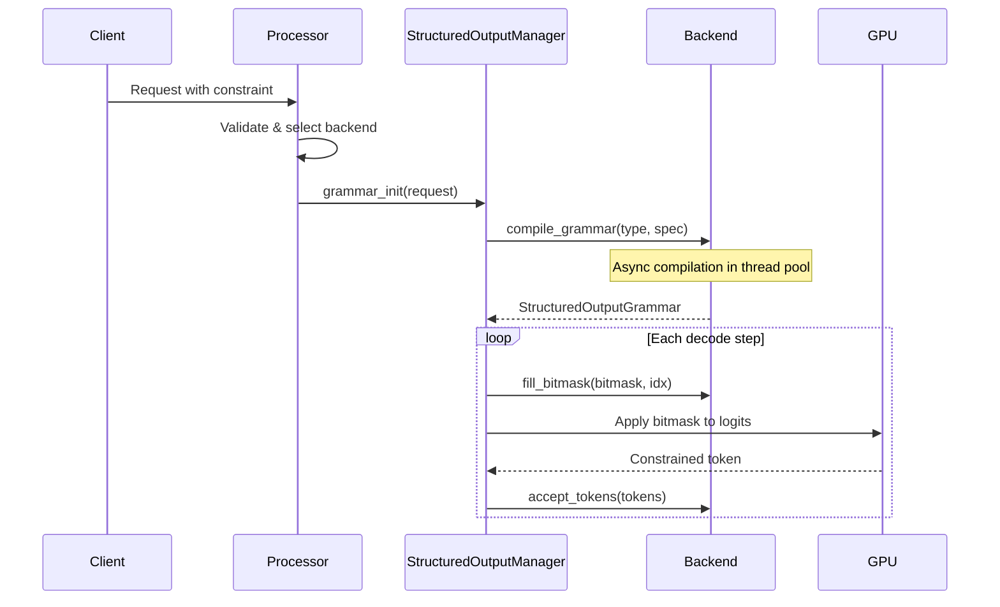
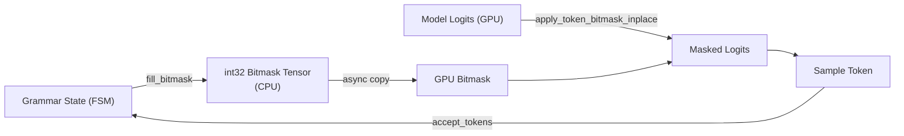

# Structured Output Overview

Structured output is a vLLM feature that constrains the model's token generation to match a
specified format — such as a JSON schema, a regular expression, or a formal grammar. Instead of
post-processing free-form text, the engine enforces the constraint at the logit level: before
each token is sampled, a bitmask is applied to the logit tensor so that only tokens that keep
the output valid can be selected.

This page explains the concepts, constraint types, and how the system works end-to-end.
For backend-specific details see the individual backend pages:

- [xgrammar backend](backend-xgrammar.md)
- [outlines backend](backend-outlines.md)
- [llguidance backend](backend-guidance.md)
- [lm-format-enforcer backend](backend-lm-format-enforcer.md)

---

## Constraint Types

vLLM supports six kinds of structured output constraints, all exposed through the
`StructuredOutputsParams` dataclass (defined in `vllm/sampling_params.py`):

| Constraint | Field | Description |
|---|---|---|
| JSON Schema | `json` | Constrain output to a JSON object matching a JSON Schema |
| JSON Object | `json_object` | Constrain output to any valid JSON object |
| Regex | `regex` | Constrain output to strings matching a regular expression |
| Grammar | `grammar` | Constrain output using an EBNF context-free grammar |
| Choice | `choice` | Constrain output to one of a fixed list of strings |
| Structural Tag | `structural_tag` | Constrain tagged regions (e.g. tool-call blocks) to a schema |

Exactly one constraint field must be set per request. Setting more than one raises a
`ValueError`.

---

## How It Works

The structured output pipeline operates in three stages:



### 1. Validation and Backend Selection

When a request arrives, `SamplingParams._validate_structured_outputs()` (in
`vllm/sampling_params.py`) validates the constraint and selects a backend. With
`backend="auto"` (the default), vLLM tries backends in priority order:

1. **xgrammar** — tried first for all constraint types it supports
2. **guidance** — fallback when xgrammar cannot handle the schema features
3. **outlines** — fallback for Mistral tokenizers or schemas with `patternProperties`

If a specific backend is configured (e.g. `backend="xgrammar"`), no fallback occurs and
validation errors are surfaced immediately.

### 2. Grammar Compilation

The `StructuredOutputManager` (in `vllm/v1/structured_output/__init__.py`) manages
grammar compilation for the engine. Compilation is offloaded to a `ThreadPoolExecutor`
so it does not block the scheduler. The compiled grammar is stored as a
`StructuredOutputGrammar` object attached to the request.

```python
# From vllm/v1/structured_output/__init__.py
max_workers = max(1, (multiprocessing.cpu_count() + 1) // 2)
self.executor = ThreadPoolExecutor(max_workers=max_workers)
```

### 3. Token Bitmask Application

At each decode step, the manager calls `fill_bitmask()` on each active grammar to
populate a packed int32 bitmask tensor. The bitmask is then applied to the model's
logit tensor on the GPU using `xgr.apply_token_bitmask_inplace()`, zeroing out
logits for all disallowed tokens before sampling.



For large batches (> 128 requests), bitmask filling is parallelised across a second
thread pool (`executor_for_fillmask`) with a batch size of 16.

---

## Constraint Type Details

### JSON Schema

The most common constraint. Accepts a JSON Schema dict or string. The schema is compiled
into a grammar or FSM that only allows token sequences that produce valid JSON matching
the schema.

```python
from pydantic import BaseModel
from vllm import LLM, SamplingParams
from vllm.sampling_params import StructuredOutputsParams

class CarDescription(BaseModel):
    brand: str
    model: str
    year: int

llm = LLM(model="Qwen/Qwen2.5-3B-Instruct")
params = SamplingParams(
    structured_outputs=StructuredOutputsParams(
        json=CarDescription.model_json_schema()
    )
)
outputs = llm.generate("Describe the Toyota Supra", params)
print(outputs[0].outputs[0].text)
# {"brand": "Toyota", "model": "Supra", "year": 1993}
```

### Regex

Constrains output to strings matching a Python-compatible regular expression.

```python
params = SamplingParams(
    structured_outputs=StructuredOutputsParams(
        regex=r"\w+@\w+\.com"
    )
)
```

> **Note:** The outlines backend does not support backreferences, look-around assertions,
> or Unicode word boundaries in regex patterns.

### Grammar (EBNF)

Constrains output using an Extended Backus-Naur Form (EBNF) grammar. The xgrammar and
guidance backends support EBNF natively. Lark-format grammars are automatically
converted to EBNF when xgrammar is the backend.

```python
sql_grammar = """
root ::= select_statement
select_statement ::= "SELECT " column " from " table " where " condition
column ::= "col_1 " | "col_2 "
table ::= "table_1 " | "table_2 "
condition ::= column "= " number
number ::= "1 " | "2 "
"""

params = SamplingParams(
    structured_outputs=StructuredOutputsParams(grammar=sql_grammar)
)
```

> **Note:** The outlines and lm-format-enforcer backends do not support grammar
> constraints.

### Choice

Constrains output to one of a fixed list of strings. Useful for classification tasks.

```python
params = SamplingParams(
    structured_outputs=StructuredOutputsParams(
        choice=["Positive", "Negative", "Neutral"]
    )
)
```

### JSON Object

Constrains output to any valid JSON object (no schema required).

```python
params = SamplingParams(
    structured_outputs=StructuredOutputsParams(json_object=True)
)
```

### Structural Tag

Constrains specific tagged regions of the output to a JSON schema, while allowing
free-form text outside those regions. Useful for tool-calling formats.

```python
structural_tag = {
    "triggers": ["<function="],
    "structures": [
        {
            "begin": "<function=get_weather>",
            "schema": {
                "type": "object",
                "properties": {"city": {"type": "string"}},
                "required": ["city"],
            },
            "end": "</function>",
        }
    ],
}
```

---

## Backend Comparison

| Feature | xgrammar | guidance | outlines | lm-format-enforcer |
|---|---|---|---|---|
| JSON Schema | ✅ | ✅ | ✅ | ✅ |
| JSON Object | ✅ | ✅ | ❌ | ✅ |
| Regex | ✅ | ✅ | ✅ | ✅ |
| EBNF Grammar | ✅ | ✅ | ❌ | ❌ |
| Choice | ✅ | ✅ | ✅ | ✅ |
| Structural Tag | ✅ | ✅ | ❌ | ❌ |
| Speculative decoding | ✅ | ✅ | ✅ | ❌ |
| Mistral tokenizer | ✅ | ❌ | ✅ | ❌ |
| Lark grammar auto-convert | ✅ | ❌ | ❌ | ❌ |
| `disable_any_whitespace` | ✅ | ✅ | ❌ | ❌ |
| `disable_additional_properties` | ❌ | ✅ | ❌ | ❌ |

---

## Key Classes

### `StructuredOutputsParams`

Defined in `vllm/sampling_params.py`. Passed as the `structured_outputs` field of
`SamplingParams`.

```python
@dataclass
class StructuredOutputsParams:
    json: str | dict | None = None
    regex: str | None = None
    choice: list[str] | None = None
    grammar: str | None = None
    json_object: bool | None = None
    structural_tag: str | None = None
    disable_fallback: bool = False
    disable_any_whitespace: bool = False
    disable_additional_properties: bool = False
    whitespace_pattern: str | None = None
```

### `StructuredOutputOptions` (Enum)

Defined in `vllm/v1/structured_output/backend_types.py`. Identifies the constraint type
internally:

```python
class StructuredOutputOptions(enum.Enum):
    JSON = enum.auto()
    JSON_OBJECT = enum.auto()
    REGEX = enum.auto()
    GRAMMAR = enum.auto()
    CHOICE = enum.auto()
    STRUCTURAL_TAG = enum.auto()
```

### `StructuredOutputBackend` (Abstract)

Engine-level backend. Implements `compile_grammar()` and `allocate_token_bitmask()`.

### `StructuredOutputGrammar` (Abstract)

Request-level grammar state machine. Implements `accept_tokens()`, `fill_bitmask()`,
`validate_tokens()`, `rollback()`, `is_terminated()`, and `reset()`.

### `StructuredOutputManager`

Engine-level orchestrator in `vllm/v1/structured_output/__init__.py`. Manages the
backend singleton, async compilation thread pool, and bitmask generation for each
decode step.

---

## Reasoning Model Support

For reasoning models (e.g. DeepSeek-R1), structured output can be applied only to the
final answer portion, skipping the `<think>...</think>` reasoning trace. This is
controlled by:

- `reasoning_parser` — selects the parser that detects when reasoning ends
- `enable_in_reasoning` — if `True`, applies constraints during reasoning as well

See `vllm/config/structured_outputs.py` for the full `StructuredOutputsConfig` options.

---

## See Also

- [response_format parameter](response-format.md)
- [guided_decoding_backend configuration](guided-decoding-backend.md)
- [xgrammar backend](backend-xgrammar.md)
- [outlines backend](backend-outlines.md)
- [llguidance backend](backend-guidance.md)
- [lm-format-enforcer backend](backend-lm-format-enforcer.md)
