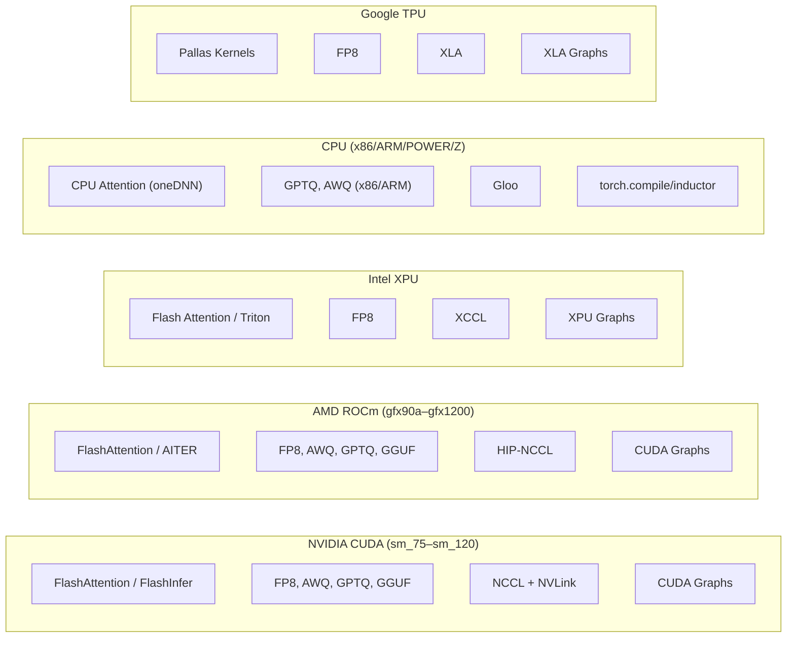

# Hardware Support

vLLM supports a wide range of hardware platforms through a unified `Platform` abstraction layer. This section documents each supported platform, its capabilities, configuration options, and CI test infrastructure.

## Supported Platforms

| Platform | Page | Key Hardware |
|----------|------|-------------|
| Platform Overview | [overview.md](overview.md) | Architecture, `Platform` interface, `current_platform` |
| NVIDIA CUDA | [cuda.md](cuda.md) | H100, A100, L40, RTX 4090, GH200 |
| AMD ROCm | [rocm.md](rocm.md) | MI300X, MI325X, RX 7900 XTX |
| Intel XPU | [xpu.md](xpu.md) | Data Center GPU Max, Arc A770 |
| CPU | [cpu.md](cpu.md) | x86_64, ARM, ppc64le, s390x |
| Google TPU | [tpu.md](tpu.md) | TPU v6e, v5e, v4 |
| ARM/ppc64le/s390x | [alt-arch.md](alt-arch.md) | Graviton, POWER9, IBM Z |
| Hardware CI | [hardware-ci.md](hardware-ci.md) | Buildkite YAML configs, test scripts |

## Quick Start by Platform

### NVIDIA GPU

```bash
pip install vllm
vllm serve meta-llama/Llama-3.1-8B
```

### AMD GPU (ROCm)

```bash
pip install vllm --extra-index-url https://download.pytorch.org/whl/rocm6.2
vllm serve meta-llama/Llama-3.1-8B
```

### Intel GPU (XPU)

```bash
pip install vllm-xpu-kernels
vllm serve meta-llama/Llama-3.1-8B
```

### CPU

```bash
pip install vllm-cpu
VLLM_CPU_KVCACHE_SPACE=16 vllm serve meta-llama/Llama-3.1-8B
```

### Google TPU

```bash
pip install -r requirements/tpu.txt && pip install -e .
vllm serve meta-llama/Llama-3.1-8B --device tpu
```

## Platform Capability Matrix



## See Also

- [Architecture Overview](../03-architecture/README.md) — How the platform layer fits into vLLM's engine
- [Configuration Reference](../06-configuration/README.md) — Platform-specific configuration options
- [Distributed Inference](../07-distributed/README.md) — Multi-GPU and multi-node setup
