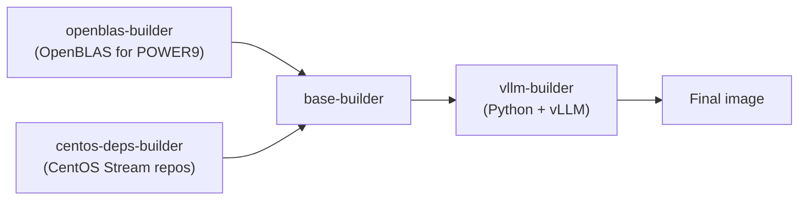

# ARM, ppc64le, and s390x Support

vLLM supports three alternative CPU architectures beyond x86_64: ARM (AArch64), IBM POWER (ppc64le), and IBM Z (s390x). Each has a dedicated Dockerfile and CI test script. All three use the `CpuPlatform` with architecture-specific optimizations.

## Architecture Summary

| Architecture | Enum | Base Image | Build Tool | CI Script |
|-------------|------|-----------|-----------|-----------|
| ARM (AArch64) | `CpuArchEnum.ARM` | Ubuntu 22.04 | Docker | `run-cpu-test-arm.sh` |
| ppc64le (POWER) | `CpuArchEnum.POWERPC` | Red Hat UBI9 | Podman | `run-cpu-test-ppc64le.sh` |
| s390x (IBM Z) | `CpuArchEnum.S390X` | Red Hat UBI9 | Docker | `run-cpu-test-s390x.sh` |

## ARM (AArch64)

### Overview

ARM support covers AWS Graviton, Ampere Altra, Apple Silicon (M-series), and other AArch64 platforms. The same `docker/Dockerfile.cpu` used for x86_64 also builds for ARM64 via Docker's multi-platform build system.

### Dockerfile

```bash
# Build for ARM64
docker buildx build \
  --platform=linux/arm64 \
  -f docker/Dockerfile.cpu \
  -t vllm-cpu-arm .
```

The Dockerfile validates that x86-specific ISA flags are not used with ARM64:

```dockerfile
RUN if [ "$TARGETARCH" = "arm64" ] && \
    { [ "$VLLM_CPU_AVX2" != "0" ] || [ "$VLLM_CPU_AVX512" != "0" ] || ... }; then \
    echo "ERROR: Cannot use x86-specific ISA flags when building for ARM64"; \
    exit 1; fi
```

ARM-specific build argument:

| Build Argument | Default | Description |
|---------------|---------|-------------|
| `VLLM_CPU_ARM_BF16` | `false` | Enable ARM BF16 instructions (cross-compilation) |

### Data Types on ARM

BF16 support on ARM depends on hardware:

```python
elif self.get_cpu_architecture() == CpuArchEnum.ARM and sys.platform.startswith("darwin"):
    # Apple Silicon: check FEAT_BF16 hardware feature
    if subprocess.check_output(
        ["sysctl -n hw.optional.arm.FEAT_BF16"], shell=True
    ).strip() == b"1":
        return [torch.bfloat16, torch.float16, torch.float32]
    return [torch.float16, torch.float32]
```

On Linux ARM (Graviton, Ampere), both BF16 and FP16 are supported natively.

### libgomp Preload

ARM requires PyTorch's `libgomp` to be preloaded for proper multi-core utilization:

```python
# Automatically applied on ARM Linux
if platform.system() == "Linux" and get_cpu_architecture() == CpuArchEnum.ARM:
    pytorch_libgomp_so = find_pytorch_libgomp()
    os.environ["LD_PRELOAD"] += ":" + pytorch_libgomp_so
```

### CI Test Script

**File**: `.buildkite/scripts/hardware_ci/run-cpu-test-arm.sh`

The ARM CI test:
1. Builds the CPU Docker image (`docker/Dockerfile.cpu`)
2. Runs offline inference with `facebook/opt-125m`
3. Tests multimodal models (Whisper)
4. Runs kernel tests (oneDNN, CPU attention, MoE)
5. Tests online serving with `Qwen/Qwen3-0.6B`

```bash
# Core range for CPU binding
CORE_RANGE=${CORE_RANGE:-0-16}
OMP_CORE_RANGE=${OMP_CORE_RANGE:-0-16}

# Build
docker build --tag cpu-test --target vllm-test -f docker/Dockerfile.cpu .

# Run with CPU binding and 16 GiB KV cache
docker run -itd \
  --cpuset-cpus="$CORE_RANGE" \
  --env VLLM_CPU_KVCACHE_SPACE=16 \
  --env VLLM_CPU_CI_ENV=1 \
  --shm-size=4g \
  --name cpu-test cpu-test
```

Test commands run inside the container:

```bash
# Offline inference
python3 examples/offline_inference/basic/generate.py --model facebook/opt-125m

# Multimodal
pytest -x -v -s tests/models/multimodal/generation/test_whisper.py -m cpu_model

# Kernels
pytest -x -v -s tests/kernels/test_onednn.py
pytest -x -v -s tests/kernels/attention/test_cpu_attn.py
pytest -x -v -s tests/kernels/moe/test_moe.py -k test_cpu_fused_moe_basic

# Online serving
VLLM_CPU_OMP_THREADS_BIND=$E2E_OMP_THREADS vllm serve Qwen/Qwen3-0.6B --max-model-len 2048
```

Total timeout: 2 hours.

---

## ppc64le (IBM POWER)

### Overview

ppc64le support targets IBM POWER9 and POWER10 servers running Linux. The Dockerfile uses Red Hat UBI9 (Universal Base Image) and builds OpenBLAS from source for POWER9 targets.

### Dockerfile

**File**: `docker/Dockerfile.ppc64le`

The build is multi-stage:



Key build steps:

```dockerfile
# Stage 1: Build OpenBLAS for POWER9
FROM registry.access.redhat.com/ubi9/ubi-minimal AS openblas-builder
RUN make -j${MAX_JOBS} TARGET=POWER9 BINARY=64 USE_OPENMP=1 \
    USE_THREAD=1 NUM_THREADS=120 DYNAMIC_ARCH=1

# Stage 2: CentOS Stream repos for additional packages
FROM registry.access.redhat.com/ubi9/ubi-minimal AS centos-deps-builder
RUN dnf install -y openjpeg2-devel lcms2-devel tcl-devel tk-devel ...

# Final: Python 3.12 + vLLM
ARG PYTHON_VERSION=3.12
```

Build with Podman (required for ppc64le):

```bash
podman build -t cpu-test-ubi9-ppc -f docker/Dockerfile.ppc64le .
```

### Data Types on ppc64le

POWER CPUs support BF16 and FP32 (no FP16):

```python
if self.get_cpu_architecture() == CpuArchEnum.POWERPC:
    return [torch.bfloat16, torch.float32]
```

### libgomp Preload

Like ARM, ppc64le requires PyTorch's `libgomp` preloading:

```python
if platform.system() == "Linux" and get_cpu_architecture() == CpuArchEnum.POWERPC:
    pytorch_libgomp_so = find_pytorch_libgomp()
    os.environ["LD_PRELOAD"] += ":" + pytorch_libgomp_so
```

### CI Test Script

**File**: `.buildkite/scripts/hardware_ci/run-cpu-test-ppc64le.sh`

The ppc64le CI uses Podman (not Docker) and runs with `TORCH_COMPILE_DISABLE=1` to avoid compilation overhead:

```bash
# Build
podman build -t cpu-test-ubi9-ppc -f docker/Dockerfile.ppc64le .

# Run
container_id=$(podman run -itd \
  --entrypoint /bin/bash \
  -v /tmp/:/root/.cache/huggingface \
  --privileged=true \
  --network host \
  -e HF_TOKEN \
  cpu-test-ubi9-ppc)
```

Tests run inside the container:

```bash
# Offline inference
TORCH_COMPILE_DISABLE=1 python3 examples/offline_inference/basic/generate.py \
  --model facebook/opt-125m

# Language model tests
pytest -v -s tests/models/language/generation/test_common.py::test_models[False-False-5-32-openai-community/gpt2]
pytest -v -s tests/models/language/generation/test_common.py::test_models[False-False-5-32-facebook/opt-125m]
pytest -v -s tests/models/language/generation/test_common.py::test_models[False-False-5-32-google/gemma-1.1-2b-it]

# Classification pooling
pytest -v -s tests/models/language/pooling/test_classification.py::test_models[float-jason9693/Qwen2.5-1.5B-apeach]
```

Total timeout: 120 minutes.

---

## s390x (IBM Z)

### Overview

s390x support targets IBM Z mainframe systems. The Dockerfile uses Red Hat UBI9 and builds Apache Arrow from source (since pre-built wheels are not available for s390x).

### Dockerfile

**File**: `docker/Dockerfile.s390x`

The build is multi-stage:


Key dependencies installed:

```dockerfile
RUN microdnf install -y \
    gcc-toolset-14 gcc-toolset-14-binutils gcc-toolset-14-libatomic-devel \
    openblas openblas-devel \
    clang llvm-devel llvm-static clang-devel \
    libsndfile numpy ...
```

Apache Arrow is built from source:

```dockerfile
FROM python-install AS pyarrow
RUN git clone https://github.com/apache/arrow.git && \
    cd arrow/cpp && mkdir release && cd release && \
    cmake -DCMAKE_BUILD_TYPE=Release \
          -DCMAKE_INSTALL_PREFIX=/usr/local \
          -DARROW_PYTHON=ON ...
```

Build:

```bash
docker build -t cpu-test -f docker/Dockerfile.s390x .
```

### CI Test Script

**File**: `.buildkite/scripts/hardware_ci/run-cpu-test-s390x.sh`

The s390x CI is minimal — it only validates that the Docker image builds successfully:

```bash
#!/bin/bash
set -ex

remove_docker_container() { docker rm -f cpu-test || true; docker system prune -f; }
trap remove_docker_container EXIT
remove_docker_container

# Build the Docker image (primary validation)
docker build -t cpu-test -f docker/Dockerfile.s390x .
```

---

## Buildkite CI Configuration

All alternative architecture tests are defined in `.buildkite/hardware_tests/cpu.yaml`:

```yaml
- label: "Arm CPU Test"
  depends_on: []
  soft_fail: true
  device: arm_cpu
  no_plugin: true
  commands:
  - bash .buildkite/scripts/hardware_ci/run-cpu-test-arm.sh
```

All tests use `soft_fail: true`, meaning CI failures are reported but do not block the pipeline.

## Quantization on Alternative Architectures

| Quantization | ARM | ppc64le | s390x |
|-------------|-----|---------|-------|
| GPTQ | ✅ | ✅ | ❌ |
| AWQ | ✅ | ✅ | ❌ |
| BitsAndBytes | ✅ | ✅ | ❌ |
| FP8 | ❌ | ❌ | ❌ |
| GGUF | ✅ | ✅ | ❌ |

## Related Pages

- [CPU Platform](cpu.md)
- [Platform Overview](overview.md)
- [Hardware CI](hardware-ci.md)
