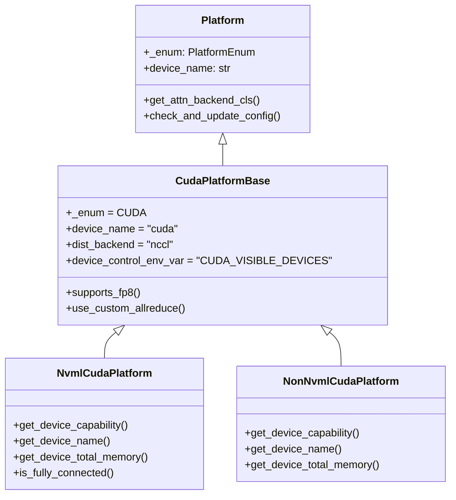

# NVIDIA CUDA Platform

vLLM's NVIDIA CUDA platform (`CudaPlatform`) provides full-featured GPU acceleration using CUDA, NCCL for distributed communication, and a rich set of attention backends including FlashAttention, FlashInfer, and Triton. It is the primary and most feature-complete platform in vLLM.

## Source File

`vllm/platforms/cuda.py`

## Supported Architectures

The official vLLM Docker image (`docker/Dockerfile`) compiles CUDA kernels for the following compute capabilities:

| Compute Capability | Architecture | GPU Examples |
|-------------------|--------------|--------------|
| sm_70 | Volta | V100 |
| sm_75 | Turing | T4, RTX 2080 |
| sm_80 | Ampere | A100, A30 |
| sm_86 | Ampere | A10, A40, RTX 3090 |
| sm_89 | Ada Lovelace | L4, L40, RTX 4090 |
| sm_90 | Hopper | H100, H200 |
| sm_100 | Blackwell | B100, B200, GB200 |
| sm_120 | Blackwell | RTX 5090 |

The default `TORCH_CUDA_ARCH_LIST` used during build is:

```
7.0 7.5 8.0 8.9 9.0 10.0 12.0
```

For GH200 (ARM-based Grace Hopper), the build uses `9.0+PTX` to enable PTX JIT compilation.

> **Note**: FP8 quantization requires sm_89 (Ada Lovelace) or newer. BF16 requires sm_80 (Ampere) or newer.

## Class Hierarchy



At module load time, vLLM auto-selects between `NvmlCudaPlatform` (when NVML is available) and `NonNvmlCudaPlatform` (for Jetson and other non-NVML environments):

```python
CudaPlatform = NvmlCudaPlatform if nvml_available else NonNvmlCudaPlatform
```

## Key Platform Properties

```python
class CudaPlatformBase(Platform):
    _enum = PlatformEnum.CUDA
    device_name: str = "cuda"
    device_type: str = "cuda"
    dispatch_key: str = "CUDA"
    ray_device_key: str = "GPU"
    dist_backend: str = "nccl"
    device_control_env_var: str = "CUDA_VISIBLE_DEVICES"
    ray_noset_device_env_vars: list[str] = [
        "RAY_EXPERIMENTAL_NOSET_CUDA_VISIBLE_DEVICES",
    ]
```

## Attention Backends

The CUDA platform selects attention backends based on device capability and model configuration. Backend priority is determined by `_get_backend_priorities()`:

### Standard Attention (non-MLA)

**Blackwell (sm_100+)**:
1. `FLASHINFER` (highest priority)
2. `FLASH_ATTN`
3. `TRITON_ATTN`
4. `FLEX_ATTENTION`

**All other GPUs (sm_75–sm_90)**:
1. `FLASH_ATTN` (highest priority)
2. `FLASHINFER`
3. `TRITON_ATTN`
4. `FLEX_ATTENTION`

### MLA Attention (DeepSeek-style)

**Blackwell (sm_100+)**:
1. `FLASHINFER_MLA` (preferred for qk_nope_head_dim=128)
2. `CUTLASS_MLA` (fallback on Blackwell)
3. `FLASH_ATTN_MLA`
4. `FLASHMLA`
5. `TRITON_MLA`
6. `FLASHMLA_SPARSE` / `FLASHINFER_MLA_SPARSE`

**Non-Blackwell**:
1. `FLASH_ATTN_MLA`
2. `FLASHMLA`
3. `FLASHINFER_MLA`
4. `TRITON_MLA`

### Vision Transformer (ViT) Attention

Supported backends for ViT models:
- `FLASH_ATTN`
- `TRITON_ATTN`
- `TORCH_SDPA`
- `FLASHINFER`

## MLA Block Size Configuration

When using MLA (Multi-head Latent Attention), the CUDA platform automatically adjusts the KV cache block size:

| Backend | Required Block Size |
|---------|-------------------|
| FlashMLA | 64 (multiple of 64) |
| CUTLASS_MLA | 128 (multiple of 128) |
| FlashInfer MLA | 64 (or 32) |

```python
# From cuda.py check_and_update_config
if use_flashmla and cache_config.block_size % 64 != 0:
    cache_config.block_size = 64

if use_cutlass_mla and cache_config.block_size % 128 != 0:
    cache_config.block_size = 128
```

## Supported Data Types

Data type support is gated by compute capability:

```python
@property
def supported_dtypes(self) -> list[torch.dtype]:
    if self.has_device_capability(80):
        # Ampere and newer: BF16, FP16, FP32
        return [torch.bfloat16, torch.float16, torch.float32]
    if self.has_device_capability(60):
        # Pascal/Volta/Turing: FP16, FP32 (no BF16)
        return [torch.float16, torch.float32]
    return [torch.float32]
```

## FP8 Support

FP8 quantization is available on Ada Lovelace (sm_89) and newer:

```python
@classmethod
def supports_fp8(cls) -> bool:
    return cls.has_device_capability(89)
```

## NVML Integration

The `NvmlCudaPlatform` uses NVML (NVIDIA Management Library) via `pynvml` for stateless hardware queries without initializing the CUDA context. The `@with_nvml_context` decorator handles NVML lifecycle:

```python
def with_nvml_context(fn):
    @wraps(fn)
    def wrapper(*args, **kwargs):
        pynvml.nvmlInit()
        try:
            return fn(*args, **kwargs)
        finally:
            pynvml.nvmlShutdown()
    return wrapper
```

Key NVML-backed methods:
- `get_device_capability(device_id)` — reads compute capability via NVML
- `get_device_name(device_id)` — physical GPU name
- `get_device_total_memory(device_id)` — total VRAM in bytes
- `is_fully_connected(device_ids)` — NVLink topology check

## NVLink Detection

The `is_fully_connected()` method checks NVLink connectivity between GPUs using NVML's `nvmlDeviceGetNvLinkState`. This is used to determine whether tensor parallelism can use fast NVLink paths.

## Distributed Communication

The CUDA platform uses NCCL for all distributed operations:

```python
dist_backend: str = "nccl"
```

The `stateless_init_device_torch_dist_pg()` method creates NCCL process groups without requiring a pre-initialized CUDA context, enabling Ray-based multi-GPU setups.

## CUDA Graph Support

CUDA graphs are fully supported on the CUDA platform:

```python
@classmethod
def get_static_graph_wrapper_cls(cls) -> str:
    return "vllm.compilation.cuda_graph.CUDAGraphWrapper"

@classmethod
def support_static_graph_mode(cls) -> bool:
    return True
```

## Custom AllReduce

The CUDA platform enables vLLM's custom AllReduce implementation for small tensor sizes, which outperforms NCCL for typical LLM batch sizes:

```python
@classmethod
def use_custom_allreduce(cls) -> bool:
    return True
```

## Worker Configuration

When `parallel_config.worker_cls == "auto"`, the CUDA platform sets:

```python
parallel_config.worker_cls = "vllm.v1.worker.gpu_worker.Worker"
```

Default KV cache block size is 16 tokens.

## Device Control

Use `CUDA_VISIBLE_DEVICES` to restrict which GPUs vLLM uses:

```bash
CUDA_VISIBLE_DEVICES=0,1 vllm serve meta-llama/Llama-3.1-8B --tensor-parallel-size 2
```

## Multi-GPU Warning

When multiple different GPU models are detected, vLLM warns about potential ordering issues:

```
Detected different devices in the system: A100, V100. Please make sure to set
`CUDA_DEVICE_ORDER=PCI_BUS_ID` to avoid unexpected behavior.
```

## Building for Specific Architectures

To build vLLM for a specific CUDA architecture:

```bash
# Build only for Hopper (H100)
docker build --build-arg torch_cuda_arch_list="9.0" -f docker/Dockerfile .

# Build for Blackwell only
docker build --build-arg torch_cuda_arch_list="10.0 12.0" -f docker/Dockerfile .

# GH200 (ARM Grace Hopper)
docker build --build-arg torch_cuda_arch_list="9.0+PTX" \
  --platform linux/arm64 -f docker/Dockerfile .
```

## Related Pages

- [Platform Overview](overview.md)
- [AMD ROCm Platform](rocm.md)
- [Hardware CI](hardware-ci.md)
