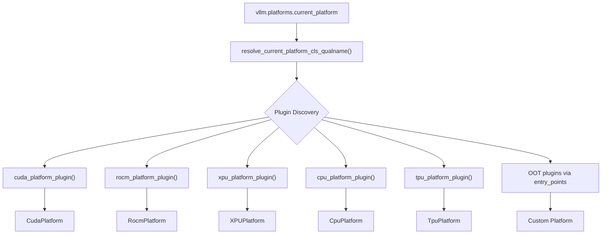
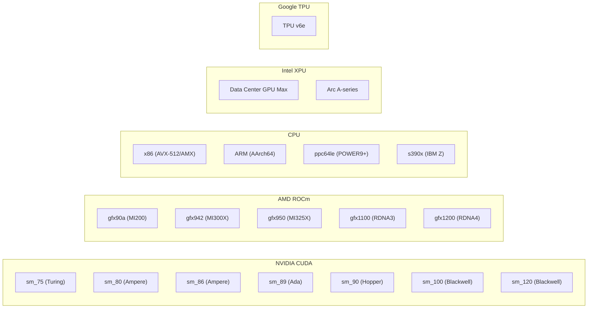

# Platform Support Overview

vLLM supports a wide range of hardware platforms through a unified `Platform` abstraction layer. Each platform implements a common interface that enables vLLM's core engine to remain hardware-agnostic while allowing platform-specific optimizations for attention kernels, quantization, distributed communication, and compilation.

## Supported Platforms

| Platform | Class | Detection Method | Distributed Backend |
|----------|-------|-----------------|---------------------|
| NVIDIA CUDA | `CudaPlatform` | pynvml / NVML | NCCL |
| AMD ROCm | `RocmPlatform` | amdsmi | NCCL (via HIP) |
| Intel XPU | `XPUPlatform` | `torch.xpu.is_available()` | XCCL |
| CPU (x86/ARM) | `CpuPlatform` | vLLM CPU build flag / macOS | Gloo |
| Google TPU | `TpuPlatform` | libtpu / Pathways | XLA |
| Out-of-Tree | Custom `Platform` subclass | Plugin entry point | Custom |

## Platform Interface Architecture

All platforms inherit from the `Platform` base class defined in `vllm/platforms/interface.py`. The `current_platform` singleton is resolved lazily at first access via a plugin discovery mechanism.



## The `Platform` Base Class

Defined in `vllm/platforms/interface.py`, the `Platform` class provides the contract that all hardware backends must implement.

### Key Class Attributes

```python
class Platform:
    _enum: PlatformEnum          # Identifies the platform type
    device_name: str             # e.g., "cuda", "rocm", "xpu", "cpu"
    device_type: str             # PyTorch device type string
    dispatch_key: str            # PyTorch dispatch key (default: "CPU")
    ray_device_key: str          # Ray resource key (e.g., "GPU")
    dist_backend: str            # Distributed backend ("nccl", "gloo", "xccl")
    device_control_env_var: str  # e.g., "CUDA_VISIBLE_DEVICES"
    simple_compile_backend: str  # torch.compile backend (default: "inductor")
    supported_quantization: list[str]  # Allowed quant methods (empty = all)
```

### Platform Identification

```python
from vllm.platforms import current_platform

current_platform.is_cuda()    # True on NVIDIA GPUs
current_platform.is_rocm()    # True on AMD GPUs
current_platform.is_xpu()     # True on Intel GPUs
current_platform.is_cpu()     # True on CPU-only builds
current_platform.is_tpu()     # True on Google TPUs
current_platform.is_cuda_alike()  # True for CUDA or ROCm
```

### `PlatformEnum` Values

```python
class PlatformEnum(enum.Enum):
    CUDA        = enum.auto()
    ROCM        = enum.auto()
    TPU         = enum.auto()
    XPU         = enum.auto()
    CPU         = enum.auto()
    OOT         = enum.auto()   # Out-of-tree plugin
    UNSPECIFIED = enum.auto()   # No platform detected
```

### Device Capability

The `DeviceCapability` named tuple encodes hardware compute capability as `(major, minor)`:

```python
class DeviceCapability(NamedTuple):
    major: int
    minor: int

    def as_version_str(self) -> str: ...   # e.g., "8.0"
    def to_int(self) -> int: ...           # e.g., 80 for sm_80
```

Key capability query methods:

```python
# Check if device meets minimum capability
platform.has_device_capability(80)          # >= sm_80 (Ampere)
platform.has_device_capability((8, 0))      # same, tuple form

# Check exact capability
platform.is_device_capability(90)           # exactly sm_90

# Check capability family (major version)
platform.is_device_capability_family(100)   # any 10.x (Blackwell)
```

### Key Abstract Methods

| Method | Description |
|--------|-------------|
| `get_device_capability(device_id)` | Returns `DeviceCapability` or `None` |
| `get_device_name(device_id)` | Human-readable device name |
| `get_device_total_memory(device_id)` | Total VRAM in bytes |
| `get_attn_backend_cls(...)` | Select attention kernel backend |
| `check_and_update_config(vllm_config)` | Apply platform-specific config defaults |
| `import_kernels()` | Load platform-specific C extensions |
| `set_device(device)` | Set active device |
| `inference_mode()` | Context manager for inference (wraps `torch.inference_mode`) |
| `get_device_communicator_cls()` | Distributed communicator class path |
| `supports_fp8()` | Whether FP8 quantization is supported |
| `support_hybrid_kv_cache()` | Whether hybrid KV cache is supported |
| `num_compute_units(device_id)` | SM / CU / EU count |

### CPU Architecture Detection

The `get_cpu_architecture()` classmethod identifies the host CPU:

```python
class CpuArchEnum(enum.Enum):
    X86     = enum.auto()   # x86_64, amd64, i386
    ARM     = enum.auto()   # arm*, aarch64
    POWERPC = enum.auto()   # ppc*
    S390X   = enum.auto()   # s390x
    RISCV   = enum.auto()   # riscv*
    OTHER   = enum.auto()
    UNKNOWN = enum.auto()
```

## Platform Detection Flow

Platform detection happens lazily when `current_platform` is first accessed. The `__init__.py` module defines detection plugins for each built-in platform:

```python
builtin_platform_plugins = {
    "tpu":  tpu_platform_plugin,
    "cuda": cuda_platform_plugin,
    "rocm": rocm_platform_plugin,
    "xpu":  xpu_platform_plugin,
    "cpu":  cpu_platform_plugin,
}
```

Detection logic per platform:

- **CUDA**: Uses `pynvml.nvmlDeviceGetCount() > 0` and checks that the vLLM build is not a CPU build. Falls back to Jetson detection via `/etc/nv_tegra_release`.
- **ROCm**: Uses `amdsmi.amdsmi_get_processor_handles()` to count AMD GPUs.
- **XPU**: Checks `torch.xpu.is_available()`.
- **CPU**: Checks for `"cpu"` substring in the vLLM version string, or macOS (`sys.platform == "darwin"`).
- **TPU**: Checks for `VLLM_TPU_USING_PATHWAYS` env var, then tries `import libtpu`.

> **Note**: Only one platform can be active at a time. If multiple platforms are detected, vLLM raises a `RuntimeError`. Out-of-tree (OOT) plugins take precedence over built-in platforms.

## Platform Capability Matrix



## Feature Support by Platform

| Feature | CUDA | ROCm | XPU | CPU | TPU |
|---------|------|------|-----|-----|-----|
| FlashAttention | ✅ | ✅ (gfx9) | ✅ | ❌ | ❌ |
| FlashInfer | ✅ | ❌ | ❌ | ❌ | ❌ |
| Triton Attention | ✅ | ✅ | ✅ | ❌ | ❌ |
| FP8 Quantization | ✅ (sm≥89) | ✅ | ✅ | ❌ | ✅ |
| AWQ | ✅ | ✅ | ❌ | ❌ | ❌ |
| GPTQ | ✅ | ✅ | ❌ | ❌ | ❌ |
| GGUF | ✅ | ✅ | ❌ | ❌ | ❌ |
| CUDA Graphs | ✅ | ✅ | ✅ | ❌ | ❌ |
| Hybrid KV Cache | ✅ | ✅ | ✅ | ✅ | ❌ |
| Tensor Parallel | ✅ | ✅ | ✅ | ✅ | ✅ |
| LoRA | ✅ | ✅ | ✅ | ✅ | ❌ |
| BF16 | ✅ (sm≥80) | ✅ | ✅ | ✅ | ✅ |

## Out-of-Tree Platform Plugins

Third-party hardware vendors can register custom platforms via Python entry points:

```toml
# pyproject.toml
[project.entry-points."vllm.platform_plugins"]
my_platform = "my_package.platform:my_platform_plugin"
```

The plugin function must return a fully-qualified class name string or `None`:

```python
def my_platform_plugin() -> str | None:
    if my_hardware_is_available():
        return "my_package.platform.MyPlatform"
    return None
```

## Related Pages

- [NVIDIA CUDA Platform](cuda.md)
- [AMD ROCm Platform](rocm.md)
- [Intel XPU Platform](xpu.md)
- [CPU Platform](cpu.md)
- [Google TPU Platform](tpu.md)
- [Hardware CI](hardware-ci.md)
