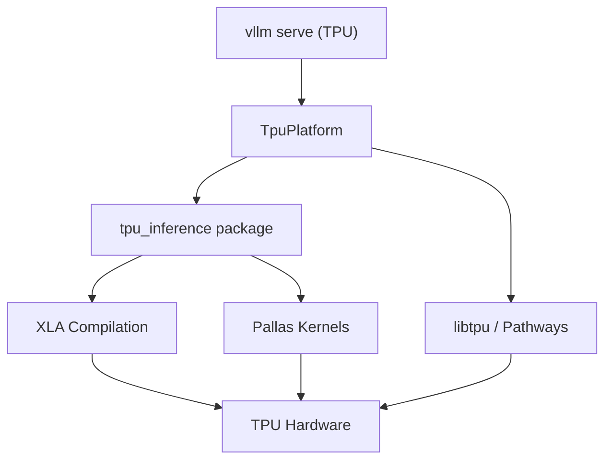

# Google TPU Platform

vLLM supports Google Cloud TPUs (Tensor Processing Units) through the `TpuPlatform` class. TPU support is provided via the `tpu_inference` package, which implements XLA-based compilation and Pallas custom kernels optimized for TPU hardware.

## Source File

`vllm/platforms/tpu.py`

## Supported Hardware

| TPU Version | Notes |
|------------|-------|
| TPU v6e | Primary supported version; used in CI |
| TPU v5e | Supported via XLA |
| TPU v4 | Supported via XLA |

## Architecture Overview



## Platform Detection

TPU detection happens in two ways:

### 1. Pathways TPU Proxy

When `VLLM_TPU_USING_PATHWAYS=1` is set, vLLM uses the Pathways distributed TPU proxy:

```python
if envs.VLLM_TPU_USING_PATHWAYS:
    return "tpu_inference.platforms.tpu_platform.TpuPlatform"
```

### 2. Direct libtpu

For standard TPU VMs, vLLM detects TPUs by importing `libtpu`:

```python
try:
    import libtpu  # Only installed on TPU VMs
    return "vllm.platforms.tpu.TpuPlatform"
except Exception:
    return None
```

## TpuPlatform Implementation

The `TpuPlatform` class is provided by the `tpu_inference` package rather than being implemented directly in vLLM:

```python
# vllm/platforms/tpu.py
try:
    from tpu_inference.platforms import TpuPlatform as TpuInferencePlatform
    TpuPlatform = TpuInferencePlatform
    USE_TPU_INFERENCE = True
except ImportError:
    logger.error(
        "tpu_inference not found, please install tpu_inference to run vllm on TPU"
    )
```

This design allows the TPU platform implementation to be updated independently of the core vLLM package.

## XLA Compilation

TPU inference relies on XLA (Accelerated Linear Algebra) for JIT compilation of model computations. Key XLA-related environment variables:

| Variable | Default | Description |
|----------|---------|-------------|
| `VLLM_XLA_CACHE_PATH` | `~/.cache/vllm/xla_cache` | Directory for XLA compilation cache |
| `VLLM_XLA_CHECK_RECOMPILATION` | `false` | Raise error if unexpected recompilation occurs |

### XLA Cache

XLA compilation can be slow on first run. The compilation cache persists compiled programs to disk:

```bash
# Set custom XLA cache location
export VLLM_XLA_CACHE_PATH=/fast-storage/xla_cache

# Disable XLA cache (force recompilation)
export VLLM_XLA_CACHE_PATH=
```

### Recompilation Detection

Enable recompilation checking to catch unexpected dynamic shapes:

```bash
VLLM_XLA_CHECK_RECOMPILATION=1 vllm serve ...
```

## Pallas Kernels

The TPU platform uses Pallas (Google's TPU kernel language built on JAX) for custom attention and other operations. Pallas kernels are tested in CI:

```bash
pytest -v -s tests/v1/tpu/test_pallas.py
```

## TPU-Specific Configuration

### Bucket Padding

TPU inference uses sequence length bucketing to avoid recompilation for every unique sequence length:

| Variable | Default | Description |
|----------|---------|-------------|
| `VLLM_TPU_BUCKET_PADDING_GAP` | `0` | Gap between sequence length buckets |
| `VLLM_TPU_MOST_MODEL_LEN` | `None` | Maximum model length for bucket planning |

### Pathways Integration

For multi-host TPU pods via Pathways:

```bash
VLLM_TPU_USING_PATHWAYS=1 vllm serve meta-llama/Llama-3.1-8B
```

## Docker Image

The TPU Docker image is based on Google's official PyTorch/XLA nightly image:

```dockerfile
ARG NIGHTLY_DATE="20250730"
ARG BASE_IMAGE="us-central1-docker.pkg.dev/tpu-pytorch-releases/docker/xla:nightly_3.12_tpuvm_$NIGHTLY_DATE"

FROM $BASE_IMAGE
# Uninstall existing torch/torch_xla and reinstall from vLLM requirements
RUN pip uninstall -y torch torch_xla torchvision
ENV VLLM_TARGET_DEVICE="tpu"
RUN python3 -m pip install -r requirements/tpu.txt
RUN python3 -m pip install -e .
```

Build and run:

```bash
docker build -f docker/Dockerfile.tpu -t vllm-tpu .

docker run --privileged --net host --shm-size=16G \
    -e "HF_TOKEN=$HF_TOKEN" \
    --name tpu-test \
    vllm-tpu /bin/bash
```

## Inference Mode

The TPU platform overrides `inference_mode()` to use `torch.no_grad()` instead of `torch.inference_mode()`, since TPU/XLA does not support the latter:

```python
@classmethod
def inference_mode(cls):
    return torch.no_grad()
```

## CI Test Suite

The TPU CI runs on real TPU v6e hardware via Buildkite. Tests are organized into numbered groups:

| Test | Description |
|------|-------------|
| `test_perf.py` | Performance benchmarks |
| `test_compilation.py` | XLA compilation correctness |
| `test_basic.py` | Basic inference tests |
| `test_quantization_accuracy.py` | Quantization accuracy |
| `tpu.py` (example) | Offline inference example |
| `test_tpu_model_runner.py` | Model runner unit tests |
| `test_sampler.py` | Sampling tests |
| `test_topk_topp_sampler.py` | Top-k/Top-p sampling |
| `test_multimodal.py` | Multimodal model tests |
| `test_pallas.py` | Pallas kernel tests |

The CI script (`run-tpu-v1-test.sh`) runs each test independently and tracks pass/fail status without aborting on individual failures.

## Installation

```bash
# Install vLLM with TPU support
pip install -r requirements/tpu.txt
pip install -e .

# Required dependencies
pip install tpu-info  # TPU hardware info tool
```

## Offline Inference Example

```python
# examples/offline_inference/tpu.py
from vllm import LLM, SamplingParams

llm = LLM(model="meta-llama/Llama-3.1-8B", device="tpu")
sampling_params = SamplingParams(temperature=0.8, top_p=0.95)

prompts = ["Hello, my name is", "The capital of France is"]
outputs = llm.generate(prompts, sampling_params)

for output in outputs:
    print(output.outputs[0].text)
```

## Limitations

| Feature | Status |
|---------|--------|
| CUDA Graphs | ❌ Not applicable (uses XLA) |
| FlashAttention | ❌ Uses Pallas instead |
| FlashInfer | ❌ Not supported |
| FP8 Quantization | ✅ Supported |
| LoRA | ❌ Not supported |
| Tensor Parallelism | ✅ Supported (multi-chip) |
| Chunked Prefill | ✅ Supported |
| Prefix Caching | ✅ Supported |

## Related Pages

- [Platform Overview](overview.md)
- [Hardware CI](hardware-ci.md)
