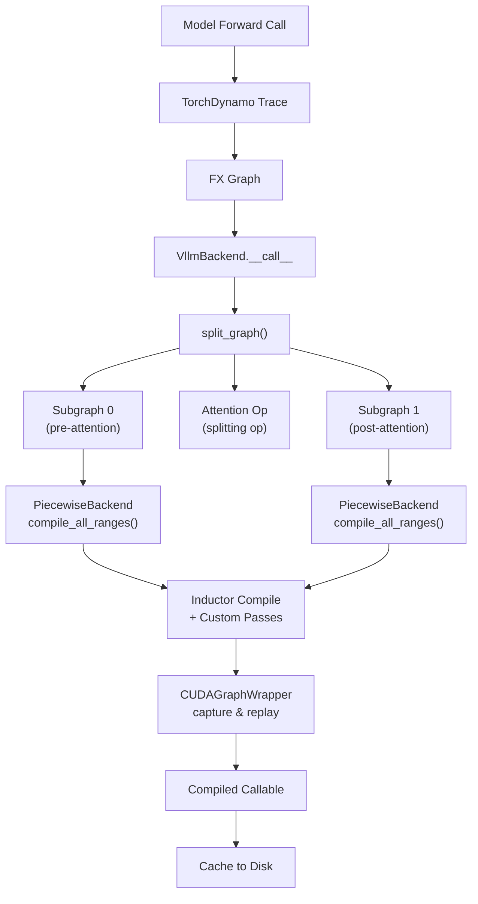

# Compilation & Optimization

vLLM uses `torch.compile` with a custom backend to dramatically accelerate model inference. This section covers the full compilation pipeline: from high-level compilation modes, through piecewise graph splitting, to CUDA graph capture and artifact caching.

## Why Compile?

Running a transformer model in pure PyTorch eager mode executes each operation individually, launching a separate CUDA kernel per op. This creates significant overhead:

- **Kernel launch latency** — each `torch.Tensor` operation dispatches a CUDA kernel
- **Memory bandwidth waste** — intermediate tensors are written to and read from HBM between ops
- **Missed fusion opportunities** — adjacent elementwise ops (e.g., RMSNorm + quantize) could be fused into a single kernel

`torch.compile` addresses these by tracing the model's computation graph with **TorchDynamo**, then lowering it through **TorchInductor** to generate optimized Triton or CUDA kernels. vLLM extends this with:

- **Piecewise compilation** — splitting the graph around attention ops that cannot be captured in CUDA graphs
- **Shape specialization** — compiling separate kernels for specific batch sizes
- **CUDA graph capture** — recording and replaying GPU command sequences to eliminate CPU overhead
- **Compilation caching** — persisting compiled artifacts to disk to avoid recompilation on restart

## Compilation Modes

vLLM exposes four compilation modes via `CompilationConfig.mode` (or the `level` alias):

| Mode | Value | Name | Description |
|------|-------|------|-------------|
| 0 | `NONE` | Eager | No compilation. Pure PyTorch eager execution. |
| 1 | `STOCK_TORCH_COMPILE` | Stock | Standard `torch.compile` — Dynamo traces the whole graph, Inductor compiles it. |
| 2 | `DYNAMO_TRACE_ONCE` | Trace Once | Single Dynamo trace, guards dropped to prevent recompilation. Requires no dynamic-shape-dependent control flow. |
| 3 | `VLLM_COMPILE` | vLLM Compile | Full vLLM custom backend: piecewise compilation, shape specialization, CUDA graphs, caching, and custom fusion passes. **Default for V1 engine.** |

### Mode 0 — NONE

The model runs as-is in PyTorch eager mode. Useful for debugging or when compilation is not supported.

```python
from vllm import LLM
llm = LLM(model="meta-llama/Llama-3.1-8B-Instruct",
          compilation_config={"mode": 0})
```

### Mode 1 — STOCK_TORCH_COMPILE

Uses the standard `torch.compile(model, backend="inductor")` path. The entire model forward pass is compiled as a single graph. This mode does not use vLLM's piecewise splitting or CUDA graph management.

### Mode 2 — DYNAMO_TRACE_ONCE

Dynamo traces the model once and drops all guards. This prevents recompilation when input shapes change, but requires that the model has no shape-dependent control flow (e.g., `if x.shape[0] > 1: ...`).

### Mode 3 — VLLM_COMPILE (Default)

The most powerful mode. vLLM's custom `VllmBackend` takes control of the compilation pipeline:

1. Dynamo traces the model forward pass into an FX graph
2. The graph is split at attention ops (splitting ops) into piecewise subgraphs
3. Each subgraph is compiled by Inductor with custom fusion passes
4. CUDA graphs are captured for each compiled subgraph
5. Compiled artifacts are cached to disk

```python
llm = LLM(model="meta-llama/Llama-3.1-8B-Instruct",
          compilation_config={"mode": 3})
```

## Compilation Pipeline Overview



## Key Source Files

| File | Purpose |
|------|---------|
| `vllm/compilation/decorators.py` | `@support_torch_compile` decorator |
| `vllm/compilation/wrapper.py` | `TorchCompileWithNoGuardsWrapper` base class |
| `vllm/compilation/backends.py` | `VllmBackend`, `split_graph`, `PiecewiseCompileInterpreter` |
| `vllm/compilation/piecewise_backend.py` | `PiecewiseBackend` — per-subgraph compilation |
| `vllm/compilation/cuda_graph.py` | `CUDAGraphWrapper` — capture and replay |
| `vllm/compilation/caching.py` | `VllmSerializableFunction`, `StandaloneCompiledArtifacts` |
| `vllm/config/compilation.py` | `CompilationConfig`, `CompilationMode`, `CUDAGraphMode` |
| `vllm/compilation/passes/` | Custom Inductor fusion passes |

## In This Section

- [Compilation Overview](overview.md) — detailed explanation of modes and tradeoffs
- [Piecewise Compilation](piecewise.md) — how the graph is split and compiled
- [CUDA Graph Capture](cuda-graphs.md) — static shape capture and replay
- [Compilation Caching](caching.md) — persisting and reusing compiled artifacts
- [CompilationConfig Reference](config-reference.md) — all configuration options
- [`@support_torch_compile` Decorator](decorators.md) — annotating model classes

## Cross-References

- [CompilationConfig](../06-configuration/compilation-config.md) — full configuration reference
- [Attention Backends](../14-attention-backends/README.md) — attention kernels that interact with compilation
- [Architecture Overview](../03-architecture/README.md) — how compilation fits into the V1 engine
- [Benchmarking](../15-benchmarking/README.md) — measuring compilation speedup
- [Adding a New Model](../04-models/adding-new-model.md) — annotating new models with `@support_torch_compile`
