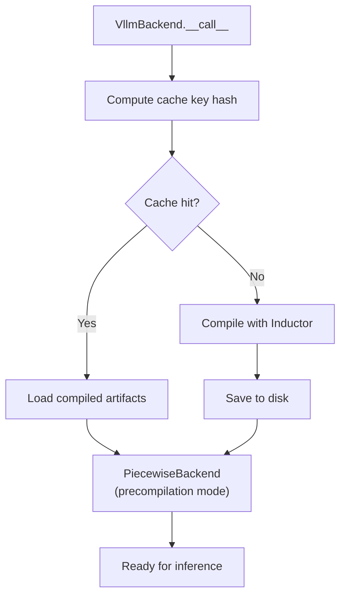

# Compilation Caching

Compiling a large language model with `torch.compile` can take minutes. vLLM's compilation cache persists compiled artifacts to disk so that subsequent server restarts reuse the compiled kernels, reducing startup time from minutes to seconds.

## Cache Architecture

The compilation cache operates at two levels:

1. **CompilerManager cache** (`vllm_compile_cache.py`) — a Python dict mapping `(shape_range, graph_index, compiler_name)` to artifact handles. This is a lightweight index file.

2. **Inductor artifact cache** — the actual compiled Triton/CUDA kernels, stored in Inductor's own cache directory (redirected to vLLM's cache root).



## Cache Key Computation

The cache key is a SHA-256 hash of four factors:

```python
factors = [env_hash, config_hash, code_hash, compiler_hash]
hash_key = hashlib.sha256(str(factors).encode()).hexdigest()[:10]
cache_dir = os.path.join(
    envs.VLLM_CACHE_ROOT, "torch_compile_cache", hash_key
)
```

| Factor | What it covers |
|--------|---------------|
| `env_hash` | Environment variables that affect compilation (e.g., `VLLM_PP_LAYER_PARTITION`) |
| `config_hash` | `VllmConfig` — model architecture, parallelism, quantization, etc. |
| `code_hash` | SHA-256 of all Python source files traced by Dynamo |
| `compiler_hash` | Inductor version and configuration |

If any of these factors change (e.g., you update vLLM, change the model config, or modify source files), the cache key changes and vLLM recompiles from scratch.

## Cache Directory Structure

```
~/.cache/vllm/torch_compile_cache/
└── <hash_key>/                    # 10-char SHA-256 prefix
    └── rank_0_0/                  # per-rank directory
        └── backbone/              # model prefix
            ├── vllm_compile_cache.py    # cache index
            ├── computation_graph.py     # human-readable FX graph
            ├── cache_key_factors.json   # debug: what went into the hash
            └── <inductor_cache>/        # Inductor's own cache files
```

The `computation_graph.py` file contains a human-readable representation of the compiled FX graph, useful for debugging:

```python
# computation_graph.py (auto-generated)
from __future__ import annotations
import torch

class GraphModule(torch.nn.Module):
    def forward(self, input_ids, positions, ...):
        # ... compiled graph operations
```

## VllmSerializableFunction

The `VllmSerializableFunction` class in `vllm/compilation/caching.py` wraps a compiled callable and implements serialization for PyTorch's precompile interface:

```python
class VllmSerializableFunction(SerializableCallable):
    """A wrapper around a compiled function by vllm.
    Implements a serialization interface to support PyTorch's precompile
    with custom backend, so that we can save and load the compiled function
    on disk."""

    def __init__(
        self,
        graph_module: torch.fx.GraphModule,
        example_inputs: Sequence[Any],
        prefix: str,
        optimized_call: Callable[..., Any],
        is_encoder: bool = False,
        vllm_backend: Any | None = None,
        sym_tensor_indices: list[int] | None = None,
        aot_autograd_config: dict[str, Any] | None = None,
    ) -> None:
```

The serialization process:
1. Strips large tensor data (replaced with meta tensors)
2. Removes non-serializable objects (shape environments, fake modes)
3. Pickles the FX graph using `GraphPickler`
4. Saves to the cache directory

## StandaloneCompiledArtifacts

For the standalone compile path (`VLLM_USE_STANDALONE_COMPILE=1`), vLLM uses `StandaloneCompiledArtifacts` to store compiled subgraph artifacts with content-based deduplication:

```python
class StandaloneCompiledArtifacts:
    """Storage for standalone compiled artifacts with content-based deduplication.

    Deduplication works via a two-level indirection:
    1. `submodule_bytes` maps "{submod_name}_{shape}" -> SHA256 hash
    2. `submodule_bytes_store` maps SHA256 hash -> actual bytes
    """

    def __init__(self) -> None:
        self.submodule_bytes: dict[str, str] = {}
        self.submodule_bytes_store: dict[str, bytes] = {}
        self.loaded_submodule_store: dict[str, Any] = {}
```

**Why deduplication?** In a transformer model, all layers have identical architecture. When compiled for the same shape, they produce identical artifacts. Deduplication can reduce cache size by 10-50x for large models.

### Inserting Artifacts

```python
def insert(self, submod_name: str, shape: str, entry: bytes) -> None:
    hasher = hashlib.sha256()
    hasher.update(entry)
    hex_digest = hasher.hexdigest()
    self.submodule_bytes[f"{submod_name}_{shape}"] = hex_digest
    if hex_digest not in self.submodule_bytes_store:
        self.submodule_bytes_store[hex_digest] = entry
        # New artifact stored
    else:
        # Reuse existing artifact (deduplication)
        pass
```

### Loading Artifacts

Loading is parallelized using `ThreadPoolExecutor`:

```python
def load_all(self) -> None:
    from torch._inductor.standalone_compile import AOTCompiledArtifact

    def _load_entry(entry_bytes: bytes) -> AOTCompiledArtifact:
        entry = pickle.loads(entry_bytes)
        return AOTCompiledArtifact.deserialize(entry)

    with concurrent.futures.ThreadPoolExecutor() as executor:
        entries = list(self.submodule_bytes_store.values())
        loaded_entries = list(executor.map(_load_entry, entries))
```

## CompilerManager

The `CompilerManager` class in `vllm/compilation/backends.py` manages the cache lifecycle:

```python
class CompilerManager:
    """Manages the compilation process, including caching the compiled graph,
    loading the compiled graph, and compiling the graph.

    The cache is a dict mapping
    `(runtime_shape, graph_index, backend_name)` to `any_data`.
    """

    def __init__(self, compilation_config: CompilationConfig) -> None:
        self.cache: dict[tuple[Range, int, str], Any] = dict()
        self.compiler = make_compiler(compilation_config)
```

### Cache Initialization

```python
def initialize_cache(
    self, cache_dir: str, disable_cache: bool = False, prefix: str = ""
) -> None:
    self.cache_file_path = os.path.join(cache_dir, "vllm_compile_cache.py")
    if not disable_cache and os.path.exists(self.cache_file_path):
        with open(self.cache_file_path) as f:
            cache = ast.literal_eval(f.read())
        self.cache = {parse_key(key): value for key, value in cache.items()}
```

The cache file is stored as a Python literal (not JSON) for readability and to support `Range` objects as keys.

### Cache Save

```python
def save_to_file(self) -> None:
    if self.disable_cache or not self.is_cache_updated:
        return
    printer = pprint.PrettyPrinter(indent=4)
    data = printer.pformat(self.cache)
    with open(self.cache_file_path, "w") as f:
        f.write(data)
```

## Code Hash Verification

When loading from cache, vLLM verifies that the source files haven't changed since compilation. This prevents using stale compiled artifacts after a code update:

```python
def _verify_source_unchanged(
    source_info: "SourceInfo", vllm_config: VllmConfig
) -> None:
    file_contents = {}
    for source in source_info.inlined_sources:
        module = sys.modules[source.module]
        file = inspect.getfile(module)
        vllm_config.compilation_config.traced_files.add(file)
        file_contents[file] = source.content
    expected_checksum = _compute_code_hash_with_content(file_contents)
    actual_checksum = _compute_code_hash(set(file_contents.keys()))
    if expected_checksum != actual_checksum:
        raise RuntimeError(
            "Source code has changed since the last compilation. Recompiling."
        )
```

## Cache Save Formats

The cache can be saved in two formats, controlled by `compile_cache_save_format`:

| Format | Description | Use Case |
|--------|-------------|----------|
| `binary` | Single binary file (default) | Production — multiprocess safe |
| `unpacked` | Directory structure | Debugging — human-readable, NOT multiprocess safe |

```python
llm = LLM(
    model="meta-llama/Llama-3.1-8B-Instruct",
    compilation_config={
        "compile_cache_save_format": "unpacked"  # for debugging
    }
)
```

## AOT Compilation

vLLM supports Ahead-of-Time (AOT) compilation via `VLLM_USE_AOT_COMPILE=1`. In AOT mode, compiled artifacts are saved under:

```
~/.cache/vllm/torch_compile_cache/torch_aot_compile/<hash>/
```

The AOT path uses a different hash that excludes source file contents (since we don't know which files will be traced before Dynamo runs). Source verification happens at load time.

## Disabling the Cache

The cache can be disabled via:

```python
# Via environment variable
VLLM_DISABLE_COMPILE_CACHE=1

# Via config
compilation_config={"cache_dir": "/dev/null"}
```

When disabled, vLLM logs:
```
INFO: vLLM's torch.compile cache is disabled.
```

## Mega AOT Artifact

For very large models, `VLLM_USE_MEGA_AOT_ARTIFACT=1` bundles all subgraph artifacts into a single file. This reduces the number of files and can speed up loading:

```python
def aot_compile_hash_factors(vllm_config: VllmConfig) -> list[str]:
    factors = []
    env_hash = hash_factors(envs.compile_factors())
    factors.append(env_hash)
    config_hash = vllm_config.compute_hash()
    factors.append(config_hash)
    if envs.VLLM_USE_MEGA_AOT_ARTIFACT:
        factors.extend(get_inductor_factors())
    return factors
```

## Monitoring Cache Usage

The `CompilationCounter` tracks cache-related metrics:

```python
@dataclasses.dataclass
class CompilationCounter:
    num_cache_entries_updated: int = 0
    num_compiled_artifacts_saved: int = 0
    num_compiled_artifacts_loaded: int = 0
```

These counters are accessible at `vllm.compilation.counter.compilation_counter`.

## See Also

- [Piecewise Compilation](piecewise.md) — what gets cached (compiled subgraphs)
- [CompilationConfig Reference](config-reference.md) — `cache_dir`, `compile_cache_save_format`
- [Overview](overview.md) — compilation modes and when caching applies
