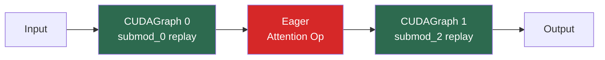

# CUDA Graph Capture

CUDA graphs allow the GPU to record a sequence of operations and replay them with minimal CPU involvement. vLLM uses CUDA graphs to eliminate the per-token CPU overhead of dispatching hundreds of CUDA kernels during decode.

## How CUDA Graphs Work

Without CUDA graphs, each forward pass requires the CPU to:
1. Prepare arguments for each kernel
2. Launch each kernel individually
3. Wait for synchronization points

With CUDA graphs:
1. **Capture phase**: Run the forward pass once while recording all GPU operations
2. **Replay phase**: On subsequent calls, replay the recorded graph with a single CPU call

The replay is dramatically faster because the CPU only issues one command instead of hundreds. This is especially beneficial during **decode** (single-token generation) where the batch is small and CPU overhead dominates.

## CUDA Graph Modes

vLLM supports several CUDA graph modes via `CUDAGraphMode`:

```python
class CUDAGraphMode(enum.Enum):
    NONE = 0           # No CUDA graph capture
    PIECEWISE = 1      # Capture each compiled subgraph separately
    FULL = 2           # Capture the entire model forward pass
    FULL_DECODE_ONLY = (FULL, NONE)       # Full graphs for decode only
    FULL_AND_PIECEWISE = (FULL, PIECEWISE) # Full for decode, piecewise for prefill
```

### PIECEWISE Mode

Each compiled subgraph (between attention ops) is captured as a separate CUDA graph. The attention ops run in eager mode between graph replays.



### FULL Mode

The entire model forward pass (including attention) is captured as a single CUDA graph. This requires attention ops that are compatible with static memory (e.g., when using static KV-cache layouts).

### FULL_AND_PIECEWISE Mode (Default)

The most performant mode for most models:
- **Decode batches**: captured as full CUDA graphs (single-token, static shapes)
- **Prefill and mixed batches**: use piecewise CUDA graphs

## The CUDAGraphWrapper

The `CUDAGraphWrapper` class in `vllm/compilation/cuda_graph.py` wraps a compiled callable to add CUDA graph capture and replay:

```python
class CUDAGraphWrapper:
    """Wraps a runnable to add CUDA graph capturing and replaying ability."""

    def __init__(
        self,
        runnable: Callable[..., Any],
        vllm_config: VllmConfig,
        runtime_mode: CUDAGraphMode,
        cudagraph_options: CUDAGraphOptions | None = None,
    ) -> None:
        self.runnable = runnable
        self.runtime_mode = runtime_mode
        self.graph_pool = current_platform.get_global_graph_pool()
        self.concrete_cudagraph_entries: dict[BatchDescriptor, CUDAGraphEntry] = {}
```

### CUDAGraphEntry

Each unique batch configuration (described by a `BatchDescriptor`) gets its own `CUDAGraphEntry`:

```python
@dataclasses.dataclass
class CUDAGraphEntry:
    batch_descriptor: BatchDescriptor
    cudagraph: torch.cuda.CUDAGraph | None = None
    output: Any | None = None
    input_addresses: list[int] | None = None  # for debugging
```

### Capture and Replay Logic

The `__call__` method implements the capture-or-replay logic:

```python
def __call__(self, *args: Any, **kwargs: Any) -> Any | None:
    forward_context = get_forward_context()
    batch_descriptor = forward_context.batch_descriptor
    cudagraph_runtime_mode = forward_context.cudagraph_runtime_mode

    # Skip if mode doesn't match (e.g., during profiling run)
    if (cudagraph_runtime_mode == CUDAGraphMode.NONE
            or cudagraph_runtime_mode != self.runtime_mode):
        return self.runnable(*args, **kwargs)

    if batch_descriptor not in self.concrete_cudagraph_entries:
        self.concrete_cudagraph_entries[batch_descriptor] = CUDAGraphEntry(
            batch_descriptor=batch_descriptor
        )

    entry = self.concrete_cudagraph_entries[batch_descriptor]

    if entry.cudagraph is None:
        # First time: capture the graph
        cudagraph = torch.cuda.CUDAGraph()
        with torch.cuda.graph(cudagraph, pool=self.graph_pool,
                              stream=current_stream()):
            output = self.runnable(*args, **kwargs)
        entry.output = weak_ref_tensors(output)
        entry.cudagraph = cudagraph
        return output
    else:
        # Subsequent times: replay the graph
        entry.cudagraph.replay()
        return entry.output
```

### Static Input Requirement

CUDA graphs require that the **same memory addresses** are used for inputs on every replay. vLLM handles this through:

1. **Static input buffers** — when `cudagraph_copy_inputs=True`, vLLM copies dynamic inputs into static buffers before capture
2. **Padding** — batch sizes are padded to the nearest capture size so the same graph can be reused

The `make_copy_and_call` function in `backends.py` creates a wrapper that copies inputs to static buffers:

```python
def make_copy_and_call(
    sym_tensor_indices: list[int],
    input_buffers: list[torch.Tensor | None],
    callable_fn: Callable[..., Any],
) -> Callable[..., Any]:
    def copy_and_call(*args: Any) -> Any:
        list_args = list(args)
        for i, index in enumerate(sym_tensor_indices):
            runtime_tensor = list_args[index]
            runtime_shape = runtime_tensor.shape[0]
            if input_buffers[i] is None:
                input_buffers[i] = runtime_tensor.clone()
            static_tensor = input_buffers[i][:runtime_shape]
            static_tensor.copy_(runtime_tensor)
            list_args[index] = static_tensor
        return callable_fn(*list_args)
    return copy_and_call
```

## CUDAGraphOptions

Fine-grained control over CUDA graph behavior per subgraph:

```python
@dataclasses.dataclass
class CUDAGraphOptions:
    debug_log_enable: bool = True   # Log capture events (only for first subgraph)
    gc_disable: bool = False        # Disable GC during capture (for non-first subgraphs)
    weak_ref_output: bool = True    # Use weak refs for output (only for last subgraph)
```

The `gc_disable` option is important for piecewise mode: capturing many subgraphs in sequence would trigger garbage collection repeatedly, slowing down capture. vLLM disables GC for all but the first subgraph.

## Capture Sizes

CUDA graphs are captured for specific batch sizes. The default capture sizes follow this pattern:

```
[1, 2, 4] + list(range(8, 256, 8)) + list(range(256, max_size + 1, 16))
```

Where `max_size = min(max_num_seqs * 2, 512)` by default.

At runtime, if the actual batch size doesn't match a capture size, the batch is **padded** to the next larger capture size. The padding tokens are masked out so they don't affect the output.

### Custom Capture Sizes

You can specify custom capture sizes:

```python
llm = LLM(
    model="meta-llama/Llama-3.1-8B-Instruct",
    compilation_config={
        "mode": 3,
        "cudagraph_capture_sizes": [1, 2, 4, 8, 16, 32, 64, 128, 256, 512],
        "max_cudagraph_capture_size": 512,
    }
)
```

> **Note:** More capture sizes means longer startup time (each size requires a separate capture) but better runtime efficiency (less padding waste).

## CUDA Graph Logging

The `CUDAGraphLogging` class tracks and reports CUDA graph usage statistics:

```python
class CUDAGraphLogging:
    COLUMN_HEADERS = [
        "Unpadded Tokens", "Padded Tokens", "Num Paddings",
        "Runtime Mode", "Count",
    ]
```

Enable debug logging to see CUDA graph capture events:

```bash
VLLM_LOGGING_LEVEL=DEBUG vllm serve meta-llama/Llama-3.1-8B-Instruct
```

Example output:
```
DEBUG: Capturing a cudagraph on (PIECEWISE, BatchDescriptor(num_tokens=128, ...))
```

## Memory Pool Sharing

All CUDA graphs in vLLM share a single memory pool (`graph_pool`). This allows PyTorch to reuse memory between graphs, reducing peak memory usage during capture:

```python
self.graph_pool = current_platform.get_global_graph_pool()
# ...
with torch.cuda.graph(cudagraph, pool=self.graph_pool, stream=current_stream()):
    output = self.runnable(*args, **kwargs)
```

## Warmup Runs

Before CUDA graph capture, vLLM runs several **warmup iterations** to ensure all lazy initializations (e.g., cuBLAS workspace allocation) are complete:

```python
cudagraph_num_of_warmups: int = 0
"""Number of warmup runs for cudagraph.
Only after that, the execution will be recorded."""
```

## Debugging CUDA Graphs

When `VLLM_LOGGING_LEVEL=DEBUG`, the `CUDAGraphWrapper` validates that input memory addresses are consistent between capture and replay:

```python
if self.is_debugging_mode:
    new_input_addresses = [
        x.data_ptr() for x in args if isinstance(x, torch.Tensor)
    ]
    assert new_input_addresses == entry.input_addresses, (
        f"Input addresses for cudagraphs are different during replay. "
        f"Expected {entry.input_addresses}, got {new_input_addresses}"
    )
```

If you see this assertion fail, it means a tensor's memory address changed between capture and replay, which indicates a bug in the input buffer management.

## Clearing CUDA Graphs

CUDA graphs can be cleared (e.g., for elastic expert parallelism reconfiguration) via:

```python
CUDAGraphWrapper.clear_all_graphs()
```

This clears all captured graphs from all `CUDAGraphWrapper` instances, forcing re-capture on the next forward pass.

## See Also

- [Piecewise Compilation](piecewise.md) — how the graph is split before CUDA graph capture
- [CompilationConfig Reference](config-reference.md) — `cudagraph_mode`, `cudagraph_capture_sizes`, `cudagraph_copy_inputs`
- [Compilation Caching](caching.md) — persisting compiled artifacts
