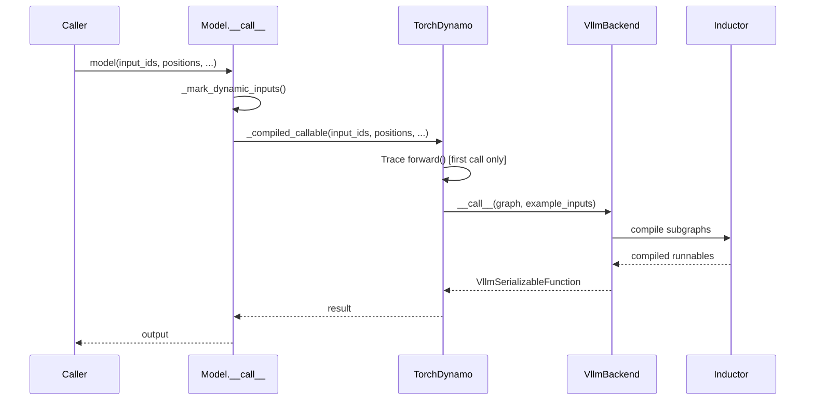

# `@support_torch_compile` Decorator

The `@support_torch_compile` decorator is the primary mechanism for marking a PyTorch `nn.Module` as compilable by vLLM's compilation system. It is defined in `vllm/compilation/decorators.py` and handles the complex setup required to integrate a model class with `torch.compile`, dynamic shape marking, and CUDA graph capture.

## Overview

When you apply `@support_torch_compile` to a model class, the decorator:

1. Injects `TorchCompileWithNoGuardsWrapper` into the class's MRO (method resolution order)
2. Wraps `__init__` to initialize the compilation infrastructure
3. Wraps `__call__` to route through the compiled callable
4. Marks tensor dimensions as dynamic before each forward pass

## Basic Usage

```python
from vllm.compilation.decorators import support_torch_compile

@support_torch_compile
class MyModel(nn.Module):
    def forward(self, x: torch.Tensor, y: Optional[torch.Tensor]):
        ...
```

When used without arguments, `@support_torch_compile` automatically infers which arguments should be marked as dynamic based on type annotations:

- `torch.Tensor` → dimension 0 is marked dynamic
- `Optional[torch.Tensor]` → dimension 0 is marked dynamic (if not None)
- `IntermediateTensors` → dimension 0 of all tensors is marked dynamic

## Usage with Arguments

```python
@support_torch_compile(
    dynamic_arg_dims={"x": 0, "y": [0, 1]},
    mark_unbacked_dims={"x": 0},
    enable_if=lambda config: config.model_config.model.startswith("llama"),
    shape_invariants=lambda x, y: torch._check(x.size()[0] == y.size()[0]),
)
class MyModel(nn.Module):
    def forward(self, x: torch.Tensor, y: torch.Tensor):
        ...
```

## Parameters

### `dynamic_arg_dims`

**Type:** `dict[str, int | list[int]] | None`  
**Default:** `None` (inferred from type annotations)

Maps argument names to the dimensions that should be marked as dynamic. Dynamic dimensions tell Dynamo to treat that dimension symbolically rather than specializing on a concrete value.

```python
# Mark dimension 0 of 'x' as dynamic
@support_torch_compile(dynamic_arg_dims={"x": 0})

# Mark dimensions 0 and 1 of 'x' as dynamic
@support_torch_compile(dynamic_arg_dims={"x": [0, 1]})

# Mark dimension -1 (last) of 'x' as dynamic
@support_torch_compile(dynamic_arg_dims={"x": -1})
```

**Inference rules** (when `dynamic_arg_dims=None`):
- `torch.Tensor` → `{arg_name: 0}`
- `torch.Tensor | None` → `{arg_name: 0}`
- `IntermediateTensors` → `{arg_name: 0}`
- `IntermediateTensors | None` → `{arg_name: 0}`

### `mark_unbacked_dims`

**Type:** `dict[str, int | list[int]] | None`  
**Default:** `None`

Marks specific dimensions as "unbacked" — Dynamo will not specialize on 0/1 values. This is useful for vision model compilation where dummy inputs may have 0 tokens.

```python
@support_torch_compile(
    dynamic_arg_dims={"pixel_values": 0},
    mark_unbacked_dims={"pixel_values": 0},
)
class VisionEncoder(nn.Module):
    def forward(self, pixel_values: Optional[torch.Tensor]):
        ...
```

### `enable_if`

**Type:** `Callable[[VllmConfig], bool] | None`  
**Default:** `None` (always compile)

A predicate that determines whether to compile this model. When the predicate returns `False`, the model runs in eager mode.

```python
@support_torch_compile(
    enable_if=lambda config: config.model_config.quantization is not None
)
class QuantizedModel(nn.Module):
    ...
```

### `shape_invariants`

**Type:** `Callable[..., None]`  
**Default:** `lambda *args, **kwargs: None` (no invariants)

A function called before each forward pass that establishes relationships between input shapes using `torch._check`. This is needed for models where Dynamo would otherwise raise data-dependent errors.

```python
def check_shapes(input_ids, inputs_embeds, **kwargs):
    if input_ids is not None and inputs_embeds is not None:
        torch._check(input_ids.size()[0] == inputs_embeds.size()[0])

@support_torch_compile(shape_invariants=check_shapes)
class MyModel(nn.Module):
    def forward(self, input_ids, inputs_embeds):
        ...
```

## How It Works

### MRO Injection

The decorator injects `TorchCompileWithNoGuardsWrapper` into the class's base classes:

```python
def _support_torch_compile(cls, dynamic_arg_dims, ...):
    if TorchCompileWithNoGuardsWrapper in cls.__bases__:
        return cls  # already decorated

    cls.__bases__ = cls.__bases__ + (TorchCompileWithNoGuardsWrapper,)
```

This makes the class inherit the `__call__` method from `TorchCompileWithNoGuardsWrapper`, which routes through the compiled callable.

### `__init__` Wrapping

The decorator wraps `__init__` to initialize the compilation infrastructure:

```python
def __init__(self, *, vllm_config=None, prefix="", **kwargs):
    # ... call original __init__
    self.vllm_config = vllm_config
    self.compilation_config = self.vllm_config.compilation_config

    self.do_not_compile = (
        self.compilation_config.mode in [
            CompilationMode.NONE, CompilationMode.STOCK_TORCH_COMPILE
        ]
        or _should_ignore_torch_compile(self.__class__)
        or not enable_compile
    )
    if not self.do_not_compile:
        TorchCompileWithNoGuardsWrapper.__init__(self)
```

### `__call__` Wrapping

The `__call__` method marks dynamic dimensions before each forward pass:

```python
def __call__(self, *args, **kwargs):
    if self.do_not_compile or torch.compiler.is_compiling():
        return self.forward(*args, **kwargs)

    # Mark dynamic dimensions
    _mark_dynamic_inputs(self, ds_type, *args, **kwargs)

    # Route through compiled callable
    return TorchCompileWithNoGuardsWrapper.__call__(self, *args, **kwargs)
```

### Dynamic Dimension Marking

The `_mark_dynamic_inputs` function marks tensor dimensions as dynamic before each Dynamo trace:

```python
def _mark_dynamic_inputs(mod, ds_type, *args, **kwargs):
    sig = inspect.signature(mod.__class__.forward)
    bound_args = sig.bind(mod, *args, **kwargs)
    bound_args.apply_defaults()

    for k, dims in dynamic_arg_dims.items():
        arg = bound_args.arguments.get(k)
        if arg is not None:
            dims = [dims] if isinstance(dims, int) else dims
            if isinstance(arg, torch.Tensor):
                if ds_type == DynamicShapesType.UNBACKED:
                    torch._dynamo.decorators.mark_unbacked(arg, dims)
                else:
                    torch._dynamo.mark_dynamic(arg, dims)
            elif isinstance(arg, IntermediateTensors):
                for tensor in arg.tensors.values():
                    torch._dynamo.mark_dynamic(tensor, dims)
```

## `@ignore_torch_compile`

The `@ignore_torch_compile` decorator prevents a subclass from being compiled, even if its parent class has `@support_torch_compile`:

```python
from vllm.compilation.decorators import support_torch_compile, ignore_torch_compile

@support_torch_compile
class BaseModel(nn.Module):
    def forward(self, x: torch.Tensor):
        ...

@ignore_torch_compile
class SpecialModel(BaseModel):
    """This model will NOT be compiled, even though BaseModel is."""
    def forward(self, x: torch.Tensor):
        ...
```

> **Note:** If a child class has `@support_torch_compile` and the parent has `@ignore_torch_compile`, the child will still be compiled.

## AOT Compilation Support

When `VLLM_USE_AOT_COMPILE=1`, the decorator also handles AOT (ahead-of-time) compilation. The compiled function is saved to disk and loaded on subsequent runs:

```python
def __call__(self, *args, **kwargs):
    # If aot_compiled_fn is set, use it directly
    if getattr(self, "aot_compiled_fn", None) is not None:
        with maybe_use_cudagraph_partition_wrapper(self.vllm_config):
            return self.aot_compiled_fn(self, *args, **kwargs)
    # ... otherwise compile normally
```

The AOT compiled function is saved via `save_aot_compiled_function`:

```python
def save_aot_compiled_function(self):
    try:
        aot_compiled_fn = self._compiled_callable.aot_compile(...)
        torch.save(aot_compiled_fn, self._aot_compilation_path)
    except Exception as e:
        logger.warning("unable to save AOT compiled function: %s", e)
```

## Compilation Counter

The decorator increments `compilation_counter.num_models_seen` each time a model is initialized for compilation:

```python
compilation_counter.num_models_seen += 1
```

This counter is used by tests to verify that the expected number of models were compiled.

## Real-World Example

Here is how `LlamaModel` uses the decorator (simplified):

```python
@support_torch_compile
class LlamaModel(nn.Module):
    def forward(
        self,
        input_ids: Optional[torch.Tensor],
        positions: torch.Tensor,
        intermediate_tensors: Optional[IntermediateTensors],
        inputs_embeds: Optional[torch.Tensor] = None,
    ) -> Union[torch.Tensor, IntermediateTensors]:
        ...
```

The decorator infers:
- `input_ids: Optional[torch.Tensor]` → `dynamic_arg_dims["input_ids"] = 0`
- `positions: torch.Tensor` → `dynamic_arg_dims["positions"] = 0`
- `intermediate_tensors: Optional[IntermediateTensors]` → `dynamic_arg_dims["intermediate_tensors"] = 0`
- `inputs_embeds: Optional[torch.Tensor]` → `dynamic_arg_dims["inputs_embeds"] = 0`

## Compilation Pipeline Diagram



## See Also

- [Compilation Overview](overview.md) — compilation modes and when the decorator applies
- [Piecewise Compilation](piecewise.md) — what happens after Dynamo traces the model
- [CompilationConfig Reference](config-reference.md) — `mode`, `dynamic_shapes_config`
- `vllm/compilation/wrapper.py` — `TorchCompileWithNoGuardsWrapper` implementation
