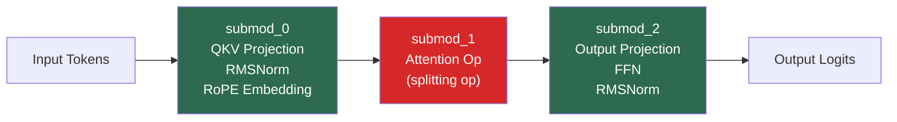
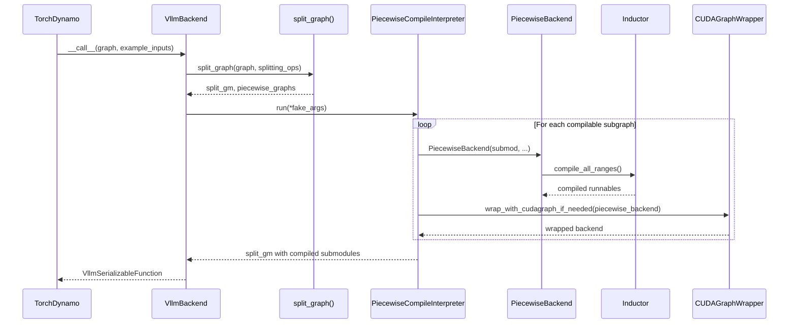

# Piecewise Compilation

Piecewise compilation is vLLM's strategy for compiling transformer models that contain operations incompatible with CUDA graph capture (primarily attention ops). Rather than compiling the entire model as one monolithic graph, vLLM splits the FX graph at these "splitting ops" and compiles each piece independently.

## The Problem: Attention and CUDA Graphs

CUDA graphs require that all GPU operations execute with **static memory addresses** — the same input and output buffers must be used every time the graph is replayed. Attention operations in vLLM (e.g., PagedAttention, FlashAttention) use dynamic KV-cache memory that changes between requests, making them incompatible with CUDA graph capture.

The solution is **piecewise compilation**:
1. Split the model graph at attention ops
2. Compile the non-attention pieces (linear layers, norms, activations) with CUDA graphs
3. Run attention ops in eager mode between the compiled pieces

## Graph Splitting

The splitting logic lives in `vllm/compilation/backends.py` in the `split_graph` function:

```python
def split_graph(
    graph: fx.GraphModule, splitting_ops: list[str]
) -> tuple[fx.GraphModule, list[SplitItem]]:
    # split graph by ops
    subgraph_id = 0
    node_to_subgraph_id: dict[fx.Node, int] = {}
    split_op_graphs: list[int] = []
    for node in graph.graph.nodes:
        if node.op in ("output", "placeholder"):
            continue
        if should_split(node, splitting_ops):
            subgraph_id += 1
            node_to_subgraph_id[node] = subgraph_id
            split_op_graphs.append(subgraph_id)
            subgraph_id += 1
        else:
            node_to_subgraph_id[node] = subgraph_id
    split_gm = torch.fx.passes.split_module.split_module(
        graph, None, lambda node: node_to_subgraph_id[node],
        keep_original_order=True
    )
```

The `should_split` function in `vllm/compilation/partition_rules.py` checks whether a node's target op is in the `splitting_ops` list:

```python
def should_split(node: torch.fx.Node, splitting_ops: list[str]) -> bool:
    if node.op != "call_function":
        return False
    target = node.target
    if isinstance(target, torch._ops.OpOverloadPacket):
        return target._qualified_op_name in splitting_ops
    if isinstance(target, torch._ops.OpOverload):
        packet_name = target.name()
        op_overload_name = f"{packet_name}.{target._overloadname}"
        return op_overload_name in splitting_ops or packet_name in splitting_ops
    return False
```

### Default Splitting Ops

By default, vLLM splits at attention and Mamba ops:

```python
_attention_ops: ClassVar[list[str]] = [
    "vllm::unified_attention",
    "vllm::unified_attention_with_output",
    "vllm::unified_mla_attention",
    "vllm::unified_mla_attention_with_output",
    "vllm::mamba_mixer2",
    "vllm::mamba_mixer",
    "vllm::short_conv",
    "vllm::linear_attention",
    "vllm::plamo2_mamba_mixer",
    "vllm::gdn_attention_core",
    "vllm::olmo_hybrid_gdn_full_forward",
    "vllm::kda_attention",
    "vllm::sparse_attn_indexer",
    "vllm::rocm_aiter_sparse_attn_indexer",
]
```

## Piecewise Graph Structure

For a typical transformer layer with one attention op, the split produces three subgraphs:



- **Green subgraphs** (submod_0, submod_2): compiled by Inductor, wrapped in CUDA graphs
- **Red subgraph** (submod_1): attention op, runs in eager mode

## The PiecewiseBackend

Each compilable subgraph is managed by a `PiecewiseBackend` instance (in `vllm/compilation/piecewise_backend.py`). This class handles:

1. **Compilation** — compiling the subgraph for each required shape range
2. **Dispatch** — routing runtime calls to the correct compiled version based on batch size

```python
class PiecewiseBackend:
    def __init__(
        self,
        graph: fx.GraphModule | None,
        vllm_config: VllmConfig,
        piecewise_compile_index: int,
        total_piecewise_compiles: int,
        sym_shape_indices: list[int],
        vllm_backend: VllmBackend,
        returns_tuple: bool,
        compiled_runnables: dict[str, Callable[..., Any]] | None = None,
        submod_name: str = "",
    ):
```

The class supports two modes:
- **Compilation mode** (`graph` is set, `compiled_runnables` is None): used during initial compilation
- **Precompilation mode** (`graph` is None, `compiled_runnables` is set): used when loading from cache

### Shape Ranges

vLLM compiles each subgraph for multiple **shape ranges** — intervals of batch sizes. This allows a single compiled kernel to handle a range of batch sizes efficiently:

```python
@dataclasses.dataclass
class RangeEntry:
    compile_range: Range
    compiled: bool = False
    runnable: Callable[..., Any] = None
```

The `compile_all_ranges` method compiles the subgraph for every configured range:

```python
def compile_all_ranges(self) -> None:
    for range_entry in self.range_entries.values():
        if range_entry.compiled:
            continue
        if range_entry.compile_range.is_single_size():
            args_list = create_concrete_args(
                self.graph, range_entry.compile_range.start
            )
        else:
            args_list = get_fake_args_from_graph(self.graph)
        # ... compile with Inductor
```

For single-size ranges (e.g., `[4, 4]`), concrete example inputs are created with `create_concrete_args`. For range-based compilation (e.g., `[1, 8]`), symbolic fake tensors are used.

### Runtime Dispatch

At inference time, `PiecewiseBackend.__call__` routes to the correct compiled version:

```python
def __call__(self, *args: Any) -> Any:
    runtime_shape = args[self.sym_shape_indices[0]]
    range_entry = self._find_range_for_shape(runtime_shape)
    assert range_entry is not None
    assert range_entry.compiled
    return range_entry.runnable(*args)
```

The `_find_range_for_shape` method first checks for an exact compile-size match, then falls back to range lookup:

```python
def _find_range_for_shape(self, runtime_shape: int) -> RangeEntry | None:
    if runtime_shape in self.compile_sizes:
        return self.range_entries[Range(start=runtime_shape, end=runtime_shape)]
    else:
        for range in self.compile_ranges:
            if runtime_shape in range:
                return self.range_entries[range]
    return None
```

## PiecewiseCompileInterpreter

The `PiecewiseCompileInterpreter` class orchestrates the compilation of all subgraphs. It extends `torch.fx.Interpreter` and overrides `call_module` to intercept each subgraph:

```python
class PiecewiseCompileInterpreter(torch.fx.Interpreter):
    def call_module(self, target, args, kwargs):
        if target in self.compile_submod_names:
            index = self.compile_submod_names.index(target)
            submod = self.fetch_attr(target)
            sym_shape_indices = [
                i for i, x in enumerate(args) if isinstance(x, torch.SymInt)
            ]
            piecewise_backend = PiecewiseBackend(
                submod,
                self.vllm_config,
                index,
                len(self.compile_submod_names),
                sym_shape_indices,
                self.vllm_backend,
                graph_returns_tuple(submod),
                submod_name=target,
            )
            self.module.__dict__[target] = wrap_with_cudagraph_if_needed(
                piecewise_backend, ...
            )
```

## Inductor Graph Partition (Alternative)

vLLM also supports an alternative partitioning strategy via `use_inductor_graph_partition=True`. Instead of splitting the FX graph before Inductor, this approach lets Inductor handle partitioning at codegen time:

```python
@contextlib.contextmanager
def inductor_partition_rule_context(
    splitting_ops: list[str] | None,
) -> Generator[None, None, None]:
    saved_splitting_ops = list(
        torch._inductor.config.custom_should_partition_ops
    )
    torch._inductor.config.custom_should_partition_ops = splitting_ops
    try:
        yield
    finally:
        torch._inductor.config.custom_should_partition_ops = saved_splitting_ops
```

This approach allows all custom passes and fusions to operate on the **full graph** before partitioning, which can enable additional optimizations. It requires PyTorch >= 2.9.0.

| Approach | When partitioning happens | Pros | Cons |
|----------|--------------------------|------|------|
| FX-level split (default) | Before Inductor | Simpler, wider compatibility | Passes see only subgraphs |
| Inductor partition | After all passes | Passes see full graph | Requires PyTorch >= 2.9 |

## Compilation Flow Diagram



## Encoder Compilation

For multimodal models with vision encoders, vLLM supports separate compilation of the encoder via `compile_mm_encoder=True`. The encoder uses a different compile range — the upper bound is set to `max_int32` since encoder sequence lengths can vary widely:

```python
if self.is_encoder_compilation:
    max_int32 = 2**31 - 1
    last_compile_range = self.compile_ranges[-1]
    self.compile_ranges[-1] = Range(
        start=last_compile_range.start, end=max_int32
    )
```

## See Also

- [CUDA Graph Capture](cuda-graphs.md) — how compiled subgraphs are wrapped in CUDA graphs
- [CompilationConfig Reference](config-reference.md) — `splitting_ops`, `compile_sizes`, `compile_ranges_split_points`
- [Compilation Caching](caching.md) — how compiled subgraph artifacts are persisted
