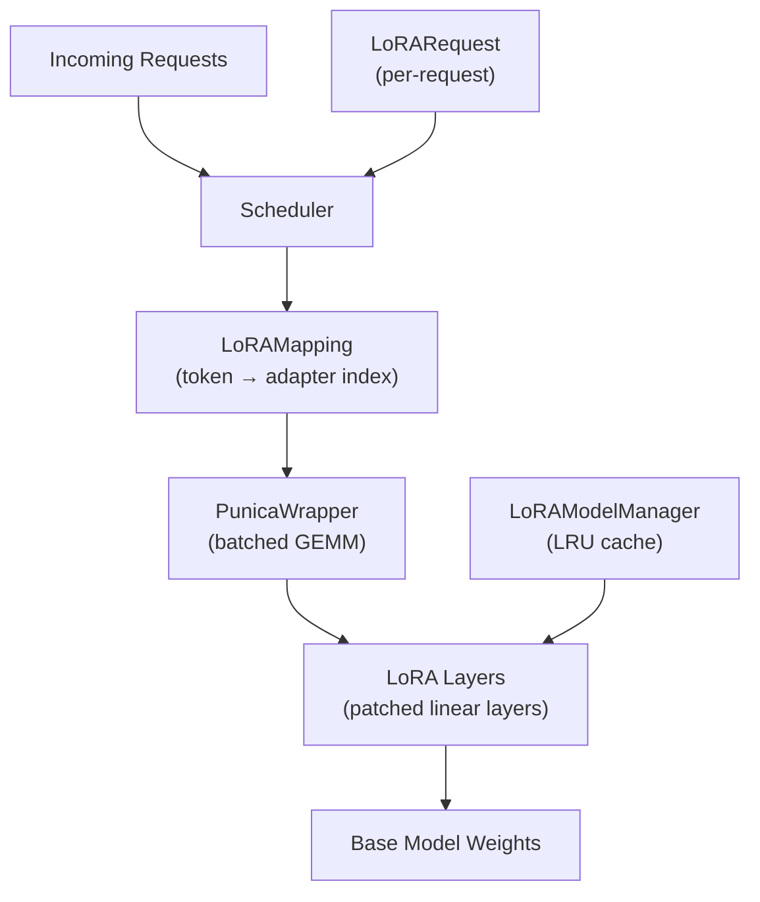

# LoRA Adapters

Low-Rank Adaptation (LoRA) is a parameter-efficient fine-tuning technique that adds small trainable matrices to frozen base-model weights. vLLM provides first-class support for LoRA adapters, enabling you to serve multiple fine-tuned variants of a base model simultaneously — each request can select a different adapter — without duplicating the base model weights in memory.

## What Is LoRA?

LoRA decomposes a weight update `ΔW` into two low-rank matrices:

```
ΔW = B × A   where A ∈ ℝ^(r×d_in), B ∈ ℝ^(d_out×r)
```

The rank `r` is much smaller than the original weight dimensions, so the number of trainable parameters is drastically reduced. During inference, the LoRA delta is added to the frozen base weight:

```
output = x × (W + α/r × B × A)
```

where `α` (lora_alpha) is a scaling hyperparameter.

## vLLM Multi-LoRA Architecture

vLLM extends the standard LoRA concept to **multi-tenant serving**: many different adapters can be active in the same batch, each applied only to the tokens belonging to its request.



Key components:

| Component | Location | Responsibility |
|-----------|----------|----------------|
| `LoRARequest` | `vllm/lora/request.py` | Per-request adapter descriptor |
| `LoRAConfig` | `vllm/config/lora.py` | Server-wide LoRA configuration |
| `LoRAModel` | `vllm/lora/lora_model.py` | Loaded adapter weights |
| `LoRAModelManager` | `vllm/lora/model_manager.py` | Adapter lifecycle management |
| `LRUCacheLoRAModelManager` | `vllm/lora/model_manager.py` | LRU-eviction variant |
| `WorkerLoRAManager` | `vllm/lora/worker_manager.py` | Worker-side loading |
| LoRA layers | `vllm/lora/layers/` | Patched linear layers |
| Punica kernels | `vllm/lora/punica_wrapper/` | Batched multi-LoRA GEMM |
| Resolvers | `vllm/plugins/lora_resolvers/` | Adapter discovery |

## Quick Start

### Loading LoRA at Server Startup

Pass `--enable-lora` and `--lora-modules` to the vLLM server:

```bash
vllm serve meta-llama/Llama-3.1-8B-Instruct \
  --enable-lora \
  --lora-modules sql-lora=/path/to/sql-lora-adapter \
  --max-lora-rank 64 \
  --max-loras 4
```

Multiple adapters can be listed:

```bash
vllm serve meta-llama/Llama-3.1-8B-Instruct \
  --enable-lora \
  --lora-modules \
    sql-lora=/path/to/sql-lora \
    code-lora=/path/to/code-lora \
  --max-loras 4 \
  --max-cpu-loras 8
```

### Per-Request Adapter Selection (OpenAI API)

Once the server is running, select an adapter by passing its name as the `model` field:

```bash
curl http://localhost:8000/v1/completions \
  -H "Content-Type: application/json" \
  -d '{
    "model": "sql-lora",
    "prompt": "SELECT * FROM users WHERE",
    "max_tokens": 50
  }'
```

### Offline Inference with LoRA

```python
from vllm import LLM, SamplingParams
from vllm.lora.request import LoRARequest

llm = LLM(
    model="meta-llama/Llama-3.1-8B-Instruct",
    enable_lora=True,
    max_loras=2,
    max_lora_rank=64,
)

sampling_params = SamplingParams(temperature=0.0, max_tokens=100)

# Use the base model
outputs = llm.generate(["Hello, world!"], sampling_params)

# Use a LoRA adapter
lora_request = LoRARequest(
    lora_name="my-adapter",
    lora_int_id=1,
    lora_path="/path/to/my-lora-adapter",
)
outputs = llm.generate(
    ["SELECT * FROM"],
    sampling_params,
    lora_request=lora_request,
)
```

## Section Contents

- [LoRARequest](lora-request.md) — Per-request adapter descriptor dataclass
- [LoRAConfig](lora-config.md) — Server-wide configuration options
- [LoRAModelManager](lora-model-manager.md) — Adapter caching and lifecycle
- [LoRA Layers](lora-layers.md) — How linear layers are patched with LoRA deltas
- [Punica Kernels](punica-kernels.md) — Batched multi-LoRA GEMM operations
- [LoRA Resolvers](lora-resolvers.md) — Filesystem and HuggingFace Hub resolvers
- [Dynamic Loading API](dynamic-loading.md) — Runtime adapter load/unload via REST API

## Supported Models

Any model that implements the `SupportsLoRA` interface can use LoRA adapters. This includes Llama, Mistral, Mixtral, Qwen, ChatGLM, Falcon, GPT-NeoX, and many others. The `LoRAModelManager` validates this at startup:

```python
from vllm.model_executor.models import SupportsLoRA

if not isinstance(model, SupportsLoRA):
    raise ValueError(f"Model {type(model)} is not supported for LoRA.")
```

## Supported LoRA Features

| Feature | Supported |
|---------|-----------|
| Multiple adapters per batch | ✅ |
| LRU eviction of adapters | ✅ |
| Tensor parallelism with LoRA | ✅ |
| Quantized base models (GPTQ, AWQ) | ✅ |
| rsLoRA (rank-stabilized scaling) | ✅ |
| DoRA (weight-decomposed) | ❌ |
| Adapter bias terms | ❌ |
| MoE models (FusedMoE) | ✅ |
| Multimodal models (vision encoder) | ✅ (experimental) |
| Dynamic load/unload via API | ✅ (dev only) |

## Cross-References

- [LoRAConfig](../06-configuration/additional-configs.md) — `LoRAConfig` reference
- [API: LoRA Management](../12-api-reference/lora-management.md) — runtime load/unload endpoints
- [Supported Models](../04-models/supported-models.md) — models that implement `SupportsLoRA`
- [Model Interfaces](../04-models/model-interfaces.md) — `SupportsLoRA` interface definition
- [Quantization](../14-quantization/README.md) — using LoRA with quantized base models
- [Distributed Inference](../07-distributed/README.md) — LoRA with tensor parallelism
