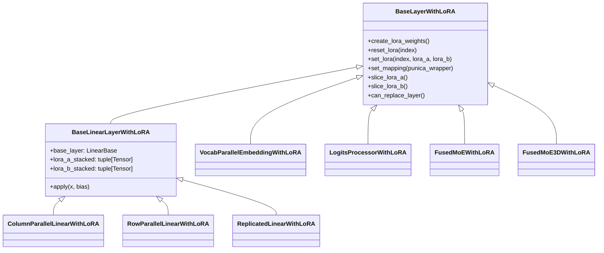

# LoRA Layers

vLLM implements LoRA by replacing standard PyTorch linear layers with LoRA-aware wrapper classes at model initialization time. Each wrapper holds pre-allocated stacked weight tensors for all `max_loras` adapter slots and delegates the actual computation to the Punica kernel.

The layer implementations live in `vllm/lora/layers/`.

## How Layer Patching Works

When `LoRAModelManager._create_lora_modules()` runs, it iterates over every named module in the model and replaces eligible layers:

```python
new_module = replace_submodule(
    self.model,
    module_name,
    from_layer(
        module,           # original nn.Module
        self.lora_slots,  # max_loras
        self.lora_config,
        packed_moduled_lst,
        self.model.config,
    ),
)
```

The `from_layer()` utility in `vllm/lora/utils.py` selects the correct `BaseLayerWithLoRA` subclass based on the original layer type. The original layer becomes `new_module.base_layer`, and all forward calls go through the wrapper.

## Class Hierarchy



## `BaseLayerWithLoRA`

Defined in `vllm/lora/layers/base.py`. The abstract base class for all LoRA-patched layers.

```python
class BaseLayerWithLoRA(nn.Module):
    def create_lora_weights(
        self, max_loras: int, lora_config: LoRAConfig,
        model_config: PretrainedConfig | None = None,
    ) -> None:
        """Initializes lora matrices."""

    def reset_lora(self, index: int):
        """Resets the lora weights at index back to 0."""

    def set_lora(
        self, index: int,
        lora_a: torch.Tensor | list[torch.Tensor],
        lora_b: torch.Tensor | list[torch.Tensor],
    ):
        """Overwrites lora tensors at index."""

    def set_mapping(self, punica_wrapper):
        self.punica_wrapper: PunicaWrapperBase = punica_wrapper

    @classmethod
    def can_replace_layer(cls, source_layer, lora_config, ...) -> bool:
        """Returns True if the layer can be replaced by this LoRA layer."""
```

## `BaseLinearLayerWithLoRA`

Defined in `vllm/lora/layers/base_linear.py`. Extends `BaseLayerWithLoRA` for all linear layer types.

### Stacked Weight Tensors

Each `BaseLinearLayerWithLoRA` pre-allocates stacked tensors to hold weights for all `max_loras` adapter slots simultaneously:

```python
self.lora_a_stacked = tuple(
    torch.zeros(
        max_loras,
        1,
        lora_a_out_size,   # max_lora_rank (or rank/tp_size if sharded)
        self.input_size,
        dtype=lora_config.lora_dtype,
        device=self.device,
    )
    for _ in range(self.n_slices)
)
self.lora_b_stacked = tuple(
    torch.zeros(
        max_loras,
        1,
        lora_b_out_size,   # output_size (or output_size/tp_size if sharded)
        lora_config.max_lora_rank,
        dtype=lora_config.lora_dtype,
        device=self.device,
    )
    for _ in range(self.n_slices)
)
```

Shape: `(max_loras, 1, rank_or_output, input_or_rank)`.

### `set_lora(index, lora_a, lora_b)`

Copies adapter weights into the pre-allocated slot at `index`:

```python
def set_lora(self, index, lora_a, lora_b):
    self.reset_lora(index)
    if self.tp_size > 1:
        lora_a = self.slice_lora_a(lora_a)
        lora_b = self.slice_lora_b(lora_b)
    self.lora_a_stacked[0][index, 0, :lora_a.shape[0], :lora_a.shape[1]].copy_(
        lora_a, non_blocking=True
    )
    self.lora_b_stacked[0][index, 0, :lora_b.shape[0], :lora_b.shape[1]].copy_(
        lora_b, non_blocking=True
    )
```

### `apply(x, bias)` — The Forward Pass

The core LoRA computation in the forward pass:

```python
def apply(self, x: torch.Tensor, bias: torch.Tensor | None = None) -> torch.Tensor:
    # 1. Run the base layer (frozen weights)
    output = self.base_layer.quant_method.apply(self.base_layer, x, bias)

    # 2. Flatten batch dimension if needed (for MM encoders)
    if x.ndim == 3 and output.ndim == 3:
        output = output.flatten(0, 1)
        x = x.flatten(0, 1)

    # 3. Add LoRA delta via Punica kernel
    lora_output = self.punica_wrapper.add_lora_linear(
        output, x,
        self.lora_a_stacked,
        self.lora_b_stacked,
        1.0,
        self.output_slices,
    )

    return output
```

The Punica kernel computes `output += x @ lora_a[slot] @ lora_b[slot] * scale` for each token, using the token-to-slot mapping from `LoRAMapping`.

## Layer Types

### `ColumnParallelLinearWithLoRA`

Wraps `ColumnParallelLinear` (e.g., `dense_h_to_4h`, `gate_up_proj`). The LoRA B matrix is sliced for tensor parallelism. Uses `_mcp_apply()` which performs an all-gather after the shrink step:

```python
# Shrink: x @ lora_a (per-rank)
shrunk_buffers = layer.punica_wrapper.add_shrink(buffers, x, layer.lora_a_stacked, 1.0)

# All-gather across TP ranks
buffers = tensor_model_parallel_all_gather(buffers)

# Expand: buffers @ lora_b (per-rank)
lora_output = layer.punica_wrapper.add_expand(
    output, buffers, layer.lora_b_stacked, layer.output_slices
)
```

### `RowParallelLinearWithLoRA`

Wraps `RowParallelLinear` (e.g., `dense_4h_to_h`, `down_proj`). The LoRA A matrix is sliced for tensor parallelism.

### `MergedColumnParallelLinearWithLoRA`

Handles fused column-parallel layers like `gate_up_proj` that pack multiple projections. Uses `n_slices > 1` to store separate `lora_a` and `lora_b` tensors for each sub-projection.

### `MergedQKVParallelLinearWithLoRA`

Handles fused QKV projections. Stores separate LoRA weights for Q, K, and V components.

### `QKVParallelLinearWithLoRA`

Handles non-fused QKV projections.

### `ReplicatedLinearWithLoRA`

Wraps `ReplicatedLinear` layers (replicated across all TP ranks, no sharding).

### `VocabParallelEmbeddingWithLoRA`

Handles vocabulary embedding layers. Only requires the expand operation (no shrink), since embeddings are lookup operations rather than matrix multiplications.

### `LogitsProcessorWithLoRA`

Wraps the logits processor (language model head). Handles the special case where the output dimension is the vocabulary size, which may be extended by LoRA adapters that add new tokens.

### `FusedMoEWithLoRA` and `FusedMoE3DWithLoRA`

Handle Mixture-of-Experts layers. `FusedMoE3DWithLoRA` is used for models where the w1 and w3 expert weights are already fused on disk (3D weight layout). These layers maintain separate stacked tensors for each expert's LoRA weights.

## Tensor Parallelism and LoRA

When tensor parallelism is enabled (`tp_size > 1`), LoRA weights are sliced appropriately:

| Layer Type | `lora_a` sharding | `lora_b` sharding |
|-----------|-------------------|-------------------|
| `ColumnParallelLinear` (standard) | Not sharded | Sliced by output dim |
| `ColumnParallelLinear` (fully sharded) | Sliced by rank | Not sharded |
| `RowParallelLinear` (standard) | Not sharded | Sliced by output dim |
| `RowParallelLinear` (fully sharded) | Not sharded | Sliced by output dim |

The `slice_lora_a()` and `slice_lora_b()` methods in each layer class implement the appropriate slicing logic.

## `LoRAMapping`

`LoRAMapping` is the data structure that maps each token in a batch to its adapter's GPU slot index:

```python
@dataclass
class LoRAMapping:
    index_mapping: tuple[int, ...]   # token_i -> lora_slot_index
    prompt_mapping: tuple[int, ...]  # request_i -> lora_slot_index
    is_prefill: bool = False
    type: LoRAMappingType = LoRAMappingType.LANGUAGE
```

- `index_mapping`: One entry per token in the batch. Value is the GPU slot index (0 to `max_loras-1`) for the adapter to use, or `max_loras` for the base model (no adapter).
- `prompt_mapping`: One entry per sequence in the batch. Used for the logits processor.
- `is_prefill`: Whether this is a prefill (prompt processing) or decode step.

The Punica wrapper uses `index_mapping` to dispatch each token's computation to the correct adapter's weight slice.

## Supported Quantization

LoRA layers are compatible with quantized base models. The `apply()` method calls `self.base_layer.quant_method.apply()` for the base computation, then adds the LoRA delta on top. The `weight` property handles different quantization formats:

```python
@property
def weight(self) -> torch.Tensor:
    if hasattr(self.base_layer, "weight"):
        return self.base_layer.weight          # unquantized
    elif hasattr(self.base_layer, "weight_packed"):
        return self.base_layer.weight_packed   # Compressed Tensor
    elif hasattr(self.base_layer, "qweight"):
        return self.base_layer.qweight         # GPTQ/AWQ
    elif hasattr(self.base_layer, "B"):
        return self.base_layer.B               # Marlin
```

## See Also

- [Punica Kernels](punica-kernels.md) — The batched GEMM operations
- [LoRAModelManager](lora-model-manager.md) — How adapters are loaded into slots
- [LoRAConfig](lora-config.md) — Configuration for rank, dtype, sharding
