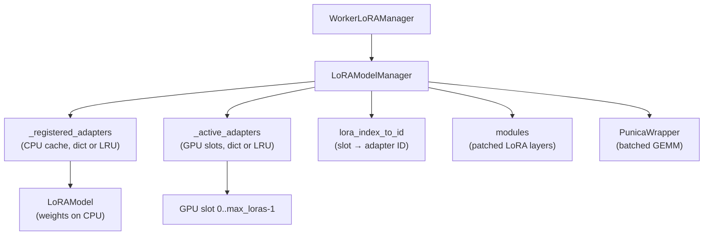

# LoRAModelManager

`LoRAModelManager` is the central component responsible for managing the lifecycle of LoRA adapters within a single worker process. It maintains two caches — one in CPU memory and one in GPU memory — and handles loading, activating, deactivating, and evicting adapters as requests arrive.

The implementation lives in `vllm/lora/model_manager.py`.

## Architecture Overview



### Two-Level Cache

vLLM uses a two-level caching strategy:

1. **CPU cache** (`_registered_adapters`): Holds `LoRAModel` objects with weights in pinned CPU memory. Capacity is `max_cpu_loras`.
2. **GPU slots** (`_active_adapters`): A fixed array of `max_loras` slots in GPU memory. Each slot holds the `lora_a` and `lora_b` tensors for one adapter, pre-loaded into the stacked weight tensors of every LoRA layer.

When a request arrives for an adapter:
1. If the adapter is already in a GPU slot → use it directly.
2. If the adapter is in the CPU cache but not on GPU → activate it (copy to a free GPU slot).
3. If the adapter is not in the CPU cache → load from disk into CPU, then activate.

## Class: `LoRAModelManager`

### Constructor

```python
class LoRAModelManager:
    def __init__(
        self,
        model: SupportsLoRA,
        max_num_seqs: int,
        max_num_batched_tokens: int,
        vocab_size: int,
        lora_config: LoRAConfig,
        device: torch.device,
        vllm_config: VllmConfig | None = None,
    ):
```

**Parameters:**

| Parameter | Description |
|-----------|-------------|
| `model` | The base model instance (must implement `SupportsLoRA`) |
| `max_num_seqs` | Maximum sequences per batch (used to size Punica metadata) |
| `max_num_batched_tokens` | Maximum tokens per batch (rounded up to multiple of 8) |
| `vocab_size` | Vocabulary size of the base model |
| `lora_config` | `LoRAConfig` instance with rank, slot counts, dtype |
| `device` | Target device (`cuda`, `cpu`, etc.) |
| `vllm_config` | Full vLLM config (needed for multimodal Punica wrappers) |

During construction, the manager:
1. Discovers all LoRA-eligible modules via `get_supported_lora_modules(model)`.
2. Initializes the Punica wrapper(s) for batched GEMM.
3. Calls `_create_lora_modules()` to replace eligible `nn.Linear` layers with `BaseLayerWithLoRA` subclasses.

### Key Properties

```python
@property
def capacity(self) -> int:
    return self.lora_config.max_cpu_loras

@property
def lora_slots(self) -> int:
    return self.lora_config.max_loras
```

### Adapter Lifecycle Methods

#### `add_adapter(adapter: LoRAModel) -> bool`

Registers a `LoRAModel` in the CPU cache. Returns `True` if the adapter was newly added, `False` if it was already registered. Raises `RuntimeError` if the CPU cache is full (non-LRU variant).

```python
def add_adapter(self, adapter: LoRAModel) -> bool:
    if adapter.id in self._registered_adapters:
        return False
    if len(self._registered_adapters) >= self.capacity:
        raise RuntimeError("No free adapter slots.")
    self._add_adapter(adapter)
    return True
```

#### `activate_adapter(lora_id: int) -> bool`

Moves an adapter from the CPU cache into a free GPU slot. The adapter must already be registered. Returns `True` if newly activated, `False` if already active.

```python
def activate_adapter(self, lora_id: int) -> bool:
    """Move LoRA into a GPU buffer to be used in the forward pass."""
    if lora_id in self._active_adapters:
        return False
    first_free_slot = next(
        (i, lora_id for i, lora_id in enumerate(self.lora_index_to_id)
         if lora_id is None),
        None,
    )
    if first_free_slot is None:
        raise ValueError("No free lora slots")
    # ... copies weights into each LoRA layer's stacked tensors
```

#### `deactivate_adapter(adapter_id: int) -> bool`

Removes an adapter from the active GPU slots, freeing the slot for another adapter. The adapter remains in the CPU cache.

#### `remove_adapter(adapter_id: int) -> bool`

Deactivates and removes an adapter from both the GPU slots and the CPU cache.

#### `set_adapter_mapping(mapping: LoRAMapping) -> None`

Updates the Punica wrapper's metadata with the current batch's token-to-adapter mapping. Called once per forward pass.

#### `list_adapters() -> dict[int, LoRAModel]`

Returns all currently registered adapters (CPU cache).

#### `get_adapter(adapter_id: int) -> LoRAModel | None`

Retrieves a registered adapter by its integer ID.

## Class: `LRUCacheLoRAModelManager`

`LRUCacheLoRAModelManager` extends `LoRAModelManager` with LRU eviction policies for both the CPU cache and GPU slots. This is the variant used in production serving when `max_cpu_loras > max_loras`.

```python
class LRUCacheLoRAModelManager(LoRAModelManager):
    """A model manager that manages multiple LoRAs with LRU cache."""
```

### LRU Behavior

Both `_registered_adapters` and `_active_adapters` are replaced with `LoRALRUCache` instances:

```python
self._registered_adapters: LoRALRUCache = LoRALRUCache(
    self.capacity, self.deactivate_adapter
)
self._active_adapters: LoRALRUCache = LoRALRUCache(
    self.lora_slots, self._deactivate_adapter
)
```

When a new adapter is added and the cache is full, the **least recently used** adapter is automatically evicted. The eviction callback (`deactivate_adapter`) is called to free the GPU slot.

### `add_adapter` (LRU variant)

```python
def add_adapter(self, lora: LoRAModel) -> bool:
    if lora.id not in self._registered_adapters:
        self._add_adapter(lora)
        was_added = True
    else:
        # Touch to update LRU order even if already present
        self._registered_adapters.touch(lora.id)
        was_added = False
    return was_added
```

### `activate_adapter` (LRU variant)

```python
def activate_adapter(self, lora_id: int) -> bool:
    if (lora_id not in self._active_adapters
            and len(self._active_adapters) >= self.lora_slots):
        self._active_adapters.remove_oldest()
    result = super().activate_adapter(lora_id)
    self._active_adapters.touch(lora_id)
    return result
```

If all GPU slots are occupied, the oldest (least recently used) active adapter is evicted before the new one is loaded.

### `remove_oldest_adapter() -> bool`

Explicitly evicts the least recently used adapter from the CPU cache. Used by `LRUCacheWorkerLoRAManager` when the CPU cache is full.

### `pin_adapter(lora_id: int) -> bool`

Pins an adapter in both the CPU and GPU caches, preventing it from being evicted by LRU. Useful for frequently-used adapters that should always remain loaded.

```python
def pin_adapter(self, lora_id: int) -> bool:
    self._pin_lora_in_cpu_cache(lora_id)
    self._pin_lora_in_gpu_cache(lora_id)
    return True
```

## Module Patching: `_create_lora_modules()`

During initialization, `_create_lora_modules()` iterates over all named modules in the model and replaces eligible layers with their LoRA-aware counterparts:

```python
def _create_lora_modules(self):
    for module_name, module in self.model.named_modules(remove_duplicate=False):
        if not self._match_target_modules(module_name):
            continue
        new_module = replace_submodule(
            self.model,
            module_name,
            from_layer(module, self.lora_slots, self.lora_config, ...),
        )
        self.register_module(module_name, new_module)
        new_module.set_mapping(punica_wrapper)
```

The `from_layer()` function in `vllm/lora/utils.py` selects the appropriate `BaseLayerWithLoRA` subclass based on the original layer type (e.g., `ColumnParallelLinear` → `ColumnParallelLinearWithLoRA`).

## `AdapterLRUCache`

The underlying LRU cache implementation:

```python
class AdapterLRUCache(LRUCache[int, T]):
    def __init__(self, capacity: int, deactivate_fn: Callable[[int], object]):
        super().__init__(capacity)
        self.deactivate_fn = deactivate_fn

    def _on_remove(self, key: int, value: T | None):
        logger.debug("Removing adapter int id: %d", key)
        self.deactivate_fn(key)
        return super()._on_remove(key, value)
```

When an entry is removed from the LRU cache (either by eviction or explicit removal), the `deactivate_fn` callback is invoked to clean up GPU resources.

## Factory Function

```python
def create_lora_manager(
    model: nn.Module,
    max_num_seqs: int,
    max_num_batched_tokens: int,
    vocab_size: int,
    lora_config: LoRAConfig,
    vllm_config: VllmConfig,
    device: torch.device,
    lora_manager_cls: type[LoRAModelManager] = LoRAModelManager,
    **kwargs,
) -> LoRAModelManager:
    """Create a LoRA adapter for a given model."""
```

The `WorkerLoRAManager` calls this factory to create the appropriate manager class. When `max_cpu_loras > max_loras`, `LRUCacheLoRAModelManager` is used automatically.

## Multimodal Support

For multimodal models, the manager creates separate Punica wrappers for different model components:

```python
self.punica_wrapper_mapping: dict[str, PunicaWrapperBase] = {}
# Keys: "language_model", tower prefixes, connector prefixes
```

Each component (language model, vision tower, connector) gets its own Punica wrapper sized appropriately for its token budget.

## See Also

- [LoRARequest](lora-request.md) — Per-request adapter descriptor
- [LoRAConfig](lora-config.md) — Configuration options
- [LoRA Layers](lora-layers.md) — How layers are patched
- [Punica Kernels](punica-kernels.md) — Batched GEMM operations
