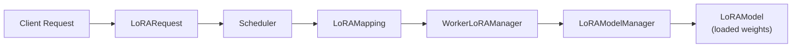

# LoRARequest

`LoRARequest` is the per-request descriptor that tells vLLM which LoRA adapter to apply when processing a specific inference request. It is defined in `vllm/lora/request.py` and is passed alongside the prompt and sampling parameters.

## Class Definition

```python
class LoRARequest(
    msgspec.Struct,
    omit_defaults=True,
    array_like=True,
):
    lora_name: str
    lora_int_id: int
    lora_path: str = ""
    base_model_name: str | None = None
    tensorizer_config_dict: dict | None = None
    load_inplace: bool = False
```

`LoRARequest` is implemented as a `msgspec.Struct` for efficient serialization and deserialization across process boundaries (e.g., between the API server and the engine worker).

## Fields

| Field | Type | Required | Description |
|-------|------|----------|-------------|
| `lora_name` | `str` | ✅ | Human-readable name for the adapter. Used as the key in the adapter registry and as the `model` field in OpenAI API requests. |
| `lora_int_id` | `int` | ✅ | Globally unique integer identifier for the adapter. Must be `> 0`. Used internally to index into GPU slot arrays. |
| `lora_path` | `str` | ✅ | Path to the adapter directory on disk (or a HuggingFace Hub repo ID when using the HF resolver). Must contain `adapter_config.json` and `adapter_model.safetensors`. |
| `base_model_name` | `str \| None` | ❌ | Optional name of the base model this adapter was trained for. Used by resolvers to validate compatibility. |
| `tensorizer_config_dict` | `dict \| None` | ❌ | Configuration for loading weights via Tensorizer instead of safetensors. |
| `load_inplace` | `bool` | ❌ | If `True`, forces reloading the adapter even if one with the same `lora_int_id` already exists in the cache. Replaces the existing adapter in-place. Default: `False`. |

## Validation

The `__post_init__` method enforces two invariants:

```python
def __post_init__(self):
    if self.lora_int_id < 1:
        raise ValueError(f"id must be > 0, got {self.lora_int_id}")
    assert self.lora_path, "lora_path cannot be empty"
```

- `lora_int_id` must be a positive integer (≥ 1).
- `lora_path` must be a non-empty string.

## Properties

`LoRARequest` exposes three convenience properties that provide a uniform interface compatible with the generic adapter management code:

```python
@property
def adapter_id(self):
    return self.lora_int_id

@property
def name(self):
    return self.lora_name

@property
def path(self):
    return self.lora_path
```

## Equality and Hashing

`LoRARequest` overrides `__eq__` and `__hash__` to compare instances **by `lora_name`** rather than by object identity or all fields:

```python
def __eq__(self, value: object) -> bool:
    return isinstance(value, self.__class__) and self.lora_name == value.lora_name

def __hash__(self) -> int:
    return hash(self.lora_name)
```

This design allows the same logical adapter to be identified consistently across different engine workers and API server instances, even if the `lora_int_id` or `lora_path` differ slightly between instances.

> **Note:** vLLM does not currently enforce global uniqueness of `lora_int_id` across all adapters. It is the caller's responsibility to assign unique IDs. Using `abs(hash(lora_name))` is a common pattern (used by the filesystem resolver).

## Usage Examples

### Basic Usage

```python
from vllm.lora.request import LoRARequest

lora_request = LoRARequest(
    lora_name="sql-lora",
    lora_int_id=1,
    lora_path="/models/adapters/sql-lora",
)
```

### Multiple Adapters in the Same Batch

Each request in a batch can reference a different adapter. vLLM's scheduler builds a `LoRAMapping` that maps each token to its adapter's GPU slot index:

```python
from vllm import LLM, SamplingParams
from vllm.lora.request import LoRARequest

llm = LLM(
    model="meta-llama/Llama-3.1-8B-Instruct",
    enable_lora=True,
    max_loras=4,
    max_lora_rank=64,
)

sql_lora = LoRARequest(
    lora_name="sql-lora",
    lora_int_id=1,
    lora_path="/models/adapters/sql-lora",
)
code_lora = LoRARequest(
    lora_name="code-lora",
    lora_int_id=2,
    lora_path="/models/adapters/code-lora",
)

sampling_params = SamplingParams(temperature=0.0, max_tokens=100)

outputs = llm.generate(
    [
        "SELECT * FROM users WHERE",   # uses sql_lora
        "def fibonacci(n):",           # uses code_lora
        "Translate to French: Hello",  # uses base model (no lora_request)
    ],
    sampling_params,
    lora_request=[sql_lora, code_lora, None],
)
```

### Force-Reloading an Adapter

Use `load_inplace=True` to replace an already-loaded adapter with a new version (e.g., after retraining):

```python
updated_lora = LoRARequest(
    lora_name="sql-lora",
    lora_int_id=1,
    lora_path="/models/adapters/sql-lora-v2",
    load_inplace=True,
)
```

### With Base Model Name

Specifying `base_model_name` enables resolvers to validate that the adapter was trained for the correct base model:

```python
lora_request = LoRARequest(
    lora_name="my-adapter",
    lora_int_id=1,
    lora_path="/models/adapters/my-adapter",
    base_model_name="meta-llama/Llama-3.1-8B-Instruct",
)
```

## Relationship to Other Components



The `LoRARequest` flows from the client through the scheduler to the worker. The `WorkerLoRAManager` uses `lora_int_id` to look up the adapter in the `LoRAModelManager` cache, and `lora_path` to load it from disk if not already cached.

## See Also

- [LoRAConfig](lora-config.md) — Server-wide configuration
- [LoRAModelManager](lora-model-manager.md) — Adapter caching and lifecycle
- [Dynamic Loading API](dynamic-loading.md) — Runtime load/unload via REST
