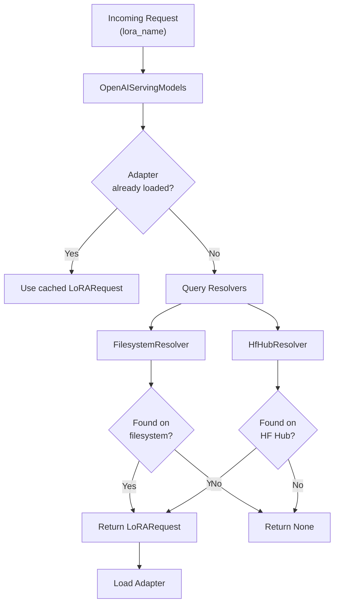

# LoRA Resolvers

LoRA resolvers are plugins that allow vLLM to automatically discover and load LoRA adapters by name, without requiring the client to specify a full filesystem path. When a request arrives with a `lora_name` that isn't already loaded, vLLM queries registered resolvers to find and load the adapter.

The resolver system is defined in `vllm/lora/resolver.py`, with built-in implementations in `vllm/plugins/lora_resolvers/`.

## Architecture



## `LoRAResolver` Base Class

Defined in `vllm/lora/resolver.py`:

```python
class LoRAResolver(ABC):
    """Base class for LoRA adapter resolvers."""

    @abstractmethod
    async def resolve_lora(
        self, base_model_name: str, lora_name: str
    ) -> LoRARequest | None:
        """Locate and return a LoRARequest for the given adapter name.

        Args:
            base_model_name: The name/identifier of the base model.
            lora_name: The name/identifier of the LoRA adapter to resolve.

        Returns:
            LoRARequest if found, None otherwise.
        """
```

The `resolve_lora` method is `async` to support non-blocking I/O (e.g., downloading from remote storage).

## `LoRAResolverRegistry`

A global registry that holds all registered resolver instances:

```python
@dataclass
class _LoRAResolverRegistry:
    resolvers: dict[str, LoRAResolver] = field(default_factory=dict)

    def register_resolver(self, resolver_name: str, resolver: LoRAResolver) -> None:
        """Register a LoRA resolver."""

    def get_resolver(self, resolver_name: str) -> LoRAResolver:
        """Get a registered resolver by name."""

    def get_supported_resolvers(self) -> Set[str]:
        """Get all registered resolver names."""

LoRAResolverRegistry = _LoRAResolverRegistry()
```

Resolvers are registered at startup via plugin entry points or explicit calls. The `OpenAIServingModels` class queries all registered resolvers when an unknown adapter name is encountered.

## `FilesystemResolver`

Defined in `vllm/plugins/lora_resolvers/filesystem_resolver.py`.

Resolves LoRA adapters from a local directory. Given a `lora_name`, it looks for a subdirectory with that name inside a configured cache directory.

### How It Works

```python
class FilesystemResolver(LoRAResolver):
    def __init__(self, lora_cache_dir: str):
        self.lora_cache_dir = lora_cache_dir

    async def resolve_lora(
        self, base_model_name: str, lora_name: str
    ) -> LoRARequest | None:
        lora_path = os.path.join(self.lora_cache_dir, lora_name)
        return await self._get_lora_req_from_path(lora_name, lora_path, base_model_name)
```

The `_get_lora_req_from_path` method validates the adapter:
1. Checks that `lora_path` exists on disk.
2. Reads `adapter_config.json` from the directory.
3. Verifies that `peft_type == "LORA"`.
4. Verifies that `base_model_name_or_path` matches the provided `base_model_name`.
5. Returns a `LoRARequest` with `lora_int_id=abs(hash(lora_name))`.

```python
async def _get_lora_req_from_path(
    self, lora_name, lora_path, base_model_name
) -> LoRARequest | None:
    if os.path.exists(lora_path):
        adapter_config_path = os.path.join(lora_path, "adapter_config.json")
        if os.path.exists(adapter_config_path):
            with open(adapter_config_path) as file:
                adapter_config = json.load(file)
            if (
                adapter_config["peft_type"] == "LORA"
                and adapter_config["base_model_name_or_path"] == base_model_name
            ):
                return LoRARequest(
                    lora_name=lora_name,
                    lora_int_id=abs(hash(lora_name)),
                    lora_path=lora_path,
                )
    return None
```

### Configuration

The filesystem resolver is activated by setting the `VLLM_LORA_RESOLVER_CACHE_DIR` environment variable:

```bash
export VLLM_LORA_RESOLVER_CACHE_DIR=/models/lora-adapters

vllm serve meta-llama/Llama-3.1-8B-Instruct \
  --enable-lora \
  --max-loras 4
```

With this configuration, a request for `lora_name="sql-lora"` will look for an adapter at `/models/lora-adapters/sql-lora/`.

### Registration

```python
def register_filesystem_resolver():
    """Register the filesystem LoRA Resolver with vLLM"""
    lora_cache_dir = envs.VLLM_LORA_RESOLVER_CACHE_DIR
    if lora_cache_dir:
        if not os.path.exists(lora_cache_dir) or not os.path.isdir(lora_cache_dir):
            raise ValueError(
                "VLLM_LORA_RESOLVER_CACHE_DIR must be set to a valid directory"
            )
        fs_resolver = FilesystemResolver(lora_cache_dir)
        LoRAResolverRegistry.register_resolver("Filesystem Resolver", fs_resolver)
```

### Expected Directory Structure

```
/models/lora-adapters/
├── sql-lora/
│   ├── adapter_config.json
│   └── adapter_model.safetensors
├── code-lora/
│   ├── adapter_config.json
│   └── adapter_model.safetensors
└── chat-lora/
    ├── adapter_config.json
    └── adapter_model.safetensors
```

Each adapter directory must contain:
- `adapter_config.json`: PEFT configuration with `peft_type`, `base_model_name_or_path`, `r`, `lora_alpha`, `target_modules`.
- `adapter_model.safetensors` (preferred), `adapter_model.bin`, or `adapter_model.pt`.

## `HfHubResolver`

Defined in `vllm/plugins/lora_resolvers/hf_hub_resolver.py`.

Extends `FilesystemResolver` to resolve LoRA adapters from HuggingFace Hub repositories. It downloads adapters on demand using `snapshot_download` and then delegates to the filesystem resolver logic.

> **Security Warning:** The HF Hub resolver allows downloading arbitrary code from the internet. It is explicitly **not intended for production use** and should only be used in local development environments.

### How It Works

```python
class HfHubResolver(FilesystemResolver):
    def __init__(self, repo_list: list[str]):
        self.repo_list: list[str] = repo_list
        self.adapter_dirs: dict[str, set[str]] = {}

    async def resolve_lora(
        self, base_model_name: str, lora_name: str
    ) -> LoRARequest | None:
        # 1. Match lora_name to a repo in repo_list
        maybe_repo = await self._resolve_repo(lora_name)

        # 2. Discover adapter directories in the repo (first time only)
        if maybe_repo is not None and maybe_repo not in self.adapter_dirs:
            self.adapter_dirs[maybe_repo] = await self._get_adapter_dirs(maybe_repo)

        # 3. Resolve the subpath within the repo
        maybe_subpath = await self._resolve_repo_subpath(lora_name, maybe_repo)

        if maybe_repo is None or maybe_subpath is None:
            return None

        # 4. Download the adapter
        repo_path = await asyncio.to_thread(
            snapshot_download,
            repo_id=maybe_repo,
            allow_patterns=f"{maybe_subpath}/*" if maybe_subpath != "." else "*",
        )

        # 5. Validate and return LoRARequest
        lora_path = os.path.join(repo_path, maybe_subpath)
        return await self._get_lora_req_from_path(lora_name, lora_path, base_model_name)
```

### Adapter Name Format

The `lora_name` must be a path relative to the HF Hub:

| `lora_name` | Repo | Subpath |
|-------------|------|---------|
| `org/repo` | `org/repo` | `.` (root) |
| `org/repo/sql-lora` | `org/repo` | `sql-lora` |
| `org/repo/adapters/v2` | `org/repo` | `adapters/v2` |

### Repo Discovery

The resolver scans the repo for directories containing `adapter_config.json`:

```python
async def _get_adapter_dirs(self, repo_name: str) -> set[str]:
    repo_files = await asyncio.to_thread(HfApi().list_repo_files, repo_id=repo_name)
    adapter_dirs = {
        os.path.dirname(name)
        for name in repo_files
        if name.endswith("adapter_config.json")
    }
    if "adapter_config.json" in repo_files:
        adapter_dirs.add(".")
    return adapter_dirs
```

### Configuration

The HF Hub resolver requires two settings:

1. **`VLLM_LORA_RESOLVER_HF_REPO_LIST`**: Comma-separated list of allowed HF Hub repositories.
2. **`VLLM_PLUGINS`**: Must include `lora_hf_hub_resolver` to explicitly opt in.

```bash
export VLLM_LORA_RESOLVER_HF_REPO_LIST="myorg/my-lora-repo,anotherorg/adapters"
export VLLM_PLUGINS="lora_hf_hub_resolver"

vllm serve meta-llama/Llama-3.1-8B-Instruct \
  --enable-lora \
  --max-loras 4
```

If `VLLM_LORA_RESOLVER_HF_REPO_LIST` is set but `lora_hf_hub_resolver` is not in `VLLM_PLUGINS`, a warning is logged and the resolver is not activated.

### Registration

```python
def register_hf_hub_resolver():
    hf_repo_list = envs.VLLM_LORA_RESOLVER_HF_REPO_LIST
    is_enabled = (
        envs.VLLM_PLUGINS is not None
        and "lora_hf_hub_resolver" in envs.VLLM_PLUGINS
    )
    if hf_repo_list:
        if not is_enabled:
            logger.warning("VLLM_LORA_RESOLVER_HF_REPO_LIST is set but "
                           "lora_hf_hub_resolver is not enabled in VLLM_PLUGINS")
        else:
            hf_hub_resolver = HfHubResolver(hf_repo_list.split(","))
            LoRAResolverRegistry.register_resolver("Hf Hub Resolver", hf_hub_resolver)
```

## Writing a Custom Resolver

You can implement your own resolver to load adapters from any source (S3, GCS, database, etc.):

```python
from vllm.lora.resolver import LoRAResolver, LoRAResolverRegistry
from vllm.lora.request import LoRARequest

class S3LoRAResolver(LoRAResolver):
    def __init__(self, bucket: str, local_cache_dir: str):
        self.bucket = bucket
        self.local_cache_dir = local_cache_dir

    async def resolve_lora(
        self, base_model_name: str, lora_name: str
    ) -> LoRARequest | None:
        import aioboto3
        local_path = f"{self.local_cache_dir}/{lora_name}"

        # Download from S3 if not cached
        if not os.path.exists(local_path):
            session = aioboto3.Session()
            async with session.client("s3") as s3:
                await s3.download_file(
                    self.bucket, f"{lora_name}/adapter_model.safetensors",
                    f"{local_path}/adapter_model.safetensors"
                )
                await s3.download_file(
                    self.bucket, f"{lora_name}/adapter_config.json",
                    f"{local_path}/adapter_config.json"
                )

        return LoRARequest(
            lora_name=lora_name,
            lora_int_id=abs(hash(lora_name)),
            lora_path=local_path,
        )

# Register the resolver
resolver = S3LoRAResolver(bucket="my-lora-bucket", local_cache_dir="/tmp/loras")
LoRAResolverRegistry.register_resolver("S3 Resolver", resolver)
```

## Environment Variables Summary

| Variable | Description |
|----------|-------------|
| `VLLM_LORA_RESOLVER_CACHE_DIR` | Directory for `FilesystemResolver` to scan |
| `VLLM_LORA_RESOLVER_HF_REPO_LIST` | Comma-separated HF Hub repos for `HfHubResolver` |
| `VLLM_PLUGINS` | Must include `lora_hf_hub_resolver` to enable HF Hub resolver |

## See Also

- [LoRARequest](lora-request.md) — The object resolvers return
- [Dynamic Loading API](dynamic-loading.md) — Runtime load/unload via REST API
- [LoRAConfig](lora-config.md) — Server-wide LoRA configuration
