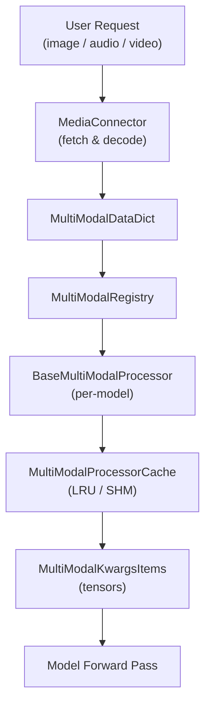

# Multimodal Support

vLLM provides first-class support for multimodal language models — models that can process
inputs beyond plain text, including images, audio, and video. This section covers the
architecture, input formats, configuration, and advanced features of vLLM's multimodal
subsystem.

## Overview

The multimodal subsystem lives in `vllm/multimodal/` and is organized around a few key
concepts:

- **Modalities**: The types of non-text data a model can accept — `image`, `audio`, `video`.
- **Registry**: A global `MultiModalRegistry` that maps model classes to their input processors.
- **Processors**: Per-model classes that transform raw media into tensors the model can consume.
- **Cache**: An LRU or shared-memory cache that avoids re-processing identical media items.
- **Encoder Budget**: A mechanism that limits how many encoder tokens can be processed per batch.
- **EVS (Efficient Video Sampling)**: A technique to prune redundant video tokens.



## Supported Modalities

| Modality | Key | Python Type | Notes |
|----------|-----|-------------|-------|
| Image | `image` | `PIL.Image`, `np.ndarray`, `torch.Tensor` | Also accepts pre-computed embeddings |
| Video | `video` | `np.ndarray` (frames), `torch.Tensor` | Requires `opencv-python-headless` |
| Audio | `audio` | `np.ndarray`, `(np.ndarray, float)` tuple | Resampling via `librosa` or `scipy` |
| Vision Chunk | `vision_chunk` | `VisionChunkImage` or `VisionChunkVideo` | Unified image/video atom |

## In This Section

| Page | Description |
|------|-------------|
| [Image Inputs](image-inputs.md) | PIL images, URLs, base64, `image_url` in chat messages |
| [Audio Inputs](audio-inputs.md) | Waveforms, audio URLs, speech-to-text models |
| [Video Inputs](video-inputs.md) | Frame extraction, video URLs, OpenCV backend |
| [Multimodal Registry](registry.md) | How models register their input processors |
| [Multimodal Cache](cache.md) | Encoder output caching, `MultiModalCache` |
| [Encoder Budget](encoder-budget.md) | Limiting encoder token count |
| [EVS — Efficient Video Sampling](evs.md) | Vision token management and pruning |
| [MultiModalConfig](config.md) | Configuration reference |
| [Code Examples](examples.md) | Image in chat completion, audio transcription |

## Quick Start

### Offline Inference with an Image

```python
from PIL import Image
from vllm import LLM, SamplingParams

llm = LLM(model="llava-hf/llava-1.5-7b-hf")
sampling_params = SamplingParams(temperature=0.0, max_tokens=256)

image = Image.open("photo.jpg")

outputs = llm.generate(
    {
        "prompt": "USER: <image>\nDescribe this image.\nASSISTANT:",
        "multi_modal_data": {"image": image},
    },
    sampling_params=sampling_params,
)
print(outputs[0].outputs[0].text)
```

### Online Serving via OpenAI-Compatible API

```bash
vllm serve llava-hf/llava-1.5-7b-hf
```

```python
from openai import OpenAI

client = OpenAI(api_key="EMPTY", base_url="http://localhost:8000/v1")

response = client.chat.completions.create(
    model="llava-hf/llava-1.5-7b-hf",
    messages=[{
        "role": "user",
        "content": [
            {"type": "text", "text": "What is in this image?"},
            {"type": "image_url", "image_url": {"url": "https://example.com/photo.jpg"}},
        ],
    }],
    max_completion_tokens=256,
)
print(response.choices[0].message.content)
```

## Key Source Files

| File | Purpose |
|------|---------|
| `vllm/multimodal/__init__.py` | Global `MULTIMODAL_REGISTRY` singleton |
| `vllm/multimodal/inputs.py` | Type aliases: `ImageItem`, `AudioItem`, `VideoItem`, `MultiModalDataDict` |
| `vllm/multimodal/registry.py` | `MultiModalRegistry` — model-to-processor dispatch |
| `vllm/multimodal/cache.py` | `MultiModalCache`, `MultiModalProcessorOnlyCache`, SHM cache |
| `vllm/multimodal/encoder_budget.py` | `MultiModalBudget` — encoder token budget |
| `vllm/multimodal/evs.py` | EVS pruning functions |
| `vllm/multimodal/audio.py` | `AudioSpec`, `AudioResampler`, `split_audio` |
| `vllm/multimodal/video.py` | `VideoLoader`, `OpenCVVideoBackendMixin`, frame sampling |
| `vllm/multimodal/image.py` | `rescale_image_size`, `rgba_to_rgb` |
| `vllm/multimodal/media/` | `MediaConnector`, `ImageMediaIO`, `AudioMediaIO`, `VideoMediaIO` |
| `vllm/multimodal/processing/` | `BaseMultiModalProcessor`, `BaseProcessingInfo`, `BaseDummyInputsBuilder` |
| `vllm/config/multimodal.py` | `MultiModalConfig` dataclass |

## Cross-References

- [Multimodal Models](../04-models/multimodal-models.md) — supported multimodal model architectures
- [MultiModalConfig](../06-configuration/additional-configs.md) — configuration reference
- [API: Chat Completions](../12-api-reference/chat-completions.md) — `image_url` in chat messages
- [API: Audio Transcriptions](../12-api-reference/audio-transcriptions.md) — Whisper transcription endpoint
- [Encoder Budget](encoder-budget.md) — limiting encoder token count per batch
- [Benchmarking](../15-benchmarking/README.md) — benchmarking multimodal inference
