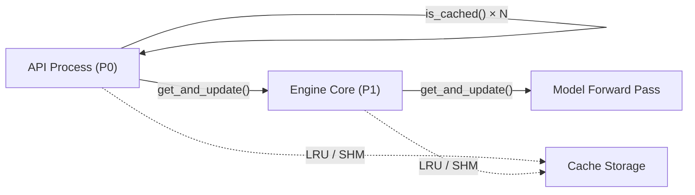

# Multimodal Cache

vLLM caches the output of multimodal preprocessing (image/audio/video encoding) to avoid
re-processing identical media items across requests. The caching system is designed around
a client-server model where the API process (P0) and the engine core process (P1) maintain
mirrored caches.

## Architecture



The key invariant: `get_and_update()` must be called in P0 and P1 one after another so
that their cache eviction orders remain identical. This allows P0 to determine whether an
item is cached in P1 by looking up the P0 cache, without communicating with P1.

## Cache Types

| Type | Key | When Used |
|------|-----|-----------|
| `MultiModalProcessorOnlyCache` | `processor_only` | IPC disabled (single process or multi-DP) |
| `MultiModalProcessorSenderCache` | `lru` | IPC enabled, LRU mirrored cache |
| `ShmObjectStoreSenderCache` | `shm` | IPC enabled, shared-memory FIFO cache |

### MultiModalProcessorOnlyCache

Used when IPC caching is disabled (e.g., `data_parallel_size > 1` without external load
balancer). Stores full tensor data and prompt updates in a single LRU cache on P0:

```python
class MultiModalProcessorOnlyCache(BaseMultiModalProcessorCache):
    """
    Cache on P0 when IPC caching is disabled.
    - Cache hit: replace input with cached item (tensor + prompt_updates)
    - Cache miss: store item and return input
    """
```

### MultiModalProcessorSenderCache (LRU)

Used when IPC caching is enabled with `mm_processor_cache_type = "lru"`. P0 stores only
metadata (size info + prompt updates), while P1 stores the actual tensor data:

```python
class MultiModalProcessorSenderCache(BaseMultiModalProcessorCache):
    """
    Cache on P0 when IPC caching is enabled (LRU mode).
    - Cache hit: clear input to avoid unnecessary IPC transfer
    - Cache miss: store metadata only (not tensor data) to save P0 memory
    """
```

### ShmObjectStoreSenderCache (SHM)

Uses a shared-memory ring buffer for zero-copy transfer between P0 and P1:

```python
class ShmObjectStoreSenderCache(BaseMultiModalProcessorCache):
    """
    Cache on P0 when IPC caching is enabled (SHM mode).
    - Cache hit: return shared-memory address reference
    - Cache miss: write tensor data to shared memory ring buffer
    """
```

## MultiModalCache Utility Class

`MultiModalCache` (in `vllm/multimodal/cache.py`) provides static helpers for size
calculation and LRU cache creation:

```python
class MultiModalCache:
    @classmethod
    def get_item_size(cls, value: MultiModalCacheValue, *, debug: bool = False) -> int:
        """Calculate the memory size of a cached item in bytes."""

    @classmethod
    def get_item_complexity(cls, value: MultiModalCacheValue) -> int:
        """Get the number of leaf elements (structural complexity)."""

    @classmethod
    def get_lru_cache(
        cls,
        capacity_gb: float,
        value_type: type[_V],
        *,
        debug: bool = False,
    ) -> LRUCache[str, _V]:
        """Create an LRU cache with the given capacity in GiB."""
```

Size calculation handles all common types:
- `torch.Tensor` → `tensor.nbytes`
- `MultiModalKwargsItem` → sum of all tensor sizes
- `MultiModalProcessorCacheItem` → size of contained item
- Other objects → `sys.getsizeof()`

## Cache Configuration

Configure the cache via `MultiModalConfig` (see [MultiModalConfig](config.md)):

```bash
# Set cache size to 8 GiB (default: 4 GiB)
vllm serve my-vision-model \
    --mm-processor-cache-gb 8

# Use shared-memory cache
vllm serve my-vision-model \
    --mm-processor-cache-type shm \
    --mm-shm-cache-max-object-size-mb 256

# Disable cache
vllm serve my-vision-model \
    --mm-processor-cache-gb 0
```

Or via Python:

```python
from vllm import LLM

llm = LLM(
    model="llava-hf/llava-1.5-7b-hf",
    mm_processor_cache_gb=8.0,
    mm_processor_cache_type="lru",
)
```

## Cache Key: MultiModalHasher

Cache keys are computed by `MultiModalHasher` (in `vllm/multimodal/hasher.py`). The hasher
supports multiple algorithms, configurable via `VLLM_MM_HASHER_ALGORITHM`:

| Algorithm | Notes |
|-----------|-------|
| `blake3` | Default, fastest |
| `sha256` | FIPS-compliant alternative |
| `sha512` | FIPS-compliant, larger digest |

```python
class MultiModalHasher:
    @classmethod
    def hash_kwargs(cls, **kwargs: object) -> str:
        """Compute a hash string from keyword arguments."""
```

Supported types for hashing:
- `bytes`, `memoryview` — raw bytes
- `str` — UTF-8 encoded
- `int`, `float` — as numpy scalar bytes
- `PIL.Image.Image` — pixel data + mode + palette (or EXIF ImageID UUID if present)
- `torch.Tensor` — dtype + shape + data
- `np.ndarray` — dtype + shape + data
- `MediaWithBytes` — original bytes if available

### User-Provided UUIDs

You can bypass the hash computation by providing explicit UUIDs:

```python
outputs = llm.generate(
    {
        "prompt": "USER: <image>\nDescribe this.\nASSISTANT:",
        "multi_modal_data": {"image": image},
        "multi_modal_uuids": {"image": "my-stable-image-id"},
    },
    sampling_params=sampling_params,
)
```

This is useful when:
- You know the image is identical to a previous request.
- You want to force cache hits for testing.
- The image object changes (e.g., different PIL instance) but content is the same.

## Cache Eviction

The LRU cache evicts items when the total size exceeds `mm_processor_cache_gb`. The
`touch_sender_cache_item` method updates the eviction order without changing the value:

```python
cache.touch_sender_cache_item(mm_hash)
```

## Cache Statistics

Monitor cache performance via the `make_stats` method:

```python
from vllm.utils.cache import CacheInfo

stats: CacheInfo = cache.make_stats(delta=True)
# CacheInfo(hits=42, total=100)
# hit_rate = stats.hits / stats.total
```

Enable per-request timing stats with `--enable-mm-processor-stats`.

## Receiver Caches

On P1 (engine core / worker), receiver caches accept items from P0:

```python
class MultiModalReceiverCache(BaseMultiModalReceiverCache):
    """LRU receiver cache for the engine process."""

class ShmObjectStoreReceiverCache(BaseMultiModalReceiverCache):
    """Shared-memory receiver cache for worker processes."""
```

The registry creates the appropriate receiver cache:

```python
# Engine process
engine_cache = MULTIMODAL_REGISTRY.engine_receiver_cache_from_config(vllm_config)

# Worker process
worker_cache = MULTIMODAL_REGISTRY.worker_receiver_cache_from_config(
    vllm_config, shared_worker_lock
)
```

## Memory Considerations

The cache is duplicated for each API process and engine core process:

```
Total memory = mm_processor_cache_gb × (api_server_count + data_parallel_size)
```

For example, with `mm_processor_cache_gb=4`, 2 API servers, and 4 DP workers:
```
Total = 4 GiB × (2 + 4) = 24 GiB
```

> **Tip**: Set `mm_processor_cache_gb` to 0 to disable the cache entirely if memory is
> constrained. This is not recommended for production workloads with repeated images.

## Related Pages

- [Multimodal Registry](registry.md) — how the cache is created
- [Encoder Budget](encoder-budget.md) — encoder token budget
- [MultiModalConfig](config.md) — full configuration reference
