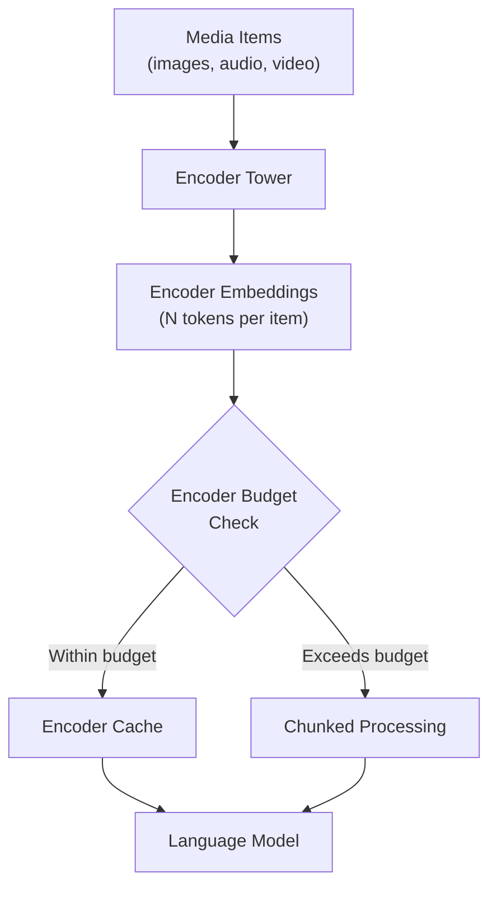

# Encoder Budget

The encoder budget system controls how many encoder tokens can be processed per batch and
how large the encoder cache can be. It prevents out-of-memory errors when processing many
large media items simultaneously.

## Overview

For multimodal models, the encoder (vision tower, audio encoder, etc.) processes media
items and produces embeddings. Each media item consumes a certain number of "encoder tokens"
— the number of embedding vectors produced. The encoder budget limits:

1. **Compute budget**: How many encoder tokens can be processed in a single batch step.
2. **Cache budget**: How many encoder token embeddings can be stored in the encoder cache.



## MultiModalBudget

The `MultiModalBudget` class (in `vllm/multimodal/encoder_budget.py`) computes all budget
information at engine startup:

```python
class MultiModalBudget:
    """Helper class to calculate budget information for multi-modal models."""

    def __init__(
        self,
        vllm_config: VllmConfig,
        mm_registry: MultiModalRegistry,
    ) -> None: ...
```

### Key Attributes

| Attribute | Type | Description |
|-----------|------|-------------|
| `encoder_compute_budget` | `int` | Max encoder tokens per batch step |
| `encoder_cache_size` | `int` | Max encoder tokens in cache |
| `mm_max_toks_per_item` | `Mapping[str, int]` | Max tokens per media item, per modality |
| `mm_max_items_per_prompt` | `Mapping[str, int]` | Max media items per prompt |
| `mm_max_items_per_batch` | `Mapping[str, int]` | Max media items per batch |
| `mm_limits` | `Mapping[str, int]` | Allowed items per prompt (from config) |

### Budget Computation

The effective encoder budget is:

```python
def get_encoder_budget(self) -> int:
    return min(self.encoder_compute_budget, self.encoder_cache_size)
```

Both `encoder_compute_budget` and `encoder_cache_size` are derived from
`SchedulerConfig.max_num_batched_tokens` by default:

```python
# vllm/config/scheduler.py
self.max_num_encoder_input_tokens = self.max_num_batched_tokens
self.encoder_cache_size = self.max_num_batched_tokens
```

The `compute_mm_encoder_budget` function (in `vllm/v1/core/encoder_cache_manager.py`)
ensures the budget is at least as large as the largest single media item:

```python
def compute_mm_encoder_budget(
    scheduler_config: SchedulerConfig,
    mm_max_toks_per_item: Mapping[str, int],
) -> tuple[int, int]:
    max_tokens_per_mm_item = max(mm_max_toks_per_item.values())

    encoder_compute_budget = max(
        scheduler_config.max_num_encoder_input_tokens,
        max_tokens_per_mm_item,
    )
    encoder_cache_size = max(
        scheduler_config.encoder_cache_size,
        max_tokens_per_mm_item,
    )
    return encoder_compute_budget, encoder_cache_size
```

## Getting Max Tokens Per Item

The `get_mm_max_toks_per_item` function determines how many encoder tokens each media item
produces:

```python
def get_mm_max_toks_per_item(
    model_config: ModelConfig,
    mm_registry: MultiModalRegistry,
    processor: BaseMultiModalProcessor,
    mm_counts: Mapping[str, int],
) -> Mapping[str, int]:
    """
    Get the maximum number of tokens per data item from each modality.
    """
    # Try model's own implementation first
    max_tokens_per_item = processor.info.get_mm_max_tokens_per_item(
        seq_len=model_config.max_model_len,
        mm_counts=mm_counts,
    )
    if max_tokens_per_item is not None:
        return max_tokens_per_item

    # Fall back to running dummy inputs through the processor
    mm_inputs = mm_registry.get_dummy_mm_inputs(
        model_config,
        mm_counts=mm_counts,
        processor=processor,
    )
    return {
        modality: sum(item.get_num_embeds() for item in placeholders)
        for modality, placeholders in mm_inputs["mm_placeholders"].items()
    }
```

## Per-Prompt and Per-Batch Limits

The budget system computes two derived limits for each modality:

### `mm_max_items_per_prompt`

The maximum number of media items of a given modality that can appear in a single prompt:

```python
max_items_per_prompt = max(
    1,
    min(mm_limit, max_model_len // max_tokens_per_item),
)
```

This ensures that even a single prompt cannot exceed the model's context length.

### `mm_max_items_per_batch`

The maximum number of media items across all requests in a batch:

```python
max_items_per_batch = max(
    1,
    min(max_encoder_items_per_batch, max_decoder_items_per_batch),
)
```

Where:
- `max_encoder_items_per_batch = encoder_budget // max_tokens_per_item`
- `max_decoder_items_per_batch = max_num_reqs × max_items_per_prompt`

## Embedding-Only Modalities

When `enable_mm_embeds=True` and a modality's limit is set to 0, that modality bypasses
the encoder tower entirely (pre-computed embeddings are passed directly). The budget system
handles this:

```python
# Modalities that pass through the MM encoder tower
tower_modalities = {
    modality for modality in supported_mm_limits
    if mm_limits.get(modality, 0) > 0
}

# Modalities that bypass the tower (pre-computed embeddings only)
embed_only_modalities = {
    modality for modality in supported_mm_limits
    if enable_mm_embeds and mm_limits.get(modality, 0) == 0
}
```

Embedding-only modalities still need encoder cache space but don't consume compute budget.

## Chunked Multimodal Input

When a single media item produces more tokens than `max_num_batched_tokens`, vLLM uses
chunked prefill to process it in multiple steps. This is controlled by
`disable_chunked_mm_input`:

```bash
# Disable chunked MM input (requires max_num_batched_tokens >= max tokens per item)
vllm serve my-vision-model \
    --disable-chunked-mm-input
```

If chunked MM input is disabled and a media item exceeds the batch token limit, an error
is raised at startup.

## Configuration

Tune the encoder budget via scheduler configuration:

```bash
# Increase max batched tokens (affects encoder budget)
vllm serve my-vision-model \
    --max-num-batched-tokens 8192

# Set max number of sequences (affects per-batch item limits)
vllm serve my-vision-model \
    --max-num-seqs 32
```

Or via Python:

```python
from vllm import LLM

llm = LLM(
    model="llava-hf/llava-1.5-7b-hf",
    max_num_batched_tokens=8192,
    max_num_seqs=32,
)
```

## Skip MM Profiling

For faster engine startup, skip multimodal memory profiling:

```bash
vllm serve my-vision-model --skip-mm-profiling
```

> **Warning**: This shifts the responsibility to the user for estimating peak memory usage.
> The engine may OOM if the actual memory usage exceeds the estimated amount.

## Related Pages

- [Multimodal Registry](registry.md) — how processors report token counts
- [Multimodal Cache](cache.md) — encoder output caching
- [EVS — Efficient Video Sampling](evs.md) — reducing encoder token count for video
- [MultiModalConfig](config.md) — full configuration reference
