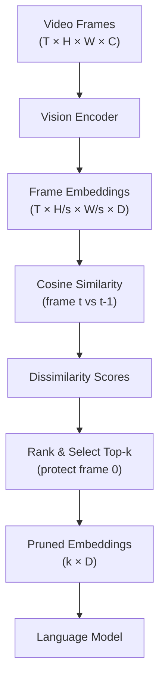

# EVS — Efficient Video Sampling

Efficient Video Sampling (EVS) is a technique for pruning redundant video tokens based on
inter-frame similarity. It reduces the number of encoder tokens that the language model
must process, improving throughput for video inputs without significantly degrading quality.

## Motivation

Video inputs can produce a very large number of tokens. For example, a 30-second video at
2 FPS with 256 tokens per frame produces 15,360 tokens. Many of these tokens are redundant
because consecutive frames are often visually similar. EVS identifies and removes the
least informative tokens.

## How EVS Works

EVS operates on the video embeddings after the vision encoder has processed all frames.
The algorithm:

1. **Compute inter-frame similarity**: For each pair of consecutive frames, compute the
   cosine similarity between their spatial token embeddings.
2. **Compute dissimilarity**: `dissimilarity = 1 - similarity`
3. **Protect the first frame**: All tokens from the first frame are always retained
   (dissimilarity set to 255 — maximum priority).
4. **Rank by dissimilarity**: Sort all tokens by dissimilarity in descending order.
5. **Retain top-k tokens**: Keep the `k` most dissimilar (most informative) tokens.



## Core Functions

All EVS functions are in `vllm/multimodal/evs.py`.

### `compute_retained_tokens_count`

```python
def compute_retained_tokens_count(
    tokens_per_frame: int,
    num_frames: int,
    q: float,
) -> int:
    """
    Compute the number of retained tokens for a given video.

    Ensures all tokens from the first frame are always retained,
    regardless of the pruning rate.

    Args:
        tokens_per_frame: Number of tokens per frame.
        num_frames: Total number of frames.
        q: Pruning rate in [0, 1). 0 = no pruning, 0.9 = 90% pruned.

    Returns:
        Number of tokens to retain.
    """
    total_tokens = tokens_per_frame * num_frames
    evs_num_tokens = int(total_tokens * (1 - q))
    min_num_tokens = tokens_per_frame  # Always keep first frame
    return max(min_num_tokens, evs_num_tokens)
```

### `compute_retention_mask`

```python
def compute_retention_mask(
    video_embeds: torch.Tensor,
    video_size_thw: torch.LongTensor | tuple[int, int, int],
    spatial_merge_size: int,
    q: float,
) -> torch.Tensor:
    """
    Compute the retention mask for input video embeddings.

    Args:
        video_embeds: Shape (T * H * W // spatial_merge_size^2, hidden_size)
        video_size_thw: (T, H, W) — temporal, height, width
        spatial_merge_size: Spatial reduction factor for rows & cols
        q: Pruning rate in [0, 1)

    Returns:
        Boolean mask of shape (T * H * W // spatial_merge_size^2)
        True = retain, False = prune
    """
```

**Example usage**:

```python
import torch
from vllm.multimodal.evs import compute_retention_mask

# Video embeddings after vision encoder
# Shape: (T * H/s * W/s, hidden_size)
video_embeds = torch.randn(16 * 14 * 14, 1024)  # 16 frames, 14×14 patches

mask = compute_retention_mask(
    video_embeds=video_embeds,
    video_size_thw=(16, 224, 224),  # T=16, H=224, W=224
    spatial_merge_size=16,           # 224/16 = 14 patches per side
    q=0.3,                           # Prune 30% of tokens
)
# mask.shape: (16 * 14 * 14,)
# mask.sum(): ~1568 tokens retained (70% of 2240)

pruned_embeds = video_embeds[mask]
```

## Enabling EVS

EVS is controlled by the `video_pruning_rate` field in `MultiModalConfig`:

```bash
# Prune 30% of video tokens
vllm serve Qwen/Qwen2.5-VL-7B-Instruct \
    --video-pruning-rate 0.3
```

```python
from vllm import LLM

llm = LLM(
    model="Qwen/Qwen2.5-VL-7B-Instruct",
    video_pruning_rate=0.3,
)
```

The pruning rate `q` must be in `[0, 1)`:
- `q = 0.0` — no pruning (default, EVS disabled)
- `q = 0.3` — prune 30% of tokens
- `q = 0.9` — prune 90% of tokens (aggressive)

> **Note**: EVS is only applied when `video_pruning_rate > 0`. Setting it to `None` or
> `0.0` disables EVS entirely.

## MRope Position Recomputation

When video tokens are pruned, the multi-dimensional rotary position embeddings (MRoPE)
must be recomputed to reflect the new token positions. The `recompute_mrope_positions`
function handles this:

```python
def recompute_mrope_positions(
    input_ids: torch.LongTensor,
    multimodal_positions: list[torch.Tensor],
    mrope_positions: torch.LongTensor,
    num_computed_tokens: int,
    vision_start_token_id: int,
    image_token_id: int,
    video_token_id: int,
) -> tuple[torch.LongTensor, int]:
    """
    Update MRoPE positions after video token pruning.

    Supports chunked prefill where multimodal embeddings are passed
    in chunks across multiple prefill stages.

    Args:
        input_ids: All input tokens of the prompt (N,)
        multimodal_positions: List of MRoPE positions for each media item.
            Shape (4, N) for Qwen2.5-VL: [t, h, w, max_width]
            Shape (5, N) for Qwen3-VL: [t, h, w, is_vision_start, is_vision]
        mrope_positions: Existing MRoPE positions (4, N) for entire sequence
        num_computed_tokens: Number of tokens computed so far (chunked prefill)
        vision_start_token_id: Token ID marking start of vision media
        image_token_id: Image token ID
        video_token_id: Video token ID

    Returns:
        (updated_mrope_positions, mrope_position_delta)
    """
```

### Chunked Prefill Support

EVS is fully compatible with chunked prefill. The `recompute_mrope_positions` function
handles the case where a video is split across multiple prefill stages:

```
Prefill 1: | TEXT TEXT TEXT <vision_start> VIDEO VIDEO VIDEO |
Prefill 2: | VIDEO VIDEO VIDEO TEXT TEXT TEXT TEXT TEXT TEXT |
```

The function tracks `num_computed_tokens` to correctly assign positions to tokens in
the current chunk.

### Qwen3-VL Support

Qwen3-VL uses a 5-channel MRoPE format that includes timestamp tokens interleaved with
video embeddings. The `recompute_mrope_positions` function handles this:

```python
# 5-channel format: [t, h, w, is_vision_start, is_vision]
# Channel 3 flags VISION_START tokens
# Channel 4 flags video embedding positions
if mm_pos.shape[0] == 5:
    has_video_tokens = torch.any(mm_pos[4, :]).item()
    # Timestamp tokens precede the first VISION_START
    first_vs = (mm_pos[3, :] == 1).nonzero(as_tuple=True)[0]
    num_timestamp_tokens = first_vs[0].item() if len(first_vs) > 0 else 0
```

## `compute_mrope_for_media`

A utility function that computes MRoPE positions for a media item from scratch:

```python
def compute_mrope_for_media(
    video_size_thw: torch.LongTensor,
    spatial_merge_size: int,
    tokens_per_second: float = 1.0,
    video_second_per_grid: float = 1.0,
) -> torch.Tensor:
    """
    Compute MRoPE positions for video/image embeddings.

    Returns:
        Tensor of shape (T * H * W, 4) where the last dimension
        represents [t_pos, h_pos, w_pos, max_width].
    """
```

## Supported Models

EVS is currently supported for models that use MRoPE-based position embeddings:

| Model | Notes |
|-------|-------|
| `Qwen/Qwen2.5-VL-*` | 4-channel MRoPE |
| `Qwen/Qwen3-VL-*` | 5-channel MRoPE with timestamp tokens |
| `Qwen/Qwen2.5-Omni-*` | Omni model with video support |

> **Note**: EVS requires the model to implement `SupportsMultiModalPruning` (defined in
> `vllm/model_executor/models/interfaces.py`).

## Performance Impact

EVS trades a small amount of quality for significant throughput improvements:

| Pruning Rate | Token Reduction | Throughput Gain | Quality Impact |
|-------------|-----------------|-----------------|----------------|
| 0.0 | 0% | 1× (baseline) | None |
| 0.3 | 30% | ~1.4× | Minimal |
| 0.5 | 50% | ~2× | Moderate |
| 0.7 | 70% | ~3× | Noticeable |

The first frame is always fully retained, which preserves scene-setting information.

## Related Pages

- [Video Inputs](video-inputs.md) — video input formats and loading
- [Encoder Budget](encoder-budget.md) — encoder token budget management
- [MultiModalConfig](config.md) — `video_pruning_rate` configuration
