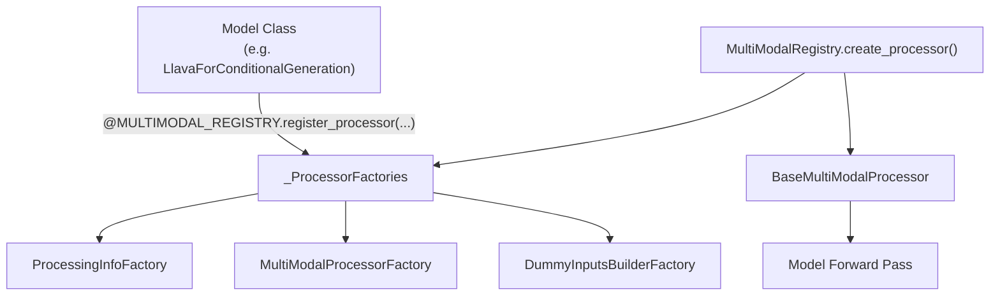
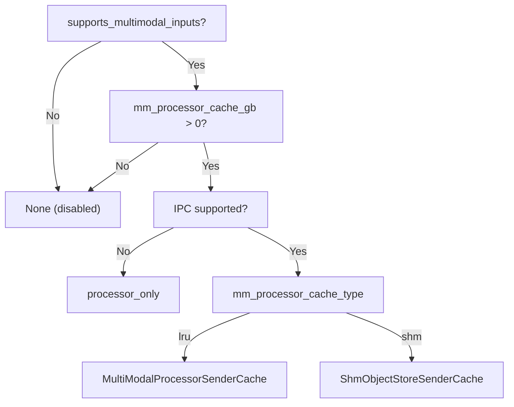

# Multimodal Registry

The `MultiModalRegistry` is the central dispatch mechanism that connects model classes to
their input processors. It lives in `vllm/multimodal/registry.py` and is instantiated as
a global singleton in `vllm/multimodal/__init__.py`.

## Global Registry

```python
# vllm/multimodal/__init__.py
from .registry import MultiModalRegistry

MULTIMODAL_REGISTRY = MultiModalRegistry()
```

All multimodal models import and use this singleton:

```python
from vllm.multimodal import MULTIMODAL_REGISTRY
```

## Architecture



## Registering a Processor

Models register their processors using the `@MULTIMODAL_REGISTRY.register_processor`
decorator. This is a class decorator that attaches a `_ProcessorFactories` object to the
model class:

```python
from vllm.multimodal import MULTIMODAL_REGISTRY
from vllm.model_executor.models.interfaces import SupportsMultiModal

@MULTIMODAL_REGISTRY.register_processor(
    MyModelMultiModalProcessor,   # MultiModalProcessorFactory
    info=MyModelProcessingInfo,   # ProcessingInfoFactory
    dummy_inputs=MyModelDummyInputsBuilder,  # DummyInputsBuilderFactory
)
class MyModel(nn.Module, SupportsMultiModal):
    ...
```

### Real Example: BLIP-2

```python
# vllm/model_executor/models/blip2.py
@MULTIMODAL_REGISTRY.register_processor(
    Blip2MultiModalProcessor,
    info=Blip2ProcessingInfo,
    dummy_inputs=Blip2DummyInputsBuilder,
)
class Blip2ForConditionalGeneration(
    nn.Module, SupportsLoRA, SupportsMultiModal, SupportsPP, SupportsQuant
):
    @classmethod
    def get_placeholder_str(cls, modality: str, i: int) -> str | None:
        if modality.startswith("image"):
            return None
        raise ValueError("Only image modality is supported")
    ...
```

## Factory Protocols

The registry uses three factory protocols:

### ProcessingInfoFactory

```python
class ProcessingInfoFactory(Protocol[_I_co]):
    """Constructs a BaseProcessingInfo from the context."""
    def __call__(self, ctx: InputProcessingContext) -> _I_co: ...
```

`BaseProcessingInfo` provides model-specific information needed for processing:
- `get_supported_mm_limits()` — which modalities are supported and their max counts
- `get_mm_max_tokens_per_item()` — max tokens per media item
- `get_hf_processor()` — the HuggingFace processor for this model

### MultiModalProcessorFactory

```python
class MultiModalProcessorFactory(Protocol[_I]):
    """Constructs a BaseMultiModalProcessor."""
    def __call__(
        self,
        info: _I,
        dummy_inputs: BaseDummyInputsBuilder[_I],
        *,
        cache: BaseMultiModalProcessorCache | None = None,
    ) -> BaseMultiModalProcessor[_I]: ...
```

### DummyInputsBuilderFactory

```python
class DummyInputsBuilderFactory(Protocol[_I]):
    """Constructs a BaseDummyInputsBuilder."""
    def __call__(self, info: _I) -> BaseDummyInputsBuilder[_I]: ...
```

`BaseDummyInputsBuilder` generates synthetic inputs for memory profiling during engine
startup.

## BaseProcessingInfo

Every multimodal model must implement `BaseProcessingInfo` (in
`vllm/multimodal/processing/context.py`):

```python
class BaseProcessingInfo:
    def __init__(self, ctx: InputProcessingContext) -> None: ...

    @abstractmethod
    def get_supported_mm_limits(self) -> Mapping[str, int | None]:
        """
        Return the maximum supported number of items for each modality.
        None means unlimited. Omitting a modality means it is not supported.
        """
        raise NotImplementedError

    def get_mm_max_tokens_per_item(
        self,
        seq_len: int,
        mm_counts: Mapping[str, int],
    ) -> Mapping[str, int] | None:
        """
        Return the maximum number of tokens per item for each modality.
        Return None to let vLLM compute this via dummy inputs.
        """
        return None
```

### Example: Supported Modality Limits

```python
class LlavaProcessingInfo(BaseProcessingInfo):
    def get_supported_mm_limits(self) -> Mapping[str, int | None]:
        return {"image": None}  # Unlimited images supported
```

```python
class WhisperProcessingInfo(BaseProcessingInfo):
    def get_supported_mm_limits(self) -> Mapping[str, int | None]:
        return {"audio": 1}  # Only 1 audio per prompt
```

## SupportsMultiModal Interface

Model classes that support multimodal inputs must implement the `SupportsMultiModal`
protocol (in `vllm/model_executor/models/interfaces.py`):

```python
@runtime_checkable
class SupportsMultiModal(Protocol):
    supports_multimodal: ClassVar[Literal[True]] = True

    # Set by register_processor
    _processor_factory: ClassVar[_ProcessorFactories]

    @classmethod
    def get_placeholder_str(cls, modality: str, i: int) -> str | None:
        """Get the placeholder text for the i-th modality item."""
        ...

    def embed_multimodal(self, **kwargs: object) -> MultiModalEmbeddings:
        """Returns multimodal embeddings to merge with text embeddings."""
        ...

    def get_language_model(self) -> VllmModel:
        """Returns the underlying language model."""
        ...
```

Additional class-level flags:

| Flag | Default | Description |
|------|---------|-------------|
| `supports_multimodal` | `True` | Marks the model as multimodal |
| `supports_multimodal_raw_input_only` | `False` | Processes raw inputs, not embeddings |
| `supports_encoder_tp_data` | `False` | Supports data-parallel encoder TP mode |
| `requires_raw_input_tokens` | `False` | Processes raw token IDs, not embeddings |

## Registry Methods

### `register_processor`

```python
def register_processor(
    self,
    processor: MultiModalProcessorFactory[_I],
    *,
    info: ProcessingInfoFactory[_I],
    dummy_inputs: DummyInputsBuilderFactory[_I],
):
    """Register a multi-modal processor to a model class."""
```

Returns a class decorator. The processor is constructed lazily — only when first needed.

### `create_processor`

```python
def create_processor(
    self,
    model_config: ModelConfig,
    *,
    tokenizer: TokenizerLike | None = None,
    cache: BaseMultiModalProcessorCache | None = None,
) -> BaseMultiModalProcessor[BaseProcessingInfo]:
    """Create a multi-modal processor for a specific model and tokenizer."""
```

### `supports_multimodal_inputs`

```python
def supports_multimodal_inputs(self, model_config: ModelConfig) -> bool:
    """
    Returns True if the model is multimodal with any non-zero supported modalities.
    Returns False if all modality limits are 0 (text-only mode).
    """
```

### `get_dummy_mm_inputs`

```python
def get_dummy_mm_inputs(
    self,
    model_config: ModelConfig,
    mm_counts: Mapping[str, int],
    *,
    cache: BaseMultiModalProcessorCache | None = None,
    processor: BaseMultiModalProcessor | None = None,
) -> MultiModalInputs:
    """Create dummy data for profiling the memory usage of a model."""
```

## Cache Factory Methods

The registry also provides factory methods for creating the appropriate cache type:

```python
def processor_cache_from_config(
    self, vllm_config: VllmConfig
) -> BaseMultiModalProcessorCache | None:
    """Return a BaseMultiModalProcessorCache, if enabled."""

def engine_receiver_cache_from_config(
    self, vllm_config: VllmConfig
) -> BaseMultiModalReceiverCache | None:
    """Return a BaseMultiModalReceiverCache for the engine process."""

def worker_receiver_cache_from_config(
    self, vllm_config: VllmConfig, shared_worker_lock: LockType
) -> BaseMultiModalReceiverCache | None:
    """Return a BaseMultiModalReceiverCache for the worker process."""
```

Cache type selection logic:



## Timing Registry

`MultiModalTimingRegistry` tracks processing time per request when observability is enabled:

```python
class MultiModalTimingRegistry:
    def __init__(self, observability_config: ObservabilityConfig | None) -> None: ...

    def get(self, request_id: str) -> TimingContext: ...
    def stat(self) -> dict[str, dict[str, float]]: ...
```

Enable with `--enable-mm-processor-stats` in the observability config.

## Writing a Custom Processor

To add multimodal support to a new model:

1. **Implement `BaseProcessingInfo`**:

```python
from vllm.multimodal.processing import BaseProcessingInfo

class MyModelProcessingInfo(BaseProcessingInfo):
    def get_supported_mm_limits(self):
        return {"image": 1}  # Support 1 image per prompt

    def get_hf_processor(self, **kwargs):
        return self.ctx.get_hf_processor(**kwargs)
```

2. **Implement `BaseDummyInputsBuilder`**:

```python
from vllm.multimodal.processing import BaseDummyInputsBuilder

class MyModelDummyInputsBuilder(BaseDummyInputsBuilder[MyModelProcessingInfo]):
    def get_dummy_processor_inputs(self, seq_len, mm_counts, mm_options):
        # Return synthetic inputs for memory profiling
        ...
```

3. **Implement `BaseMultiModalProcessor`**:

```python
from vllm.multimodal.processing import BaseMultiModalProcessor

class MyModelMultiModalProcessor(BaseMultiModalProcessor[MyModelProcessingInfo]):
    def _get_mm_fields_config(self, hf_inputs, hf_processor_mm_kwargs):
        # Map HF processor outputs to MultiModalFieldConfig
        ...

    def _get_prompt_updates(self, mm_items, hf_processor_mm_kwargs, out_mm_kwargs):
        # Define how placeholder tokens are inserted/replaced
        ...
```

4. **Register with the decorator**:

```python
@MULTIMODAL_REGISTRY.register_processor(
    MyModelMultiModalProcessor,
    info=MyModelProcessingInfo,
    dummy_inputs=MyModelDummyInputsBuilder,
)
class MyModel(nn.Module, SupportsMultiModal):
    ...
```

## Related Pages

- [Multimodal Cache](cache.md) — caching architecture
- [Encoder Budget](encoder-budget.md) — token budget management
- [MultiModalConfig](config.md) — configuration reference
- [Multimodal Overview](README.md) — overview and quick start
