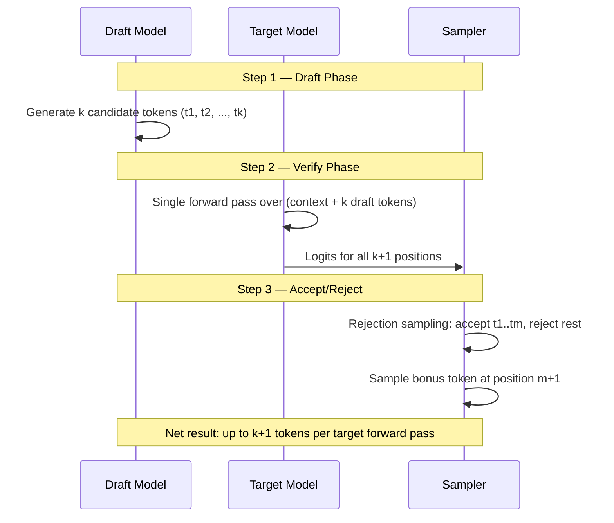
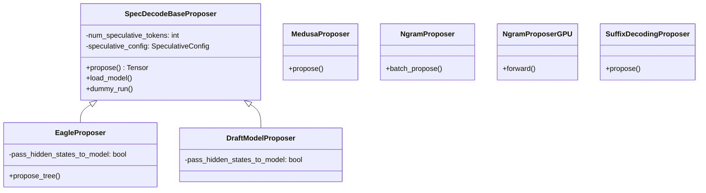

# Speculative Decoding

Speculative decoding is a technique that accelerates autoregressive language model inference by generating multiple candidate tokens in parallel and verifying them in a single forward pass of the target model. vLLM provides a rich ecosystem of speculative decoding methods, from lightweight n-gram lookup to sophisticated neural draft models.

## Overview

Standard autoregressive decoding generates one token per forward pass of the large target model. Speculative decoding breaks this bottleneck by using a cheaper **draft model** (or heuristic) to propose several candidate tokens at once, then running the expensive target model once to verify all of them simultaneously.



### Why It Works

The key insight is that the target model's forward pass over a sequence of length `n+k` is only marginally more expensive than a pass over length `n` — the compute is dominated by the attention over the KV cache, not the number of new query tokens. If the draft model's proposals are accepted with high probability, the effective throughput increases proportionally.

### Acceptance Rate and Speedup

The **acceptance rate** α is the probability that a single draft token is accepted by the target model's distribution. For a chain of `k` draft tokens, the expected number of accepted tokens is:

```
E[accepted] = Σ_{i=1}^{k} α^i = α(1 - α^k) / (1 - α)
```

Including the mandatory bonus token, the mean acceptance length (MAL) is:

```
MAL = 1 + E[accepted]
```

The theoretical speedup is approximately `MAL / (1 + draft_cost_ratio)`, where `draft_cost_ratio` is the relative cost of running the draft model compared to the target model. For very cheap drafters (n-gram, Medusa), the speedup approaches MAL directly.

## Available Methods

vLLM supports the following speculative decoding methods, configured via `SpeculativeConfig`:

| Method | Key | Draft Source | Best For |
|--------|-----|--------------|----------|
| [EAGLE / EAGLE-2 / EAGLE-3](eagle.md) | `eagle`, `eagle3` | Lightweight autoregressive draft model | General-purpose, highest acceptance rate |
| [Medusa](medusa.md) | `medusa` | Multiple parallel prediction heads | Low-latency, no KV cache overhead |
| [N-gram (CPU)](ngram.md) | `ngram` | Prompt lookup in token history | Repetitive text, code, RAG |
| [N-gram (GPU)](ngram.md) | `ngram_gpu` | GPU-accelerated prompt lookup | High-throughput n-gram |
| [Suffix Decoding](suffix-decoding.md) | `suffix` | Suffix tree over past responses | Repeated patterns, chat |
| [MTP (Multi-Token Prediction)](mtp.md) | `mtp` | Built-in MTP layers (DeepSeek, Ernie, etc.) | Models with native MTP support |
| Draft Model | `draft_model` | Separate smaller LLM | Maximum flexibility |

## Quick Start

### EAGLE Speculative Decoding

```python
from vllm import LLM

llm = LLM(
    model="meta-llama/Llama-3.1-8B-Instruct",
    speculative_config={
        "model": "yuhuili/EAGLE-LLaMA3.1-Instruct-8B",
        "num_speculative_tokens": 5,
    },
)
```

### N-gram Speculative Decoding

```python
llm = LLM(
    model="meta-llama/Llama-3.1-8B-Instruct",
    speculative_config={
        "method": "ngram",
        "num_speculative_tokens": 5,
        "prompt_lookup_max": 5,
    },
)
```

### MTP (DeepSeek-V3)

```python
llm = LLM(
    model="deepseek-ai/DeepSeek-V3",
    speculative_config={
        "method": "mtp",
        "num_speculative_tokens": 1,
    },
)
```

## Architecture

All speculative decoding in vLLM v1 is implemented in `vllm/v1/spec_decode/`. The proposer classes share a common interface:



## Configuration Reference

See [Configuration](configuration.md) for the full `SpeculativeConfig` reference.

## Metrics and Observability

See [Metrics](metrics.md) for acceptance rate tracking, Prometheus counters, and performance tuning guidance.

## Pages in This Section

- [EAGLE Speculative Decoding](eagle.md) — EAGLE, EAGLE-2, EAGLE-3, tree attention
- [Medusa](medusa.md) — Multiple decoding heads
- [N-gram Proposer](ngram.md) — CPU and GPU prompt lookup
- [Suffix Decoding](suffix-decoding.md) — Suffix tree-based speculation
- [MTP (Multi-Token Prediction)](mtp.md) — DeepSeek MTP, Ernie MTP
- [Metrics](metrics.md) — Acceptance rate, token budget, Prometheus
- [Configuration](configuration.md) — `SpeculativeConfig` reference

## Cross-References

- [SpeculativeConfig](../06-configuration/speculative-config.md) — full configuration reference
- [Engine & Scheduler: Sampling](../15-engine-scheduler/sampling.md) — how the sampler applies rejection sampling
- [Attention Backends: Tree Attention](../14-attention-backends/tree-attn.md) — tree attention for EAGLE
- [Supported Models](../04-models/supported-models.md) — models with native MTP support
- [Observability: Metrics](../11-observability/metrics.md) — speculative decoding Prometheus metrics
- [Benchmarking](../15-benchmarking/README.md) — measuring speculative decoding speedup
