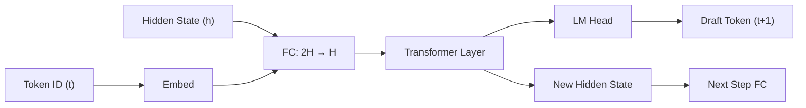
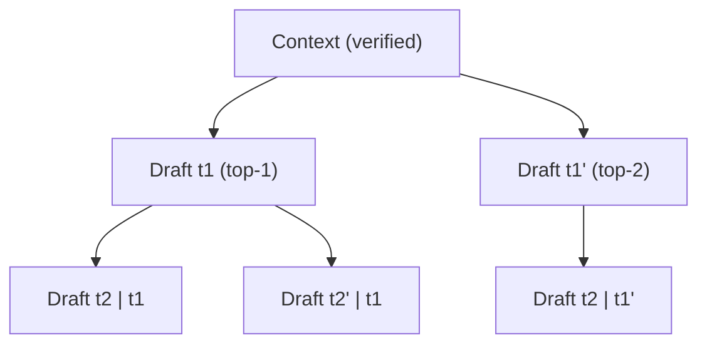

# EAGLE Speculative Decoding

EAGLE (Extrapolation Algorithm for Greater Language-model Efficiency) is vLLM's most capable speculative decoding method. It uses a lightweight autoregressive draft model that receives the target model's hidden states as input, enabling high acceptance rates with minimal overhead.

## Overview

EAGLE works by training a small draft model that takes the target model's hidden states as additional context. Because the draft model "sees" the same internal representations as the target model, it can predict the next tokens with much higher accuracy than a standalone smaller model.

vLLM supports three generations of EAGLE:

| Variant | Method Key | Architecture | Key Feature |
|---------|-----------|--------------|-------------|
| EAGLE | `eagle` | Single-layer transformer + FC projection | Concatenates token embeddings + hidden states |
| EAGLE-2 | `eagle` | Same as EAGLE | Dynamic draft length based on confidence |
| EAGLE-3 | `eagle3` | Multi-layer with auxiliary hidden states | Uses intermediate hidden states from multiple target layers |

## How EAGLE Works

### Draft Phase

The EAGLE draft model receives:
1. The last accepted token ID
2. The target model's hidden state at that position
3. Its own KV cache from previous draft steps

It concatenates the token embedding with the hidden state through a fully-connected projection layer, then runs a single transformer decoder layer to produce the next hidden state, from which it samples a draft token.



### Tree Attention

For `num_speculative_tokens > 1`, EAGLE uses **tree attention** to explore multiple draft paths simultaneously. Instead of a linear chain of draft tokens, it builds a tree where each node can have multiple children.

The tree structure is specified via `speculative_token_tree`, a list of tuples representing paths from the root:

```python
# Linear chain of 3 tokens (default)
speculative_token_tree = "[(0,), (0, 0), (0, 0, 0)]"

# Tree with branching at root (top-2 at first step, top-1 thereafter)
speculative_token_tree = "[(0,), (1,), (0, 0), (1, 0)]"
```

The tree attention mechanism allows the verifier to check all paths in a single forward pass using a custom causal mask that respects the tree structure.



### EAGLE-3 Auxiliary Hidden States

EAGLE-3 improves upon EAGLE by using hidden states from multiple intermediate layers of the target model, not just the final layer. This gives the draft model richer information about the target model's internal representations.

The layers used are specified in the draft model config via `eagle_aux_hidden_state_layer_ids`. The `Eagle3LlamaForCausalLM` model combines these auxiliary hidden states before passing them to the draft model:

```python
# From vllm/model_executor/models/llama_eagle3.py
# First layer uses 2*hidden_size (embeds + hidden_states concatenated)
# Subsequent layers use hidden_size (only hidden_states, no embeds)
qkv_input_size = 2 * self.hidden_size if layer_idx == 0 else self.hidden_size
```

## Implementation

### Core Classes

**`SpecDecodeBaseProposer`** (`vllm/v1/spec_decode/eagle.py`)

The base class for all model-based speculative decoders. It manages:
- Draft model loading and weight sharing with the target model
- KV cache management for draft tokens
- Tree attention metadata building
- CUDA graph dispatch for draft model execution
- Parallel drafting support

Key constructor parameters:
```python
class SpecDecodeBaseProposer:
    def __init__(
        self,
        vllm_config: VllmConfig,
        device: torch.device,
        pass_hidden_states_to_model: bool,  # True for EAGLE, False for draft_model
        runner=None,
    )
```

**`EagleProposer`** (`vllm/v1/spec_decode/eagle.py`, line 1688)

Extends `SpecDecodeBaseProposer` with `pass_hidden_states_to_model=True`. This is the class used for both `eagle` and `eagle3` methods.

### The `propose` Method

The main entry point for generating draft tokens:

```python
def propose(
    self,
    target_token_ids: torch.Tensor,      # [num_tokens]
    target_positions: torch.Tensor,       # [num_tokens] or [3, num_tokens] for M-RoPE
    target_hidden_states: torch.Tensor,   # [num_tokens, hidden_size]
    next_token_ids: torch.Tensor,         # [batch_size]
    token_indices_to_sample: torch.Tensor | None,
    common_attn_metadata: CommonAttentionMetadata,
    sampling_metadata: SamplingMetadata,
    ...
) -> torch.Tensor:
```

For EAGLE-3, the method first combines auxiliary hidden states:
```python
if self.method == "eagle3":
    assert isinstance(self.model, Eagle3LlamaForCausalLM)
    target_hidden_states = self.model.combine_hidden_states(target_hidden_states)
```

For `num_speculative_tokens == 1` or parallel drafting, it uses a simple greedy sample. For `num_speculative_tokens > 1`, it calls `propose_tree()`.

### Tree Proposal (`propose_tree`)

The `propose_tree` method implements multi-step tree-structured drafting:

1. **Level 0**: Sample top-k tokens from the first-pass logits (k = branching factor)
2. **Level 1..N**: For each node in the tree, run the draft model with tree attention metadata
3. **Collect**: Return all draft token IDs as a list of tensors, one per tree level

```python
def propose_tree(
    self,
    batch_size: int,
    logits: torch.Tensor,           # [num_tokens, vocab_size]
    positions: torch.Tensor,        # [num_tokens]
    hidden_states: torch.Tensor,    # [num_tokens, hidden_size]
    common_attn_metadata: CommonAttentionMetadata,
    ...
) -> list[torch.Tensor]:
```

### Weight Sharing

EAGLE draft models often share embedding weights with the target model to save memory. The `_maybe_share_embeddings` method detects whether the draft model has its own `embed_tokens` and, if not, shares the target model's:

```python
def _maybe_share_embeddings(self, target_language_model: nn.Module) -> None:
    # Shares embed_tokens if draft model has no own embeddings
    if hasattr(self.model, "has_own_embed_tokens"):
        if not self.model.has_own_embed_tokens:
            share_embeddings = True
```

Similarly, `_maybe_share_lm_head` shares the language model head when the draft model uses the same vocabulary.

## Supported Models

EAGLE draft models follow a naming convention: `Eagle{TargetArch}` for EAGLE and `Eagle3{TargetArch}` for EAGLE-3.

| Target Model | EAGLE Draft | EAGLE-3 Draft |
|-------------|-------------|---------------|
| Llama 3.1 8B | `yuhuili/EAGLE-LLaMA3.1-Instruct-8B` | `yuhuili/EAGLE3-LLaMA3.1-Instruct-8B` |
| Llama 3.3 70B | `yuhuili/EAGLE-LLaMA3.3-Instruct-70B` | `yuhuili/EAGLE3-LLaMA3.3-Instruct-70B` |
| DeepSeek | `vllm/deepseek_eagle` | — |
| Mistral Large 3 | `EagleMistralLarge3ForCausalLM` | — |
| Llama 4 | `llama4_eagle` | — |
| MiniCPM | `minicpm_eagle` | — |

The `EAGLEConfig` (`vllm/transformers_utils/configs/eagle.py`) automatically maps target model architectures to their EAGLE counterparts:

```python
# For method="eagle":
kwargs["architectures"] = [
    f"Eagle{arch}" if not arch.startswith("Eagle") else arch
    for arch in self.model.architectures
]

# For method="eagle3":
kwargs["architectures"] = [
    arch if arch.startswith("Eagle3") or arch.endswith("Eagle3")
    else f"Eagle3{arch}"
    for arch in self.model.architectures
]
```

## Configuration

```python
from vllm import LLM

# EAGLE with 5 speculative tokens
llm = LLM(
    model="meta-llama/Llama-3.1-8B-Instruct",
    speculative_config={
        "model": "yuhuili/EAGLE-LLaMA3.1-Instruct-8B",
        "num_speculative_tokens": 5,
    },
)

# EAGLE-3 with tree attention (branching factor 2 at root)
llm = LLM(
    model="meta-llama/Llama-3.1-8B-Instruct",
    speculative_config={
        "model": "yuhuili/EAGLE3-LLaMA3.1-Instruct-8B",
        "method": "eagle3",
        "num_speculative_tokens": 5,
        "speculative_token_tree": "[(0,), (1,), (0,0), (1,0), (0,0,0)]",
    },
)

# EAGLE with parallel drafting
llm = LLM(
    model="meta-llama/Llama-3.1-8B-Instruct",
    speculative_config={
        "model": "amd/PARD-Llama-3.2-1B",
        "num_speculative_tokens": 5,
        "parallel_drafting": True,
    },
)
```

### Parallel Drafting

When `parallel_drafting=True`, all speculative tokens are generated in a single draft model forward pass rather than sequentially. This requires a specially trained draft model that supports parallel token prediction (e.g., PARD models). The draft model config must have `pard_token` or `ptd_token_id` in its `config.json`.

### Disabling Padded Drafter Batch

By default, EAGLE pads the draft input batch to a uniform length. Set `disable_padded_drafter_batch=True` to allow variable-length batches (requires an attention backend that supports this):

```python
speculative_config={
    "model": "yuhuili/EAGLE-LLaMA3.1-Instruct-8B",
    "num_speculative_tokens": 5,
    "disable_padded_drafter_batch": True,
}
```

### Local Argmax Reduction

For tensor-parallel setups, `use_local_argmax_reduction=True` reduces communication overhead during draft token generation from O(vocab_size) to O(2 × tp_size) per token:

```python
speculative_config={
    "model": "yuhuili/EAGLE-LLaMA3.1-Instruct-8B",
    "num_speculative_tokens": 5,
    "use_local_argmax_reduction": True,
}
```

## Performance Tips

- **Tree attention** generally outperforms linear chains for the same number of speculative tokens, especially when the acceptance rate is moderate (α ≈ 0.6–0.8).
- **EAGLE-3** typically achieves higher acceptance rates than EAGLE-2 due to richer hidden state information.
- **Parallel drafting** reduces draft latency but may lower acceptance rates compared to autoregressive drafting.
- For **tensor-parallel** deployments, set `draft_tensor_parallel_size` to match the target model's TP size.

> **Note**: EAGLE with draft models or parallel drafting does not currently support multimodal models or M-RoPE. Use standard EAGLE (without parallel drafting) for multimodal targets.

## Related Pages

- [Overview](README.md) — Speculative decoding overview
- [Configuration](configuration.md) — Full `SpeculativeConfig` reference
- [Metrics](metrics.md) — Acceptance rate and performance metrics
- [MTP](mtp.md) — Multi-token prediction (DeepSeek, Ernie)
