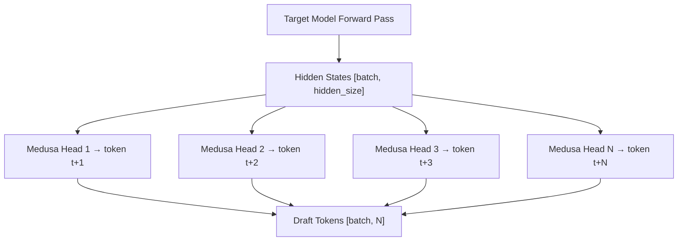

# Medusa Speculative Decoding

Medusa is a speculative decoding method that adds multiple lightweight prediction heads directly on top of the target model's hidden states. Unlike EAGLE, Medusa does not require a separate autoregressive draft model — all draft tokens are generated in a single parallel forward pass through the Medusa heads.

## Overview

Medusa was introduced in the paper [Medusa: Simple LLM Inference Acceleration Framework with Multiple Decoding Heads](https://arxiv.org/abs/2401.10774). The key idea is to attach `N` additional "Medusa heads" to the target model, where head `i` predicts the token at position `t+i+1` given the hidden state at position `t`.



Because all heads operate on the **same** hidden state in parallel, Medusa adds negligible latency to the target model's forward pass. The draft tokens are then verified by the target model using standard rejection sampling.

## Architecture

### Medusa Head Structure

Each Medusa head consists of a `ResidualBlock` followed by a language model head (`ParallelLMHead`):

```python
# From vllm/model_executor/models/medusa.py
class ResidualBlock(nn.Module):
    def __init__(self, config, hidden_size: int, num_layers: int):
        self.layers = nn.ModuleList([
            nn.Linear(hidden_size, hidden_size, bias=False)
            for _ in range(num_layers)
        ])
        self.act = nn.SiLU()

    def forward(self, x: torch.Tensor) -> torch.Tensor:
        for layer in self.layers:
            x = x + self.act(layer(x))  # Residual connection
        return x
```

The `Medusa` model class (`vllm/model_executor/models/medusa.py`) contains:
- `self.blocks`: `num_heads` `ResidualBlock` modules
- `self.lm_heads`: `num_heads` `ParallelLMHead` modules (or a shared head)

### Forward Pass

```python
# From vllm/model_executor/models/medusa.py
class Medusa(nn.Module):
    def forward(self, hidden_states: torch.Tensor) -> list[torch.Tensor]:
        # Each block processes the same hidden states independently
        return [block(hidden_states) for block in self.blocks]

    def compute_logits(
        self,
        hidden_states: list[torch.Tensor],
    ) -> list[torch.Tensor]:
        logits_lst = []
        for hs, lm_head in zip(hidden_states, self.lm_heads):
            _logits = self.logits_processor(lm_head, hs)
            logits_lst.append(_logits)
        return logits_lst
```

### MedusaProposer

The `MedusaProposer` class (`vllm/v1/spec_decode/medusa.py`) wraps the Medusa model and implements the proposer interface:

```python
class MedusaProposer:
    def propose(
        self,
        target_hidden_states: torch.Tensor,
        sampling_metadata: SamplingMetadata,
        slot_mappings=None,  # unused
    ) -> torch.Tensor:
        # Generate blocks and compute logits
        blocks = self.model(target_hidden_states)
        logits = self.model.compute_logits(blocks)

        # Compute argmax for each Medusa head and stack into a single tensor
        # Shape: [batch_size, num_heads]
        draft_tokens = torch.stack(
            [logit.argmax(dim=-1) for logit in logits], dim=1
        )
        return draft_tokens
```

The proposer takes the target model's hidden states directly — no separate model forward pass is needed. The draft tokens are the argmax predictions from each head.

### Model Loading

Medusa heads are loaded as a separate model alongside the target model:

```python
def load_model(self, target_model: nn.Module) -> None:
    with set_model_tag("medusa_head"):
        self.model = get_model(
            vllm_config=self.vllm_config,
            model_config=self.spec_config.draft_model_config,
        )
```

## Token Map Optimization

Medusa supports an optional **token map** that reduces the vocabulary size for draft token generation. By restricting the draft vocabulary to the most frequently used tokens, the LM head computation becomes cheaper without significantly affecting acceptance rates.

To use this feature:
1. Find the top-k most frequent tokens in your target dataset
2. Add a `token_map` tensor to the draft checkpoint
3. Set `truncated_vocab_size = k` in the draft model config

```python
# From vllm/model_executor/models/medusa.py
if self.token_map is None:
    logits_lst.append(_logits)
else:
    # Map truncated logits back to full vocabulary space
    full_logits = -torch.inf * torch.ones(
        size=(*_logits.shape[:-1], self.orig_vocab_size),
        device=_logits.device,
        dtype=_logits.dtype,
    )
    full_logits[..., self.token_map] = _logits
    logits_lst.append(full_logits)
```

## Configuration

### Basic Setup

```python
from vllm import LLM

llm = LLM(
    model="FasterDecoding/medusa-vicuna-7b-v1.3",
    speculative_config={
        "model": "FasterDecoding/medusa-vicuna-7b-v1.3",
        "num_speculative_tokens": 3,  # Number of Medusa heads to use
    },
)
```

> **Note**: For Medusa, the `model` in `speculative_config` points to the Medusa checkpoint, which contains both the base model weights and the Medusa head weights.

### Medusa Config Parameters

The Medusa model config (`vllm/transformers_utils/configs/medusa.py`) defines:

| Parameter | Description |
|-----------|-------------|
| `num_heads` | Number of Medusa heads (= max speculative tokens) |
| `num_hidden_layers` | Number of layers in each ResidualBlock |
| `hidden_size` | Hidden dimension (must match target model) |
| `vocab_size` | Full vocabulary size |
| `truncated_vocab_size` | Reduced vocabulary size (optional) |
| `medusa_fc_bias` | Whether to use bias in FC layers |
| `logit_scale` | Scale factor for logits |
| `original_lm_head` | Whether to use a single shared LM head |

### Specifying Number of Heads

The `num_speculative_tokens` parameter controls how many Medusa heads are used. It must be ≤ `num_heads` in the model config:

```python
speculative_config={
    "model": "path/to/medusa-checkpoint",
    "num_speculative_tokens": 3,  # Use first 3 heads
}
```

## Differences from EAGLE

| Feature | Medusa | EAGLE |
|---------|--------|-------|
| Draft model type | Parallel heads on target | Separate autoregressive model |
| KV cache for draft | Not needed | Required |
| Draft latency | ~0 (parallel with target) | Sequential forward passes |
| Acceptance rate | Moderate | High |
| Memory overhead | Low (head weights only) | Moderate (full draft model) |
| Tree attention | Not supported | Supported |
| Multimodal support | Yes | Limited |

## Limitations

- Medusa currently only supports **top-1 (argmax) sampling** for draft token generation. Stochastic sampling from Medusa head distributions is not yet implemented.
- Medusa does not support **tree attention** — draft tokens are always generated as a linear chain.
- EPLB (Expert Parallel Load Balancing) is not supported for Medusa models.

## Related Pages

- [Overview](README.md) — Speculative decoding overview
- [EAGLE](eagle.md) — EAGLE speculative decoding
- [Configuration](configuration.md) — Full `SpeculativeConfig` reference
- [Metrics](metrics.md) — Acceptance rate and performance metrics
