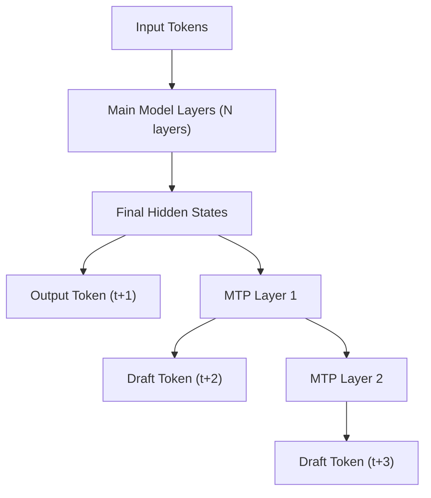

# Multi-Token Prediction (MTP)

Multi-Token Prediction (MTP) is a speculative decoding method where the draft model is built directly into the target model's architecture as additional "MTP layers." Unlike EAGLE or Medusa, MTP does not require a separate checkpoint — the draft capability is part of the same model weights.

## Overview

MTP was popularized by DeepSeek-V3, which includes dedicated `num_nextn_predict_layers` transformer layers at the end of the model specifically for predicting future tokens. These layers share the model's embedding table and use the final hidden states of the main model as input.



The MTP layers are lightweight transformer decoder layers that take:
1. The embedding of the previously predicted token
2. The hidden state from the main model (or previous MTP layer)

They produce a new hidden state from which the next draft token is sampled.

## Supported Models

vLLM supports MTP for a wide range of models. The `SpeculativeConfig` automatically detects and configures MTP when the target model has `num_nextn_predict_layers > 0`:

| Model Type | MTP Class | Notes |
|-----------|-----------|-------|
| DeepSeek-V3, DeepSeek-V3-0324 | `DeepSeekMTPModel` | Full MoE support |
| DeepSeek-V2 variants | `DeepSeekMTPModel` | |
| Ernie 4.5 MoE | `ErnieMTPModel` | Llama-based MTP layers |
| MiMo | `MiMoMTPModel` | |
| GLM-4 MoE | `Glm4MoeMTPModel` | |
| GLM-4 MoE Lite | `Glm4MoeLiteMTPModel` | |
| Nemotron-H | `NemotronHMTPModel` | |
| Qwen3-Next | `Qwen3NextMTP` | |
| Qwen3.5 | `Qwen3_5MTP`, `Qwen3_5MoeMTP` | |
| ExaOne MoE | `ExaoneMoeMTP` | |
| PanGu Ultra MoE | `OpenPanguMTPModel` | |
| Step-3.5 | `Step3p5MTP` | |

## DeepSeek MTP Implementation

### Architecture

The DeepSeek MTP implementation (`vllm/model_executor/models/deepseek_mtp.py`) consists of:

**`DeepSeekMultiTokenPredictorLayer`**: A single MTP layer containing:
- `enorm`: RMSNorm for the input embeddings
- `hnorm`: RMSNorm for the previous hidden states
- `eh_proj`: Linear projection from `2 × hidden_size` → `hidden_size`
- `mtp_block`: A full `DeepseekV2DecoderLayer` (with MLA attention and MoE FFN)
- `shared_head`: Shared LM head (RMSNorm + ParallelLMHead)

```python
# From vllm/model_executor/models/deepseek_mtp.py
class DeepSeekMultiTokenPredictorLayer(nn.Module):
    def forward(
        self,
        input_ids: torch.Tensor,
        positions: torch.Tensor,
        previous_hidden_states: torch.Tensor,
        inputs_embeds: torch.Tensor | None = None,
        spec_step_index: int = 0,
    ) -> torch.Tensor:
        # Mask position 0 inputs (not needed by MTP)
        inputs_embeds = torch.where(positions.unsqueeze(-1) == 0, 0, inputs_embeds)
        inputs_embeds = self.enorm(inputs_embeds)
        previous_hidden_states = self.hnorm(previous_hidden_states)

        # Concatenate embeddings and hidden states, then project
        hidden_states = self.eh_proj(
            torch.cat([inputs_embeds, previous_hidden_states], dim=-1)
        )

        # Run through the transformer decoder layer
        hidden_states, residual = self.mtp_block(
            positions=positions, hidden_states=hidden_states, residual=None
        )
        hidden_states = residual + hidden_states
        return hidden_states
```

**`DeepSeekMultiTokenPredictor`**: Container for all MTP layers:

```python
class DeepSeekMultiTokenPredictor(nn.Module):
    def __init__(self, *, vllm_config: VllmConfig, prefix: str = ""):
        config = vllm_config.model_config.hf_config
        self.mtp_start_layer_idx = config.num_hidden_layers
        self.num_mtp_layers = config.num_nextn_predict_layers

        self.layers = torch.nn.ModuleDict({
            str(idx): DeepSeekMultiTokenPredictorLayer(...)
            for idx in range(
                self.mtp_start_layer_idx,
                self.mtp_start_layer_idx + self.num_mtp_layers,
            )
        })
        self.embed_tokens = VocabParallelEmbedding(...)
        self.logits_processor = LogitsProcessor(config.vocab_size)
```

**`DeepSeekMTP`**: The top-level model class with `@support_torch_compile` decoration. It wraps `DeepSeekMultiTokenPredictor` and also implements `DeepseekV2MixtureOfExperts` for MoE expert management.

### Layer Reuse for Multiple Speculative Tokens

When `num_speculative_tokens > num_mtp_layers`, the MTP layers are reused cyclically:

```python
def forward(self, ..., spec_step_idx: int = 0) -> torch.Tensor:
    # Cycle through MTP layers
    current_step_idx = spec_step_idx % self.num_mtp_layers
    return self.layers[str(self.mtp_start_layer_idx + current_step_idx)](...)
```

> **Warning**: Using `num_speculative_tokens > num_mtp_layers` runs the same MTP layer multiple times, which may result in lower acceptance rates.

## Ernie MTP Implementation

The Ernie MTP implementation (`vllm/model_executor/models/ernie_mtp.py`) follows the same pattern as DeepSeek MTP but uses Llama-style decoder layers instead of DeepSeek's MLA attention:

```python
# From vllm/model_executor/models/ernie_mtp.py
class ErnieMultiTokenPredictorLayer(nn.Module):
    def __init__(self, vllm_config: VllmConfig, prefix: str):
        self.mtp_emb_norm = RMSNorm(config.hidden_size, eps=config.rms_norm_eps)
        self.mtp_hidden_norm = RMSNorm(config.hidden_size, eps=config.rms_norm_eps)
        self.mtp_linear_proj = nn.Linear(
            config.hidden_size * 2, config.hidden_size, bias=False
        )
        self.mtp_block = LlamaDecoderLayer(vllm_config, prefix)

    def forward(
        self,
        inputs_embeds: torch.Tensor,
        positions: torch.Tensor,
        previous_hidden_states: torch.Tensor,
        spec_step_index: int = 0,
    ) -> torch.Tensor:
        inputs_embeds[positions == 0] = 0  # Mask position 0
        inputs_embeds = self.mtp_emb_norm(inputs_embeds)
        previous_hidden_states = self.mtp_hidden_norm(previous_hidden_states)

        hidden_states = self.mtp_linear_proj(
            torch.cat([inputs_embeds, previous_hidden_states], dim=-1)
        )
        hidden_states, residual = self.mtp_block(
            positions=positions, hidden_states=hidden_states, residual=None
        )
        return residual + hidden_states
```

The key difference from DeepSeek MTP is the use of `LlamaDecoderLayer` instead of `DeepseekV2DecoderLayer`, making it suitable for Ernie's Llama-based architecture.

## Configuration

### Basic Setup

MTP is automatically detected when the target model has MTP layers. You only need to specify `method="mtp"` and `num_speculative_tokens`:

```python
from vllm import LLM

# DeepSeek-V3 with MTP
llm = LLM(
    model="deepseek-ai/DeepSeek-V3",
    speculative_config={
        "method": "mtp",
        "num_speculative_tokens": 1,
    },
)

# Ernie 4.5 MoE with MTP
llm = LLM(
    model="baidu/ERNIE-4.5-300B-A47B",
    speculative_config={
        "method": "mtp",
        "num_speculative_tokens": 1,
    },
)
```

### Auto-Detection

When you provide a model that has MTP layers (detected via `num_nextn_predict_layers` in the config), vLLM automatically sets `method="mtp"`:

```python
# Auto-detected as MTP
llm = LLM(
    model="deepseek-ai/DeepSeek-V3",
    speculative_config={
        "num_speculative_tokens": 1,
        # method is auto-detected as "mtp"
    },
)
```

### Configuration Parameters

| Parameter | Description |
|-----------|-------------|
| `method` | `"mtp"` (or auto-detected) |
| `num_speculative_tokens` | Number of draft tokens. Defaults to `num_nextn_predict_layers` from model config. Must be divisible by `num_nextn_predict_layers` if > 1. |
| `quantization` | Quantization method for MTP layers. Defaults to target model's quantization. |

### Quantization

MTP layers inherit the target model's quantization by default:

```python
# FP8 quantized DeepSeek-V3 with MTP
llm = LLM(
    model="deepseek-ai/DeepSeek-V3",
    quantization="fp8",
    speculative_config={
        "method": "mtp",
        "num_speculative_tokens": 1,
    },
)
```

## How MTP Differs from EAGLE

| Feature | MTP | EAGLE |
|---------|-----|-------|
| Draft model location | Built into target model | Separate checkpoint |
| Weight sharing | Full (same model file) | Embedding sharing only |
| Architecture | Target model's decoder layers | Lightweight custom layers |
| KV cache | Shared with target | Separate draft KV cache |
| Acceptance rate | High (same architecture) | High (trained on hidden states) |
| Memory overhead | Minimal | Moderate |
| Setup complexity | None (auto-detected) | Requires separate model |

## Model Config Override

The `SpeculativeConfig.hf_config_override` method handles the automatic conversion of target model configs to MTP configs:

```python
# From vllm/config/speculative.py
@staticmethod
def hf_config_override(hf_config: PretrainedConfig) -> PretrainedConfig:
    if hf_config.model_type in ("deepseek_v3", "deepseek_v32", "glm_moe_dsa"):
        hf_config.model_type = "deepseek_mtp"
    if hf_config.model_type == "deepseek_mtp":
        n_predict = getattr(hf_config, "num_nextn_predict_layers", None)
        hf_config.update({
            "n_predict": n_predict,
            "architectures": ["DeepSeekMTPModel"]
        })
    # ... similar for other model types
```

This override is applied when loading the draft model config, ensuring the correct MTP architecture class is used.

## Related Pages

- [Overview](README.md) — Speculative decoding overview
- [EAGLE](eagle.md) — EAGLE speculative decoding
- [Configuration](configuration.md) — Full `SpeculativeConfig` reference
- [Metrics](metrics.md) — Acceptance rate and performance metrics
