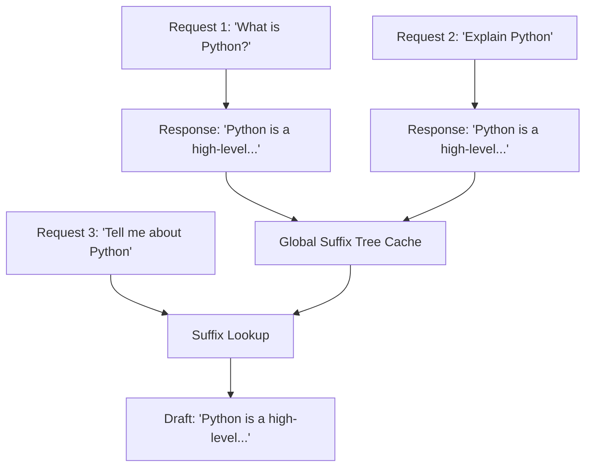
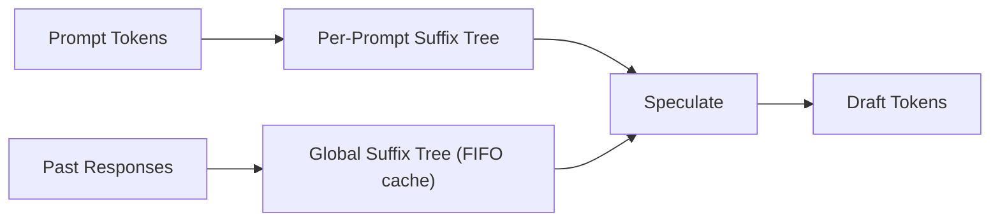

# Suffix Decoding

Suffix decoding is a speculative decoding method that builds a **suffix tree** over past request responses and uses it to propose draft tokens for new requests. Unlike n-gram decoding (which only looks at the current request's context), suffix decoding can leverage patterns from all previously served requests, making it particularly effective for applications with repeated or similar queries.

## Overview

Suffix decoding was introduced in the paper [Suffix Decoding: A Model-Free Approach to Speeding Up Large Language Model Inference](https://arxiv.org/pdf/2411.04975). The key insight is that in many production deployments, responses to similar queries share common token sequences. By caching these sequences in a suffix tree, the system can propose draft tokens based on what has been generated before.



## Architecture

### SuffixDecodingProposer

The `SuffixDecodingProposer` class (`vllm/v1/spec_decode/suffix_decoding.py`) wraps the `SuffixDecodingCache` from the `arctic_inference` library:

```python
class SuffixDecodingProposer:
    """
    Speculative decoding proposer for Suffix Decoding.
    Uses the official implementation from Arctic Inference
    (https://github.com/snowflakedb/ArcticInference).
    """

    def __init__(self, vllm_config: VllmConfig):
        from arctic_inference.suffix_decoding import SuffixDecodingCache

        self.suffix_cache = SuffixDecodingCache(
            max_tree_depth=config.suffix_decoding_max_tree_depth,
            max_cached_requests=config.suffix_decoding_max_cached_requests,
        )
```

> **Dependency**: Suffix decoding requires the `arctic_inference` package from Snowflake. Install it with `pip install arctic-inference`.

### Two-Level Caching

Suffix decoding maintains two types of suffix trees:

1. **Per-prompt suffix tree**: Built from the prompt tokens of the current request. This captures patterns within the prompt itself (similar to n-gram decoding).

2. **Global suffix tree**: Caches responses from all past requests. This is the key differentiator — it allows speculation based on what the model has generated for similar queries before.



### Request Lifecycle

The proposer manages the lifecycle of each request through the suffix cache:

```python
def propose(
    self,
    input_batch: InputBatch,
    sampled_token_ids: list[list[int]],
    ...
) -> list[list[int]]:
    for i, sampled_ids in enumerate(sampled_token_ids):
        req_id = input_batch.req_ids[i]

        if req_id not in self.suffix_cache.active_requests:
            # Start a new request: build per-prompt suffix tree
            prompt_token_ids = input_batch.token_ids_cpu[index, :num_prompt_tokens]
            self.suffix_cache.start_request(req_id, prompt_token_ids)

        # Append newly sampled tokens to the cache
        self.suffix_cache.add_active_response(req_id, sampled_ids)

        # Look up draft tokens using suffix matching
        pattern = input_batch.token_ids_cpu[i, start:num_tokens]
        draft = self.suffix_cache.speculate(
            req_id,
            pattern,
            max_spec_tokens=...,
            max_spec_factor=self.max_spec_factor,
            min_token_prob=self.min_token_prob,
        )
        draft_token_ids.append(draft.token_ids)

    # Stop requests no longer in the batch
    for req_id in (self.suffix_cache.active_requests - input_batch.req_id_to_index.keys()):
        self.suffix_cache.stop_request(req_id)
```

### Dynamic Speculation Length

Unlike other speculative decoding methods that always propose exactly `num_speculative_tokens` tokens, suffix decoding proposes a **dynamic** number of tokens based on the quality of the suffix match. The number of proposed tokens is controlled by:

```
max_spec_tokens = min(
    num_speculative_tokens,
    max_spec_factor × prefix_match_length
)
```

This means longer prefix matches lead to more aggressive speculation. A `max_spec_factor` of 1.0 means the speculation length equals the prefix match length.

### Probability Filtering

The `min_token_prob` parameter filters out low-confidence draft tokens. The suffix cache estimates token probabilities based on frequency counts in the cached responses. Only tokens with estimated probability ≥ `min_token_prob` are included in the draft.

## Configuration

### Basic Setup

```python
from vllm import LLM

llm = LLM(
    model="meta-llama/Llama-3.1-8B-Instruct",
    speculative_config={
        "method": "suffix",
        "num_speculative_tokens": 5,
    },
)
```

### Configuration Parameters

All suffix decoding parameters are part of `SpeculativeConfig`:

| Parameter | Type | Default | Description |
|-----------|------|---------|-------------|
| `method` | str | — | Must be `"suffix"` |
| `num_speculative_tokens` | int | — | Maximum number of draft tokens to propose |
| `suffix_decoding_max_tree_depth` | int | 24 | Maximum depth of suffix trees. Limits the sum of prefix match length and speculation length. |
| `suffix_decoding_max_cached_requests` | int | 10000 | Maximum number of past requests to cache in the global suffix tree. Eviction is FIFO. Set to 0 to disable global caching. |
| `suffix_decoding_max_spec_factor` | float | 1.0 | Controls speculation aggressiveness: `max_spec_tokens = max_spec_factor × prefix_match_length` |
| `suffix_decoding_min_token_prob` | float | 0.1 | Minimum estimated token probability to include in draft |

### Disabling Global Cache

To use only per-prompt suffix trees (no cross-request caching), set `suffix_decoding_max_cached_requests=0`:

```python
speculative_config={
    "method": "suffix",
    "num_speculative_tokens": 5,
    "suffix_decoding_max_cached_requests": 0,  # Disable global cache
}
```

### Tuning for Your Workload

```python
# Aggressive speculation for highly repetitive workloads
speculative_config={
    "method": "suffix",
    "num_speculative_tokens": 10,
    "suffix_decoding_max_tree_depth": 32,
    "suffix_decoding_max_cached_requests": 50000,
    "suffix_decoding_max_spec_factor": 2.0,
    "suffix_decoding_min_token_prob": 0.05,
}

# Conservative speculation for diverse workloads
speculative_config={
    "method": "suffix",
    "num_speculative_tokens": 3,
    "suffix_decoding_max_tree_depth": 16,
    "suffix_decoding_max_cached_requests": 5000,
    "suffix_decoding_max_spec_factor": 0.5,
    "suffix_decoding_min_token_prob": 0.3,
}
```

## When to Use Suffix Decoding

Suffix decoding is most effective for:

1. **Repeated queries**: FAQ bots, customer service, where similar questions get similar answers
2. **Template-based responses**: Applications where responses follow fixed patterns
3. **Code generation with common patterns**: Boilerplate code, standard library usage
4. **Long-running deployments**: The global cache improves over time as more responses are cached

It is less effective for:
- Highly diverse, creative generation tasks
- Cold-start scenarios (empty cache)
- Applications where each response is unique

## Comparison with N-gram Decoding

| Feature | N-gram | Suffix Decoding |
|---------|--------|-----------------|
| Cache scope | Current request only | All past requests + current |
| Memory | Minimal | Proportional to `max_cached_requests` |
| Cold start | Works immediately | Improves over time |
| Speculation length | Fixed `k` | Dynamic based on match quality |
| Probability filtering | No | Yes (`min_token_prob`) |
| External dependency | None | `arctic_inference` |

## Related Pages

- [Overview](README.md) — Speculative decoding overview
- [N-gram Proposer](ngram.md) — CPU and GPU prompt lookup
- [Configuration](configuration.md) — Full `SpeculativeConfig` reference
- [Metrics](metrics.md) — Acceptance rate and performance metrics
