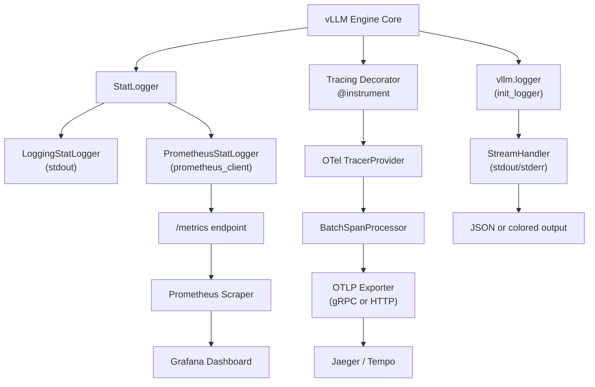

# Observability

vLLM provides a comprehensive observability stack covering Prometheus metrics, OpenTelemetry distributed tracing, and structured logging. This section documents every component so you can build production-grade monitoring dashboards, set up alerting, and trace requests end-to-end.

## What's Covered

| Topic | Description |
|-------|-------------|
| [Prometheus Metrics](metrics.md) | All metric names, types, labels, and bucket definitions |
| [FastAPI Instrumentator](instrumentator.md) | `prometheus-fastapi-instrumentator` integration and `/metrics` endpoint |
| [OpenTelemetry Tracing](tracing.md) | Span names, attributes, OTLP export, and context propagation |
| [Structured Logging](logging.md) | `vllm/logger.py`, JSON logging, log levels, and environment variables |
| [ObservabilityConfig](observability-config.md) | Full reference for `ObservabilityConfig` fields |
| [API Endpoints](endpoints.md) | `/metrics` and `/server_info` endpoint reference |

## Architecture Overview



## Quick Start

### Enable Prometheus Metrics

Prometheus metrics are enabled by default when you run `vllm serve`. Scrape the `/metrics` endpoint:

```bash
# Start vLLM
vllm serve meta-llama/Llama-3.1-8B-Instruct --port 8000

# Verify metrics are available
curl http://localhost:8000/metrics | head -40
```

### Enable OpenTelemetry Tracing

```bash
pip install opentelemetry-sdk opentelemetry-exporter-otlp

vllm serve meta-llama/Llama-3.1-8B-Instruct \
  --otlp-traces-endpoint http://localhost:4317 \
  --collect-detailed-traces model,worker
```

### Enable JSON Logging

```bash
# Create a logging config file
cat > /tmp/logging_config.json << 'EOF'
{
  "formatters": {
    "json": {
      "class": "pythonjsonlogger.jsonlogger.JsonFormatter"
    }
  },
  "handlers": {
    "console": {
      "class": "logging.StreamHandler",
      "formatter": "json",
      "level": "INFO",
      "stream": "ext://sys.stdout"
    }
  },
  "loggers": {
    "vllm": {
      "handlers": ["console"],
      "level": "INFO",
      "propagate": false
    }
  },
  "version": 1
}
EOF

VLLM_LOGGING_CONFIG_PATH=/tmp/logging_config.json \
  vllm serve meta-llama/Llama-3.1-8B-Instruct
```

## Key Metrics at a Glance

| Metric | Type | Description |
|--------|------|-------------|
| `vllm:num_requests_running` | Gauge | Requests currently in GPU batches |
| `vllm:num_requests_waiting` | Gauge | Requests queued for processing |
| `vllm:kv_cache_usage_perc` | Gauge | KV cache utilization (0–1) |
| `vllm:prompt_tokens_total` | Counter | Total prefill tokens processed |
| `vllm:generation_tokens_total` | Counter | Total generation tokens produced |
| `vllm:time_to_first_token_seconds` | Histogram | TTFT latency distribution |
| `vllm:e2e_request_latency_seconds` | Histogram | End-to-end request latency |
| `vllm:inter_token_latency_seconds` | Histogram | Inter-token latency (ITL) |

See [Prometheus Metrics](metrics.md) for the complete reference.

## Cross-References

- [ObservabilityConfig](../06-configuration/additional-configs.md) — configuration reference for observability settings
- [API Endpoints: /metrics](endpoints.md) — Prometheus scrape endpoint details
- [Deployment Guide](../15-deployment/README.md) — monitoring deployed instances
- [Benchmarking](../15-benchmarking/README.md) — using metrics to interpret benchmark results
- [Engine & Scheduler](../15-engine-scheduler/README.md) — scheduler-level metrics
- [Speculative Decoding: Metrics](../10-speculative-decoding/metrics.md) — speculative decoding acceptance rate metrics
