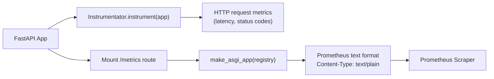

# FastAPI Instrumentator & `/metrics` Endpoint

vLLM uses [`prometheus-fastapi-instrumentator`](https://github.com/trallnag/prometheus-fastapi-instrumentator) to automatically instrument its FastAPI application with HTTP request metrics, and mounts a dedicated `/metrics` endpoint for Prometheus scraping.

## Architecture



## Integration Code

The integration is implemented in `vllm/entrypoints/serve/instrumentator/metrics.py`:

```python
from prometheus_fastapi_instrumentator import Instrumentator
from prometheus_client import make_asgi_app
from starlette.routing import Mount

def attach_router(app: FastAPI):
    """Mount prometheus metrics to a FastAPI app."""
    registry = get_prometheus_registry()

    Instrumentator(
        excluded_handlers=[
            "/metrics",
            "/health",
            "/load",
            "/ping",
            "/version",
            "/server_info",
        ],
        registry=registry,
    ).add().instrument(app).expose(app, response_class=PrometheusResponse)

    # Add prometheus asgi middleware to route /metrics requests
    metrics_route = Mount("/metrics", make_asgi_app(registry=registry))
    metrics_route.path_regex = re.compile("^/metrics(?P<path>.*)$")
    app.routes.append(metrics_route)
```

### Key Design Decisions

1. **Excluded handlers** — Health check endpoints (`/health`, `/load`, `/ping`, `/version`, `/server_info`) are excluded from HTTP instrumentation to avoid polluting latency histograms with fast, non-inference requests.

2. **Custom `PrometheusResponse`** — A custom response class sets the correct `Content-Type` header (`text/plain; version=0.0.4; charset=utf-8`) required by Prometheus. Without this, FastAPI would return `application/json`, which Prometheus cannot parse.

3. **Dual mounting** — The instrumentator's `.expose()` call registers a route, and an additional ASGI `Mount` is added to handle the `/metrics` path with a regex workaround to prevent 307 redirects.

4. **Registry selection** — The registry is chosen based on whether `PROMETHEUS_MULTIPROC_DIR` is set (multiprocess mode) or not (single-process mode).

## The `/metrics` Endpoint

### Endpoint Details

| Property | Value |
|----------|-------|
| Path | `GET /metrics` |
| Content-Type | `text/plain; version=0.0.4; charset=utf-8` |
| Authentication | None (unauthenticated by default) |
| Format | Prometheus text exposition format |

### Sample Output

```
# HELP vllm:num_requests_running Number of requests in model execution batches.
# TYPE vllm:num_requests_running gauge
vllm:num_requests_running{engine="0",model_name="meta-llama/Llama-3.1-8B-Instruct"} 4.0

# HELP vllm:num_requests_waiting Number of requests waiting to be processed.
# TYPE vllm:num_requests_waiting gauge
vllm:num_requests_waiting{engine="0",model_name="meta-llama/Llama-3.1-8B-Instruct"} 12.0

# HELP vllm:kv_cache_usage_perc KV-cache usage. 1 means 100 percent usage.
# TYPE vllm:kv_cache_usage_perc gauge
vllm:kv_cache_usage_perc{engine="0",model_name="meta-llama/Llama-3.1-8B-Instruct"} 0.42

# HELP vllm:prompt_tokens_total Number of prefill tokens processed.
# TYPE vllm:prompt_tokens_total counter
vllm:prompt_tokens_total{engine="0",model_name="meta-llama/Llama-3.1-8B-Instruct"} 1048576.0

# HELP vllm:time_to_first_token_seconds Histogram of time to first token in seconds.
# TYPE vllm:time_to_first_token_seconds histogram
vllm:time_to_first_token_seconds_bucket{engine="0",le="0.001",...} 0.0
vllm:time_to_first_token_seconds_bucket{engine="0",le="0.1",...} 1234.0
vllm:time_to_first_token_seconds_bucket{engine="0",le="+Inf",...} 5678.0
vllm:time_to_first_token_seconds_sum{...} 892.3
vllm:time_to_first_token_seconds_count{...} 5678.0
```

### Scraping Configuration

Add vLLM to your Prometheus `scrape_configs`:

```yaml
# prometheus.yml
scrape_configs:
  - job_name: 'vllm'
    static_configs:
      - targets: ['localhost:8000']
    metrics_path: '/metrics'
    scrape_interval: 15s
    scrape_timeout: 10s
```

For Kubernetes deployments, use pod annotations:

```yaml
# Kubernetes Pod annotations
annotations:
  prometheus.io/scrape: "true"
  prometheus.io/port: "8000"
  prometheus.io/path: "/metrics"
```

## HTTP Request Metrics (from Instrumentator)

The `prometheus-fastapi-instrumentator` automatically adds these metrics for all non-excluded endpoints:

| Metric | Type | Description |
|--------|------|-------------|
| `http_requests_total` | Counter | Total HTTP requests by method, handler, and status code |
| `http_request_duration_seconds` | Histogram | HTTP request duration in seconds |
| `http_request_size_bytes` | Histogram | HTTP request body size in bytes |
| `http_response_size_bytes` | Histogram | HTTP response body size in bytes |

These metrics are labeled with `method`, `handler`, and `status` labels.

## Multiprocess Mode

When running multiple API server workers (e.g., with `--api-server-count N`), vLLM automatically configures Prometheus multiprocess mode:

```python
# vllm/v1/metrics/prometheus.py
def get_prometheus_registry() -> CollectorRegistry:
    if os.getenv("PROMETHEUS_MULTIPROC_DIR") is not None:
        registry = CollectorRegistry()
        multiprocess.MultiProcessCollector(registry)
        return registry
    return REGISTRY
```

In multiprocess mode:
- Each worker process writes metrics to files in `PROMETHEUS_MULTIPROC_DIR`
- The `/metrics` endpoint aggregates metrics from all worker files using `MultiProcessCollector`
- Gauges use `multiprocess_mode="mostrecent"` to report the most recent value across workers
- Counters are summed across all workers

> **Important:** vLLM automatically creates and manages a temporary directory for `PROMETHEUS_MULTIPROC_DIR`. If you set this variable manually, you must clear the directory between vLLM restarts to avoid stale data.

## ORCA Load Reporting

vLLM also supports ORCA (Open Request Cost Aggregation) headers for load-aware routing. The `/load` endpoint and ORCA response headers expose key metrics to load balancers:

```python
# vllm/entrypoints/openai/orca_metrics.py
prometheus_to_orca_metrics = {
    "vllm:kv_cache_usage_perc": "kv_cache_usage_perc",
    "vllm:num_requests_waiting": "num_requests_waiting",
}
```

ORCA headers are added to inference responses in TEXT or JSON format:

```
# TEXT format
endpoint-load-metrics: TEXT named_metrics.kv_cache_usage_perc=0.42,named_metrics.num_requests_waiting=5.0

# JSON format
endpoint-load-metrics: JSON {"named_metrics": {"kv_cache_usage_perc": 0.42, "num_requests_waiting": 5.0}}
```

## Disabling Access Logs for `/metrics`

In production, the Prometheus scraper hits `/metrics` every 15–60 seconds, generating noisy access logs. Suppress these with:

```bash
vllm serve <model> \
  --disable-access-log-for-endpoints /health,/metrics,/ping
```

This uses exact path matching and only affects uvicorn access logs, not vLLM application logs.

## Related Pages

- [Prometheus Metrics Reference](metrics.md)
- [ObservabilityConfig Reference](observability-config.md)
- [API Endpoints](endpoints.md)
