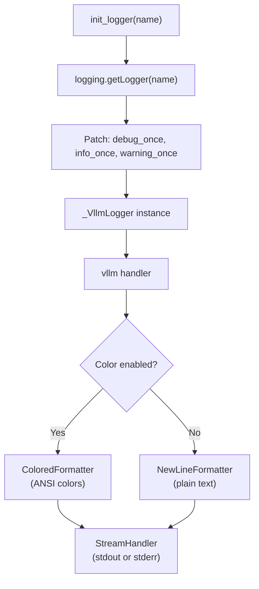

# Structured Logging

vLLM uses Python's standard `logging` module with a custom configuration system that supports colored terminal output, structured JSON logging, per-scope deduplication, and full customization via JSON config files.

## Logger Architecture



All vLLM loggers are children of the root `vllm` logger, which is configured once at module import time via `_configure_vllm_root_logger()`.

## Log Format

The default log format is:

```
{VLLM_LOGGING_PREFIX}{LEVEL} {TIMESTAMP} [{fileinfo}:{lineno}] {message}
```

Example output:

```
INFO 04-05 14:23:01 [engine/core.py:142] Engine initialized with model meta-llama/Llama-3.1-8B-Instruct
WARNING 04-05 14:23:05 [scheduler.py:89] KV cache usage is above 90%
```

In DEBUG mode, `fileinfo` shows a shortened relative path (e.g., `model_executor/.../quantization/awq.py`). In other modes, it shows just the filename.

## Environment Variables

| Variable | Default | Description |
|----------|---------|-------------|
| `VLLM_LOGGING_LEVEL` | `INFO` | Log level: `DEBUG`, `INFO`, `WARNING`, `ERROR`, `CRITICAL` |
| `VLLM_LOGGING_PREFIX` | `""` | String prepended to every log message |
| `VLLM_LOGGING_STREAM` | `ext://sys.stdout` | Output stream: `ext://sys.stdout` or `ext://sys.stderr` |
| `VLLM_LOGGING_CONFIG_PATH` | `None` | Path to a custom JSON logging config file |
| `VLLM_LOGGING_COLOR` | `auto` | Color mode: `auto`, `0` (off), `1` (on) |
| `VLLM_CONFIGURE_LOGGING` | `1` | Set to `0` to disable all vLLM logging configuration |
| `VLLM_LOG_STATS_INTERVAL` | `10.0` | Interval in seconds between stats log lines |
| `VLLM_LOG_BATCHSIZE_INTERVAL` | `-1` | Interval for batch size logging (`-1` = disabled) |

### Color Detection

When `VLLM_LOGGING_COLOR=auto` (default), color is enabled only when the output stream is a TTY:

```python
def _use_color() -> bool:
    if envs.NO_COLOR or envs.VLLM_LOGGING_COLOR == "0":
        return False
    if envs.VLLM_LOGGING_COLOR == "1":
        return True
    if envs.VLLM_LOGGING_STREAM == "ext://sys.stdout":
        return hasattr(sys.stdout, "isatty") and sys.stdout.isatty()
    elif envs.VLLM_LOGGING_STREAM == "ext://sys.stderr":
        return hasattr(sys.stderr, "isatty") and sys.stderr.isatty()
    return False
```

## The `init_logger` Function

Every vLLM module creates its logger using `init_logger`:

```python
# vllm/logger.py
from vllm.logger import init_logger

logger = init_logger(__name__)
```

`init_logger` retrieves the standard Python logger and patches three additional methods onto it:

| Method | Description |
|--------|-------------|
| `logger.debug_once(msg, *args)` | Log at DEBUG level, but only once per unique message |
| `logger.info_once(msg, *args)` | Log at INFO level, but only once per unique message |
| `logger.warning_once(msg, *args)` | Log at WARNING level, but only once per unique message |

The `_once` variants use `@lru_cache` to deduplicate messages, preventing log spam in hot paths.

## Log Scopes

The `_once` methods accept an optional `scope` parameter that controls which processes emit the log:

```python
logger.info_once("Model loaded", scope="global")   # Only rank 0 globally
logger.info_once("Worker ready", scope="local")    # Only local rank 0
logger.info_once("Request received", scope="process")  # Every process (default)
```

| Scope | Behavior |
|-------|----------|
| `process` | Always logs (default) |
| `global` | Only logs on the global first rank (rank 0 across all nodes) |
| `local` | Only logs on the local first rank (rank 0 on each node) |

This prevents duplicate log lines in tensor-parallel and pipeline-parallel deployments.

## Formatters

### `NewLineFormatter`

The default formatter (`vllm.logging_utils.NewLineFormatter`) aligns multi-line log messages by prepending the log prefix to each newline:

```python
class NewLineFormatter(logging.Formatter):
    def format(self, record):
        msg = super().format(record)
        if record.message != "":
            parts = msg.split(record.message)
            msg = msg.replace("\n", "\r\n" + parts[0])
        return msg
```

In DEBUG mode, it also shortens file paths for readability:
- `vllm/model_executor/layers/quantization/utils/fp8_utils.py` → `model_executor/.../quantization/utils/fp8_utils.py`

### `ColoredFormatter`

The `ColoredFormatter` extends `NewLineFormatter` with ANSI color codes:

| Level | Color |
|-------|-------|
| `DEBUG` | White (`\033[37m`) |
| `INFO` | Green (`\033[32m`) |
| `WARNING` | Yellow (`\033[33m`) |
| `ERROR` | Red (`\033[31m`) |
| `CRITICAL` | Magenta (`\033[35m`) |

Timestamps and file info are rendered in grey (`\033[90m`).

## Default Logging Configuration

The built-in configuration (applied when `VLLM_CONFIGURE_LOGGING=1`):

```python
DEFAULT_LOGGING_CONFIG = {
    "formatters": {
        "vllm": {
            "class": "vllm.logging_utils.NewLineFormatter",
            "datefmt": "%m-%d %H:%M:%S",
            "format": "{prefix}%(levelname)s %(asctime)s [%(fileinfo)s:%(lineno)d] %(message)s",
        },
        "vllm_color": {
            "class": "vllm.logging_utils.ColoredFormatter",
            "datefmt": "%m-%d %H:%M:%S",
            "format": "{prefix}%(levelname)s %(asctime)s [%(fileinfo)s:%(lineno)d] %(message)s",
        },
    },
    "handlers": {
        "vllm": {
            "class": "logging.StreamHandler",
            "formatter": "vllm_color",  # or "vllm" if no color
            "level": "INFO",
            "stream": "ext://sys.stdout",
        },
    },
    "loggers": {
        "vllm": {
            "handlers": ["vllm"],
            "level": "INFO",
            "propagate": False,
        },
    },
    "version": 1,
    "disable_existing_loggers": False,
}
```

## Custom Logging Configuration

### JSON Logging with `python-json-logger`

`python-json-logger` is included in vLLM's dependencies. To enable structured JSON output:

```json
{
  "formatters": {
    "json": {
      "class": "pythonjsonlogger.jsonlogger.JsonFormatter"
    }
  },
  "handlers": {
    "console": {
      "class": "logging.StreamHandler",
      "formatter": "json",
      "level": "INFO",
      "stream": "ext://sys.stdout"
    }
  },
  "loggers": {
    "vllm": {
      "handlers": ["console"],
      "level": "INFO",
      "propagate": false
    }
  },
  "version": 1
}
```

Save this as `/path/to/logging_config.json` and run:

```bash
VLLM_LOGGING_CONFIG_PATH=/path/to/logging_config.json \
  vllm serve meta-llama/Llama-3.1-8B-Instruct
```

JSON output example:

```json
{"message": "Engine initialized", "name": "vllm.engine.core", "levelname": "INFO", "asctime": "04-05 14:23:01"}
{"message": "Avg prompt throughput: 1234.5 tokens/s, Avg generation throughput: 567.8 tokens/s, Running: 4 reqs, Waiting: 0 reqs, GPU KV cache usage: 42.1%, Prefix cache hit rate: 78.3%", "name": "vllm.v1.metrics.loggers", "levelname": "INFO"}
```

### Silencing a Specific Logger

```json
{
  "formatters": {
    "vllm": {
      "class": "vllm.logging_utils.NewLineFormatter",
      "datefmt": "%m-%d %H:%M:%S",
      "format": "%(levelname)s %(asctime)s %(filename)s:%(lineno)d] %(message)s"
    }
  },
  "handlers": {
    "vllm": {
      "class": "logging.StreamHandler",
      "formatter": "vllm",
      "level": "INFO",
      "stream": "ext://sys.stdout"
    }
  },
  "loggers": {
    "vllm": {
      "handlers": ["vllm"],
      "level": "INFO",
      "propagate": false
    },
    "vllm.model_executor.layers.quantization": {
      "propagate": false
    }
  },
  "version": 1
}
```

### Disabling All vLLM Logging

```bash
VLLM_CONFIGURE_LOGGING=0 vllm serve meta-llama/Llama-3.1-8B-Instruct
```

## Stats Logging

The `LoggingStatLogger` emits periodic stats lines at the interval controlled by `VLLM_LOG_STATS_INTERVAL` (default: 10 seconds):

```
INFO 04-05 14:23:10 [loggers.py:210] Avg prompt throughput: 1234.5 tokens/s,
  Avg generation throughput: 567.8 tokens/s, Running: 4 reqs, Waiting: 0 reqs,
  GPU KV cache usage: 42.1%, Prefix cache hit rate: 78.3%
```

When the engine is idle (no throughput), the stats line is logged at DEBUG level to reduce noise.

Additional stats lines are appended when enabled:
- **Preemptions**: `Preemptions: N` (only when > 0)
- **External prefix cache**: `External prefix cache hit rate: X.X%` (when KV connector enabled)
- **Multi-modal cache**: `MM cache hit rate: X.X%` (when multimodal enabled)
- **Speculative decoding**: Mean acceptance length, acceptance rate, per-position rates
- **MFU metrics**: TFLOPS, memory bandwidth (when `--enable-mfu-metrics`)

## Access Log Filtering

In production, health check and metrics endpoints generate noisy access logs. Filter them:

```bash
vllm serve <model> \
  --disable-access-log-for-endpoints /health,/metrics,/ping,/load
```

| Endpoint | Typical Caller | Frequency |
|----------|---------------|-----------|
| `/health` | Kubernetes probes, load balancers | Every 5–30s |
| `/metrics` | Prometheus scraper | Every 15–60s |
| `/ping` | SageMaker infrastructure | Continuous |
| `/load` | Custom monitoring | Variable |

To disable all access logs:

```bash
vllm serve <model> --disable-uvicorn-access-log
```

## Function Call Tracing (Debug)

For debugging hangs or crashes, vLLM can trace every Python function call:

```python
from vllm.logger import enable_trace_function_call

enable_trace_function_call(
    log_file_path="/tmp/vllm_trace.log",
    root_dir=None,  # defaults to vllm root directory
)
```

> **Warning:** This is extremely verbose and will significantly slow down execution. Use only for debugging, never in production.

## Suppressing Logging Temporarily

```python
from vllm.logger import suppress_logging
import logging

with suppress_logging(level=logging.INFO):
    # INFO and below are suppressed in this block
    load_model()
```

## httpx Log Level

When `VLLM_LOGGING_LEVEL=INFO`, vLLM automatically sets `httpx` (used by Transformers for Hub access) to WARNING level to reduce noise:

```python
if envs.VLLM_LOGGING_LEVEL == "INFO":
    logging.getLogger("httpx").setLevel(logging.WARNING)
```

## Related Pages

- [ObservabilityConfig Reference](observability-config.md)
- [Prometheus Metrics Reference](metrics.md)
- [OpenTelemetry Tracing](tracing.md)
