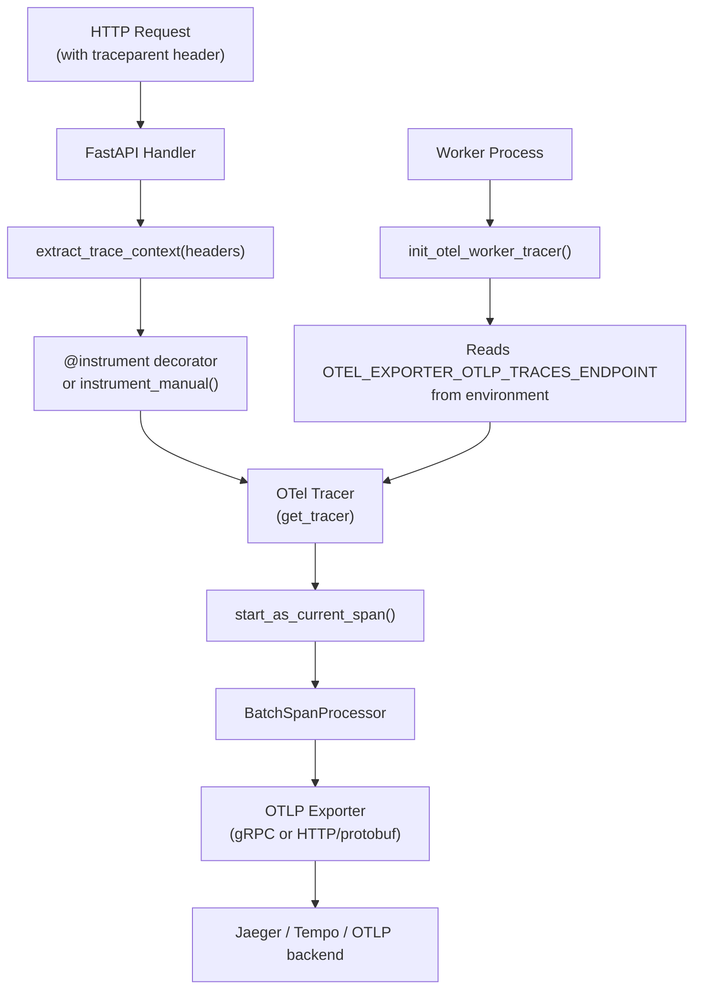
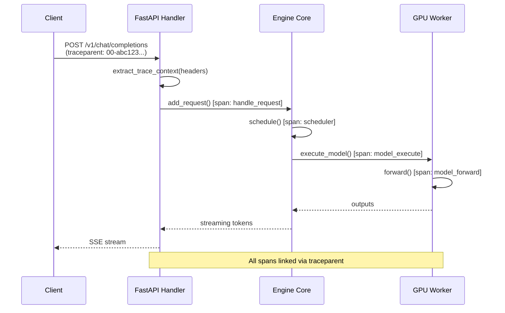

# OpenTelemetry Tracing

vLLM supports distributed tracing via OpenTelemetry (OTel), enabling end-to-end request tracing from the API server through the engine core and into model execution. Traces are exported via OTLP (OpenTelemetry Protocol) to any compatible backend such as Jaeger, Grafana Tempo, or Honeycomb.

## Architecture



## Installation

OpenTelemetry support requires additional packages:

```bash
pip install \
  opentelemetry-sdk \
  opentelemetry-exporter-otlp-proto-grpc \
  opentelemetry-exporter-otlp-proto-http
```

## Configuration

Enable tracing via `ObservabilityConfig` or CLI flags:

```bash
vllm serve meta-llama/Llama-3.1-8B-Instruct \
  --otlp-traces-endpoint http://localhost:4317 \
  --collect-detailed-traces model,worker
```

| CLI Flag | Description |
|----------|-------------|
| `--otlp-traces-endpoint` | OTLP endpoint URL (gRPC or HTTP) |
| `--collect-detailed-traces` | Modules to trace in detail: `model`, `worker`, or `all` |

## Tracer Initialization

### Main Process

The tracer is initialized in the main API server process via `init_tracer()`:

```python
# vllm/tracing/__init__.py
def init_tracer(
    instrumenting_module_name: str,
    otlp_traces_endpoint: str,
    extra_attributes: dict[str, str] | None = None,
):
    is_available, init_tracer_fn, _, _, _ = _REGISTERED_TRACING_BACKENDS["otel"]
    if is_available():
        return init_tracer_fn(
            instrumenting_module_name, otlp_traces_endpoint, extra_attributes
        )
```

The `init_otel_tracer()` function in `vllm/tracing/otel.py`:
1. Stores the endpoint in `OTEL_EXPORTER_OTLP_TRACES_ENDPOINT` so child processes inherit it
2. Creates an OTel `Resource` with `vllm.instrumenting_module_name` and `vllm.process_id` attributes
3. Instantiates a `TracerProvider` with a `BatchSpanProcessor`
4. Registers an `atexit` handler to flush and shut down the provider

### Worker Processes

Worker processes (e.g., tensor-parallel workers) initialize their own tracers via `maybe_init_worker_tracer()`:

```python
def init_otel_worker_tracer(
    instrumenting_module_name: str,
    process_kind: str,
    process_name: str,
) -> Tracer:
    otlp_endpoint = os.environ.get("OTEL_EXPORTER_OTLP_TRACES_ENDPOINT")
    if not otlp_endpoint:
        return None

    extra_attrs = {
        "vllm.process_kind": process_kind,
        "vllm.process_name": process_name,
    }
    return init_otel_tracer(instrumenting_module_name, otlp_endpoint, extra_attrs)
```

Worker tracers add `vllm.process_kind` and `vllm.process_name` resource attributes to distinguish spans from different workers.

## OTLP Export Protocol

The protocol is selected via the `OTEL_EXPORTER_OTLP_TRACES_PROTOCOL` environment variable:

| Value | Exporter | Default |
|-------|----------|---------|
| `grpc` | `OTLPSpanExporter` (gRPC, insecure) | ✅ Yes |
| `http/protobuf` | `OTLPSpanExporter` (HTTP) | No |

```python
# vllm/tracing/otel.py
def get_span_exporter(endpoint):
    protocol = os.environ.get(OTEL_EXPORTER_OTLP_TRACES_PROTOCOL, "grpc")
    if protocol == "grpc":
        exporter = OTLPGrpcExporter(endpoint=endpoint, insecure=True)
    elif protocol == "http/protobuf":
        exporter = OTLPHttpExporter(endpoint=endpoint)
    else:
        raise ValueError(f"Unsupported OTLP protocol '{protocol}' is configured")
    return exporter
```

## Instrumentation API

### `@instrument` Decorator

The `@instrument` decorator wraps both sync and async functions with OTel spans:

```python
from vllm.tracing import instrument

@instrument(span_name="my_operation", attributes={"component": "scheduler"})
async def schedule_requests(requests):
    ...

# Or use as a plain decorator (span name defaults to function qualname)
@instrument
def process_batch(batch):
    ...
```

The decorator automatically:
- Creates a span with the function's qualified name, module, file path, and line number as attributes
- Handles both sync and async functions
- Propagates the current trace context to the span
- Records exceptions if `record_exception=True` (default)

### `instrument_manual()` — Manual Spans with Explicit Timestamps

For cases where you need to record spans with pre-computed timestamps (e.g., model forward pass timing):

```python
from vllm.tracing import instrument_manual, SpanKind

instrument_manual(
    span_name="model_forward",
    start_time=start_ns,          # nanoseconds since epoch
    end_time=end_ns,              # nanoseconds since epoch
    attributes={
        "gen_ai.latency.time_in_model_forward": elapsed_ms,
    },
    context=parent_context,
    kind=SpanKind.INTERNAL,
)
```

## Span Attributes

### Standard GenAI Attributes (`SpanAttributes`)

Defined in `vllm/tracing/utils.py`, these follow OpenTelemetry Semantic Conventions for Generative AI:

| Attribute | Description |
|-----------|-------------|
| `gen_ai.usage.completion_tokens` | Number of completion tokens generated |
| `gen_ai.usage.prompt_tokens` | Number of prompt tokens processed |
| `gen_ai.request.max_tokens` | Maximum tokens requested |
| `gen_ai.request.top_p` | Top-p sampling parameter |
| `gen_ai.request.temperature` | Temperature sampling parameter |
| `gen_ai.response.model` | Model name used for the response |
| `gen_ai.request.id` | Unique request identifier |
| `gen_ai.request.n` | Number of completions requested |
| `gen_ai.usage.num_sequences` | Number of sequences generated |

### Latency Attributes

| Attribute | Description |
|-----------|-------------|
| `gen_ai.latency.time_in_queue` | Time spent waiting in the scheduler queue (ms) |
| `gen_ai.latency.time_to_first_token` | Time from request arrival to first token (ms) |
| `gen_ai.latency.e2e` | End-to-end request latency (ms) |
| `gen_ai.latency.time_in_scheduler` | Time spent in the scheduler (ms) |
| `gen_ai.latency.time_in_model_forward` | Time in model forward pass (ms) — requires `collect_detailed_traces: model` |
| `gen_ai.latency.time_in_model_execute` | Time in model execute (ms) — requires `collect_detailed_traces: worker` |
| `gen_ai.latency.time_in_model_prefill` | Time in prefill phase (ms) |
| `gen_ai.latency.time_in_model_decode` | Time in decode phase (ms) |
| `gen_ai.latency.time_in_model_inference` | Total model inference time (ms) |

### Code-Level Attributes (`LoadingSpanAttributes`)

Added automatically by the `@instrument` decorator:

| Attribute | Description |
|-----------|-------------|
| `code.namespace` | Python module name |
| `code.function` | Function qualified name |
| `code.filepath` | Source file path |
| `code.lineno` | Source line number |

### Resource Attributes

Set on the `TracerProvider` resource and visible on all spans:

| Attribute | Description |
|-----------|-------------|
| `vllm.instrumenting_module_name` | Module that initialized the tracer |
| `vllm.process_id` | OS process ID |
| `vllm.process_kind` | Worker process kind (worker processes only) |
| `vllm.process_name` | Worker process name (worker processes only) |

## Context Propagation

### W3C TraceContext Headers

vLLM uses the W3C TraceContext standard for context propagation. The standard headers are:

| Header | Description |
|--------|-------------|
| `traceparent` | Trace ID, span ID, and trace flags |
| `tracestate` | Vendor-specific trace state |

### Extracting Context from HTTP Requests

```python
from vllm.tracing import extract_trace_context, contains_trace_headers

# Check if request has trace context
if contains_trace_headers(request.headers):
    context = extract_trace_context(request.headers)
    # Use context when creating spans
```

### Propagating Context to Worker Processes

vLLM automatically propagates trace context to worker subprocesses via environment variables using the `propagate_trace_to_env()` context manager:

```python
# vllm/tracing/otel.py
@contextmanager
def propagate_trace_to_env():
    """Temporarily injects the current OTel context into os.environ."""
    original_state = {k: os.environ.get(k) for k in TRACE_HEADERS}
    try:
        inject(os.environ)  # writes 'traceparent' and 'tracestate'
        yield
    finally:
        # Restore original environment
        for key, original_value in original_state.items():
            if original_value is None:
                os.environ.pop(key, None)
            else:
                os.environ[key] = original_value
```

The `_get_smart_context()` function determines the parent context:
1. If a valid span is already active in the current process, use it as parent
2. Otherwise, extract context from `traceparent`/`tracestate` environment variables
3. Fall back to extracting from the full `os.environ` dictionary

## Detailed Trace Modules

The `--collect-detailed-traces` flag controls which modules emit detailed timing spans:

| Value | Effect |
|-------|--------|
| `model` | Collect `gen_ai.latency.time_in_model_forward` — traces the model forward pass |
| `worker` | Collect `gen_ai.latency.time_in_model_execute` — traces the worker execute call |
| `all` | Enable both `model` and `worker` tracing |

> **Performance Note:** Detailed tracing involves blocking operations and can impact throughput. Use only for debugging or profiling, not in production under load.

## Checking Tracing Availability

```python
from vllm.tracing import is_tracing_available, log_tracing_disabled_warning

if is_tracing_available():
    # Safe to use tracing APIs
    instrument_manual(...)
else:
    log_tracing_disabled_warning()  # Logs once, then silences
```

## Example: Jaeger Setup

```yaml
# docker-compose.yml
services:
  jaeger:
    image: jaegertracing/all-in-one:latest
    ports:
      - "4317:4317"   # OTLP gRPC
      - "16686:16686" # Jaeger UI
```

```bash
vllm serve meta-llama/Llama-3.1-8B-Instruct \
  --otlp-traces-endpoint http://localhost:4317 \
  --collect-detailed-traces all
```

Then open `http://localhost:16686` to view traces.

## Example: Grafana Tempo Setup

```yaml
# prometheus.yml — add remote_write for exemplars
remote_write:
  - url: http://tempo:9009/api/prom/push
```

```bash
# Start vLLM with Tempo endpoint
vllm serve meta-llama/Llama-3.1-8B-Instruct \
  --otlp-traces-endpoint http://tempo:4317
```

## Trace Flow for a Single Request



## Related Pages

- [ObservabilityConfig Reference](observability-config.md)
- [Prometheus Metrics Reference](metrics.md)
- [Structured Logging](logging.md)
