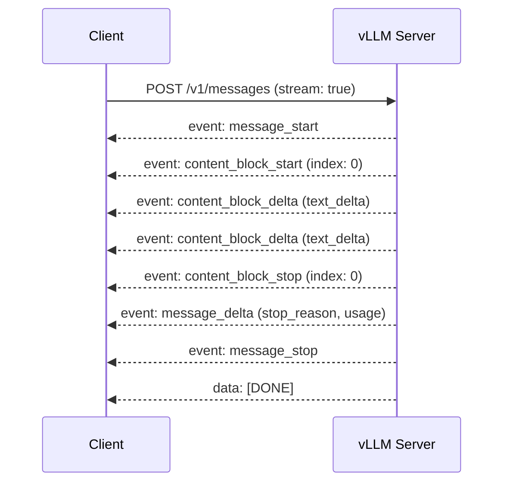

# Anthropic Messages API

vLLM provides a native implementation of the [Anthropic Messages API](https://docs.anthropic.com/en/api/messages), allowing you to use Anthropic-compatible clients against vLLM without modification. The implementation translates Anthropic request/response formats to vLLM's internal OpenAI-compatible pipeline.

## Endpoints

| Method | Path | Description |
|--------|------|-------------|
| `POST` | `/v1/messages` | Create a message (supports streaming) |
| `POST` | `/v1/messages/count_tokens` | Count tokens for a request without generating |

Source: `vllm/entrypoints/anthropic/api_router.py`, `vllm/entrypoints/anthropic/protocol.py`, `vllm/entrypoints/anthropic/serving.py`

---

## POST `/v1/messages`

Creates a message using the Anthropic Messages API format. Supports both synchronous and streaming responses.

### Request Body

```json
{
  "model": "meta-llama/Llama-3-8B-Instruct",
  "messages": [
    {
      "role": "user",
      "content": "Hello, how are you?"
    }
  ],
  "max_tokens": 1024,
  "stream": false,
  "temperature": 0.7,
  "top_p": 0.9,
  "top_k": 50,
  "system": "You are a helpful assistant.",
  "stop_sequences": ["Human:", "Assistant:"],
  "tools": [],
  "tool_choice": null
}
```

### Request Fields

| Field | Type | Required | Description |
|-------|------|----------|-------------|
| `model` | `string` | ✅ | Model identifier |
| `messages` | `list[AnthropicMessage]` | ✅ | Conversation history |
| `max_tokens` | `int` | ✅ | Maximum tokens to generate (must be > 0) |
| `stream` | `bool` | ❌ | Enable SSE streaming (default: `false`) |
| `system` | `string \| list[ContentBlock]` | ❌ | System prompt (string or content blocks) |
| `temperature` | `float` | ❌ | Sampling temperature |
| `top_p` | `float` | ❌ | Nucleus sampling probability |
| `top_k` | `int` | ❌ | Top-K sampling |
| `stop_sequences` | `list[string]` | ❌ | Stop sequences |
| `tools` | `list[AnthropicTool]` | ❌ | Tool definitions |
| `tool_choice` | `AnthropicToolChoice` | ❌ | Tool selection strategy |
| `metadata` | `dict` | ❌ | Request metadata (ignored by vLLM) |

### Message Format

Each message in the `messages` array has:

```json
{
  "role": "user",
  "content": "Hello!"
}
```

Or with structured content blocks:

```json
{
  "role": "user",
  "content": [
    {
      "type": "text",
      "text": "What is in this image?"
    },
    {
      "type": "image",
      "source": {
        "type": "base64",
        "media_type": "image/jpeg",
        "data": "<base64-encoded-image>"
      }
    }
  ]
}
```

#### Content Block Types

| Type | Description | Key Fields |
|------|-------------|------------|
| `text` | Plain text | `text` |
| `image` | Image (base64 or URL) | `source.type`, `source.data` / `source.url` |
| `tool_use` | Tool invocation | `id`, `name`, `input` |
| `tool_result` | Tool response | `tool_use_id`, `content`, `is_error` |
| `thinking` | Extended thinking block | `thinking`, `signature` |

### Tool Definition

```json
{
  "name": "get_weather",
  "description": "Get current weather for a location",
  "input_schema": {
    "type": "object",
    "properties": {
      "location": {"type": "string", "description": "City name"},
      "unit": {"type": "string", "enum": ["celsius", "fahrenheit"]}
    },
    "required": ["location"]
  }
}
```

### Tool Choice

```json
{
  "type": "auto"
}
```

| `type` | Description |
|--------|-------------|
| `auto` | Model decides whether to use tools |
| `any` | Model must use at least one tool |
| `tool` | Force a specific tool (requires `name`) |
| `none` | Disable tool use |

---

### Non-Streaming Response

```json
{
  "id": "msg_1234567890",
  "type": "message",
  "role": "assistant",
  "content": [
    {
      "type": "text",
      "text": "I'm doing well, thank you for asking!"
    }
  ],
  "model": "meta-llama/Llama-3-8B-Instruct",
  "stop_reason": "end_turn",
  "stop_sequence": null,
  "usage": {
    "input_tokens": 12,
    "output_tokens": 10
  }
}
```

#### Response Fields

| Field | Type | Description |
|-------|------|-------------|
| `id` | `string` | Unique message ID (`msg_<timestamp>`) |
| `type` | `"message"` | Always `"message"` |
| `role` | `"assistant"` | Always `"assistant"` |
| `content` | `list[ContentBlock]` | Generated content blocks |
| `model` | `string` | Model used |
| `stop_reason` | `string \| null` | Why generation stopped |
| `stop_sequence` | `string \| null` | Stop sequence that triggered stop |
| `usage` | `AnthropicUsage` | Token usage |

#### Stop Reasons

| Anthropic `stop_reason` | Maps from vLLM finish reason |
|------------------------|------------------------------|
| `end_turn` | `stop` |
| `max_tokens` | `length` |
| `tool_use` | `tool_calls` |
| `stop_sequence` | (stop sequence matched) |

---

### Streaming Response

When `stream: true`, the server returns Server-Sent Events (SSE). Each event has the format:

```
event: <event_type>
data: <json_payload>
```

#### Event Sequence



#### Event Types

| Event | Description |
|-------|-------------|
| `message_start` | Start of message with initial metadata |
| `content_block_start` | Start of a content block |
| `content_block_delta` | Incremental content update |
| `content_block_stop` | End of a content block |
| `message_delta` | Message-level delta (stop reason, usage) |
| `message_stop` | End of message |
| `ping` | Keep-alive ping |
| `error` | Error event |

#### Example Stream

```
event: message_start
data: {"type":"message_start","message":{"id":"msg_1234","type":"message","role":"assistant","content":[],"model":"meta-llama/Llama-3-8B-Instruct","stop_reason":null,"usage":{"input_tokens":12,"output_tokens":0}}}

event: content_block_start
data: {"type":"content_block_start","index":0,"content_block":{"type":"text","text":""}}

event: content_block_delta
data: {"type":"content_block_delta","index":0,"delta":{"type":"text_delta","text":"I'm doing"}}

event: content_block_delta
data: {"type":"content_block_delta","index":0,"delta":{"type":"text_delta","text":" well!"}}

event: content_block_stop
data: {"type":"content_block_stop","index":0}

event: message_delta
data: {"type":"message_delta","delta":{"stop_reason":"end_turn","stop_sequence":null},"usage":{"output_tokens":5}}

event: message_stop
data: {"type":"message_stop"}

data: [DONE]
```

#### Delta Types

| `delta.type` | Description |
|-------------|-------------|
| `text_delta` | Incremental text chunk (`delta.text`) |
| `input_json_delta` | Incremental tool input JSON (`delta.partial_json`) |
| `thinking_delta` | Incremental thinking text (`delta.thinking`) |
| `signature_delta` | Thinking signature (`delta.signature`) |

---

## POST `/v1/messages/count_tokens`

Counts the number of input tokens for a request without generating any output. Useful for pre-flight token budget checks.

### Request Body

```json
{
  "model": "meta-llama/Llama-3-8B-Instruct",
  "messages": [
    {"role": "user", "content": "Hello!"}
  ],
  "system": "You are a helpful assistant.",
  "tools": [],
  "tool_choice": null
}
```

| Field | Type | Required | Description |
|-------|------|----------|-------------|
| `model` | `string` | ✅ | Model identifier |
| `messages` | `list[AnthropicMessage]` | ✅ | Messages to count |
| `system` | `string \| list[ContentBlock]` | ❌ | System prompt |
| `tools` | `list[AnthropicTool]` | ❌ | Tool definitions |
| `tool_choice` | `AnthropicToolChoice` | ❌ | Tool choice |

### Response

```json
{
  "input_tokens": 42,
  "context_management": {
    "original_input_tokens": 42
  }
}
```

---

## Internal Translation

The Anthropic serving layer (`AnthropicServingMessages`) extends `OpenAIServingChat` and translates between formats:

```mermaid
graph LR
    A["Anthropic Request<br/>(AnthropicMessagesRequest)"] --> B["_convert_anthropic_to_openai_request()"]
    B --> C["ChatCompletionRequest<br/>(OpenAI format)"]
    C --> D["OpenAIServingChat.create_chat_completion()"]
    D --> E["vLLM Engine"]
    E --> F["ChatCompletionResponse"]
    F --> G["_convert_to_anthropic_response()"]
    G --> H["AnthropicMessagesResponse"]
```



Key translation steps:
- **System messages**: Anthropic `system` field → OpenAI `{"role": "system", ...}` message
- **Image sources**: Anthropic `base64` source → OpenAI `data:<media_type>;base64,<data>` URL
- **Tool use blocks**: Anthropic `tool_use` → OpenAI `tool_calls` array
- **Tool results**: Anthropic `tool_result` → OpenAI `tool` role messages
- **Thinking blocks**: Anthropic `thinking` → OpenAI `reasoning` field
- **Stop reasons**: vLLM `stop`/`length`/`tool_calls` → Anthropic `end_turn`/`max_tokens`/`tool_use`

---

## Error Responses

Errors are returned in Anthropic format:

```json
{
  "type": "error",
  "error": {
    "type": "invalid_request_error",
    "message": "max_tokens must be positive"
  }
}
```

| HTTP Status | Error Type |
|-------------|------------|
| 400 | `invalid_request_error` |
| 404 | `not_found_error` |
| 500 | `internal_error` |

---

## Usage Example

```python
import anthropic

client = anthropic.Anthropic(
    base_url="http://localhost:8000",
    api_key="your-api-key",  # or set ANTHROPIC_API_KEY
)

message = client.messages.create(
    model="meta-llama/Llama-3-8B-Instruct",
    max_tokens=1024,
    messages=[
        {"role": "user", "content": "Explain quantum entanglement briefly."}
    ]
)
print(message.content[0].text)
```

### Streaming Example

```python
with client.messages.stream(
    model="meta-llama/Llama-3-8B-Instruct",
    max_tokens=1024,
    messages=[{"role": "user", "content": "Tell me a story."}],
) as stream:
    for text in stream.text_stream:
        print(text, end="", flush=True)
```

> **Note**: The Anthropic Messages API is registered via `vllm/entrypoints/anthropic/api_router.py` and attached to the FastAPI app when the `generate` task is supported. The handler class `AnthropicServingMessages` inherits from `OpenAIServingChat`, reusing the full chat completion pipeline.
