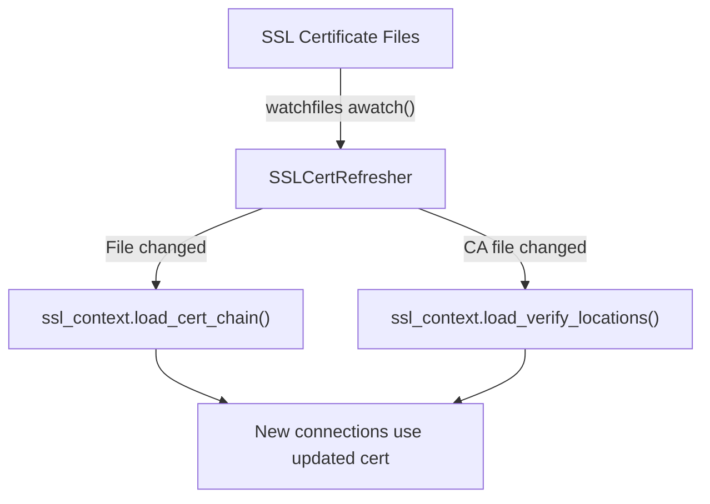

# Authentication, CORS, and SSL Configuration

vLLM's OpenAI-compatible server supports API key authentication, CORS (Cross-Origin Resource Sharing), and TLS/SSL termination. This page covers how to configure each of these security features.

**Source:** `vllm/entrypoints/openai/server_utils.py`, `vllm/entrypoints/ssl.py`, `vllm/entrypoints/openai/cli_args.py`

---

## Authentication

### API Key Authentication

vLLM implements Bearer token authentication via the `AuthenticationMiddleware` class in `vllm/entrypoints/openai/server_utils.py`.

#### How It Works

1. The server is started with one or more API keys via `--api-key` or the `VLLM_API_KEY` environment variable.
2. All requests to paths starting with `/v1` must include an `Authorization: Bearer <key>` header.
3. Paths outside `/v1` (e.g., `/health`, `/metrics`) are **not** protected.
4. `OPTIONS` requests (CORS preflight) are **not** authenticated.
5. Keys are compared using constant-time comparison (via `secrets.compare_digest`) to prevent timing attacks. Keys are stored as SHA-256 hashes in memory.

#### Configuration

```bash
# Single API key
vllm serve meta-llama/Llama-3.1-8B-Instruct \
  --api-key my-secret-key-123

# Multiple API keys (any one is accepted)
vllm serve meta-llama/Llama-3.1-8B-Instruct \
  --api-key key-for-app-1 \
  --api-key key-for-app-2

# Via environment variable
export VLLM_API_KEY=my-secret-key-123
vllm serve meta-llama/Llama-3.1-8B-Instruct
```

> **Note:** The `--api-key` CLI flag takes precedence over the `VLLM_API_KEY` environment variable.

#### Making Authenticated Requests

```bash
# Using curl
curl http://localhost:8000/v1/chat/completions \
  -H "Authorization: Bearer my-secret-key-123" \
  -H "Content-Type: application/json" \
  -d '{"model": "meta-llama/Llama-3.1-8B-Instruct", "messages": [{"role": "user", "content": "Hello"}]}'

# Using the OpenAI Python client
import openai
client = openai.OpenAI(
    base_url="http://localhost:8000/v1",
    api_key="my-secret-key-123"
)
```

#### Unauthorized Response

When authentication fails, the server returns:

```http
HTTP/1.1 401 Unauthorized
Content-Type: application/json

{"error": "Unauthorized"}
```

---

### Request ID Headers

Enable `X-Request-Id` headers for request tracing:

```bash
vllm serve meta-llama/Llama-3.1-8B-Instruct \
  --enable-request-id-headers
```

The `XRequestIdMiddleware` class in `server_utils.py` adds an `X-Request-Id` header to every response. If the client sends an `X-Request-Id` header in the request, the same value is echoed back; otherwise, a new UUID is generated.

---

## CORS Configuration

CORS is configured via FastAPI's `CORSMiddleware`. The following CLI flags control CORS behavior:

| Flag | Default | Description |
|------|---------|-------------|
| `--allowed-origins` | `["*"]` | JSON list of allowed origins. |
| `--allowed-methods` | `["*"]` | JSON list of allowed HTTP methods. |
| `--allowed-headers` | `["*"]` | JSON list of allowed HTTP headers. |
| `--allow-credentials` | `false` | Allow cookies and credentials in cross-origin requests. |

### Examples

#### Allow All Origins (Development)

```bash
vllm serve meta-llama/Llama-3.1-8B-Instruct \
  --allowed-origins '["*"]' \
  --allowed-methods '["*"]' \
  --allowed-headers '["*"]'
```

#### Restrict to Specific Origins (Production)

```bash
vllm serve meta-llama/Llama-3.1-8B-Instruct \
  --allowed-origins '["https://app.example.com", "https://admin.example.com"]' \
  --allowed-methods '["GET", "POST", "OPTIONS"]' \
  --allowed-headers '["Content-Type", "Authorization"]' \
  --allow-credentials
```

> **Warning:** Setting `--allow-credentials` with `--allowed-origins '["*"]'` is not allowed by the CORS specification. You must specify explicit origins when using credentials.

---

## SSL / TLS Configuration

vLLM supports HTTPS via SSL/TLS certificates. The server uses uvicorn's built-in SSL support.

### Basic SSL Setup

```bash
vllm serve meta-llama/Llama-3.1-8B-Instruct \
  --ssl-keyfile /etc/ssl/private/server.key \
  --ssl-certfile /etc/ssl/certs/server.crt \
  --port 443
```

### SSL Configuration Options

| Flag | Default | Description |
|------|---------|-------------|
| `--ssl-keyfile` | `null` | Path to the SSL private key file (PEM format). |
| `--ssl-certfile` | `null` | Path to the SSL certificate file (PEM format). |
| `--ssl-ca-certs` | `null` | Path to the CA certificates file for client certificate verification. |
| `--ssl-cert-reqs` | `0` | Client certificate requirement. Values from Python's `ssl` module: `0` = `CERT_NONE`, `1` = `CERT_OPTIONAL`, `2` = `CERT_REQUIRED`. |
| `--ssl-ciphers` | `null` | SSL cipher suites (TLS 1.2 and below only). Example: `'ECDHE-RSA-AES256-GCM-SHA384:ECDHE-RSA-CHACHA20-POLY1305'`. |
| `--enable-ssl-refresh` | `false` | Automatically reload SSL certificates when files change. |

### Mutual TLS (mTLS)

To require client certificates:

```bash
vllm serve meta-llama/Llama-3.1-8B-Instruct \
  --ssl-keyfile /etc/ssl/private/server.key \
  --ssl-certfile /etc/ssl/certs/server.crt \
  --ssl-ca-certs /etc/ssl/certs/ca.crt \
  --ssl-cert-reqs 2  # CERT_REQUIRED
```

### Automatic Certificate Refresh

The `SSLCertRefresher` class in `vllm/entrypoints/ssl.py` monitors certificate files using `watchfiles` and automatically reloads them when they change. This is useful for certificate rotation without server restarts.

```bash
vllm serve meta-llama/Llama-3.1-8B-Instruct \
  --ssl-keyfile /etc/ssl/private/server.key \
  --ssl-certfile /etc/ssl/certs/server.crt \
  --enable-ssl-refresh
```

When `--enable-ssl-refresh` is set:
- The server watches both the key file and certificate file for changes.
- On any change, it calls `ssl_context.load_cert_chain()` to reload the certificate chain.
- If a CA file is specified, it also watches for CA file changes and calls `ssl_context.load_verify_locations()`.



### Generating Self-Signed Certificates (Development)

```bash
# Generate a self-signed certificate for development
openssl req -x509 -newkey rsa:4096 -keyout server.key -out server.crt \
  -days 365 -nodes -subj '/CN=localhost'

vllm serve meta-llama/Llama-3.1-8B-Instruct \
  --ssl-keyfile server.key \
  --ssl-certfile server.crt
```

---

## Custom Middleware

You can add custom ASGI middleware to the server:

```bash
# Add a class-based middleware
vllm serve meta-llama/Llama-3.1-8B-Instruct \
  --middleware myapp.middleware.RateLimitMiddleware

# Add a function-based middleware
vllm serve meta-llama/Llama-3.1-8B-Instruct \
  --middleware myapp.middleware.log_request_middleware
```

The `--middleware` flag can be specified multiple times. Middleware is applied in the order specified.

**Class-based middleware** is added with `app.add_middleware(MiddlewareClass)`.
**Function-based middleware** (async functions) is added with `@app.middleware("http")`.

---

## Security Best Practices

1. **Always use API keys in production.** Set `--api-key` or `VLLM_API_KEY` to prevent unauthorized access.

2. **Use HTTPS in production.** Configure `--ssl-keyfile` and `--ssl-certfile` to encrypt traffic.

3. **Restrict CORS origins.** Replace `["*"]` with specific allowed origins in production.

4. **Use `--enable-ssl-refresh`** for zero-downtime certificate rotation.

5. **Use `--cache-salt`** in multi-tenant environments to prevent prefix cache attacks. Each tenant should use a unique, secret salt value.

6. **Disable FastAPI docs** in production to avoid exposing the API schema:
   ```bash
   vllm serve ... --disable-fastapi-docs
   ```

7. **Limit log verbosity** to avoid leaking sensitive prompt data:
   ```bash
   vllm serve ... --uvicorn-log-level warning --max-log-len 100
   ```

---

## Related Pages

- [CLI Arguments](cli-args.md) — Complete list of server flags
- [Error Handling](error-handling.md) — HTTP status codes including 401 Unauthorized
- [POST /v1/chat/completions](chat-completions.md) — Making authenticated API requests
