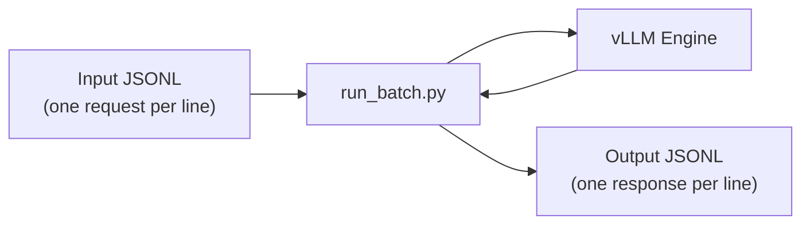

# Batch Inference

vLLM supports offline batch inference via `vllm/entrypoints/openai/run_batch.py`. This allows you to process large numbers of requests from a file without running a live HTTP server, making it ideal for bulk processing, evaluation pipelines, and cost-efficient offline workloads.

**Source:** `vllm/entrypoints/openai/run_batch.py`

---

## Overview

The batch runner reads requests from a JSONL (JSON Lines) input file, processes them using the vLLM engine, and writes results to an output JSONL file. Each line in the input file is an independent request; each line in the output file is the corresponding response.



---

## Supported Endpoints

The batch runner supports the following endpoint URLs in the input file:

| URL | Request Type | Description |
|-----|-------------|-------------|
| `/v1/chat/completions` | `ChatCompletionRequest` | Chat completions |
| `/v1/embeddings` | `EmbeddingRequest` | Text embeddings |
| `/v1/audio/transcriptions` | `BatchTranscriptionRequest` | Audio transcription |
| `/v1/audio/translations` | `BatchTranslationRequest` | Audio translation |
| `*/score` | `ScoreRequest` | Relevance scoring |
| `*/rerank` | `RerankRequest` | Document reranking |

---

## Input File Format

The input file is a JSONL file where each line is a `BatchRequestInput` object:

```json
{"custom_id": "request-1", "method": "POST", "url": "/v1/chat/completions", "body": {"model": "meta-llama/Llama-3.1-8B-Instruct", "messages": [{"role": "user", "content": "What is 2+2?"}], "max_completion_tokens": 50}}
{"custom_id": "request-2", "method": "POST", "url": "/v1/chat/completions", "body": {"model": "meta-llama/Llama-3.1-8B-Instruct", "messages": [{"role": "user", "content": "What is the capital of France?"}], "max_completion_tokens": 50}}
{"custom_id": "request-3", "method": "POST", "url": "/v1/chat/completions", "body": {"model": "meta-llama/Llama-3.1-8B-Instruct", "messages": [{"role": "system", "content": "You are a poet."}, {"role": "user", "content": "Write a haiku about rain."}], "temperature": 0.9}}
```

### BatchRequestInput Fields

| Field | Type | Description |
|-------|------|-------------|
| `custom_id` | `string` | **Required.** Developer-provided ID to match outputs to inputs. Must be unique within the batch. |
| `method` | `string` | HTTP method. Currently only `"POST"` is supported. |
| `url` | `string` | The API endpoint URL (e.g., `"/v1/chat/completions"`). |
| `body` | `object` | The request body. Schema depends on the `url` (see [Supported Endpoints](#supported-endpoints)). |

---

## Output File Format

The output file is a JSONL file where each line is a `BatchRequestOutput` object:

```json
{"id": "batch-abc123", "custom_id": "request-1", "response": {"status_code": 200, "request_id": "req-xyz", "body": {"id": "chatcmpl-...", "object": "chat.completion", "choices": [{"index": 0, "message": {"role": "assistant", "content": "4"}, "finish_reason": "stop"}], "usage": {"prompt_tokens": 10, "completion_tokens": 2, "total_tokens": 12}}}, "error": null}
{"id": "batch-def456", "custom_id": "request-2", "response": {"status_code": 200, "request_id": "req-uvw", "body": {"id": "chatcmpl-...", "object": "chat.completion", "choices": [{"index": 0, "message": {"role": "assistant", "content": "Paris"}, "finish_reason": "stop"}], "usage": {"prompt_tokens": 12, "completion_tokens": 1, "total_tokens": 13}}}, "error": null}
```

### BatchRequestOutput Fields

| Field | Type | Description |
|-------|------|-------------|
| `id` | `string` | Unique batch output ID. |
| `custom_id` | `string` | The `custom_id` from the corresponding input request. |
| `response` | `object \| null` | The response data (see below). `null` if the request failed with a non-HTTP error. |
| `response.status_code` | `int` | HTTP status code (e.g., `200`, `400`, `500`). |
| `response.request_id` | `string` | Internal request ID. |
| `response.body` | `object \| null` | The response body (e.g., `ChatCompletionResponse`). |
| `error` | `object \| null` | Error information for non-HTTP failures. |

---

## Running Batch Inference

### Command Line

```bash
python -m vllm.entrypoints.openai.run_batch \
  --model meta-llama/Llama-3.1-8B-Instruct \
  -i input.jsonl \
  -o output.jsonl
```

### CLI Arguments

The batch runner accepts all standard engine arguments plus these batch-specific flags:

| Flag | Short | Default | Description |
|------|-------|---------|-------------|
| `--input-file` | `-i` | **required** | Path or URL to the input JSONL file. Supports local paths and `http://`/`https://` URLs. |
| `--output-file` | `-o` | **required** | Path or URL to the output JSONL file. Supports local paths and `http://`/`https://` URLs. |
| `--output-tmp-dir` | | `null` | Temporary directory for output before uploading to a URL. |
| `--enable-metrics` | | `false` | Enable Prometheus metrics server. |
| `--host` | | `null` | Host for the Prometheus metrics server (requires `--enable-metrics`). |
| `--port` | | `8000` | Port for the Prometheus metrics server (requires `--enable-metrics`). |

All [engine arguments](cli-args.md#engine-arguments) (e.g., `--tensor-parallel-size`, `--dtype`, `--gpu-memory-utilization`) are also supported.

### Examples

#### Basic Batch Processing

```bash
python -m vllm.entrypoints.openai.run_batch \
  --model meta-llama/Llama-3.1-8B-Instruct \
  --dtype bfloat16 \
  --max-model-len 4096 \
  -i /data/requests.jsonl \
  -o /data/responses.jsonl
```

#### With Tensor Parallelism

```bash
python -m vllm.entrypoints.openai.run_batch \
  --model meta-llama/Llama-3.1-70B-Instruct \
  --tensor-parallel-size 4 \
  --gpu-memory-utilization 0.95 \
  -i requests.jsonl \
  -o responses.jsonl
```

#### From Remote URL

```bash
python -m vllm.entrypoints.openai.run_batch \
  --model meta-llama/Llama-3.1-8B-Instruct \
  -i https://storage.example.com/batch/requests.jsonl \
  -o https://storage.example.com/batch/responses.jsonl
```

#### With Prometheus Metrics

```bash
python -m vllm.entrypoints.openai.run_batch \
  --model meta-llama/Llama-3.1-8B-Instruct \
  --enable-metrics \
  --host 0.0.0.0 \
  --port 9090 \
  -i requests.jsonl \
  -o responses.jsonl
```

---

## Audio Transcription in Batch Mode

For audio transcription, use `BatchTranscriptionRequest` which replaces the `file` field with `file_url`:

```json
{"custom_id": "audio-1", "method": "POST", "url": "/v1/audio/transcriptions", "body": {"model": "openai/whisper-large-v3", "file_url": "https://example.com/audio.mp3", "response_format": "json"}}
{"custom_id": "audio-2", "method": "POST", "url": "/v1/audio/transcriptions", "body": {"model": "openai/whisper-large-v3", "file_url": "data:audio/wav;base64,UklGRiQAAABXQVZFZm10...", "language": "fr"}}
```

The `file_url` field accepts:
- HTTP/HTTPS URLs to audio files
- Data URLs with base64-encoded audio (`data:audio/{format};base64,{data}`)

---

## Generating Input Files

### Python Helper

```python
import json

requests = [
    {
        "custom_id": f"req-{i}",
        "method": "POST",
        "url": "/v1/chat/completions",
        "body": {
            "model": "meta-llama/Llama-3.1-8B-Instruct",
            "messages": [
                {"role": "user", "content": f"Question {i}: What is {i} + {i}?"}
            ],
            "max_completion_tokens": 50,
            "temperature": 0.0
        }
    }
    for i in range(100)
]

with open("requests.jsonl", "w") as f:
    for req in requests:
        f.write(json.dumps(req) + "\n")
```

### Reading Output Files

```python
import json

results = {}
with open("responses.jsonl") as f:
    for line in f:
        output = json.loads(line)
        custom_id = output["custom_id"]
        if output["response"] and output["response"]["status_code"] == 200:
            body = output["response"]["body"]
            text = body["choices"][0]["message"]["content"]
            results[custom_id] = text
        else:
            results[custom_id] = f"ERROR: {output['error']}"

for req_id, text in results.items():
    print(f"{req_id}: {text}")
```

---

## Progress Tracking

The batch runner displays a progress bar during processing:

```
Processing: 100% Completed | 1000/1000 [02:34<00:00, 6.49 requests/s]
```

Progress tracking is automatically disabled in distributed environments (Ray, multiprocessing) to avoid output corruption.

---

## Error Handling

Failed requests are recorded in the output file with non-200 status codes or error information:

```json
{
  "id": "batch-err123",
  "custom_id": "request-bad",
  "response": {
    "status_code": 400,
    "request_id": "req-abc",
    "body": null
  },
  "error": {
    "message": "Invalid request: max_completion_tokens must be positive",
    "type": "Bad Request",
    "code": 400
  }
}
```

Unsupported endpoint URLs produce an error response:

```json
{
  "error": {
    "message": "URL /v1/unknown was used. Supported endpoints: /v1/chat/completions, /v1/embeddings, /v1/audio/transcriptions, /v1/audio/translations, /score, /rerank.",
    "type": "Bad Request",
    "code": 400
  }
}
```

---

## Related Pages

- [POST /v1/chat/completions](chat-completions.md) — Chat completions request schema
- [POST /v1/audio/transcriptions](audio-transcriptions.md) — Audio transcription request schema
- [CLI Arguments](cli-args.md) — Engine and server configuration flags
- [Error Handling](error-handling.md) — HTTP status codes and error formats
