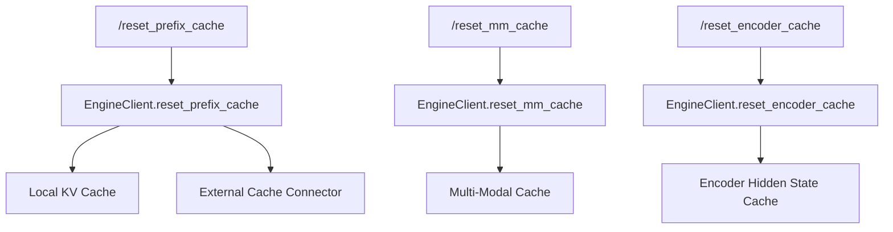

# Cache Management

vLLM provides HTTP endpoints to reset various caches at runtime. These endpoints are useful for development, testing, and scenarios where cache invalidation is required (e.g., after model weight updates or when debugging prefix cache behavior).

Source: `vllm/entrypoints/serve/cache/api_router.py`

## Availability

Cache management endpoints are only available when the server is running in **development mode**:

```bash
VLLM_SERVER_DEV_MODE=true vllm serve meta-llama/Llama-3-8B-Instruct
```

If `VLLM_SERVER_DEV_MODE` is not set, these endpoints are not registered and return 404.

---

## Endpoints

| Method | Path | Description |
|--------|------|-------------|
| `POST` | `/reset_prefix_cache` | Reset the KV prefix cache |
| `POST` | `/reset_mm_cache` | Reset the multi-modal (image/audio) cache |
| `POST` | `/reset_encoder_cache` | Reset the encoder cache |

---

## POST `/reset_prefix_cache`

Resets the local KV prefix cache. Optionally also resets the external (connector-managed) prefix cache.

### Query Parameters

| Parameter | Type | Default | Description |
|-----------|------|---------|-------------|
| `reset_running_requests` | `bool` | `false` | Also reset cache for currently running requests |
| `reset_external` | `bool` | `false` | Also reset the external connector-managed cache |

### Examples

```bash
# Reset local prefix cache only
curl -X POST http://localhost:8000/reset_prefix_cache

# Reset local + external prefix cache
curl -X POST "http://localhost:8000/reset_prefix_cache?reset_external=true"

# Reset including running requests
curl -X POST "http://localhost:8000/reset_prefix_cache?reset_running_requests=true&reset_external=true"
```

### Response

- **200 OK** — Cache reset initiated (empty body)

> **Note**: The API server does not verify whether the cache was successfully reset. The reset command is sent to the engine asynchronously.

---

## POST `/reset_mm_cache`

Resets the multi-modal cache, which stores processed image, audio, and video inputs. This is useful when:
- Testing multi-modal inputs with the same prompts
- Debugging multi-modal preprocessing issues
- Freeing memory used by cached media inputs

### Example

```bash
curl -X POST http://localhost:8000/reset_mm_cache
```

### Response

- **200 OK** — Cache reset initiated (empty body)

> **Note**: The multi-modal cache is also automatically reset during server startup via `async_llm.reset_mm_cache()` in `build_async_engine_client_from_engine_args()`.

---

## POST `/reset_encoder_cache`

Resets the encoder cache used by encoder-decoder models (e.g., T5, BART). This cache stores encoder hidden states that can be reused across multiple decoder steps.

### Example

```bash
curl -X POST http://localhost:8000/reset_encoder_cache
```

### Response

- **200 OK** — Cache reset initiated (empty body)

---

## Use Cases

### Development and Testing

When running experiments that require deterministic behavior without prefix cache hits:

```python
import requests

# Reset all caches before each test
requests.post("http://localhost:8000/reset_prefix_cache")
requests.post("http://localhost:8000/reset_mm_cache")

# Now run your test
response = requests.post(
    "http://localhost:8000/v1/chat/completions",
    json={
        "model": "meta-llama/Llama-3-8B-Instruct",
        "messages": [{"role": "user", "content": "Hello!"}],
    }
)
```

### After Weight Updates (RLHF)

When using the RLHF weight update endpoints, reset the prefix cache to ensure the new weights are used for all subsequent requests:

```python
# Update model weights
requests.post("http://localhost:8000/update_weights", json={"update_info": {...}})

# Reset prefix cache to invalidate stale cached KV states
requests.post("http://localhost:8000/reset_prefix_cache?reset_running_requests=true")

# Resume generation
requests.post("http://localhost:8000/resume")
```

### External Cache Connectors

When using an external KV cache connector (e.g., Redis, distributed cache), use `reset_external=true` to also clear the remote cache:

```bash
curl -X POST "http://localhost:8000/reset_prefix_cache?reset_external=true"
```

---

## Cache Architecture



> **Warning**: These endpoints are intended for development use only. Resetting caches in production will cause cache misses and increased latency for subsequent requests. Always use `VLLM_SERVER_DEV_MODE=true` to enable them.
