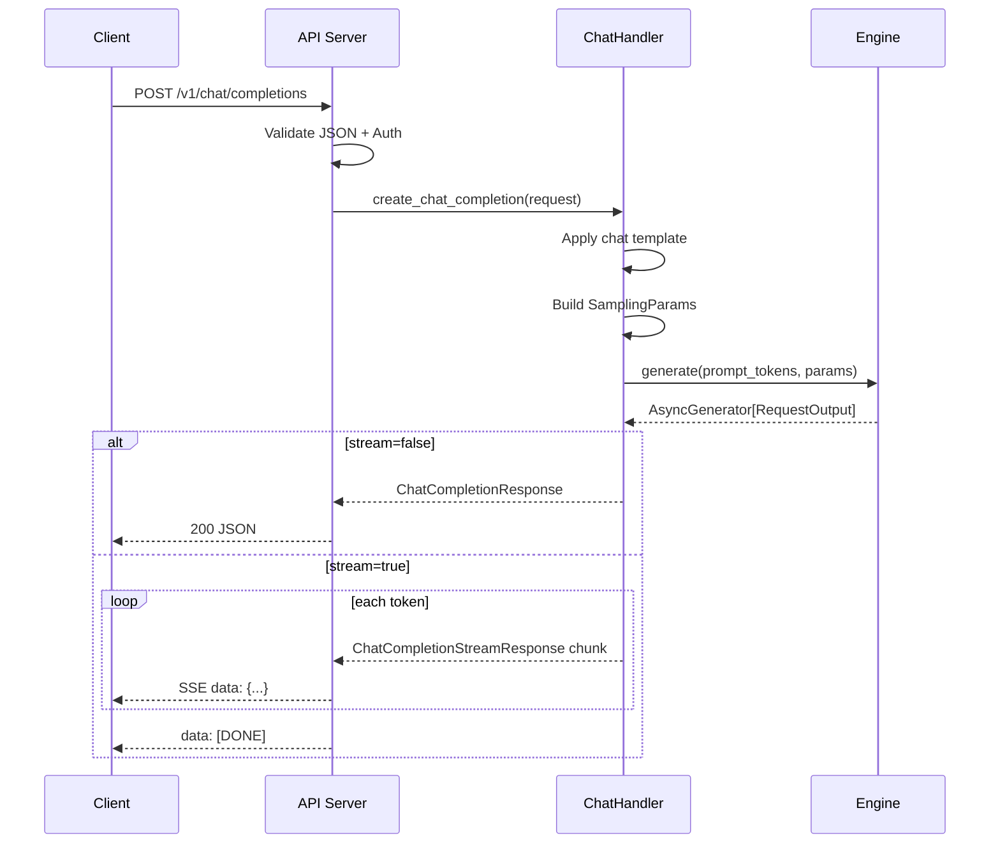

# POST /v1/chat/completions

The Chat Completions endpoint is vLLM's primary inference API. It is fully compatible with the OpenAI Chat Completions API and supports text generation, streaming, tool/function calling, vision (multimodal) inputs, and structured outputs.

**Source:** `vllm/entrypoints/openai/chat_completion/`

---

## Endpoint

```
POST /v1/chat/completions
```

Content-Type: `application/json`

---

## Request Schema

The request body is defined in `vllm/entrypoints/openai/chat_completion/protocol.py` as `ChatCompletionRequest`.

### Core OpenAI-Compatible Fields

| Field | Type | Default | Description |
|-------|------|---------|-------------|
| `messages` | `array` | **required** | List of messages in the conversation. Each message has `role` (`system`, `user`, `assistant`, `tool`) and `content`. |
| `model` | `string \| null` | `null` | Model name to use. If `null`, uses the server's default model. |
| `frequency_penalty` | `float \| null` | `0.0` | Penalizes tokens based on their frequency in the output so far. Range: `-2.0` to `2.0`. |
| `logit_bias` | `object \| null` | `null` | Map of token IDs to bias values (`-100` to `100`). |
| `logprobs` | `bool \| null` | `false` | Whether to return log probabilities of output tokens. |
| `top_logprobs` | `int \| null` | `0` | Number of top log-probability tokens to return per position (requires `logprobs=true`). |
| `max_tokens` | `int \| null` | `null` | *Deprecated.* Use `max_completion_tokens` instead. |
| `max_completion_tokens` | `int \| null` | `null` | Maximum number of tokens to generate. |
| `n` | `int \| null` | `1` | Number of completions to generate per request. |
| `presence_penalty` | `float \| null` | `0.0` | Penalizes tokens that have appeared at all in the output. Range: `-2.0` to `2.0`. |
| `response_format` | `object \| null` | `null` | Output format. Supports `{"type": "text"}`, `{"type": "json_object"}`, `{"type": "json_schema", "json_schema": {...}}`, and `{"type": "structural_tag", ...}`. |
| `seed` | `int \| null` | `null` | Random seed for reproducibility. |
| `stop` | `string \| array \| null` | `[]` | Stop sequences. Generation halts when any of these strings is produced. |
| `stream` | `bool \| null` | `false` | If `true`, stream partial results as Server-Sent Events. |
| `stream_options` | `object \| null` | `null` | Options for streaming. See [Stream Options](#stream-options). |
| `temperature` | `float \| null` | `null` | Sampling temperature. Higher values = more random. |
| `top_p` | `float \| null` | `null` | Nucleus sampling probability threshold. |
| `tools` | `array \| null` | `null` | List of tool definitions available to the model. |
| `tool_choice` | `string \| object \| null` | `"none"` | Controls tool use: `"none"`, `"auto"`, `"required"`, or a specific tool `{"type": "function", "function": {"name": "..."}}`. |
| `reasoning_effort` | `string \| null` | `null` | For reasoning models: `"low"`, `"medium"`, or `"high"`. |
| `include_reasoning` | `bool` | `true` | Whether to include reasoning tokens in the response. |
| `parallel_tool_calls` | `bool \| null` | `true` | Whether to allow parallel tool calls. |
| `user` | `string \| null` | `null` | User identifier (ignored by vLLM). |

### vLLM Sampling Extensions

These fields extend the standard OpenAI API with additional sampling controls:

| Field | Type | Default | Description |
|-------|------|---------|-------------|
| `use_beam_search` | `bool` | `false` | Use beam search instead of sampling. |
| `top_k` | `int \| null` | `null` | Top-K sampling: keep only the K most probable tokens. |
| `min_p` | `float \| null` | `null` | Minimum probability threshold for token sampling. |
| `repetition_penalty` | `float \| null` | `null` | Penalizes repeated tokens. Values > 1.0 discourage repetition. |
| `length_penalty` | `float` | `1.0` | Exponential penalty for sequence length (beam search only). |
| `stop_token_ids` | `array \| null` | `[]` | List of token IDs that stop generation. |
| `include_stop_str_in_output` | `bool` | `false` | Whether to include the stop string in the output. |
| `ignore_eos` | `bool` | `false` | Continue generating past the EOS token. |
| `min_tokens` | `int` | `0` | Minimum number of tokens to generate before stopping. |
| `skip_special_tokens` | `bool` | `true` | Skip special tokens in the decoded output. |
| `spaces_between_special_tokens` | `bool` | `true` | Add spaces between special tokens. |
| `truncate_prompt_tokens` | `int \| null` | `null` | Truncate prompt to this many tokens. `-1` means keep the last N tokens. |
| `prompt_logprobs` | `int \| null` | `null` | Return log probabilities for the prompt tokens. |
| `allowed_token_ids` | `array \| null` | `null` | Restrict generation to only these token IDs. |
| `bad_words` | `array` | `[]` | Words to prevent from appearing in the output. |

### vLLM Extra Parameters

| Field | Type | Default | Description |
|-------|------|---------|-------------|
| `echo` | `bool` | `false` | Prepend the last message if it has the same role as the new message. |
| `add_generation_prompt` | `bool` | `true` | Add the generation prompt from the chat template. |
| `continue_final_message` | `bool` | `false` | Continue the final message instead of starting a new one. Cannot be used with `add_generation_prompt`. |
| `add_special_tokens` | `bool` | `false` | Add BOS/EOS tokens on top of what the chat template adds. |
| `documents` | `array \| null` | `null` | RAG documents accessible to the model. Each should have `"title"` and `"text"` keys. |
| `chat_template` | `string \| null` | `null` | Custom Jinja2 chat template. Requires `trust_request_chat_template=true` on the server. |
| `chat_template_kwargs` | `object \| null` | `null` | Extra keyword arguments passed to the chat template renderer. |
| `mm_processor_kwargs` | `object \| null` | `null` | Extra kwargs for the HuggingFace multimodal processor. |
| `priority` | `int` | `0` | Request priority (lower = higher priority). Requires priority scheduling. |
| `request_id` | `string` | auto-generated | Custom request ID for tracing. |
| `cache_salt` | `string \| null` | `null` | Salt for prefix cache isolation in multi-tenant environments. |
| `structured_outputs` | `object \| null` | `null` | Additional structured output parameters. |
| `logits_processors` | `array \| null` | `null` | Custom logits processors (requires `--logits-processor-pattern` on server). |
| `return_tokens_as_token_ids` | `bool \| null` | `null` | Represent tokens as `"token_id:{id}"` strings in logprobs. |
| `return_token_ids` | `bool \| null` | `null` | Include token IDs alongside generated text. |
| `kv_transfer_params` | `object \| null` | `null` | KV-cache transfer parameters for disaggregated serving. |
| `vllm_xargs` | `object \| null` | `null` | Custom extension parameters (string/numeric values). |

### Stream Options

When `stream=true`, you can pass `stream_options`:

| Field | Type | Default | Description |
|-------|------|---------|-------------|
| `include_usage` | `bool \| null` | `true` | Include usage statistics in the final chunk. |
| `continuous_usage_stats` | `bool \| null` | `false` | Include usage stats in every chunk. |

---

## Response Schema

### Non-Streaming Response

```json
{
  "id": "chatcmpl-abc123",
  "object": "chat.completion",
  "created": 1714000000,
  "model": "meta-llama/Llama-3.1-8B-Instruct",
  "choices": [
    {
      "index": 0,
      "message": {
        "role": "assistant",
        "content": "The capital of France is Paris.",
        "tool_calls": [],
        "reasoning": null
      },
      "logprobs": null,
      "finish_reason": "stop",
      "stop_reason": null,
      "token_ids": null
    }
  ],
  "usage": {
    "prompt_tokens": 15,
    "completion_tokens": 9,
    "total_tokens": 24,
    "prompt_tokens_details": {
      "cached_tokens": 0
    }
  },
  "system_fingerprint": null,
  "prompt_logprobs": null,
  "prompt_token_ids": null,
  "kv_transfer_params": null
}
```

### Streaming Response (SSE)

When `stream=true`, the server returns a stream of `text/event-stream` events:

```
data: {"id":"chatcmpl-abc123","object":"chat.completion.chunk","created":1714000000,"model":"meta-llama/Llama-3.1-8B-Instruct","choices":[{"index":0,"delta":{"role":"assistant","content":"The"},"finish_reason":null}]}

data: {"id":"chatcmpl-abc123","object":"chat.completion.chunk","created":1714000000,"model":"meta-llama/Llama-3.1-8B-Instruct","choices":[{"index":0,"delta":{"content":" capital"},"finish_reason":null}]}

data: {"id":"chatcmpl-abc123","object":"chat.completion.chunk","created":1714000000,"model":"meta-llama/Llama-3.1-8B-Instruct","choices":[{"index":0,"delta":{},"finish_reason":"stop"}],"usage":{"prompt_tokens":15,"completion_tokens":9,"total_tokens":24}}

data: [DONE]
```

### Response Fields

| Field | Type | Description |
|-------|------|-------------|
| `id` | `string` | Unique completion ID (format: `chatcmpl-{uuid}`). |
| `object` | `string` | Always `"chat.completion"` (or `"chat.completion.chunk"` for streaming). |
| `created` | `int` | Unix timestamp of creation. |
| `model` | `string` | Model name used for generation. |
| `choices` | `array` | List of completion choices. |
| `choices[].index` | `int` | Choice index. |
| `choices[].message` | `object` | The generated message (non-streaming). |
| `choices[].delta` | `object` | The incremental message delta (streaming). |
| `choices[].finish_reason` | `string \| null` | Why generation stopped: `"stop"`, `"length"`, `"tool_calls"`, `"content_filter"`. |
| `choices[].stop_reason` | `int \| string \| null` | The specific stop string or token ID that triggered stopping. |
| `choices[].token_ids` | `array \| null` | Token IDs of the generated text (if `return_token_ids=true`). |
| `usage` | `object` | Token usage statistics. |
| `prompt_logprobs` | `array \| null` | Log probabilities for prompt tokens (if requested). |
| `prompt_token_ids` | `array \| null` | Token IDs of the prompt (if `return_token_ids=true`). |
| `kv_transfer_params` | `object \| null` | KV-cache transfer parameters (disaggregated serving). |

---

## Examples

### Basic Chat Completion

```python
import openai

client = openai.OpenAI(base_url="http://localhost:8000/v1", api_key="token-abc123")

response = client.chat.completions.create(
    model="meta-llama/Llama-3.1-8B-Instruct",
    messages=[
        {"role": "system", "content": "You are a helpful assistant."},
        {"role": "user", "content": "What is the capital of France?"}
    ],
    temperature=0.7,
    max_completion_tokens=100
)
print(response.choices[0].message.content)
```

### Streaming

```python
stream = client.chat.completions.create(
    model="meta-llama/Llama-3.1-8B-Instruct",
    messages=[{"role": "user", "content": "Tell me a short story."}],
    stream=True,
    stream_options={"include_usage": True}
)

for chunk in stream:
    if chunk.choices[0].delta.content:
        print(chunk.choices[0].delta.content, end="", flush=True)
```

### Tool / Function Calling

```python
tools = [
    {
        "type": "function",
        "function": {
            "name": "get_weather",
            "description": "Get the current weather for a location",
            "parameters": {
                "type": "object",
                "properties": {
                    "location": {"type": "string", "description": "City name"},
                    "unit": {"type": "string", "enum": ["celsius", "fahrenheit"]}
                },
                "required": ["location"]
            }
        }
    }
]

response = client.chat.completions.create(
    model="meta-llama/Llama-3.1-8B-Instruct",
    messages=[{"role": "user", "content": "What's the weather in Paris?"}],
    tools=tools,
    tool_choice="auto"
)

# Check if the model called a tool
if response.choices[0].finish_reason == "tool_calls":
    tool_call = response.choices[0].message.tool_calls[0]
    print(f"Tool: {tool_call.function.name}")
    print(f"Args: {tool_call.function.arguments}")
```

> **Note:** Tool calling requires `--enable-auto-tool-choice` and `--tool-call-parser` flags when starting the server. See [CLI Arguments](cli-args.md) for details.

### Vision (Multimodal) Input

```python
response = client.chat.completions.create(
    model="Qwen/Qwen2-VL-7B-Instruct",
    messages=[
        {
            "role": "user",
            "content": [
                {
                    "type": "image_url",
                    "image_url": {"url": "https://example.com/image.jpg"}
                },
                {
                    "type": "text",
                    "text": "Describe this image."
                }
            ]
        }
    ]
)
```

### JSON Schema Output

```python
response = client.chat.completions.create(
    model="meta-llama/Llama-3.1-8B-Instruct",
    messages=[{"role": "user", "content": "Extract: John is 30 years old."}],
    response_format={
        "type": "json_schema",
        "json_schema": {
            "name": "person",
            "schema": {
                "type": "object",
                "properties": {
                    "name": {"type": "string"},
                    "age": {"type": "integer"}
                },
                "required": ["name", "age"]
            }
        }
    }
)
```

### Raw HTTP Request

```bash
curl http://localhost:8000/v1/chat/completions \
  -H "Content-Type: application/json" \
  -H "Authorization: Bearer token-abc123" \
  -d '{
    "model": "meta-llama/Llama-3.1-8B-Instruct",
    "messages": [
      {"role": "system", "content": "You are a helpful assistant."},
      {"role": "user", "content": "Hello!"}
    ],
    "temperature": 0.8,
    "max_completion_tokens": 200
  }'
```

---

## Request Flow



---

## Additional Endpoint

### Render Chat Completion

```
POST /v1/chat/completions/render
```

Returns the rendered conversation and engine prompts **without** generating any tokens. Useful for debugging chat templates.

```bash
curl http://localhost:8000/v1/chat/completions/render \
  -H "Content-Type: application/json" \
  -d '{
    "model": "meta-llama/Llama-3.1-8B-Instruct",
    "messages": [{"role": "user", "content": "Hello"}]
  }'
```

---

## Related Pages

- [POST /v1/completions](completions.md) — Legacy text completions
- [POST /v1/responses](responses.md) — Responses API
- [CLI Arguments](cli-args.md) — Server configuration flags
- [Authentication & Security](auth-ssl.md) — API key and SSL setup
- [Error Handling](error-handling.md) — HTTP status codes and error formats
