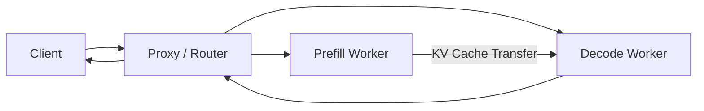
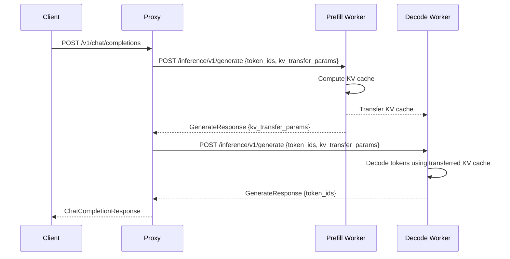

# Disaggregated Prefill Proxy

vLLM supports a disaggregated prefill architecture where prefill (prompt processing) and decode (token generation) are handled by separate server instances. The proxy layer provides endpoints for managing requests in this setup.

Source: `vllm/entrypoints/serve/disagg/api_router.py`, `vllm/entrypoints/serve/disagg/protocol.py`, `vllm/entrypoints/serve/disagg/serving.py`

## Overview

In disaggregated prefill, the system is split into:
- **Prefill workers**: Process the input prompt and compute KV cache
- **Decode workers**: Generate output tokens using the pre-computed KV cache



---

## Endpoints

| Method | Path | Description |
|--------|------|-------------|
| `POST` | `/inference/v1/generate` | Token-level generation (disaggregated mode) |
| `POST` | `/abort_requests` | Abort one or more active requests |

---

## POST `/inference/v1/generate`

A low-level generation endpoint that accepts pre-tokenized input (token IDs) and returns token IDs. This endpoint is used internally by the disaggregated prefill proxy.

### Request

```json
{
  "request_id": "req-abc123",
  "token_ids": [128000, 9906, 11, 1268, 527, 499, 30],
  "sampling_params": {
    "temperature": 0.7,
    "max_tokens": 256,
    "stop": ["<|end_of_text|>"]
  },
  "model": "meta-llama/Llama-3-8B-Instruct",
  "stream": false,
  "stream_options": null,
  "cache_salt": null,
  "priority": 0,
  "kv_transfer_params": null
}
```

| Field | Type | Default | Description |
|-------|------|---------|-------------|
| `request_id` | `string` | auto-UUID | Unique request identifier |
| `token_ids` | `list[int]` | required | Pre-tokenized input token IDs |
| `sampling_params` | `SamplingParams` | required | Generation parameters |
| `model` | `string \| null` | `null` | Model identifier |
| `stream` | `bool \| null` | `false` | Enable streaming |
| `stream_options` | `StreamOptions \| null` | `null` | Streaming options |
| `cache_salt` | `string \| null` | `null` | Prefix cache isolation salt |
| `priority` | `int` | `0` | Request priority |
| `kv_transfer_params` | `dict \| null` | `null` | KV transfer parameters for disaggregated serving |
| `features` | `string \| null` | `null` | Processed multi-modal inputs (reserved) |

### Non-Streaming Response

```json
{
  "request_id": "req-abc123",
  "choices": [
    {
      "index": 0,
      "token_ids": [40, 2846, 1701, 1664, 11, 9901, 499, 369, 10371, 0],
      "finish_reason": "stop",
      "logprobs": null
    }
  ],
  "prompt_logprobs": null,
  "kv_transfer_params": null
}
```

### Streaming Response

When `stream: true`, the server returns Server-Sent Events (SSE):

```
data: {"request_id": "req-abc123", "choices": [{"index": 0, "token_ids": [40], "finish_reason": null}]}

data: {"request_id": "req-abc123", "choices": [{"index": 0, "token_ids": [2846, 1701], "finish_reason": null}]}

data: {"request_id": "req-abc123", "choices": [{"index": 0, "token_ids": [], "finish_reason": "stop"}]}

data: [DONE]
```

### Availability

This endpoint is always registered but only functional when the server has a `ServingTokens` handler (i.e., when `--tokens-only` mode is active). Otherwise, it returns an error:

```json
{
  "message": "The model does not support generate tokens API",
  "type": "BadRequestError",
  "code": 400
}
```

---

## POST `/abort_requests`

Aborts one or more active requests. This endpoint is only registered when the server is running in `--tokens-only` mode (disaggregated prefill proxy mode).

### Request Body

```json
{
  "request_ids": ["req-abc123", "req-def456"]
}
```

| Field | Type | Description |
|-------|------|-------------|
| `request_ids` | `list[string]` | List of request IDs to abort |

### Response

- **200 OK** — Abort commands dispatched (empty body)
- **400 Bad Request** — Missing `request_ids` or invalid JSON

```bash
curl -X POST http://localhost:8000/abort_requests \
    -H "Content-Type: application/json" \
    -d '{"request_ids": ["req-abc123"]}'
```

### Implementation

Abort requests are dispatched as a background task to avoid blocking the response:

```python
asyncio.create_task(engine_client(raw_request).abort(request_ids))
return Response(status_code=200)
```

---

## KV Transfer Parameters

The `kv_transfer_params` field enables coordination between prefill and decode workers:

```json
{
  "kv_transfer_params": {
    "do_remote_prefill": true,
    "do_remote_decode": false,
    "prefill_server_url": "http://prefill-worker:8001",
    "decode_server_url": "http://decode-worker:8002"
  }
}
```

These parameters are passed through the request and response to enable the proxy to coordinate KV cache transfers between workers.

---

## Disaggregated Prefill Architecture



---

## Starting in Tokens-Only Mode

To start a vLLM instance as a disaggregated prefill worker:

```bash
# Prefill worker
vllm serve meta-llama/Llama-3-8B-Instruct \
    --tokens-only \
    --port 8001

# Decode worker
vllm serve meta-llama/Llama-3-8B-Instruct \
    --tokens-only \
    --port 8002
```

The `--tokens-only` flag:
1. Registers the `/abort_requests` endpoint
2. Enables the `ServingTokens` handler for `/inference/v1/generate`
3. Configures the engine for token-level I/O

> **Note**: The `/abort_requests` endpoint is only available when `--tokens-only` is set. In standard serving mode, requests can be aborted by closing the HTTP connection (handled by the `@with_cancellation` decorator on generation endpoints).
