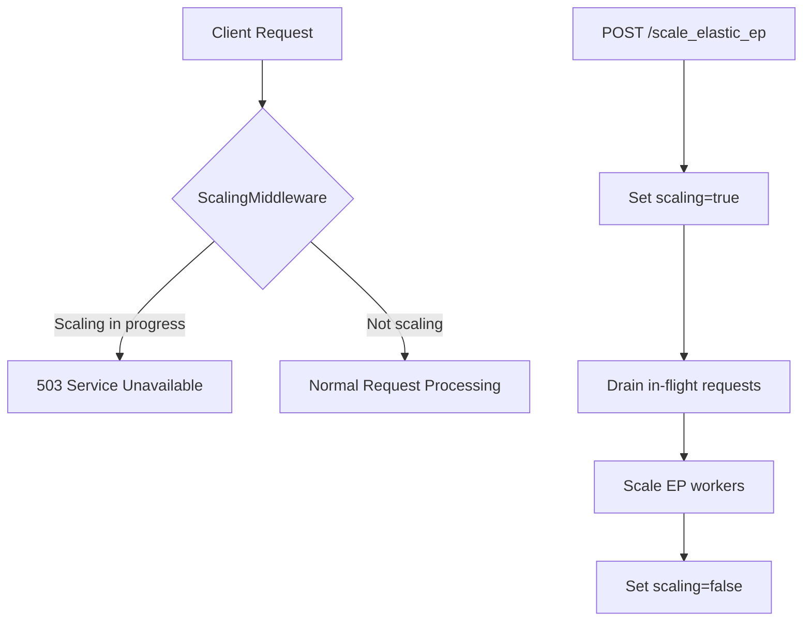
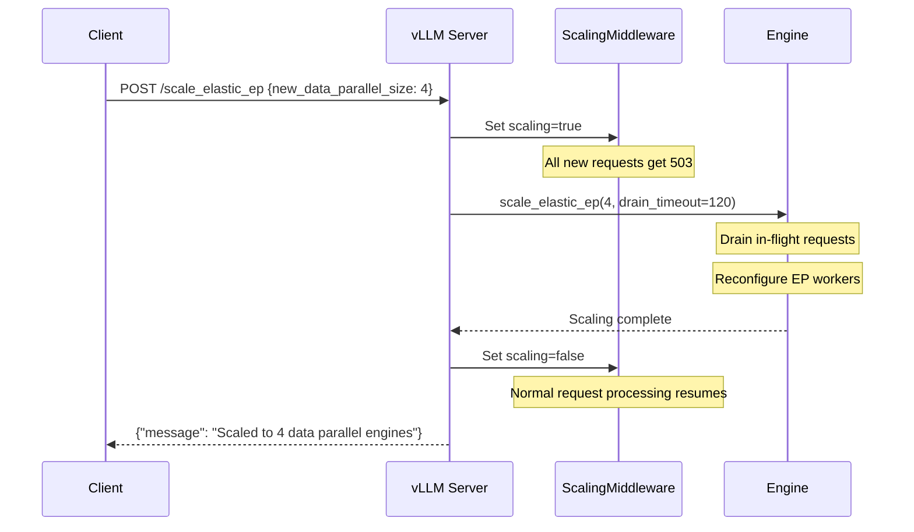

# Elastic Expert Parallelism

vLLM supports elastic expert parallelism (EP) for Mixture-of-Experts (MoE) models, allowing the number of data-parallel expert engines to be scaled dynamically at runtime without restarting the server.

Source: `vllm/entrypoints/serve/elastic_ep/api_router.py`, `vllm/entrypoints/serve/elastic_ep/middleware.py`

## Overview

Elastic expert parallelism enables dynamic scaling of the inference cluster for MoE models. When scaling is in progress, the `ScalingMiddleware` returns 503 for all incoming requests to prevent serving during the transition.



---

## Endpoints

| Method | Path | Description |
|--------|------|-------------|
| `POST` | `/scale_elastic_ep` | Scale the number of expert parallel engines |
| `POST` | `/is_scaling_elastic_ep` | Check if scaling is in progress |

---

## POST `/scale_elastic_ep`

Scales the number of data-parallel expert engines. This operation:
1. Sets a global scaling flag (causes 503 for new requests via middleware)
2. Drains in-flight requests (up to `drain_timeout` seconds)
3. Scales the EP workers to the new size
4. Clears the scaling flag

### Request Body

```json
{
  "new_data_parallel_size": 4,
  "drain_timeout": 120
}
```

| Field | Type | Required | Description |
|-------|------|----------|-------------|
| `new_data_parallel_size` | `int` | ✅ | Target number of data-parallel engines (must be > 0) |
| `drain_timeout` | `int` | ❌ | Seconds to wait for in-flight requests to drain (default: 120) |

### Response

**Success (200 OK):**
```json
{
  "message": "Scaled to 4 data parallel engines"
}
```

**Timeout (408 Request Timeout):**
```json
{
  "detail": "Scale failed due to request drain timeout after 120 seconds"
}
```

**Error (500 Internal Server Error):**
```json
{
  "detail": "Scale failed"
}
```

**Validation Errors (400 Bad Request):**
```json
{"detail": "new_data_parallel_size is required"}
{"detail": "new_data_parallel_size must be a positive integer"}
{"detail": "drain_timeout must be a positive integer"}
```

### Example

```bash
# Scale to 4 data-parallel engines with 60-second drain timeout
curl -X POST http://localhost:8000/scale_elastic_ep \
    -H "Content-Type: application/json" \
    -d '{"new_data_parallel_size": 4, "drain_timeout": 60}'
```

```python
import requests

response = requests.post(
    "http://localhost:8000/scale_elastic_ep",
    json={
        "new_data_parallel_size": 4,
        "drain_timeout": 120,
    }
)

if response.status_code == 200:
    print(response.json()["message"])
elif response.status_code == 408:
    print("Scale timed out:", response.json()["detail"])
else:
    print("Scale failed:", response.json()["detail"])
```

---

## POST `/is_scaling_elastic_ep`

Returns whether an elastic EP scaling operation is currently in progress.

### Request

No request body required.

```bash
curl -X POST http://localhost:8000/is_scaling_elastic_ep
```

### Response

```json
{"is_scaling_elastic_ep": false}
```

```json
{"is_scaling_elastic_ep": true}
```

---

## ScalingMiddleware

The `ScalingMiddleware` is applied globally to all HTTP requests. When scaling is in progress, it returns 503 for all requests:

```python
class ScalingMiddleware:
    def __call__(self, scope, receive, send):
        if scope["type"] != "http":
            return self.app(scope, receive, send)

        if get_scaling_elastic_ep():
            response = JSONResponse(
                content={"error": "The model is currently scaling. Please try again later."},
                status_code=503,
            )
            return response(scope, receive, send)

        return self.app(scope, receive, send)
```

This ensures no new requests are processed while the EP cluster is being reconfigured.

---

## Scaling Workflow



---

## Use Cases

### Dynamic Scaling Based on Load

```python
import requests
import time

def scale_ep(target_size: int, timeout: int = 120):
    """Scale elastic EP to target size."""
    # Check if already scaling
    resp = requests.post("http://localhost:8000/is_scaling_elastic_ep")
    if resp.json()["is_scaling_elastic_ep"]:
        print("Already scaling, waiting...")
        return False

    # Initiate scaling
    resp = requests.post(
        "http://localhost:8000/scale_elastic_ep",
        json={"new_data_parallel_size": target_size, "drain_timeout": timeout},
    )

    if resp.status_code == 200:
        print(f"Scaled to {target_size} EP engines")
        return True
    else:
        print(f"Scale failed: {resp.json()}")
        return False

# Scale up during peak hours
scale_ep(target_size=8)

# Scale down during off-peak
scale_ep(target_size=2)
```

### Health Check During Scaling

```python
import requests

def is_ready():
    """Check if server is ready (not scaling)."""
    # Check scaling state
    resp = requests.post("http://localhost:8000/is_scaling_elastic_ep")
    if resp.json()["is_scaling_elastic_ep"]:
        return False

    # Check engine health
    resp = requests.get("http://localhost:8000/health")
    return resp.status_code == 200
```

---

## Configuration

Elastic expert parallelism requires a MoE model and appropriate parallel configuration:

```bash
vllm serve mistralai/Mixtral-8x7B-Instruct-v0.1 \
    --tensor-parallel-size 2 \
    --data-parallel-size 4 \
    --enable-expert-parallel
```

The `new_data_parallel_size` in `/scale_elastic_ep` must be compatible with the model's expert configuration and available hardware.

> **Note**: The `/scale_elastic_ep` endpoint is always registered (not gated by `VLLM_SERVER_DEV_MODE`). The `ScalingMiddleware` is always active and will return 503 during any scaling operation. Ensure your load balancer or client handles 503 responses gracefully during scaling.
