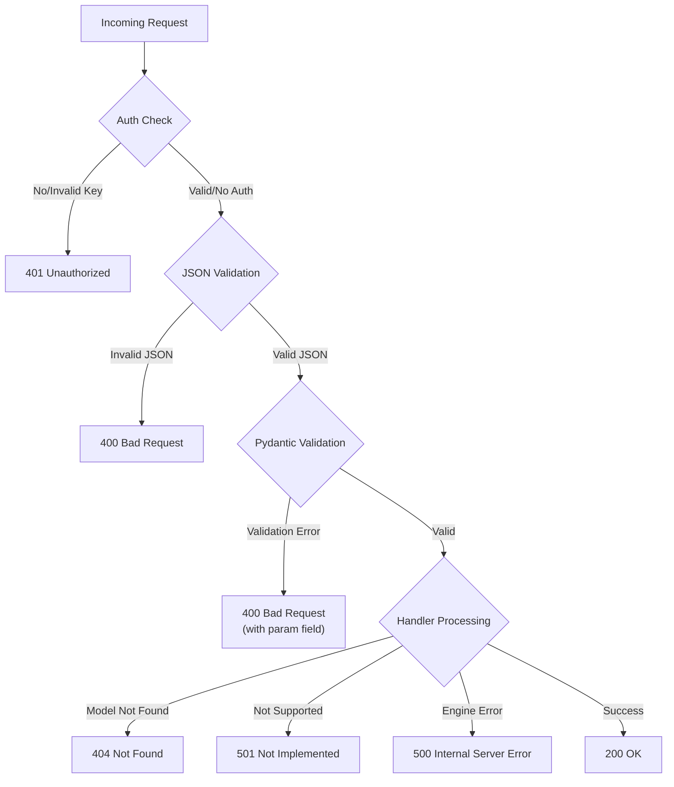

# Error Handling and HTTP Status Codes

vLLM's OpenAI-compatible server returns structured error responses following the OpenAI API error format. This page documents the error response schema, HTTP status codes, and how different error conditions are handled.

**Source:** `vllm/entrypoints/openai/server_utils.py`, `vllm/entrypoints/openai/engine/protocol.py`

---

## Error Response Format

All error responses use a consistent JSON structure defined in `vllm/entrypoints/openai/engine/protocol.py`:

```json
{
  "error": {
    "message": "Human-readable error description",
    "type": "Bad Request",
    "param": null,
    "code": 400
  }
}
```

### ErrorResponse Fields

| Field | Type | Description |
|-------|------|-------------|
| `error.message` | `string` | Human-readable description of the error. |
| `error.type` | `string` | HTTP status phrase (e.g., `"Bad Request"`, `"Not Found"`, `"Internal Server Error"`). |
| `error.param` | `string \| null` | The specific parameter that caused the error (for validation errors). |
| `error.code` | `int` | HTTP status code (e.g., `400`, `404`, `500`). |

---

## HTTP Status Codes

### 200 OK

Successful request. The response body contains the completion, transcription, or other result.

### 400 Bad Request

Returned for invalid request parameters or validation errors.

**Common causes:**
- Missing required fields
- Invalid field values (e.g., `temperature` out of range)
- Conflicting parameters (e.g., `add_generation_prompt=true` with `continue_final_message=true`)
- Invalid JSON body
- Stream options set without `stream=true`

```json
{
  "error": {
    "message": "1 validation error for ChatCompletionRequest\ntemperature\n  Input should be less than or equal to 2 [type=less_than_equal, ...]",
    "type": "Bad Request",
    "param": "temperature",
    "code": 400
  }
}
```

### 401 Unauthorized

Returned when API key authentication fails.

**Cause:** The `Authorization: Bearer <key>` header is missing or contains an invalid key.

```json
{"error": "Unauthorized"}
```

> **Note:** The 401 response uses a simplified format (not the standard `ErrorResponse` structure) because it is returned by the `AuthenticationMiddleware` before the request reaches the application layer.

### 404 Not Found

Returned when the requested model is not available or the endpoint does not exist.

**Common causes:**
- Requesting a model that is not loaded (e.g., a LoRA adapter that was not registered)
- Requesting an endpoint that is not enabled for the current model task

```json
{
  "error": {
    "message": "The model `my-lora` does not exist.",
    "type": "Not Found",
    "param": null,
    "code": 404
  }
}
```

### 422 Unprocessable Entity

Returned for semantic validation errors, particularly for multipart form data (audio transcription).

**Common causes:**
- Providing a string instead of a file object for the `file` field in transcription requests

```json
{
  "error": {
    "message": "Expected 'file' to be a file-like object, not 'str'.",
    "type": "Unprocessable Entity",
    "param": null,
    "code": 422
  }
}
```

### 500 Internal Server Error

Returned for unexpected server-side errors, including engine failures.

**Common causes:**
- Model generation errors
- Out-of-memory conditions
- Internal engine exceptions

```json
{
  "error": {
    "message": "Internal server error",
    "type": "Internal Server Error",
    "param": null,
    "code": 500
  }
}
```

### 501 Not Implemented

Returned when a requested feature is not supported by the current model or configuration.

**Common causes:**
- Requesting chat completions on a model that only supports text completions
- Requesting a feature that requires a specific model type

```json
{
  "error": {
    "message": "The model does not support Chat Completions API",
    "type": "Not Implemented",
    "param": null,
    "code": 501
  }
}
```

---

## Exception Handlers

vLLM registers several exception handlers in `vllm/entrypoints/openai/server_utils.py`:

### `http_exception_handler`

Handles FastAPI `HTTPException` instances. Converts them to the standard `ErrorResponse` format.

```python
# Triggered by: raise HTTPException(status_code=404, detail="Model not found")
# Returns:
{
  "error": {
    "message": "Model not found",
    "type": "Not Found",
    "code": 404
  }
}
```

### `validation_exception_handler`

Handles Pydantic `RequestValidationError` instances (invalid request bodies). Extracts the `param` field from `VLLMValidationError` context if available.

```python
# Triggered by: invalid request body (Pydantic validation failure)
# Returns HTTP 400 with validation details
```

### `engine_error_handler`

Handles `EngineGenerateError` and `EngineDeadError` from the vLLM engine. Returns HTTP 500.

```python
# Triggered by: engine-level generation failures
# Returns HTTP 500 Internal Server Error
```

### `exception_handler`

Catch-all handler for unexpected exceptions. Returns HTTP 500.

---

## Error Flow



---

## Handling Errors in Client Code

### Python (OpenAI SDK)

```python
import openai

client = openai.OpenAI(base_url="http://localhost:8000/v1", api_key="token-abc123")

try:
    response = client.chat.completions.create(
        model="meta-llama/Llama-3.1-8B-Instruct",
        messages=[{"role": "user", "content": "Hello"}]
    )
except openai.AuthenticationError as e:
    print(f"Authentication failed: {e}")
except openai.NotFoundError as e:
    print(f"Model not found: {e}")
except openai.BadRequestError as e:
    print(f"Invalid request: {e}")
except openai.InternalServerError as e:
    print(f"Server error: {e}")
except openai.APIConnectionError as e:
    print(f"Connection error: {e}")
```

### Raw HTTP (curl)

```bash
# Check the HTTP status code
response=$(curl -s -w "\n%{http_code}" http://localhost:8000/v1/chat/completions \
  -H "Content-Type: application/json" \
  -d '{"model": "nonexistent-model", "messages": [{"role": "user", "content": "Hi"}]}')

body=$(echo "$response" | head -n -1)
status=$(echo "$response" | tail -n 1)

echo "Status: $status"
echo "Body: $body"
```

---

## Error Stack Traces

By default, error stack traces are not logged. Enable them for debugging:

```bash
vllm serve meta-llama/Llama-3.1-8B-Instruct --log-error-stack
```

Or set the environment variable:

```bash
export VLLM_SERVER_DEV_MODE=1
vllm serve meta-llama/Llama-3.1-8B-Instruct
```

---

## Message Sanitization

Error messages are sanitized before being returned to clients to prevent information leakage. The `sanitize_message` function in `vllm/entrypoints/utils.py` strips sensitive internal details from error messages.

---

## VLLMValidationError

vLLM uses a custom `VLLMValidationError` exception (defined in `vllm/exceptions.py`) for validation errors that include a `parameter` field. This allows the error response to include the specific parameter that caused the validation failure in the `param` field.

```python
# Example: raised when stream options are set without stream=True
raise VLLMValidationError(
    "Stream options can only be defined when `stream=True`.",
    parameter="stream_include_usage"
)
# Results in:
{
  "error": {
    "message": "Stream options can only be defined when `stream=True`.",
    "type": "Bad Request",
    "param": "stream_include_usage",
    "code": 400
  }
}
```

---

## Related Pages

- [Authentication & SSL](auth-ssl.md) — API key authentication and 401 errors
- [POST /v1/chat/completions](chat-completions.md) — Chat completions endpoint
- [CLI Arguments](cli-args.md) — `--log-error-stack` and logging flags
