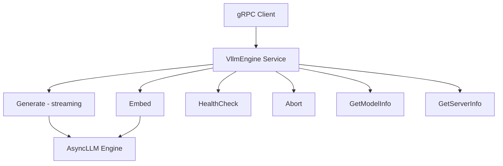
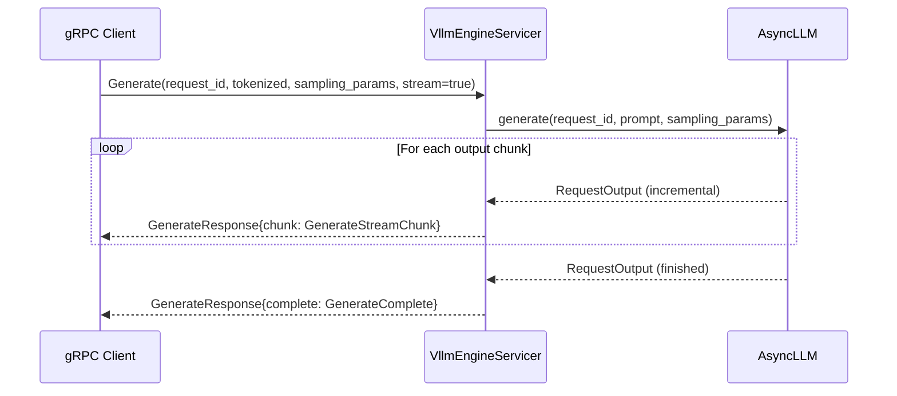

# gRPC API

vLLM exposes a high-performance gRPC interface defined in `vllm/grpc/vllm_engine.proto`. This binary protocol is designed for efficient communication between the Rust router and the vLLM Python engine (`AsyncLLM`), and can also be used directly by any gRPC client.

## Overview

The gRPC server is started via `vllm/entrypoints/grpc_server.py`:

```bash
python -m vllm.entrypoints.grpc_server \
    --model meta-llama/Llama-2-7b-hf \
    --host 0.0.0.0 \
    --port 50051
```

The server implements gRPC reflection, so you can introspect it with tools like `grpcurl`.

## Service Definition

```protobuf
service VllmEngine {
  rpc Generate(GenerateRequest) returns (stream GenerateResponse);
  rpc Embed(EmbedRequest) returns (EmbedResponse);
  rpc HealthCheck(HealthCheckRequest) returns (HealthCheckResponse);
  rpc Abort(AbortRequest) returns (AbortResponse);
  rpc GetModelInfo(GetModelInfoRequest) returns (GetModelInfoResponse);
  rpc GetServerInfo(GetServerInfoRequest) returns (GetServerInfoResponse);
}
```

Package: `vllm.grpc.engine`



---

## RPC Methods

### `Generate`

Submit a text generation request. Supports both streaming and non-streaming modes via the `stream` field.

**Signature**: `rpc Generate(GenerateRequest) returns (stream GenerateResponse)`

The server always returns a stream. For non-streaming requests, the stream contains a single `GenerateComplete` message.

#### `GenerateRequest`

```protobuf
message GenerateRequest {
  string request_id = 1;

  oneof input {
    TokenizedInput tokenized = 2;
    string text = 3;
  }

  SamplingParams sampling_params = 4;
  bool stream = 5;
}
```

| Field | Type | Description |
|-------|------|-------------|
| `request_id` | `string` | Unique request identifier |
| `tokenized` | `TokenizedInput` | Pre-tokenized input (preferred for Rust router) |
| `text` | `string` | Raw text input |
| `sampling_params` | `SamplingParams` | Generation parameters |
| `stream` | `bool` | If `true`, returns incremental chunks |

#### `TokenizedInput`

```protobuf
message TokenizedInput {
  string original_text = 1;
  repeated uint32 input_ids = 2;
}
```

| Field | Description |
|-------|-------------|
| `original_text` | Original text for reference/debugging |
| `input_ids` | Actual token IDs to process |

#### `GenerateResponse`

```protobuf
message GenerateResponse {
  oneof response {
    GenerateStreamChunk chunk = 1;
    GenerateComplete complete = 2;
  }
}
```

For streaming requests (`stream: true`), the server emits multiple `GenerateStreamChunk` messages followed by a final `GenerateComplete`. For non-streaming, a single `GenerateComplete` is returned.

#### `GenerateStreamChunk`

```protobuf
message GenerateStreamChunk {
  repeated uint32 token_ids = 1;
  uint32 prompt_tokens = 2;
  uint32 completion_tokens = 3;
  uint32 cached_tokens = 4;
}
```

| Field | Description |
|-------|-------------|
| `token_ids` | Incremental output token IDs for this chunk |
| `prompt_tokens` | Total prompt token count |
| `completion_tokens` | Total completion tokens so far |
| `cached_tokens` | Number of tokens served from KV cache |

#### `GenerateComplete`

```protobuf
message GenerateComplete {
  repeated uint32 output_ids = 1;
  string finish_reason = 2;
  uint32 prompt_tokens = 3;
  uint32 completion_tokens = 4;
  uint32 cached_tokens = 5;
}
```

| Field | Description |
|-------|-------------|
| `output_ids` | All output token IDs |
| `finish_reason` | `"stop"`, `"length"`, or `"abort"` |
| `prompt_tokens` | Total prompt tokens |
| `completion_tokens` | Total completion tokens |
| `cached_tokens` | Tokens served from KV cache |

---

### `Embed`

Submit an embedding request. Returns a single response (not streaming).

**Signature**: `rpc Embed(EmbedRequest) returns (EmbedResponse)`

#### `EmbedRequest`

```protobuf
message EmbedRequest {
  string request_id = 1;
  TokenizedInput tokenized = 2;
}
```

#### `EmbedResponse`

```protobuf
message EmbedResponse {
  repeated float embedding = 1;
  uint32 prompt_tokens = 2;
  uint32 embedding_dim = 3;
}
```

| Field | Description |
|-------|-------------|
| `embedding` | Float32 embedding vector |
| `prompt_tokens` | Number of input tokens processed |
| `embedding_dim` | Dimensionality of the embedding |

---

### `HealthCheck`

Probe server health.

**Signature**: `rpc HealthCheck(HealthCheckRequest) returns (HealthCheckResponse)`

```protobuf
message HealthCheckRequest {}

message HealthCheckResponse {
  bool healthy = 1;
  string message = 2;
}
```

---

### `Abort`

Cancel one or more in-flight requests by ID.

**Signature**: `rpc Abort(AbortRequest) returns (AbortResponse)`

```protobuf
message AbortRequest {
  repeated string request_ids = 1;
}

message AbortResponse {}
```

---

### `GetModelInfo`

Retrieve metadata about the loaded model.

**Signature**: `rpc GetModelInfo(GetModelInfoRequest) returns (GetModelInfoResponse)`

```protobuf
message GetModelInfoResponse {
  string model_path = 1;
  bool is_generation = 2;
  uint32 max_context_length = 3;
  uint32 vocab_size = 4;
  bool supports_vision = 5;
}
```

| Field | Description |
|-------|-------------|
| `model_path` | Path or HuggingFace ID of the loaded model |
| `is_generation` | `true` for generation models, `false` for embedding |
| `max_context_length` | Maximum supported context length |
| `vocab_size` | Vocabulary size |
| `supports_vision` | Whether the model accepts image inputs |

---

### `GetServerInfo`

Retrieve runtime server state.

**Signature**: `rpc GetServerInfo(GetServerInfoRequest) returns (GetServerInfoResponse)`

```protobuf
message GetServerInfoResponse {
  uint32 active_requests = 1;
  bool is_paused = 2;
  double last_receive_timestamp = 3;
  double uptime_seconds = 4;
  string server_type = 5;
}
```

| Field | Description |
|-------|-------------|
| `active_requests` | Number of currently active requests |
| `is_paused` | Whether the engine is paused |
| `last_receive_timestamp` | Unix timestamp of last received request |
| `uptime_seconds` | Server uptime in seconds |
| `server_type` | Always `"vllm-grpc"` |

---

## `SamplingParams` Message

The `SamplingParams` message controls generation behavior:

```protobuf
message SamplingParams {
  optional float temperature = 1;
  float top_p = 2;
  uint32 top_k = 3;
  float min_p = 4;
  float frequency_penalty = 5;
  float presence_penalty = 6;
  float repetition_penalty = 7;

  optional uint32 max_tokens = 8;
  uint32 min_tokens = 9;

  repeated string stop = 10;
  repeated uint32 stop_token_ids = 11;

  bool skip_special_tokens = 12;
  bool spaces_between_special_tokens = 13;
  bool ignore_eos = 14;

  uint32 n = 15;

  optional int32 logprobs = 22;
  optional int32 prompt_logprobs = 23;
  optional int32 seed = 24;
  bool include_stop_str_in_output = 25;
  map<int32, float> logit_bias = 26;
  optional int32 truncate_prompt_tokens = 27;

  oneof constraint {
    string json_schema = 16;
    string regex = 17;
    string grammar = 18;
    string structural_tag = 19;
    bool json_object = 20;
    ChoiceConstraint choice = 21;
  }
}
```

### Key Parameters

| Parameter | Type | Description |
|-----------|------|-------------|
| `temperature` | `float` (optional) | Sampling temperature (0 = greedy) |
| `top_p` | `float` | Nucleus sampling probability |
| `top_k` | `uint32` | Top-K sampling |
| `min_p` | `float` | Minimum probability threshold |
| `max_tokens` | `uint32` (optional) | Maximum output tokens |
| `stop` | `repeated string` | Stop strings |
| `stop_token_ids` | `repeated uint32` | Stop token IDs |
| `n` | `uint32` | Number of parallel samples |
| `logprobs` | `int32` (optional) | Log probabilities per output token |
| `prompt_logprobs` | `int32` (optional) | Log probabilities per prompt token |
| `seed` | `int32` (optional) | Random seed for reproducibility |
| `logit_bias` | `map<int32, float>` | Token ID to bias mapping (-100 to 100) |
| `truncate_prompt_tokens` | `int32` (optional) | Prompt truncation (-1 for model max) |

### Structured Output Constraints

The `constraint` oneof field enables structured output:

| Field | Description |
|-------|-------------|
| `json_schema` | JSON Schema string for structured output |
| `regex` | Regex pattern the output must match |
| `grammar` | EBNF grammar for structured output |
| `structural_tag` | Structural tag (e.g., Harmony models) |
| `json_object` | Force JSON object output |
| `choice` | Restrict output to one of the provided choices |

---

## Streaming Flow



---

## Python Client Example

```python
import grpc
from vllm.grpc import vllm_engine_pb2, vllm_engine_pb2_grpc

channel = grpc.insecure_channel("localhost:50051")
stub = vllm_engine_pb2_grpc.VllmEngineStub(channel)

# Non-streaming generation
request = vllm_engine_pb2.GenerateRequest(
    request_id="req-001",
    text="The capital of France is",
    sampling_params=vllm_engine_pb2.SamplingParams(
        temperature=0.0,
        max_tokens=50,
    ),
    stream=False,
)

for response in stub.Generate(request):
    if response.HasField("complete"):
        print("Output token IDs:", list(response.complete.output_ids))
        print("Finish reason:", response.complete.finish_reason)

# Health check
health_resp = stub.HealthCheck(vllm_engine_pb2.HealthCheckRequest())
print("Healthy:", health_resp.healthy)

# Model info
info = stub.GetModelInfo(vllm_engine_pb2.GetModelInfoRequest())
print("Model:", info.model_path)
print("Max context:", info.max_context_length)
```

### Using grpcurl

```bash
# Health check
grpcurl -plaintext localhost:50051 vllm.grpc.engine.VllmEngine/HealthCheck

# Get model info
grpcurl -plaintext localhost:50051 vllm.grpc.engine.VllmEngine/GetModelInfo

# Generate (non-streaming)
grpcurl -plaintext -d '{
  "request_id": "test-1",
  "text": "Hello world",
  "sampling_params": {"temperature": 0.7, "max_tokens": 50},
  "stream": false
}' localhost:50051 vllm.grpc.engine.VllmEngine/Generate
```

---

## Server Implementation Notes

The `VllmEngineServicer` class in `vllm/entrypoints/grpc_server.py`:

- Converts `GenerateRequest` to vLLM's `TextPrompt` or `TokensPrompt`
- Builds `SamplingParams` with `detokenize=False` (token IDs are returned, not text)
- Uses `output_kind=RequestOutputKind.DELTA` for streaming to return incremental tokens
- Supports structured outputs via the `constraint` oneof field
- Implements gRPC reflection for service discovery

> **Note**: The gRPC server returns raw token IDs, not decoded text. Clients are responsible for detokenization. This is intentional for the Rust router use case where the router handles tokenization/detokenization.
