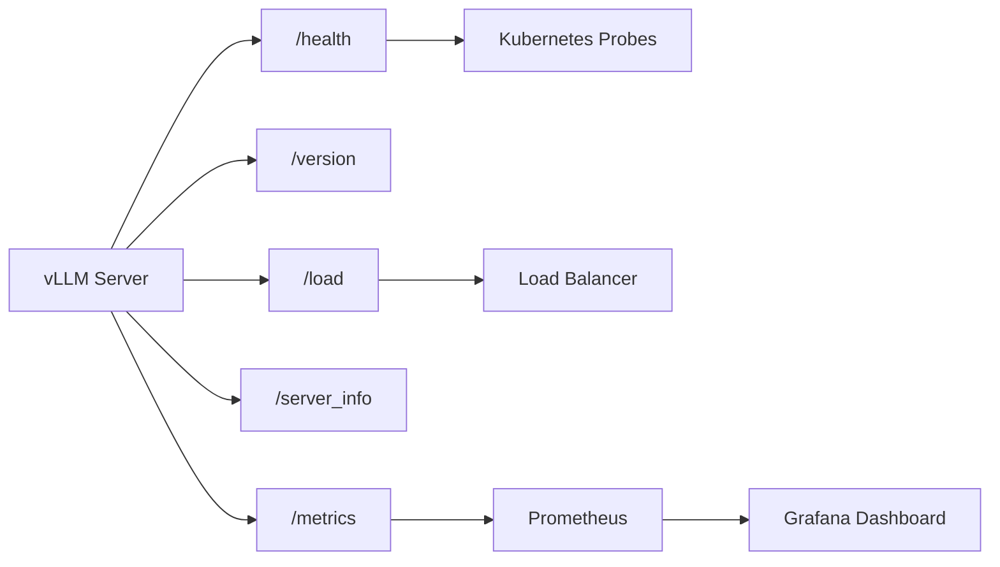

# Health, Version, Load & Server Info

vLLM exposes several operational endpoints for monitoring server health, checking the version, measuring load, and inspecting server configuration.

Source files:
- `vllm/entrypoints/serve/instrumentator/health.py` — `/health`
- `vllm/entrypoints/serve/instrumentator/basic.py` — `/version`, `/load`
- `vllm/entrypoints/serve/instrumentator/server_info.py` — `/server_info`
- `vllm/entrypoints/serve/instrumentator/metrics.py` — `/metrics`

---

## Endpoints

| Method | Path | Description |
|--------|------|-------------|
| `GET` | `/health` | Engine health check |
| `GET` | `/version` | vLLM version |
| `GET` | `/load` | Current server load metrics |
| `GET` | `/server_info` | Full server configuration and environment |
| `GET` | `/metrics` | Prometheus metrics |

---

## GET `/health`

Checks whether the vLLM engine is alive and healthy.

### Response

- **200 OK** — Engine is healthy and ready to serve requests
- **503 Service Unavailable** — Engine has died (`EngineDeadError`)

```bash
curl http://localhost:8000/health
# HTTP 200 (empty body)
```

### Implementation

```python
@router.get("/health", response_class=Response)
async def health(raw_request: Request) -> Response:
    try:
        await engine_client(raw_request).check_health()
        return Response(status_code=200)
    except EngineDeadError:
        return Response(status_code=503)
```

The health check calls `engine_client.check_health()` which verifies the engine process is alive and responsive.

### Kubernetes Liveness Probe

```yaml
livenessProbe:
  httpGet:
    path: /health
    port: 8000
  initialDelaySeconds: 30
  periodSeconds: 10
  failureThreshold: 3
```

---

## GET `/version`

Returns the current vLLM version.

### Response

```json
{"version": "0.9.0"}
```

```bash
curl http://localhost:8000/version
# {"version": "0.9.0"}
```

---

## GET `/load`

Returns current server load metrics. Tracks the number of active GPU-utilizing requests across all inference endpoints.

### Response

```json
{"server_load": 3}
```

The `server_load` value counts active requests on the following routes:
- `/v1/responses` and related
- `/v1/messages` (Anthropic)
- `/v1/chat/completions`
- `/v1/completions`
- `/v1/audio/transcriptions` and `/v1/audio/translations`
- `/v1/embeddings`
- `/pooling`, `/classify`, `/score`, `/v1/score`
- `/rerank`, `/v1/rerank`, `/v2/rerank`

```bash
curl http://localhost:8000/load
# {"server_load": 0}
```

### Use Cases

- **Load balancing**: Route new requests to the least-loaded server
- **Autoscaling**: Scale up when `server_load` exceeds a threshold
- **Monitoring**: Track concurrent request count

```python
import requests

def get_least_loaded_server(servers):
    loads = {}
    for server in servers:
        resp = requests.get(f"{server}/load")
        loads[server] = resp.json()["server_load"]
    return min(loads, key=loads.get)
```

---

## GET `/server_info`

Returns comprehensive server configuration, environment variables, and system information. Useful for debugging and auditing server state.

### Query Parameters

| Parameter | Type | Default | Description |
|-----------|------|---------|-------------|
| `config_format` | `"text" \| "json"` | `"text"` | Format for the vLLM config section |

### Response

```json
{
  "vllm_config": "VllmConfig(model='meta-llama/Llama-3-8B-Instruct', ...)",
  "vllm_env": {
    "VLLM_WORKER_MULTIPROC_METHOD": "spawn",
    "VLLM_ATTENTION_BACKEND": "FLASH_ATTN",
    "VLLM_USE_V1": "1"
  },
  "system_env": {
    "python_version": "3.11.0",
    "torch_version": "2.5.0",
    "cuda_version": "12.4",
    "gpu_name": "NVIDIA A100-SXM4-80GB",
    "gpu_memory_gb": 80.0
  }
}
```

### Response Fields

| Field | Description |
|-------|-------------|
| `vllm_config` | Full vLLM configuration (text or JSON format) |
| `vllm_env` | All `VLLM_*` environment variables (excludes keys with "KEY" in name) |
| `system_env` | System information from `vllm.collect_env` |

### JSON Config Format

Use `config_format=json` for machine-readable configuration:

```bash
curl "http://localhost:8000/server_info?config_format=json"
```

```json
{
  "vllm_config": {
    "model_config": {
      "model": "meta-llama/Llama-3-8B-Instruct",
      "max_model_len": 131072,
      "dtype": "bfloat16"
    },
    "parallel_config": {
      "tensor_parallel_size": 1,
      "pipeline_parallel_size": 1
    }
  },
  "vllm_env": {...},
  "system_env": {...}
}
```

> **Note**: The `system_env` is cached after the first call (`@functools.lru_cache(maxsize=1)`) to avoid repeated system probing.

---

## GET `/metrics`

Exposes Prometheus metrics for monitoring. This endpoint is always available and returns metrics in the Prometheus text format.

### Response

```
# HELP vllm:num_requests_running Number of requests currently running on GPU
# TYPE vllm:num_requests_running gauge
vllm:num_requests_running 2.0

# HELP vllm:num_requests_waiting Number of requests waiting to be processed
# TYPE vllm:num_requests_waiting gauge
vllm:num_requests_waiting 0.0

# HELP vllm:gpu_cache_usage_perc GPU KV-cache usage
# TYPE vllm:gpu_cache_usage_perc gauge
vllm:gpu_cache_usage_perc 0.15
```

The `/metrics` endpoint is excluded from Prometheus instrumentation itself (to avoid recursive metrics).

### Prometheus Scrape Config

```yaml
scrape_configs:
  - job_name: 'vllm'
    static_configs:
      - targets: ['localhost:8000']
    metrics_path: '/metrics'
```

---

## Monitoring Dashboard



---

## Summary

| Endpoint | Auth Required | Cached | Use Case |
|----------|--------------|--------|----------|
| `/health` | No | No | Liveness/readiness probes |
| `/version` | No | No | Version verification |
| `/load` | No | No | Load balancing |
| `/server_info` | No | Partial | Debugging, auditing |
| `/metrics` | No | No | Prometheus monitoring |

> **Note**: These endpoints are excluded from the Prometheus FastAPI instrumentator to avoid polluting metrics with health check traffic. The `/metrics` endpoint itself is also excluded from instrumentation.
