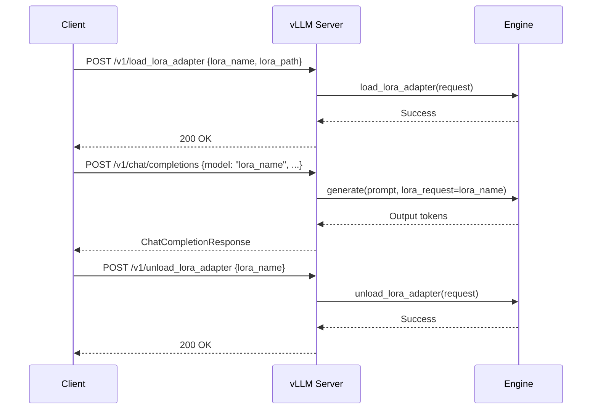

# LoRA Management

vLLM supports dynamic loading and unloading of LoRA adapters at runtime via dedicated API endpoints. This feature enables multi-tenant deployments where different users or tasks require different fine-tuned adapters without restarting the server.

Source: `vllm/entrypoints/serve/lora/api_router.py`, `vllm/entrypoints/serve/lora/protocol.py`

## Enabling Runtime LoRA Updates

Runtime LoRA management is **disabled by default** for security reasons. Enable it by setting the environment variable:

```bash
export VLLM_ALLOW_RUNTIME_LORA_UPDATING=true
```

Or pass it when starting the server:

```bash
VLLM_ALLOW_RUNTIME_LORA_UPDATING=true vllm serve meta-llama/Llama-3-8B-Instruct \
    --enable-lora \
    --max-lora-rank 64
```

> **Warning**: Runtime LoRA loading/unloading should **only be used for local development**. In production, pre-load adapters at startup using `--lora-modules`.

When enabled, a warning is logged:
```
WARNING: LoRA dynamic loading & unloading is enabled in the API server. This should ONLY be used for local development!
```

---

## Endpoints

| Method | Path | Description |
|--------|------|-------------|
| `POST` | `/v1/load_lora_adapter` | Load a LoRA adapter |
| `POST` | `/v1/unload_lora_adapter` | Unload a LoRA adapter |

---

## POST `/v1/load_lora_adapter`

Loads a LoRA adapter from a local path or HuggingFace Hub.

### Request

```json
{
  "lora_name": "my-adapter",
  "lora_path": "/path/to/adapter",
  "load_inplace": false
}
```

| Parameter | Type | Default | Description |
|-----------|------|---------|-------------|
| `lora_name` | `string` | required | Unique name to identify this adapter |
| `lora_path` | `string` | required | Local filesystem path or HuggingFace model ID |
| `load_inplace` | `bool` | `false` | Load adapter weights in-place (advanced) |

### Response

- **200 OK** — Adapter loaded successfully (empty body)
- **400 Bad Request** — Invalid request or adapter already loaded
- **500 Internal Server Error** — Failed to load adapter

### Example

```python
import requests

response = requests.post(
    "http://localhost:8000/v1/load_lora_adapter",
    json={
        "lora_name": "sql-adapter",
        "lora_path": "path/to/sql-lora-adapter",
        "load_inplace": False,
    }
)
print(response.status_code)  # 200
```

### Using with HuggingFace Hub

```python
response = requests.post(
    "http://localhost:8000/v1/load_lora_adapter",
    json={
        "lora_name": "my-finetuned-model",
        "lora_path": "username/my-lora-adapter",
    }
)
```

---

## POST `/v1/unload_lora_adapter`

Unloads a previously loaded LoRA adapter, freeing GPU memory.

### Request

```json
{
  "lora_name": "my-adapter",
  "lora_int_id": null
}
```

| Parameter | Type | Default | Description |
|-----------|------|---------|-------------|
| `lora_name` | `string` | required | Name of the adapter to unload |
| `lora_int_id` | `int \| null` | `null` | Internal integer ID (optional, for precise targeting) |

### Response

- **200 OK** — Adapter unloaded successfully (empty body)
- **400 Bad Request** — Adapter not found or invalid request
- **500 Internal Server Error** — Failed to unload adapter

### Example

```python
import requests

response = requests.post(
    "http://localhost:8000/v1/unload_lora_adapter",
    json={"lora_name": "sql-adapter"}
)
print(response.status_code)  # 200
```

---

## Using Loaded Adapters

Once loaded, use the adapter by specifying its name in the `model` field of any generation request:

```python
from openai import OpenAI

client = OpenAI(base_url="http://localhost:8000/v1", api_key="token")

# Use the base model
response = client.chat.completions.create(
    model="meta-llama/Llama-3-8B-Instruct",
    messages=[{"role": "user", "content": "Hello!"}],
)

# Use the LoRA adapter
response = client.chat.completions.create(
    model="sql-adapter",  # Use the lora_name
    messages=[{"role": "user", "content": "Write a SQL query to find all users."}],
)
```

---

## SageMaker Integration

The LoRA management endpoints are also registered with SageMaker's adapter management protocol via `@sagemaker_standards.register_load_adapter_handler` and `@sagemaker_standards.register_unload_adapter_handler`. This enables SageMaker's multi-model endpoint feature to dynamically load/unload adapters.

The SageMaker request shape mapping:
- **Load**: `{"name": "body.name", "src": "body.src", "load_inplace": "body.load_inplace || false"}`
- **Unload**: `{"lora_name": "path_params.adapter_name"}`

---

## Workflow



---

## Pre-loading Adapters at Startup

For production use, pre-load adapters at server startup instead of using the runtime API:

```bash
vllm serve meta-llama/Llama-3-8B-Instruct \
    --enable-lora \
    --lora-modules sql-adapter=/path/to/sql-adapter \
    --lora-modules code-adapter=/path/to/code-adapter \
    --max-loras 4 \
    --max-lora-rank 64
```

Pre-loaded adapters are always available and do not require the `VLLM_ALLOW_RUNTIME_LORA_UPDATING` flag.

> **See also**: [LoRA & Adapter Support](../08-features/README.md) for comprehensive documentation on LoRA configuration, rank settings, and multi-adapter serving.
