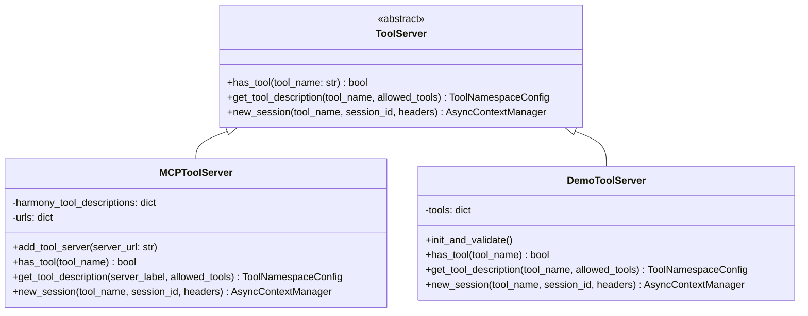
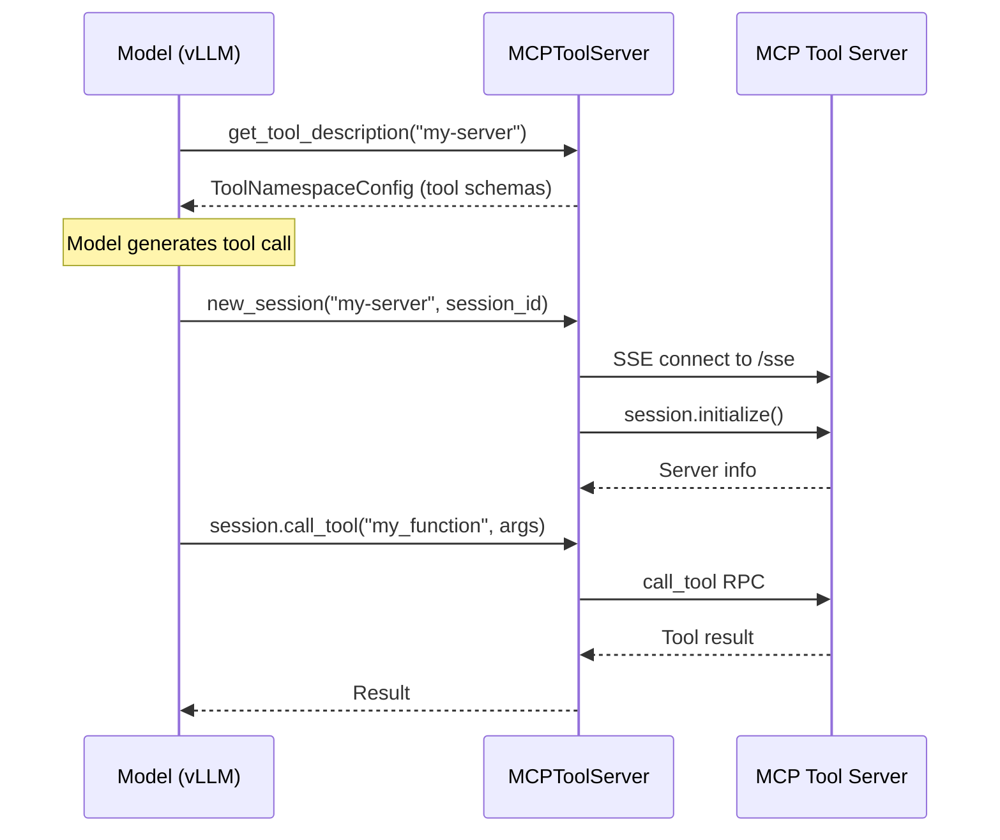

# MCP Server Protocol

vLLM integrates with the [Model Context Protocol (MCP)](https://modelcontextprotocol.io/) to expose external tools to language models. The MCP integration allows vLLM to connect to MCP-compatible tool servers and make their tools available during inference.

Source: `vllm/entrypoints/mcp/tool_server.py`, `vllm/entrypoints/mcp/tool.py`

## Overview

The MCP integration provides two server implementations:



---

## MCPToolServer

`MCPToolServer` connects to one or more external MCP-compatible tool servers via SSE (Server-Sent Events) transport.

### Initialization

```python
from vllm.entrypoints.mcp.tool_server import MCPToolServer

server = MCPToolServer()
await server.add_tool_server("localhost:3000,localhost:3001")
```

The `add_tool_server` method accepts a comma-separated list of host:port addresses. For each address, it:

1. Connects to `http://<host>:<port>/sse`
2. Calls `session.initialize()` to get server metadata
3. Calls `session.list_tools()` to enumerate available tools
4. Adapts the tool schemas for Harmony compatibility
5. Registers the tools under the server's name

### Tool Schema Adaptation

MCP tool schemas are adapted for Harmony via `trim_schema()` and `post_process_tools_description()`:

- Removes `title` fields from JSON Schema
- Removes `null` defaults
- Converts `anyOf: [{type: X}, {type: null}]` → `type: [X]` (removes null from union types)
- Filters out tools with `annotations.include_in_prompt = false`

### Session Management

Each tool invocation creates a new MCP session:

```python
async with server.new_session(
    tool_name="my-tool-server",
    session_id="session-abc123",
    headers={"Authorization": "Bearer token"}
) as session:
    result = await session.call_tool("my_function", {"arg": "value"})
```

The session connects to the MCP server with:
- `x-session-id` header set to the provided `session_id`
- Any additional headers passed in the `headers` parameter

---

## DemoToolServer

`DemoToolServer` provides built-in tools for development and testing without requiring an external MCP server.

### Built-in Tools

| Tool | Description | Enabled When |
|------|-------------|--------------|
| `browser` | Web browsing capabilities | `HarmonyBrowserTool.enabled` is `True` |
| `python` | Python code execution | `HarmonyPythonTool.validate()` succeeds |

```python
from vllm.entrypoints.mcp.tool_server import DemoToolServer

server = DemoToolServer()
await server.init_and_validate()
# Logs: "DemoToolServer initialized with tools: ['browser', 'python']"
```

---

## Tool Interface

### `has_tool(tool_name: str) -> bool`

Returns `True` if the server supports the named tool namespace.

```python
if server.has_tool("my-tool-server"):
    description = server.get_tool_description("my-tool-server")
```

### `get_tool_description(tool_name, allowed_tools=None) -> ToolNamespaceConfig | None`

Returns a `ToolNamespaceConfig` for the given tool namespace. If `allowed_tools` is provided, only the listed tools are included.

```python
# Get all tools from a server
config = server.get_tool_description("my-tool-server")

# Get only specific tools
config = server.get_tool_description(
    "my-tool-server",
    allowed_tools=["search", "calculator"]
)
```

Returns `None` if:
- The tool namespace is not registered
- `allowed_tools` is provided but none of the listed tools exist

### `new_session(tool_name, session_id, headers=None)`

Async context manager that creates a new tool session. For `MCPToolServer`, this establishes an SSE connection to the MCP server. For `DemoToolServer`, it yields the tool object directly.

---

## MCP Protocol Flow



---

## Configuration

The MCP tool server URL is configured via the `--tool-call-parser` and related CLI arguments. When using Harmony models with MCP:

```bash
vllm serve meta-llama/Llama-3-8B-Instruct \
    --tool-call-parser harmony \
    --enable-auto-tool-choice
```

### Required Dependencies

```bash
pip install mcp
```

The `mcp` package is required for `MCPToolServer`. If not installed, an `ImportError` is raised with a helpful message.

---

## Tool Schema Format

MCP tools are converted to `ToolDescription` objects compatible with Harmony:

```python
ToolDescription.new(
    name="search_web",
    description="Search the web for information",
    parameters={
        "type": "object",
        "properties": {
            "query": {"type": "string"},
            "max_results": {"type": "integer"}
        },
        "required": ["query"]
    }
)
```

These are grouped into a `ToolNamespaceConfig`:

```python
ToolNamespaceConfig(
    name="my-tool-server",
    description="A collection of useful tools",
    tools=[tool1, tool2, ...]
)
```

---

## Duplicate Server Handling

If two MCP servers have the same name (as reported by `initialize_response.serverInfo.name`), the second server is ignored with a warning:

```
WARNING: Tool my-server already exists. Ignoring duplicate tool server http://localhost:3001/sse
```

> **Note**: The MCP integration requires the `mcp` Python package (`pip install mcp`). The `DemoToolServer` is available without additional dependencies and is useful for local development and testing of tool-calling workflows.
