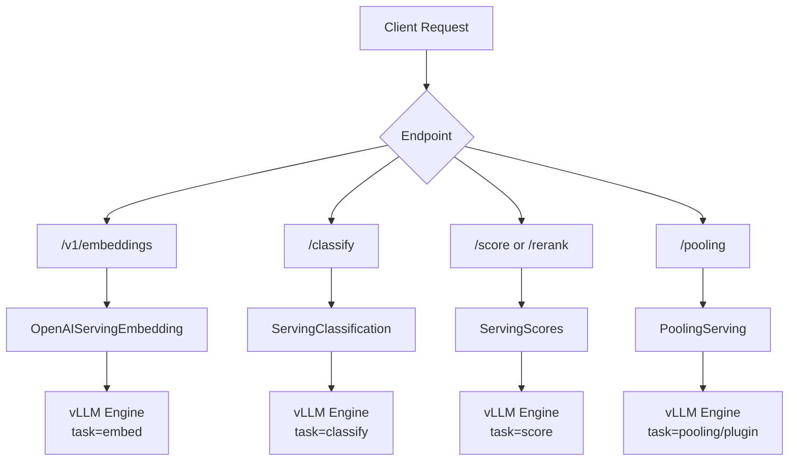

# Pooling Endpoints

vLLM provides a suite of pooling endpoints for embedding, classification, and cross-encoder scoring tasks. These endpoints are available when the server is started with a pooling-capable model.

Source files:
- `vllm/entrypoints/pooling/embed/` — Embedding endpoint
- `vllm/entrypoints/pooling/classify/` — Classification endpoint
- `vllm/entrypoints/pooling/score/` — Score/rerank endpoints
- `vllm/entrypoints/pooling/pooling/` — Generic pooling endpoint
- `vllm/entrypoints/pooling/base/protocol.py` — Shared request mixins

## Endpoint Summary

| Method | Path | Task | Description |
|--------|------|------|-------------|
| `POST` | `/v1/embeddings` | `embed` | OpenAI-compatible embeddings |
| `POST` | `/classify` | `classify` | Text classification |
| `POST` | `/score` | `score` | Cross-encoder scoring |
| `POST` | `/v1/score` | `score` | Score (deprecated path) |
| `POST` | `/rerank` | `score` | Reranking (JinaAI-compatible) |
| `POST` | `/v1/rerank` | `score` | Rerank (deprecated path) |
| `POST` | `/v2/rerank` | `score` | Rerank v2 |
| `POST` | `/pooling` | any pooling | Generic pooling |

---

## Common Request Parameters

All pooling endpoints share a common set of base parameters defined in `PoolingBasicRequestMixin`:

| Parameter | Type | Default | Description |
|-----------|------|---------|-------------|
| `model` | `string \| null` | `null` | Model identifier (uses server default if null) |
| `user` | `string \| null` | `null` | User identifier for tracking |
| `truncate_prompt_tokens` | `int \| null` | `null` | Truncate input to N tokens (-1 = model max) |
| `request_id` | `string` | auto-generated UUID | Request identifier |
| `priority` | `int` | `0` | Request priority (lower = higher priority) |
| `mm_processor_kwargs` | `dict \| null` | `null` | Extra kwargs for HuggingFace processor |
| `cache_salt` | `string \| null` | `null` | Salt for prefix cache isolation |

### Input Formats

Pooling endpoints accept two input formats:

**Completion-style** (raw text or token IDs):
```json
{
  "input": "The quick brown fox",
  "add_special_tokens": true
}
```

Or with token IDs:
```json
{
  "input": [101, 2054, 2003, 102]
}
```

**Chat-style** (conversation messages):
```json
{
  "messages": [
    {"role": "user", "content": "What is machine learning?"}
  ],
  "add_generation_prompt": false
}
```

---

## POST `/v1/embeddings`

Generates dense vector embeddings for input text. Compatible with the OpenAI Embeddings API.

### Request

```json
{
  "model": "BAAI/bge-base-en-v1.5",
  "input": "The quick brown fox jumps over the lazy dog",
  "encoding_format": "float",
  "dimensions": null,
  "truncate_prompt_tokens": null
}
```

| Parameter | Type | Default | Description |
|-----------|------|---------|-------------|
| `input` | `string \| list[string] \| list[int] \| list[list[int]]` | required | Text or token IDs to embed |
| `encoding_format` | `"float" \| "base64"` | `"float"` | Output encoding format |
| `dimensions` | `int \| null` | `null` | Truncate embedding to N dimensions |
| `use_activation` | `bool \| null` | `null` | Apply activation function to pooler output |
| `embed_dtype` | `"float32" \| "float16" \| ...` | `"float32"` | Dtype for base64 encoding |
| `endianness` | `"native" \| "little" \| "big"` | `"native"` | Byte order for base64 encoding |
| `add_special_tokens` | `bool` | `true` | Add BOS/EOS tokens |

### Response

```json
{
  "id": "embd-abc123",
  "object": "list",
  "created": 1700000000,
  "model": "BAAI/bge-base-en-v1.5",
  "data": [
    {
      "index": 0,
      "object": "embedding",
      "embedding": [0.023, -0.041, 0.087, ...]
    }
  ],
  "usage": {
    "prompt_tokens": 9,
    "total_tokens": 9
  }
}
```

When `encoding_format: "base64"`, the `embedding` field contains a base64-encoded binary string.

### Batch Embeddings

```json
{
  "model": "BAAI/bge-base-en-v1.5",
  "input": [
    "First document",
    "Second document",
    "Third document"
  ]
}
```

### Python Example

```python
from openai import OpenAI

client = OpenAI(base_url="http://localhost:8000/v1", api_key="token")

response = client.embeddings.create(
    model="BAAI/bge-base-en-v1.5",
    input=["Hello world", "How are you?"],
)

for item in response.data:
    print(f"Index {item.index}: {len(item.embedding)}-dim vector")
```

> **Performance tip**: Install `orjson` (`pip install orjson`) for faster JSON serialization of embedding responses.

---

## POST `/classify`

Classifies input text into predefined categories. Returns class probabilities and the predicted label.

### Request

```json
{
  "model": "cross-encoder/nli-deberta-v3-small",
  "input": "This movie was absolutely fantastic!",
  "use_activation": null
}
```

| Parameter | Type | Default | Description |
|-----------|------|---------|-------------|
| `input` | `string \| list[string] \| ...` | required | Text to classify |
| `use_activation` | `bool \| null` | `null` | Apply activation (softmax) to logits |
| `add_special_tokens` | `bool` | `true` | Add special tokens |

### Response

```json
{
  "id": "classify-abc123",
  "object": "list",
  "created": 1700000000,
  "model": "cross-encoder/nli-deberta-v3-small",
  "data": [
    {
      "index": 0,
      "label": "POSITIVE",
      "probs": [0.05, 0.95],
      "num_classes": 2
    }
  ],
  "usage": {
    "prompt_tokens": 8,
    "total_tokens": 8
  }
}
```

| Field | Description |
|-------|-------------|
| `label` | Predicted class label (or `null` if labels not available) |
| `probs` | Probability for each class |
| `num_classes` | Total number of classes |

---

## POST `/score`

Computes relevance scores between pairs of texts. Used for cross-encoder models that score query-document pairs.

### Request Formats

The `/score` endpoint accepts multiple input formats:

**Queries + Documents:**
```json
{
  "model": "cross-encoder/ms-marco-MiniLM-L-6-v2",
  "queries": "What is machine learning?",
  "documents": [
    "Machine learning is a subset of AI.",
    "The weather is sunny today."
  ]
}
```

**Queries + Items:**
```json
{
  "model": "cross-encoder/ms-marco-MiniLM-L-6-v2",
  "queries": "search query",
  "items": ["item 1", "item 2"]
}
```

**Data 1 + Data 2:**
```json
{
  "model": "cross-encoder/ms-marco-MiniLM-L-6-v2",
  "data_1": "query text",
  "data_2": ["doc 1", "doc 2"]
}
```

**Text 1 + Text 2:**
```json
{
  "model": "cross-encoder/ms-marco-MiniLM-L-6-v2",
  "text_1": "sentence A",
  "text_2": "sentence B"
}
```

### Response

```json
{
  "id": "embd-abc123",
  "object": "list",
  "created": 1700000000,
  "model": "cross-encoder/ms-marco-MiniLM-L-6-v2",
  "data": [
    {"index": 0, "object": "score", "score": 0.923},
    {"index": 1, "object": "score", "score": 0.041}
  ],
  "usage": {
    "prompt_tokens": 24,
    "total_tokens": 24
  }
}
```

> **Note**: `/v1/score` is a deprecated alias for `/score`. A deprecation warning is logged when it is used.

---

## POST `/rerank`

Reranks a list of documents by relevance to a query. Compatible with the JinaAI Rerank API format.

### Request

```json
{
  "model": "cross-encoder/ms-marco-MiniLM-L-6-v2",
  "query": "What is the capital of France?",
  "documents": [
    "Paris is the capital of France.",
    "Berlin is the capital of Germany.",
    "The Eiffel Tower is in Paris."
  ],
  "top_n": 2
}
```

| Parameter | Type | Default | Description |
|-----------|------|---------|-------------|
| `query` | `string \| ContentPart` | required | Query text |
| `documents` | `list[string \| ContentPart]` | required | Documents to rerank |
| `top_n` | `int` | `0` (all) | Return top N results (0 = all) |
| `use_activation` | `bool \| null` | `null` | Apply activation to scores |
| `truncate_prompt_tokens` | `int \| null` | `null` | Truncate inputs |

### Response

```json
{
  "id": "rerank-abc123",
  "model": "cross-encoder/ms-marco-MiniLM-L-6-v2",
  "usage": {
    "prompt_tokens": 45,
    "total_tokens": 45
  },
  "results": [
    {
      "index": 0,
      "document": {"text": "Paris is the capital of France."},
      "relevance_score": 0.987
    },
    {
      "index": 2,
      "document": {"text": "The Eiffel Tower is in Paris."},
      "relevance_score": 0.743
    }
  ]
}
```

Results are sorted by `relevance_score` descending. The `index` field refers to the original position in the `documents` array.

> **Note**: `/v1/rerank` and `/v2/rerank` are aliases for `/rerank`. Using `/v1/rerank` logs a deprecation warning.

---

## POST `/pooling`

Generic pooling endpoint that supports all pooling tasks. Useful when you want to explicitly specify the task or use a model that supports multiple pooling modes.

### Request

```json
{
  "model": "BAAI/bge-base-en-v1.5",
  "input": "Hello world",
  "task": "embed",
  "encoding_format": "float",
  "dimensions": null
}
```

| Parameter | Type | Default | Description |
|-----------|------|---------|-------------|
| `input` | `string \| list[...]` | required | Input text or token IDs |
| `task` | `PoolingTask \| null` | `null` | Explicit task override |
| `encoding_format` | `"float" \| "base64"` | `"float"` | Output format |
| `dimensions` | `int \| null` | `null` | Embedding dimensions |
| `use_activation` | `bool \| null` | `null` | Apply activation |

### Response

```json
{
  "id": "pool-abc123",
  "object": "list",
  "created": 1700000000,
  "model": "BAAI/bge-base-en-v1.5",
  "data": [
    {
      "index": 0,
      "object": "pooling",
      "data": [0.023, -0.041, 0.087, ...]
    }
  ],
  "usage": {
    "prompt_tokens": 3,
    "total_tokens": 3
  }
}
```

---

## Architecture



All pooling endpoints use the `@load_aware_call` decorator to track server load metrics and the `@with_cancellation` decorator to handle client disconnects gracefully.

---

## Starting a Pooling Server

```bash
# Embedding server
vllm serve BAAI/bge-base-en-v1.5 --task embed

# Classification server
vllm serve cross-encoder/nli-deberta-v3-small --task classify

# Reranking/scoring server
vllm serve cross-encoder/ms-marco-MiniLM-L-6-v2 --task score
```

> **Note**: The `--task` flag determines which pooling endpoints are registered. A model started with `--task embed` will only expose `/v1/embeddings` and `/pooling`, not `/classify` or `/score`.
