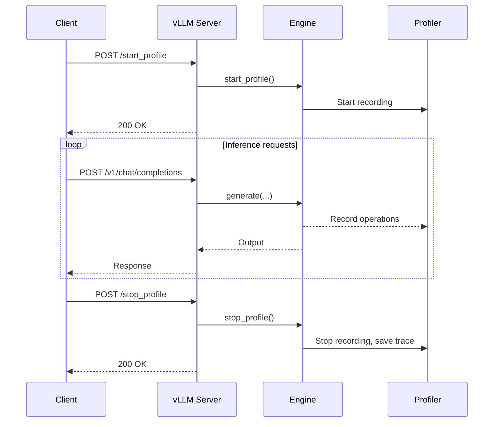

# Profiling Endpoints

vLLM provides HTTP endpoints to start and stop the profiler at runtime. This enables capturing performance profiles of the inference engine without restarting the server.

Source: `vllm/entrypoints/serve/profile/api_router.py`

## Availability

Profiling endpoints are only registered when a profiler is configured via the `--profiler-config` CLI argument:

```bash
vllm serve meta-llama/Llama-3-8B-Instruct \
    --profiler-config '{"profiler": "torch_profiler"}'
```

If no profiler is configured, these endpoints are not registered. When enabled, a warning is logged:

```
WARNING: Profiler with mode 'torch_profiler' is enabled in the API server. This should ONLY be used for local development!
```

---

## Endpoints

| Method | Path | Description |
|--------|------|-------------|
| `POST` | `/start_profile` | Start the profiler |
| `POST` | `/stop_profile` | Stop the profiler and save results |

---

## POST `/start_profile`

Starts the profiler. After calling this endpoint, all subsequent inference operations are profiled until `/stop_profile` is called.

### Request

No request body required.

```bash
curl -X POST http://localhost:8000/start_profile
```

### Response

- **200 OK** — Profiler started (empty body)

Logs:
```
INFO: Starting profiler...
INFO: Profiler started.
```

---

## POST `/stop_profile`

Stops the profiler and saves the profile data to disk.

### Request

No request body required.

```bash
curl -X POST http://localhost:8000/stop_profile
```

### Response

- **200 OK** — Profiler stopped (empty body)

Logs:
```
INFO: Stopping profiler...
INFO: Profiler stopped.
```

---

## Profiling Workflow



---

## Python Example

```python
import requests
import time

base_url = "http://localhost:8000"

# Start profiling
requests.post(f"{base_url}/start_profile")
print("Profiler started")

# Run some inference
for i in range(10):
    requests.post(
        f"{base_url}/v1/chat/completions",
        json={
            "model": "meta-llama/Llama-3-8B-Instruct",
            "messages": [{"role": "user", "content": f"Request {i}"}],
            "max_tokens": 100,
        }
    )

# Stop profiling
requests.post(f"{base_url}/stop_profile")
print("Profiler stopped, trace saved")
```

---

## Profiler Configuration

The `ProfilerConfig` is set via the `--profiler-config` argument. The `profiler` field specifies the profiler backend:

```bash
# PyTorch profiler
vllm serve meta-llama/Llama-3-8B-Instruct \
    --profiler-config '{"profiler": "torch_profiler"}'
```

The profiler configuration is validated at startup:

```python
profiler_config = getattr(app.state.args, "profiler_config", None)
assert profiler_config is None or isinstance(profiler_config, ProfilerConfig)
if profiler_config is not None and profiler_config.profiler is not None:
    # Register profiling endpoints
    app.include_router(router)
```

---

## Analyzing Profiles

After stopping the profiler, the trace file can be analyzed with:

**PyTorch Profiler** — Open the trace in TensorBoard:
```bash
tensorboard --logdir ./profiler_output
```

Or use the Chrome trace viewer:
```bash
# Open chrome://tracing in Chrome and load the .json trace file
```

> **Note**: Profiling adds overhead to inference. Use profiling endpoints only during development and benchmarking, not in production. The endpoints are only available when `profiler_config.profiler` is set to a non-null value.
