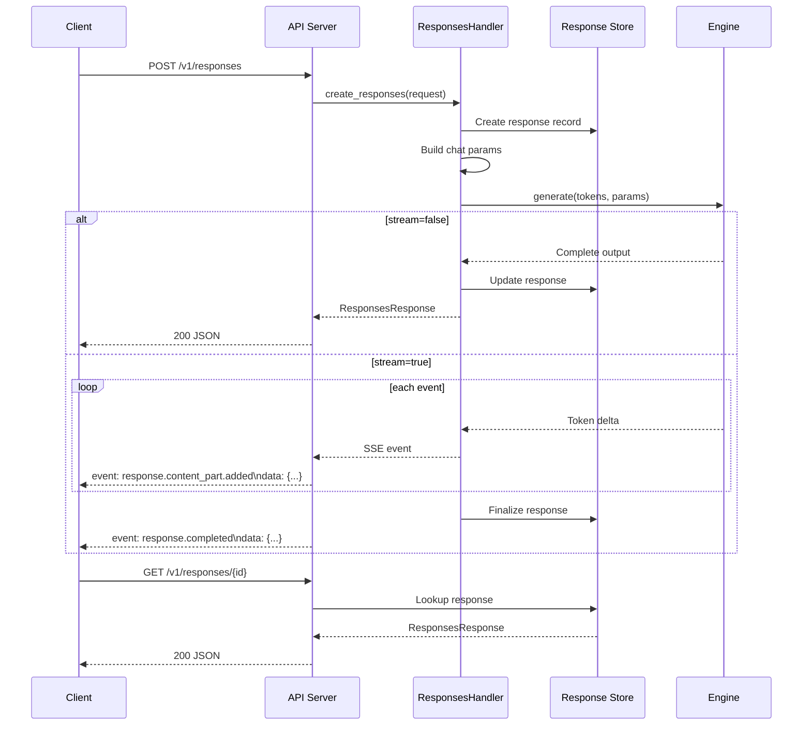

# POST /v1/responses and GET /v1/responses/{id}

The Responses API is vLLM's implementation of the OpenAI Responses API — a stateful, multi-turn interface that supports tool use, reasoning, background processing, and rich streaming events. Unlike the Chat Completions API, the Responses API maintains response state server-side and supports retrieving past responses by ID.

**Source:** `vllm/entrypoints/openai/responses/`

---

## Endpoints

| Method | Path | Description |
|--------|------|-------------|
| `POST` | `/v1/responses` | Create a new response |
| `GET` | `/v1/responses/{response_id}` | Retrieve a stored response |
| `POST` | `/v1/responses/{response_id}/cancel` | Cancel an in-progress response |

---

## POST /v1/responses

Creates a new model response. Supports text, tool calls, reasoning, and streaming via Server-Sent Events.

### Request Schema

The request body is defined in `vllm/entrypoints/openai/responses/protocol.py` as `ResponsesRequest`.

#### Core Fields

| Field | Type | Default | Description |
|-------|------|---------|-------------|
| `input` | `string \| array` | **required** | The input to the model. Can be a plain string or a list of `ResponseInputItem` objects (messages, images, etc.). |
| `model` | `string \| null` | `null` | Model name to use. |
| `instructions` | `string \| null` | `null` | System-level instructions for the model. |
| `max_output_tokens` | `int \| null` | `null` | Maximum number of output tokens. |
| `max_tool_calls` | `int \| null` | `null` | Maximum number of tool calls allowed. |
| `temperature` | `float \| null` | `null` | Sampling temperature. |
| `top_p` | `float \| null` | `null` | Nucleus sampling probability. |
| `top_k` | `int \| null` | `null` | Top-K sampling. |
| `tools` | `array` | `[]` | List of tools available to the model (function, web search, code interpreter, MCP). |
| `tool_choice` | `string \| object` | `"auto"` | Tool selection: `"auto"`, `"none"`, `"required"`, or a specific tool. |
| `parallel_tool_calls` | `bool \| null` | `true` | Allow parallel tool calls. |
| `reasoning` | `object \| null` | `null` | Reasoning configuration (e.g., `{"effort": "high"}`). |
| `stream` | `bool \| null` | `false` | Stream events as Server-Sent Events. |
| `store` | `bool \| null` | `true` | Store the response server-side for later retrieval. |
| `background` | `bool \| null` | `false` | Run the response in the background (non-blocking). |
| `previous_response_id` | `string \| null` | `null` | ID of a previous response to continue from (multi-turn). |
| `truncation` | `string \| null` | `"disabled"` | Truncation strategy: `"auto"` or `"disabled"`. |
| `service_tier` | `string` | `"auto"` | Service tier: `"auto"`, `"default"`, `"flex"`, `"scale"`, `"priority"`. |
| `metadata` | `object \| null` | `null` | Arbitrary metadata attached to the response. |
| `user` | `string \| null` | `null` | User identifier. |
| `include` | `array \| null` | `null` | Additional data to include in the response (e.g., `"message.output_text.logprobs"`). |
| `text` | `object \| null` | `null` | Text output configuration (format, etc.). |
| `logit_bias` | `object \| null` | `null` | Token logit biases. |
| `top_logprobs` | `int \| null` | `0` | Number of top log-probability tokens to return. |
| `prompt` | `object \| null` | `null` | Prompt configuration (advanced). |

#### vLLM Extra Parameters

| Field | Type | Default | Description |
|-------|------|---------|-------------|
| `request_id` | `string` | auto-generated | Custom request ID (format: `resp_{uuid}`). |
| `priority` | `int` | `0` | Request priority (lower = higher priority). |
| `cache_salt` | `string \| null` | `null` | Salt for prefix cache isolation. |
| `enable_response_messages` | `bool` | `false` | Include raw input/output messages in the response. |
| `previous_input_messages` | `array \| null` | `null` | Previous messages in OpenAI Harmony format (alternative to `previous_response_id`). |
| `structured_outputs` | `object \| null` | `null` | Additional structured output parameters. |
| `repetition_penalty` | `float \| null` | `null` | Repetition penalty. |
| `seed` | `int \| null` | `null` | Random seed. |
| `stop` | `string \| array \| null` | `[]` | Stop sequences. |
| `ignore_eos` | `bool` | `false` | Continue past EOS token. |
| `skip_special_tokens` | `bool` | `true` | Skip special tokens in output. |
| `include_stop_str_in_output` | `bool` | `false` | Include stop string in output. |
| `mm_processor_kwargs` | `object \| null` | `null` | Extra kwargs for the HuggingFace multimodal processor. |
| `media_io_kwargs` | `object \| null` | `null` | Extra kwargs for media IO connectors, keyed by modality. |
| `vllm_xargs` | `object \| null` | `null` | Custom extension parameters. |

---

### Response Schema

The response is defined as `ResponsesResponse` in `vllm/entrypoints/openai/responses/protocol.py`.

```json
{
  "id": "resp_abc123",
  "object": "response",
  "created_at": 1714000000,
  "model": "meta-llama/Llama-3.1-8B-Instruct",
  "status": "completed",
  "output": [
    {
      "type": "message",
      "id": "msg_abc123",
      "role": "assistant",
      "content": [
        {
          "type": "output_text",
          "text": "The capital of France is Paris."
        }
      ]
    }
  ],
  "usage": {
    "input_tokens": 15,
    "output_tokens": 9,
    "total_tokens": 24,
    "input_tokens_details": {
      "cached_tokens": 0,
      "input_tokens_per_turn": [15],
      "cached_tokens_per_turn": [0]
    },
    "output_tokens_details": {
      "reasoning_tokens": 0,
      "tool_output_tokens": 0,
      "output_tokens_per_turn": [9],
      "tool_output_tokens_per_turn": [0]
    }
  },
  "temperature": 1.0,
  "top_p": 1.0,
  "tool_choice": "auto",
  "tools": [],
  "parallel_tool_calls": true,
  "background": false,
  "max_output_tokens": 4096,
  "service_tier": "auto",
  "truncation": "disabled",
  "reasoning": null,
  "previous_response_id": null,
  "incomplete_details": null
}
```

#### Response Fields

| Field | Type | Description |
|-------|------|-------------|
| `id` | `string` | Unique response ID (format: `resp_{uuid}`). |
| `object` | `string` | Always `"response"`. |
| `created_at` | `int` | Unix timestamp of creation. |
| `model` | `string` | Model name used. |
| `status` | `string` | Response status: `"completed"`, `"in_progress"`, `"incomplete"`, `"failed"`, `"cancelled"`. |
| `output` | `array` | List of output items (messages, tool calls, reasoning, etc.). |
| `usage` | `object \| null` | Token usage statistics. |
| `incomplete_details` | `object \| null` | Details if status is `"incomplete"` (e.g., `{"reason": "max_output_tokens"}`). |
| `previous_response_id` | `string \| null` | ID of the previous response in a multi-turn conversation. |
| `input_messages` | `array \| null` | Raw input messages (if `enable_response_messages=true`). |
| `output_messages` | `array \| null` | Raw output messages (if `enable_response_messages=true`). |

---

### Streaming Events

When `stream=true`, the server emits Server-Sent Events with named event types. Each event has the format:

```
event: {event_type}
data: {json_payload}
```

#### Event Types

| Event Type | Description |
|------------|-------------|
| `response.created` | Response object created, status `"in_progress"`. |
| `response.in_progress` | Response is being generated. |
| `response.output_item.added` | A new output item (message, tool call) was added. |
| `response.output_item.done` | An output item is complete. |
| `response.content_part.added` | A new content part was added to an output item. |
| `response.content_part.done` | A content part is complete. |
| `response.reasoning_text.delta` | Incremental reasoning text delta. |
| `response.reasoning_text.done` | Reasoning text is complete. |
| `response.reasoning_part.added` | A reasoning part was added. |
| `response.reasoning_part.done` | A reasoning part is complete. |
| `response.web_search_call.in_progress` | Web search tool call started. |
| `response.web_search_call.searching` | Web search in progress. |
| `response.web_search_call.completed` | Web search completed. |
| `response.code_interpreter_call.in_progress` | Code interpreter call started. |
| `response.code_interpreter_call.code.delta` | Incremental code delta. |
| `response.code_interpreter_call.code.done` | Code generation complete. |
| `response.code_interpreter_call.completed` | Code interpreter call complete. |
| `response.mcp_call.in_progress` | MCP tool call started. |
| `response.mcp_call.arguments.delta` | Incremental MCP arguments delta. |
| `response.mcp_call.arguments.done` | MCP arguments complete. |
| `response.mcp_call.completed` | MCP tool call complete. |
| `response.completed` | Response is fully complete. |

---

## GET /v1/responses/{response_id}

Retrieves a previously stored response by its ID.

### Path Parameters

| Parameter | Type | Description |
|-----------|------|-------------|
| `response_id` | `string` | The ID of the response to retrieve (format: `resp_{uuid}`). |

### Query Parameters

| Parameter | Type | Default | Description |
|-----------|------|---------|-------------|
| `starting_after` | `int \| null` | `null` | Return events starting after this sequence number (for partial retrieval). |
| `stream` | `bool \| null` | `false` | Stream the response as SSE events. |

### Response

Returns a `ResponsesResponse` object (same schema as the creation response) or a stream of SSE events.

---

## POST /v1/responses/{response_id}/cancel

Cancels an in-progress response.

### Path Parameters

| Parameter | Type | Description |
|-----------|------|-------------|
| `response_id` | `string` | The ID of the response to cancel. |

### Response

Returns the updated `ResponsesResponse` object with `status: "cancelled"`.

---

## Examples

### Basic Text Response

```python
import openai

client = openai.OpenAI(base_url="http://localhost:8000/v1", api_key="token-abc123")

response = client.responses.create(
    model="meta-llama/Llama-3.1-8B-Instruct",
    input="What is the capital of France?"
)
print(response.output[0].content[0].text)
```

### Multi-Turn Conversation

```python
# First turn
response1 = client.responses.create(
    model="meta-llama/Llama-3.1-8B-Instruct",
    input="My name is Alice.",
    store=True
)

# Second turn — continues from the first
response2 = client.responses.create(
    model="meta-llama/Llama-3.1-8B-Instruct",
    input="What is my name?",
    previous_response_id=response1.id
)
print(response2.output[0].content[0].text)
# Output: "Your name is Alice."
```

### Streaming Response

```python
stream = client.responses.create(
    model="meta-llama/Llama-3.1-8B-Instruct",
    input="Tell me a short story.",
    stream=True
)

for event in stream:
    print(event)
```

### Tool Use

```python
response = client.responses.create(
    model="meta-llama/Llama-3.1-8B-Instruct",
    input="What's the weather in Paris?",
    tools=[
        {
            "type": "function",
            "name": "get_weather",
            "description": "Get current weather",
            "parameters": {
                "type": "object",
                "properties": {
                    "location": {"type": "string"}
                },
                "required": ["location"]
            }
        }
    ],
    tool_choice="auto"
)
```

### Retrieve a Response

```bash
curl http://localhost:8000/v1/responses/resp_abc123 \
  -H "Authorization: Bearer token-abc123"
```

### Raw HTTP Request

```bash
curl http://localhost:8000/v1/responses \
  -H "Content-Type: application/json" \
  -H "Authorization: Bearer token-abc123" \
  -d '{
    "model": "meta-llama/Llama-3.1-8B-Instruct",
    "input": "Explain quantum entanglement in simple terms.",
    "max_output_tokens": 200,
    "temperature": 0.7
  }'
```

---

## Architecture



---

## Related Pages

- [POST /v1/chat/completions](chat-completions.md) — Chat completions API
- [Error Handling](error-handling.md) — HTTP status codes and error formats
- [CLI Arguments](cli-args.md) — Server configuration flags
