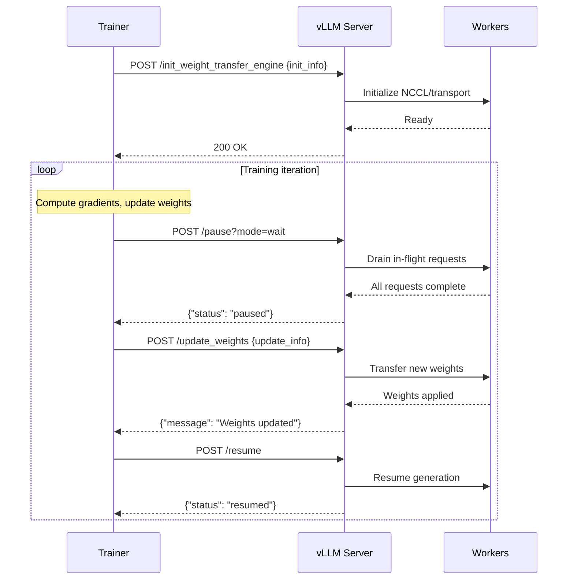

# RLHF Endpoints

vLLM provides a set of HTTP endpoints for Reinforcement Learning from Human Feedback (RLHF) workflows. These endpoints enable online training scenarios where a trainer process needs to pause inference, update model weights, and resume generation.

Source: `vllm/entrypoints/serve/rlhf/api_router.py`, `vllm/distributed/weight_transfer/base.py`

## Availability

RLHF endpoints are only available when the server is running in **development mode**:

```bash
VLLM_SERVER_DEV_MODE=true vllm serve meta-llama/Llama-3-8B-Instruct
```

---

## Endpoints

| Method | Path | Description |
|--------|------|-------------|
| `POST` | `/pause` | Pause generation for weight updates |
| `POST` | `/resume` | Resume generation after pause |
| `GET` | `/is_paused` | Check current pause status |
| `POST` | `/init_weight_transfer_engine` | Initialize weight transfer engine |
| `POST` | `/update_weights` | Push new model weights to inference workers |
| `GET` | `/get_world_size` | Get the distributed world size |

---

## POST `/pause`

Pauses generation to allow safe weight updates. In-flight requests are handled according to the `mode` parameter.

### Query Parameters

| Parameter | Type | Default | Description |
|-----------|------|---------|-------------|
| `mode` | `"abort" \| "wait" \| "keep"` | `"abort"` | How to handle in-flight requests |
| `wait_for_inflight_requests` | `bool` | `false` | **Deprecated**: Use `mode="wait"` instead |
| `clear_cache` | `bool` | `true` | **Deprecated**: Clear KV/prefix caches after draining |

### Pause Modes

| Mode | Description |
|------|-------------|
| `abort` | Abort all in-flight requests immediately (fastest) |
| `wait` | Wait for all in-flight requests to complete before pausing |
| `keep` | Freeze requests in queue; they resume when `/resume` is called |

### Request

```bash
# Abort in-flight requests immediately
curl -X POST "http://localhost:8000/pause?mode=abort"

# Wait for in-flight requests to finish
curl -X POST "http://localhost:8000/pause?mode=wait"

# Keep requests frozen (they resume on /resume)
curl -X POST "http://localhost:8000/pause?mode=keep"
```

### Response

```json
{"status": "paused"}
```

| HTTP Status | Description |
|-------------|-------------|
| 200 | Successfully paused |
| 400 | Invalid mode or already paused |
| 500 | Internal error |

---

## POST `/resume`

Resumes generation after a pause. Any requests frozen with `mode="keep"` will be processed.

### Request

```bash
curl -X POST http://localhost:8000/resume
```

### Response

```json
{"status": "resumed"}
```

---

## GET `/is_paused`

Returns the current pause status of the engine.

### Request

```bash
curl http://localhost:8000/is_paused
```

### Response

```json
{"is_paused": false}
```

---

## POST `/init_weight_transfer_engine`

Initializes the weight transfer engine with backend-specific configuration. Must be called before `/update_weights`.

### Request Body

```json
{
  "init_info": {
    "backend": "nccl",
    "master_addr": "trainer-host",
    "master_port": 29500,
    "world_size": 8,
    "rank": 0
  }
}
```

| Field | Type | Description |
|-------|------|-------------|
| `init_info` | `dict` | Backend-specific initialization parameters |

The `init_info` dict is passed to the `WeightTransferInitRequest` and forwarded to the configured weight transfer engine backend.

### Response

```json
{"message": "Weight transfer initialized"}
```

| HTTP Status | Description |
|-------------|-------------|
| 200 | Engine initialized successfully |
| 400 | Missing `init_info` or invalid JSON |

---

## POST `/update_weights`

Pushes new model weights from the trainer to the inference workers. The engine must be paused before calling this endpoint.

### Request Body

```json
{
  "update_info": {
    "layer_name": "model.layers.0.self_attn.q_proj.weight",
    "dtype": "bfloat16",
    "shape": [4096, 4096]
  }
}
```

| Field | Type | Description |
|-------|------|-------------|
| `update_info` | `dict` | Backend-specific weight update parameters |

The `update_info` dict is passed to `WeightTransferUpdateRequest` and forwarded to the weight transfer engine.

### Response

```json
{"message": "Weights updated"}
```

| HTTP Status | Description |
|-------------|-------------|
| 200 | Weights updated successfully |
| 400 | Missing `update_info` or invalid JSON |

---

## GET `/get_world_size`

Returns the distributed world size of the inference cluster.

### Query Parameters

| Parameter | Type | Default | Description |
|-----------|------|---------|-------------|
| `include_dp` | `bool` | `true` | Include data parallelism in world size |

### Response

```json
{"world_size": 8}
```

When `include_dp=true` (default): returns `TP × PP × DP`
When `include_dp=false`: returns `TP × PP`

---

## RLHF Workflow



---

## Python Example

```python
import requests

base_url = "http://localhost:8000"

# Initialize weight transfer
requests.post(f"{base_url}/init_weight_transfer_engine", json={
    "init_info": {
        "backend": "nccl",
        "master_addr": "localhost",
        "master_port": 29500,
    }
})

# Training loop
for step in range(num_steps):
    # ... compute gradients and new weights ...

    # Pause inference
    resp = requests.post(f"{base_url}/pause?mode=wait")
    assert resp.json()["status"] == "paused"

    # Push updated weights
    for layer_name, weight_tensor in updated_weights.items():
        requests.post(f"{base_url}/update_weights", json={
            "update_info": {
                "layer_name": layer_name,
                "data": weight_tensor.tolist(),
            }
        })

    # Resume inference
    requests.post(f"{base_url}/resume")

# Check world size for distributed setup
world_size = requests.get(f"{base_url}/get_world_size").json()["world_size"]
print(f"Inference world size: {world_size}")
```

---

## Weight Transfer Engine

The weight transfer system is built on an abstract `WeightTransferEngine` base class (`vllm/distributed/weight_transfer/base.py`). Backends implement:

- `WeightTransferInitInfo` — Backend-specific initialization parameters
- `WeightTransferUpdateInfo` — Backend-specific weight update parameters

The `is_checkpoint_format` flag in `WeightTransferUpdateInfo` controls whether weights need layerwise processing:
- `True` (default): Weights are in checkpoint/original model format and need repacking/renaming
- `False`: Weights are already in kernel format (pre-processed)

> **Note**: RLHF endpoints require `VLLM_SERVER_DEV_MODE=true`. The weight transfer engine must be initialized with `/init_weight_transfer_engine` before calling `/update_weights`. Always pause the engine before updating weights to avoid race conditions.
