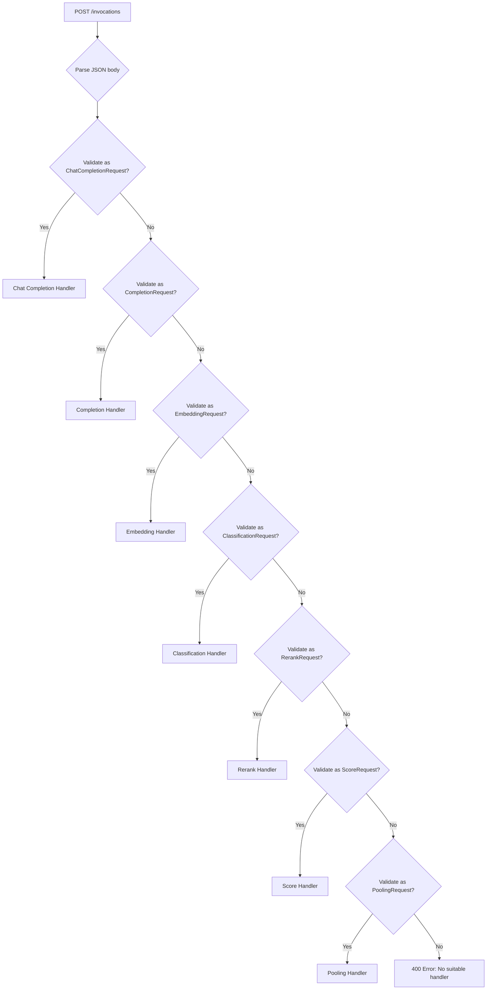

# SageMaker Endpoints

vLLM provides native support for [Amazon SageMaker](https://aws.amazon.com/sagemaker/) hosting requirements. SageMaker expects two specific HTTP endpoints — `/ping` and `/invocations` — which vLLM implements via the `model_hosting_container_standards` library.

Source: `vllm/entrypoints/sagemaker/api_router.py`

## Endpoints

| Method | Path | Description |
|--------|------|-------------|
| `GET` / `POST` | `/ping` | Health check required by SageMaker |
| `POST` | `/invocations` | Unified inference endpoint |

---

## GET/POST `/ping`

SageMaker periodically calls `/ping` to determine if the container is healthy and ready to serve traffic. vLLM delegates this to the same health check used by `/health`.

### Response

- **200 OK** — Server is healthy and ready
- **503 Service Unavailable** — Engine is dead or not ready

```bash
curl http://localhost:8080/ping
# HTTP 200 (empty body)
```

The `/ping` endpoint is registered with `@sagemaker_standards.register_ping_handler` and internally calls the same `health()` function as the `/health` endpoint.

---

## POST `/invocations`

The `/invocations` endpoint is the unified inference endpoint for SageMaker. It automatically routes requests to the appropriate handler based on the request body structure.

### Request Routing

The endpoint inspects the JSON body and attempts to validate it against each supported request type in priority order:



The routing priority (first match wins) depends on which tasks the model supports:

| Priority | Request Type | Task Required |
|----------|-------------|---------------|
| 1 | `ChatCompletionRequest` | `generate` |
| 2 | `CompletionRequest` | `generate` |
| 3 | `EmbeddingRequest` | `embed` |
| 4 | `ClassificationRequest` | `classify` |
| 5 | `RerankRequest` | `score` |
| 6 | `ScoreRequest` | `score` or `embed` |
| 7 | `PoolingRequest` | any pooling task |

### Request Body

The body must be valid JSON matching one of the supported request types. The endpoint uses Pydantic validation to determine the correct handler.

**Chat Completion Example:**

```json
{
  "model": "meta-llama/Llama-3-8B-Instruct",
  "messages": [
    {"role": "user", "content": "Hello!"}
  ],
  "max_tokens": 256,
  "temperature": 0.7
}
```

**Embedding Example:**

```json
{
  "model": "BAAI/bge-base-en-v1.5",
  "input": "The quick brown fox"
}
```

**Rerank Example:**

```json
{
  "model": "cross-encoder/ms-marco-MiniLM-L-6-v2",
  "query": "What is machine learning?",
  "documents": [
    "Machine learning is a subset of AI.",
    "The weather is sunny today."
  ],
  "top_n": 2
}
```

### Response

Responses follow the same format as the corresponding direct endpoint (e.g., `/v1/chat/completions`, `/v1/embeddings`).

### Error Response

```json
{
  "object": "error",
  "message": "Cannot find suitable handler for request. Expected one of: [ChatCompletionRequest, CompletionRequest]",
  "type": "BadRequestError",
  "param": null,
  "code": 400
}
```

---

## SageMaker Integration Features

### Adapter Injection

The `/invocations` endpoint is decorated with `@sagemaker_standards.inject_adapter_id(adapter_path="model")`, which automatically injects the SageMaker adapter ID into the `model` field of the request. This enables dynamic LoRA adapter selection in SageMaker multi-model endpoints.

### Stateful Session Management

The `@sagemaker_standards.stateful_session_manager()` decorator enables session-based routing for stateful inference scenarios.

### LoRA Adapter Management

When `VLLM_ALLOW_RUNTIME_LORA_UPDATING=true`, the SageMaker load/unload adapter handlers are registered:

- **Load adapter**: Maps SageMaker's `{"name": "...", "src": "...", "load_inplace": false}` to vLLM's `LoadLoRAAdapterRequest`
- **Unload adapter**: Maps SageMaker's adapter name from path params to `UnloadLoRAAdapterRequest`

---

## Deployment Configuration

### Docker Container

```dockerfile
FROM vllm/vllm-openai:latest

ENV MODEL_NAME=meta-llama/Llama-3-8B-Instruct
ENV PORT=8080

CMD ["python", "-m", "vllm.entrypoints.openai.api_server", \
     "--model", "${MODEL_NAME}", \
     "--port", "${PORT}"]
```

### SageMaker Model Definition

```python
import sagemaker
from sagemaker.model import Model

model = Model(
    image_uri="<your-ecr-image>",
    model_data="s3://your-bucket/model.tar.gz",
    role="arn:aws:iam::123456789:role/SageMakerRole",
    env={
        "MODEL_NAME": "meta-llama/Llama-3-8B-Instruct",
        "VLLM_API_KEY": "your-api-key",
    }
)

predictor = model.deploy(
    initial_instance_count=1,
    instance_type="ml.g5.2xlarge",
    endpoint_name="vllm-endpoint",
)
```

### Invoking the Endpoint

```python
import json
import boto3

runtime = boto3.client("sagemaker-runtime")

response = runtime.invoke_endpoint(
    EndpointName="vllm-endpoint",
    ContentType="application/json",
    Body=json.dumps({
        "model": "meta-llama/Llama-3-8B-Instruct",
        "messages": [{"role": "user", "content": "Hello!"}],
        "max_tokens": 256,
    })
)

result = json.loads(response["Body"].read())
print(result["choices"][0]["message"]["content"])
```

---

## Bootstrap

The SageMaker integration is bootstrapped via `sagemaker_standards_bootstrap(app)` in `vllm/entrypoints/openai/api_server.py`, which applies the `model_hosting_container_standards` middleware to the FastAPI application. This registers all SageMaker-specific handlers and middleware automatically.

> **Note**: The SageMaker endpoints are always registered regardless of the `--disable-fastapi-docs` flag. The `/ping` endpoint supports both `GET` and `POST` methods as required by SageMaker's health check protocol.
