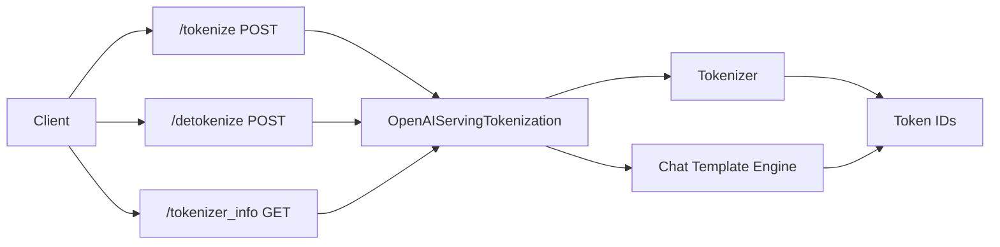

# Serving Utilities

vLLM exposes several utility endpoints for tokenization, detokenization, and tokenizer introspection. These are useful for pre-processing inputs, debugging, and understanding model tokenization behavior.

Source: `vllm/entrypoints/serve/tokenize/api_router.py`, `vllm/entrypoints/serve/tokenize/protocol.py`, `vllm/entrypoints/serve/tokenize/serving.py`

## Endpoints

| Method | Path | Description |
|--------|------|-------------|
| `POST` | `/tokenize` | Tokenize text or chat messages |
| `POST` | `/detokenize` | Convert token IDs back to text |
| `GET` | `/tokenizer_info` | Get tokenizer configuration (opt-in) |

---

## POST `/tokenize`

Converts text or chat messages into token IDs without running inference. Supports both completion-style (raw text) and chat-style (messages array) inputs.

### Completion-Style Request

```json
{
  "model": "meta-llama/Llama-3-8B-Instruct",
  "prompt": "Hello, how are you?",
  "add_special_tokens": true,
  "return_token_strs": false
}
```

| Parameter | Type | Default | Description |
|-----------|------|---------|-------------|
| `model` | `string \| null` | `null` | Model identifier |
| `prompt` | `string` | required | Text to tokenize |
| `add_special_tokens` | `bool` | `true` | Add BOS/EOS tokens |
| `return_token_strs` | `bool \| null` | `false` | Also return string representations |

### Chat-Style Request

```json
{
  "model": "meta-llama/Llama-3-8B-Instruct",
  "messages": [
    {"role": "system", "content": "You are a helpful assistant."},
    {"role": "user", "content": "Hello!"}
  ],
  "add_generation_prompt": true,
  "add_special_tokens": false,
  "return_token_strs": true,
  "continue_final_message": false,
  "chat_template": null,
  "chat_template_kwargs": null,
  "tools": null
}
```

| Parameter | Type | Default | Description |
|-----------|------|---------|-------------|
| `model` | `string \| null` | `null` | Model identifier |
| `messages` | `list[ChatMessage]` | required | Conversation messages |
| `add_generation_prompt` | `bool` | `true` | Append generation prompt from chat template |
| `continue_final_message` | `bool` | `false` | Leave final message open-ended (no EOS) |
| `add_special_tokens` | `bool` | `false` | Add extra special tokens beyond chat template |
| `return_token_strs` | `bool \| null` | `false` | Return string representations of tokens |
| `chat_template` | `string \| null` | `null` | Custom Jinja2 chat template |
| `chat_template_kwargs` | `dict \| null` | `null` | Extra kwargs for chat template renderer |
| `media_io_kwargs` | `dict \| null` | `null` | Extra kwargs for media IO connectors |
| `mm_processor_kwargs` | `dict \| null` | `null` | Extra kwargs for HuggingFace processor |
| `tools` | `list[Tool] \| null` | `null` | Tool definitions for tool-calling templates |

> **Note**: `add_generation_prompt` and `continue_final_message` are mutually exclusive. Setting both to `true` raises a validation error.

### Response

```json
{
  "count": 12,
  "max_model_len": 131072,
  "tokens": [128000, 9906, 11, 1268, 527, 499, 30, 128001],
  "token_strs": ["<|begin_of_text|>", "Hello", ",", " how", " are", " you", "?", "<|end_of_text|>"]
}
```

| Field | Type | Description |
|-------|------|-------------|
| `count` | `int` | Number of tokens |
| `max_model_len` | `int` | Maximum context length of the model |
| `tokens` | `list[int]` | Token IDs |
| `token_strs` | `list[string] \| null` | String representations (only if `return_token_strs=true`) |

### Example

```python
import requests

response = requests.post(
    "http://localhost:8000/tokenize",
    json={
        "model": "meta-llama/Llama-3-8B-Instruct",
        "prompt": "Hello, world!",
        "return_token_strs": True,
    }
)
data = response.json()
print(f"Token count: {data['count']}")
print(f"Tokens: {data['tokens']}")
print(f"Token strings: {data['token_strs']}")
```

---

## POST `/detokenize`

Converts a list of token IDs back to a text string.

### Request

```json
{
  "model": "meta-llama/Llama-3-8B-Instruct",
  "tokens": [128000, 9906, 11, 1268, 527, 499, 30]
}
```

| Parameter | Type | Description |
|-----------|------|-------------|
| `model` | `string \| null` | Model identifier |
| `tokens` | `list[int]` | Token IDs to decode (each must be in `[0, 2^63 - 1]`) |

### Response

```json
{
  "prompt": "<|begin_of_text|>Hello, how are you?"
}
```

| Field | Description |
|-------|-------------|
| `prompt` | Decoded text string |

### Example

```python
import requests

response = requests.post(
    "http://localhost:8000/detokenize",
    json={
        "tokens": [128000, 9906, 11, 1268, 527, 499, 30],
    }
)
print(response.json()["prompt"])
# Output: "<|begin_of_text|>Hello, how are you?"
```

### Error Handling

- **400 Bad Request**: Token ID out of range or invalid JSON
- **404 Not Found**: Model not found
- **500 Internal Server Error**: Tokenizer error

---

## GET `/tokenizer_info`

Returns the full tokenizer configuration, equivalent to the model's `tokenizer_config.json`. This endpoint must be explicitly enabled via the `--enable-tokenizer-info-endpoint` CLI flag.

### Enabling the Endpoint

```bash
vllm serve meta-llama/Llama-3-8B-Instruct \
    --enable-tokenizer-info-endpoint
```

### Response

The response is a JSON object containing all fields from the tokenizer configuration. The exact fields depend on the tokenizer type, but typically include:

```json
{
  "tokenizer_class": "PreTrainedTokenizerFast",
  "bos_token": "<|begin_of_text|>",
  "eos_token": "<|end_of_text|>",
  "unk_token": null,
  "pad_token": "<|end_of_text|>",
  "model_max_length": 131072,
  "add_bos_token": true,
  "add_eos_token": false,
  "chat_template": "...",
  "tokenizer_type": "llama",
  "vocab_size": 128256
}
```

The response uses `extra="allow"` in the Pydantic model, so all tokenizer config fields are preserved even if not explicitly defined in the schema.

| Field | Description |
|-------|-------------|
| `tokenizer_class` | HuggingFace tokenizer class name |
| Additional fields | All fields from `tokenizer_config.json` |

### Example

```python
import requests

response = requests.get("http://localhost:8000/tokenizer_info")
info = response.json()
print(f"Tokenizer class: {info['tokenizer_class']}")
print(f"Vocab size: {info.get('vocab_size')}")
print(f"BOS token: {info.get('bos_token')}")
```

---

## Architecture



The `OpenAIServingTokenization` class handles all three endpoints. It:
- Validates the model name against loaded models
- Applies LoRA adapter tokenizers when specified
- Processes chat templates for chat-style tokenization requests
- Returns token counts alongside the model's `max_model_len` for context budget planning

> **Note**: The `/tokenizer_info` endpoint is disabled by default to avoid exposing potentially sensitive tokenizer configuration. Enable it explicitly with `--enable-tokenizer-info-endpoint` when needed.
