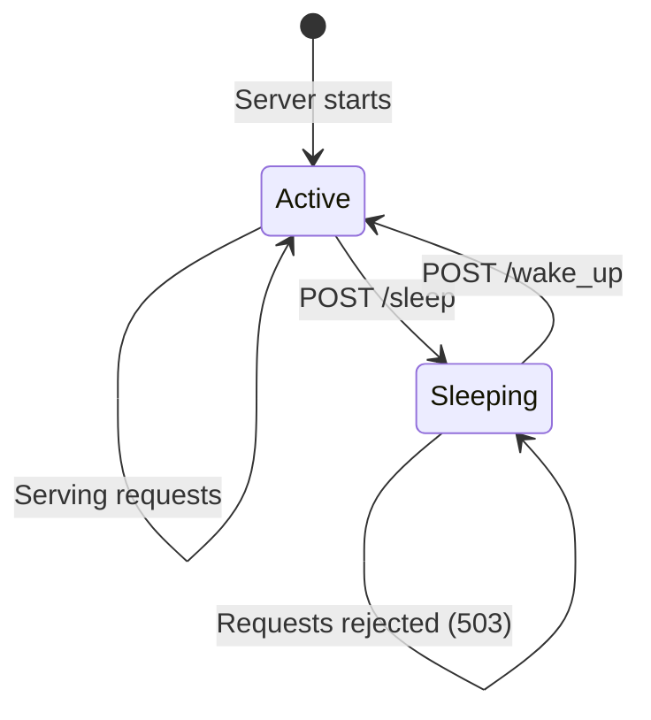

# Sleep / Wake Endpoints

vLLM provides endpoints to put the inference engine into a low-power sleep state and wake it back up. This is useful for cost optimization in cloud deployments where the GPU can be freed when the server is idle.

Source: `vllm/entrypoints/serve/sleep/api_router.py`

## Availability

Sleep/wake endpoints are only available when the server is running in **development mode**:

```bash
VLLM_SERVER_DEV_MODE=true vllm serve meta-llama/Llama-3-8B-Instruct
```

---

## Endpoints

| Method | Path | Description |
|--------|------|-------------|
| `POST` | `/sleep` | Put the engine to sleep |
| `POST` | `/wake_up` | Wake the engine from sleep |
| `GET` | `/is_sleeping` | Check if the engine is sleeping |

---

## POST `/sleep`

Puts the engine into sleep mode, freeing GPU memory. In-flight requests are handled according to the `mode` parameter.

### Query Parameters

| Parameter | Type | Default | Description |
|-----------|------|---------|-------------|
| `level` | `int` | `1` | Sleep level (higher = deeper sleep, more memory freed) |
| `mode` | `"abort" \| "wait" \| "keep"` | `"abort"` | How to handle in-flight requests |

### Sleep Levels

| Level | Description |
|-------|-------------|
| `1` | Offload KV cache and activations to CPU |
| Higher | More aggressive memory reclamation (model-dependent) |

### Request

```bash
# Default sleep (level 1, abort in-flight)
curl -X POST http://localhost:8000/sleep

# Deep sleep, wait for in-flight requests
curl -X POST "http://localhost:8000/sleep?level=1&mode=wait"
```

### Response

- **200 OK** — Sleep command sent (empty body)

> **Note**: In some configurations (v0 with frontend multiprocessing), the sleep command is sent asynchronously. The 200 response indicates the command was dispatched, not that sleep is complete.

---

## POST `/wake_up`

Wakes the engine from sleep mode, restoring GPU memory allocations.

### Query Parameters

| Parameter | Type | Default | Description |
|-----------|------|---------|-------------|
| `tags` | `list[string]` | `[]` (all) | Wake up only specific tagged resources |

### Request

```bash
# Wake up all resources
curl -X POST http://localhost:8000/wake_up

# Wake up specific tagged resources
curl -X POST "http://localhost:8000/wake_up?tags=kv_cache&tags=model_weights"
```

### Response

- **200 OK** — Wake command sent (empty body)

Logs:
```
INFO: wake up the engine with tags: ['kv_cache', 'model_weights']
```

If no tags are provided, all resources are woken up:
```
INFO: wake up the engine with tags: None
```

> **Note**: Similar to `/sleep`, the wake-up command may be asynchronous in some configurations.

---

## GET `/is_sleeping`

Returns whether the engine is currently in sleep mode.

### Request

```bash
curl http://localhost:8000/is_sleeping
```

### Response

```json
{"is_sleeping": false}
```

```json
{"is_sleeping": true}
```

---

## Sleep/Wake Workflow



---

## Python Example

```python
import requests
import time

base_url = "http://localhost:8000"

def check_sleeping():
    resp = requests.get(f"{base_url}/is_sleeping")
    return resp.json()["is_sleeping"]

# Check initial state
print(f"Is sleeping: {check_sleeping()}")  # False

# Put engine to sleep (wait for in-flight requests)
requests.post(f"{base_url}/sleep?mode=wait")
print(f"Is sleeping: {check_sleeping()}")  # True

# ... GPU memory is now freed ...
time.sleep(60)  # Idle period

# Wake up the engine
requests.post(f"{base_url}/wake_up")
print(f"Is sleeping: {check_sleeping()}")  # False

# Engine is ready to serve again
response = requests.post(
    f"{base_url}/v1/chat/completions",
    json={
        "model": "meta-llama/Llama-3-8B-Instruct",
        "messages": [{"role": "user", "content": "Hello!"}],
    }
)
print(response.json()["choices"][0]["message"]["content"])
```

---

## Use Cases

### Cost Optimization

In cloud deployments with GPU instances, sleep/wake can be used to free GPU memory during idle periods:

```python
import asyncio
import requests

IDLE_TIMEOUT = 300  # 5 minutes

last_request_time = time.time()

async def idle_monitor():
    while True:
        await asyncio.sleep(60)
        idle_time = time.time() - last_request_time
        is_sleeping = requests.get(f"{base_url}/is_sleeping").json()["is_sleeping"]

        if idle_time > IDLE_TIMEOUT and not is_sleeping:
            print("Server idle, going to sleep...")
            requests.post(f"{base_url}/sleep?mode=wait")
```

### RLHF Integration

Sleep can be combined with weight updates for RLHF workflows:

```python
# Sleep to free GPU memory before weight transfer
requests.post(f"{base_url}/sleep?mode=wait")

# Transfer new weights (using CPU memory)
transfer_weights(new_weights)

# Wake up with new weights loaded
requests.post(f"{base_url}/wake_up")
```

> **Note**: Sleep/wake endpoints require `VLLM_SERVER_DEV_MODE=true`. Requests sent while the engine is sleeping will receive a 503 Service Unavailable response from the `ScalingMiddleware`.
